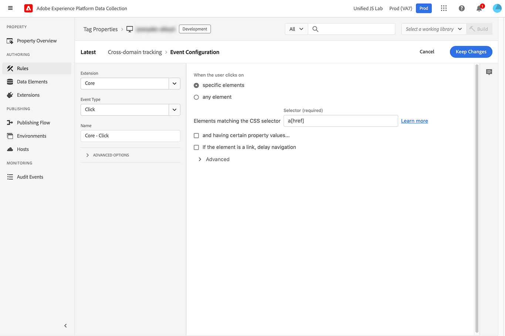
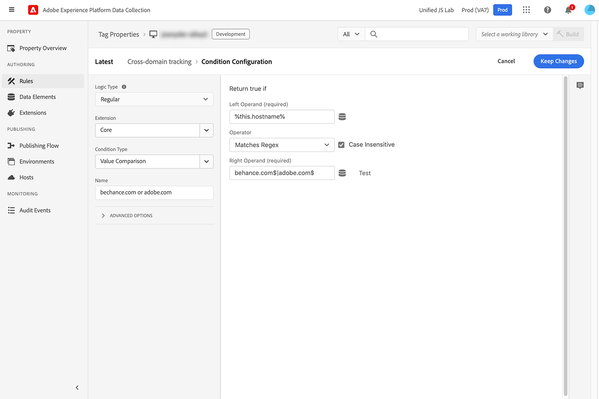
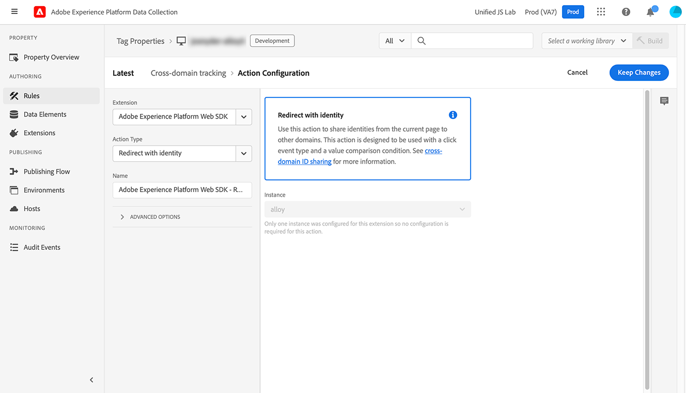

# Rediriger avec identité

Le type d’action **[!UICONTROL Rediriger avec identité]** vous permet de partager un identifiant visiteur de la page active vers un autre domaine détenu par votre organisation. Il est conçu pour être utilisé avec un événement de clic et une condition de comparaison de valeurs. Sur le plan fonctionnel, elle est similaire à la commande [`appendIdentityToUrl`](/help/collection/js/commands/appendidentitytourl.md) de la bibliothèque JavaScript.

1. Connectez-vous à [CX Enterprise](https://experience.adobe.com?lang=fr) à l’aide de vos informations d’identification Adobe ID.
1. Accédez à **[!UICONTROL Collecte de données]** > **[!UICONTROL Balises]**.
1. Sélectionnez la propriété de balise de votre choix.
1. Accédez à **[!UICONTROL Règles]**, puis sélectionnez la règle de votre choix.
1. Sous [!UICONTROL Actions], sélectionnez une action existante ou créez-en une.
1. Définissez le champ déroulant [!UICONTROL Extension] sur **[!UICONTROL Adobe Experience Platform Web SDK]**, puis définissez le [!UICONTROL Type d’action] sur **[!UICONTROL Rediriger avec une identité]**.

## Cas d’utilisation

* **Identifier un individu à travers plusieurs domaines** : si un visiteur clique d’un domaine à un autre appartenant à votre organisation, vous pouvez utiliser cette action afin qu’ils soient toujours considérés comme la même personne. Cette méthode d’identification est particulièrement utile si vous disposez de rapports qui combinent des données provenant de plusieurs domaines, empêchant ainsi l’inflation des visiteurs.
* **Identification d&#39;une personne d&#39;une application mobile à une application web** : si une personne est dans votre application mobile et qu&#39;elle clique sur un lien vers votre application web, vous pouvez utiliser cette action afin que la SDK web reconnaisse qu&#39;il s&#39;agit de la même personne. Ce workflow offre une expérience cohérente en matière de création de rapports et de personnalisation.

## Champs disponibles

* **[!UICONTROL Instance]** : instance SDK à laquelle l’action s’applique. Ce menu déroulant est désactivé si votre implémentation utilise une seule instance SDK.
* **[!UICONTROL Remplacements de la configuration des trains de données]** : cette commande prend en charge les remplacements de la configuration des trains de données, ce qui vous permet de contrôler les applications et les services qui reçoivent ces données. Lorsque vous définissez un remplacement de configuration de train de données à la fois dans une commande individuelle et dans les paramètres de configuration de l’extension de balise, la commande individuelle est prioritaire. Consultez [ Remplacements de configuration de train de données ](../configure/configuration-overrides.md) pour plus d’informations.

## Exemple de règle

Cette commande est généralement utilisée avec une règle spécifique qui écoute les clics et vérifie les domaines souhaités.

+++Critères d’événement de règle

Se déclenche lorsqu’un utilisateur clique sur une balise d’ancrage avec une propriété `href`.

* **[!UICONTROL Extension]** : Core
* **[!UICONTROL Type d’événement]** : cliquez sur
* **[!UICONTROL Lorsque l&#39;utilisateur clique sur]** : Eléments spécifiques
* **[!UICONTROL Éléments correspondant au sélecteur CSS]** : `a[href]`

+++

+++Condition de règle

Déclenche uniquement sur les domaines souhaités.

* **[!UICONTROL Type de logique]** : Standard
* **[!UICONTROL Extension]** : Core
* **[!UICONTROL Type de condition]** : comparaison de valeurs
* **[!UICONTROL Opérande de gauche]** : `%this.hostname%`
* **[!UICONTROL Operator]** : Correspond à l’expression régulière
* **[!UICONTROL Opérande droit]** : expression régulière correspondant aux domaines souhaités. Par exemple : `adobe.com$|behance.com$`

+++

+++Action de la règle

Ajoutez l’identité à l’URL.

* **[!UICONTROL Extension]** : SDK Web Adobe Experience Platform
* **[!UICONTROL Type d’action]** : redirection avec identité

+++
