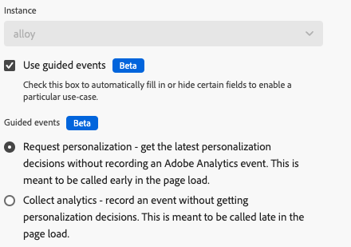
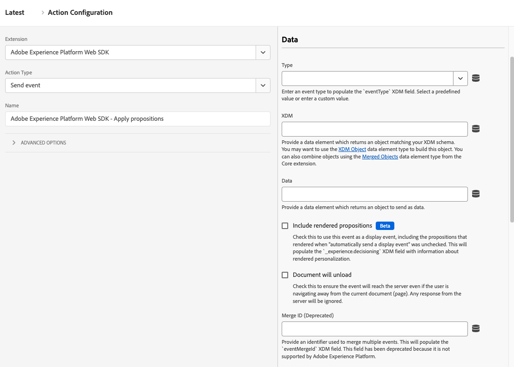
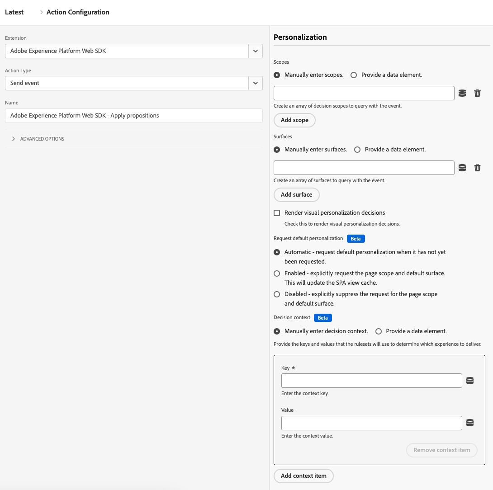
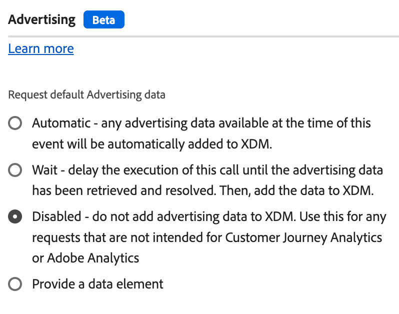

# Événement d’envoi

L’action **[!UICONTROL Send event]** envoie une payload à un flux de données sur l’Edge Network Adobe Experience Platform. Il s’agit d’une fonctionnalité clé de la collecte et de la personnalisation des données. Presque toutes les organisations utilisent cette action dans le cadre de leur implémentation de Web SDK.

1. Connectez-vous à [experience.adobe.com](https://experience.adobe.com?lang=fr) à l’aide de vos informations d’identification Adobe ID.
1. Accédez à **[!UICONTROL Data Collection]** > **[!UICONTROL Tags]**.
1. Sélectionnez la propriété de balise de votre choix.
1. Accédez à **[!UICONTROL Rules]**, puis sélectionnez la règle de votre choix.
1. Sous [!UICONTROL Actions], sélectionnez une action existante ou créez-en une.
1. Définissez le champ déroulant du [!UICONTROL Extension] sur **[!UICONTROL Adobe Experience Platform Web SDK]**, puis définissez le [!UICONTROL Action type] sur **[!UICONTROL Send event]**.

## Champs généraux

* **[!UICONTROL Instance]** : instance SDK à laquelle l’action s’applique. Ce menu déroulant est désactivé si votre implémentation utilise une seule instance SDK.
* **[!UICONTROL Use guided events]** : activez cette option pour remplir ou masquer automatiquement certains champs afin d’activer un cas d’utilisation particulier. Ce paramètre peut contribuer à réduire le bruit des options disponibles lors de la configuration de l’action pour chaque objectif respectif et suit les bonnes pratiques d’Adobe en matière d’[événements de page supérieure/inférieure](/help/collection/use-cases/personalization/top-bottom-page-events.md). L’activation de cette case à cocher déclenche l’affichage des boutons radio suivants :
   * **[!UICONTROL Request personalization]** : obtenez les dernières décisions de personnalisation sans enregistrer d’événement Adobe Analytics. Elle est généralement appelée en haut de la page. Lorsqu&#39;il est sélectionné, ce bouton radio définit les champs suivants :
      * [!UICONTROL Type] est verrouillé sur [!UICONTROL Decisioning Proposition Fetch]
      * [!UICONTROL Render visual personalization decisions] est verrouillé pour activé
      * [!UICONTROL Automatically send a display event] est verrouillé sur désactivé
   * **[!UICONTROL Collect analytics]** : enregistrez un événement sans obtenir de décisions de personnalisation. Elle est généralement appelée en bas de la page. Lorsqu&#39;il est sélectionné, ce bouton radio définit les champs suivants :
      * [!UICONTROL Include rendered propositions] est verrouillé pour activé

## Champs de données

* **[!UICONTROL Type]** : type d’événement. Vous pouvez effectuer une sélection à partir d’un ensemble prédéfini de valeurs ou définir votre propre valeur. Pour plus d’informations, voir [Valeurs acceptées pour `eventType`](/help/xdm/classes/experienceevent.md#accepted-values-for-eventtype). La bibliothèque JavaScript équivalente à ce champ est [`eventType`](/help/collection/js/commands/sendevent/eventtype.md).
* **[!UICONTROL XDM]** : payload XDM à envoyer à Adobe. Vous pouvez utiliser un [objet XDM](../data-element-types.md#xdm-object) ou [Variable](../data-element-types.md#variable) dans ce champ. Si vous disposez de règles qui renseignent plusieurs objets XDM, vous pouvez utiliser [Objets fusionnés](../../core/overview.md#merged-objects) pour les combiner.
* **[!UICONTROL Data]** : payload de données à envoyer à Adobe. Certains services et applications ne nécessitent pas de respecter un schéma XDM, comme Adobe Analytics ou Adobe Target. Utilisez un type d’élément de données [Variable](../data-element-types.md#variable) pour ce champ.
* **[!UICONTROL Include rendered propositions]** : activez cette case à cocher pour utiliser cet événement en tant qu’événement d’affichage, y compris les propositions générées lorsque l’option « Envoyer automatiquement un événement d’affichage » n’était pas cochée. Le champ XDM `_experience.decisioning` est renseigné avec des informations sur la personnalisation rendue.
* **[!UICONTROL Document will unload]** : cochez cette case pour vous assurer que l’événement atteint le serveur même si l’utilisateur quitte la page. Ce paramètre permet aux événements d’atteindre le serveur, mais les réponses d’Edge Network sont ignorées.
* **[!UICONTROL Merge ID]** _(obsolète)_ : renseigne le champ XDM `eventMergeId`.

## Champs de personnalisation

* **[!UICONTROL Scopes]** : tableau des portées que vous souhaitez demander explicitement à la personnalisation. Vous pouvez saisir les portées manuellement ou fournir un élément de données. Lors de la saisie manuelle des portées, chaque champ représente une portée. Sélectionnez **[!UICONTROL Add scope]** pour ajouter d’autres portées à l’action.
* **[!UICONTROL Surfaces]** : tableau de surfaces à interroger avec l’événement. Voir [Création d’expériences web](https://experienceleague.adobe.com/docs/journey-optimizer/using/web/create-web.html?lang=fr) dans la documentation de Adobe Journey Optimizer pour plus d’informations. Lors de la saisie manuelle de surfaces, chaque champ représente une surface. Sélectionnez **[!UICONTROL Add surface]** pour ajouter d’autres surfaces à l’action.
* **Rendre les décisions de personnalisation visuelle :** une case à cocher qui, lorsqu’elle est activée, vous permet de rendre du contenu personnalisé sur la page. Pour plus d’informations[&#128279;](/help/collection/use-cases/personalization/render-auto-pers-content.md) consultez la section Rendu automatique des actions DOM .
* **[!UICONTROL Request default personalization]** : contrôle si la portée à l’échelle de la page et la surface par défaut sont demandées. Par défaut, elle est demandée automatiquement lors du premier appel `sendEvent` du chargement de la page. La bibliothèque JavaScript équivalente à ces boutons radio est [`requestDefaultPersonalization`](/help/collection/js/commands/sendevent/personalization.md). Vous pouvez choisir parmi les options suivantes :
   * **[!UICONTROL Automatic]** : comportement par défaut. Ne demandez la personnalisation par défaut que si elle n’a pas encore été demandée.
   * **[!UICONTROL Enabled]** : demander explicitement la portée de la page et la surface par défaut. Cette opération met à jour le cache de l’affichage SPA.
   * **[!UICONTROL Disabled]** : supprimer explicitement la demande pour la portée de page et la surface par défaut.
* **[!UICONTROL Decision context]** : mappage clé-valeur utilisé lors de l’évaluation des ensembles de règles Adobe Journey Optimizer pour la prise de décision sur l’appareil. Vous pouvez fournir le contexte de décision manuellement ou par le biais d&#39;un élément de données.

## Champs Advertising

* **[!UICONTROL Request default advertising data]** : détermine quand (ou si) la bibliothèque ajoute des informations publicitaires à la payload XDM. Vous pouvez choisir parmi les options suivantes :
   * **[!UICONTROL Automatic]** : toutes les données publicitaires disponibles au moment de l’événement sont ajoutées à la payload de l’événement.
   * **[!UICONTROL Wait]** : retardez l’envoi de l’événement jusqu’à la réception des données de publicité.
   * **[!UICONTROL Disabled]** : n’ajoutez pas de données publicitaires à la payload de l’événement. Sélectionnez cette option si votre implémentation n’utilise ni Adobe Analytics ni Customer Journey Analytics.

## Remplacements de la configuration du train de données

Cette commande prend en charge les remplacements de la configuration des trains de données, ce qui vous permet de contrôler les applications et services qui reçoivent ces données. Lorsque vous définissez un remplacement de configuration de train de données à la fois dans une commande individuelle et dans les paramètres de configuration de l’extension de balise, la commande individuelle est prioritaire. Consultez [&#x200B; Remplacements de configuration de train de données &#x200B;](../configure/configuration-overrides.md) pour plus d’informations.
