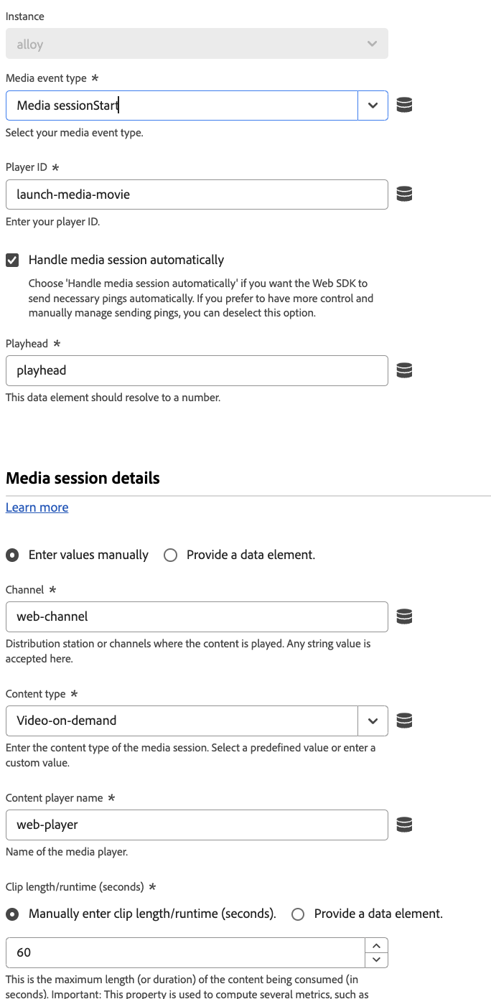

# Envoyer l’événement multimédia

L’action **[!UICONTROL Envoyer l’événement multimédia]** envoie l’événement multimédia à un flux de données, qui peut ensuite être utilisé par des applications et des services tels que Adobe Experience Platform ou Adobe Analytics. Cette action est utile lorsque vous effectuez le suivi du contenu multimédia en flux continu sur votre propriété.

Les options disponibles dépendent du **[!UICONTROL type d’événement multimédia]** que vous sélectionnez. Tous les types d’événements multimédias nécessitent un **[!UICONTROL ID de lecteur]**, qui est le nom du lecteur de contenu.

Certains types d’événements permettent de configurer d’autres champs. Si un type d’événement multimédia n’est pas répertorié ici, le seul champ disponible est [!UICONTROL ID du lecteur]. Les types d’événements multimédias suivants incluent d’autres champs :

## [!UICONTROL Début de la coupure publicitaire]

Permet de configurer les détails d’un pod publicitaire.

* **[!UICONTROL Nom de la coupure publicitaire]** : nom convivial de la coupure publicitaire.
* **[!UICONTROL Décalage de la coupure publicitaire (secondes)]** : décalage de la coupure publicitaire dans le contenu, en secondes.
* **[!UICONTROL Index de coupure publicitaire]** : index de la coupure publicitaire dans le contenu, commençant à 1.

## [!UICONTROL Début de la publicité]

Permet de configurer les détails de la publicité.

* **[!UICONTROL Nom de la publicité]** : nom convivial de la publicité.
* **[!UICONTROL ID de l’annonce publicitaire]** : ID de l’annonce publicitaire. Toute valeur alphanumérique est prise en charge.
* **[!UICONTROL Durée de la publicité (secondes)]** : durée de la publicité vidéo, en secondes.
* **[!UICONTROL Annonceur]** : société ou marque dont le produit est présenté dans la publicité.
* **[!UICONTROL Identifiant de campagne]** : l’identifiant de la campagne publicitaire.
* **[!UICONTROL Creative ID]** : identifiant du contenu publicitaire.
* **[!UICONTROL URL Creative]** : URL de la création publicitaire.
* **[!UICONTROL ID d’emplacement]** : ID d’emplacement de l’annonce publicitaire.
* **[!UICONTROL Identifiant du site]** : l’identifiant du site publicitaire.
* **[!UICONTROL Position de la capsule]** : index de la publicité à l’intérieur de la coupure publicitaire parent, commençant à 0.

Ce type d’événement prend également en charge la possibilité de fournir des métadonnées personnalisées dans le cadre de la payload d’événement multimédia.

## [!UICONTROL Changement de débit]

* **[!UICONTROL Qualité des données d’expérience]** : objet [Qualité d’expérience](/help/xdm/data-types/qoe-data-details-collection.md) qui spécifie le débit, les images perdues, les images par seconde et l’heure de début.

## [!UICONTROL &#x200B; Début du chapitre &#x200B;]

Permet de configurer les détails du chapitre.

* **[!UICONTROL Nom du chapitre]** : le nom du chapitre ou du segment.
* **[!UICONTROL Longueur du chapitre]** : longueur du chapitre, en secondes.
* **[!UICONTROL Index de chapitre]** : position du chapitre à l’intérieur du contenu.
* **[!UICONTROL Décalage du chapitre]** : décalage du chapitre par rapport au début du contenu, en secondes.

Ce type d’événement prend également en charge la possibilité de fournir des métadonnées personnalisées dans le cadre de la payload d’événement multimédia.

## [!UICONTROL Erreur]

Permet de configurer les détails des erreurs.

* **[!UICONTROL Nom de l’erreur]** : le nom de l’erreur.
* **&#x200B;**&#x200B;: source de l&#39;erreur.

## [!UICONTROL Début de la session]

Permet de configurer les détails de session multimédia.

* **[!UICONTROL Gérer automatiquement la session multimédia]** : une case à cocher qui permet au SDK Web d’envoyer automatiquement les pings nécessaires. Vous pouvez décocher cette case si vous souhaitez envoyer manuellement des pings.
* **[!UICONTROL Curseur de lecture]** : curseur de lecture, en secondes.
* **[!UICONTROL Type de contenu]** : le type de contenu. Toute valeur de chaîne est prise en charge ; Adobe propose également les paramètres prédéfinis suivants :
   * [!UICONTROL Livre audio]
   * [!UICONTROL Vidéo téléchargée à la demande]
   * [!UICONTROL &#x200B; Lecture linéaire de la ressource multimédia &#x200B;]
   * [!UICONTROL Diffusion en direct]
   * [!UICONTROL &#x200B; Podcast &#x200B;]
   * [!UICONTROL Émission radio]
   * [!UICONTROL Chanson]
   * [!UICONTROL Contenu généré par l’utilisateur]
   * [!UICONTROL Vidéo à la demande]
* **[!UICONTROL Longueur de l’élément/exécution (secondes)]** : durée maximale du contenu consommé, en secondes. Pour les médias en direct dont la durée est inconnue, la valeur de `86400` est la valeur par défaut.
* **[!UICONTROL ID de contenu]** : ID de contenu du contenu.
* **[!UICONTROL Type de chargement de l’annonce publicitaire]** : type d’annonce publicitaire chargée. Les deux valeurs suivantes sont prises en charge :
   * [!UICONTROL Publicités identiques à TV]
   * [!UICONTROL Autre (annonces personnalisées/dynamiques)]
* **[!UICONTROL Album]** : L&#39;album auquel appartient la chanson.
* **[!UICONTROL Artiste]** : L&#39;artiste de la chanson.
* **[!UICONTROL Identifiant de ressource]** : identifiant unique du contenu de la ressource multimédia. Ces identifiants sont généralement dérivés d’autorités de métadonnées telles que EIDR, TMS/Gracenote ou Rovi. Ces identifiants peuvent également provenir d’autres systèmes propriétaires ou internes.
* **[!UICONTROL Auteur]** : nom de l’auteur du livre audio.
* **[!UICONTROL Autorisé]** : indicateur qui détermine si l’utilisateur est connecté via l’authentification Adobe.
* **[!UICONTROL Partie du jour]** : heure de diffusion ou de lecture du contenu. Toute valeur de chaîne est prise en charge.
* **[!UICONTROL Épisode]** : numéro de l’épisode.
* **[!UICONTROL Type de flux]** : le type de flux.
* **[!UICONTROL Date de première diffusion]** : date à laquelle le contenu a été diffusé pour la première fois à la télévision. Toute valeur de chaîne est prise en charge ; cependant, Adobe recommande d’utiliser le format `YYYY-MM-DD`.
* **[!UICONTROL Première date numérique]** : date à laquelle le contenu a été diffusé pour la première fois sur un canal ou une plateforme numérique. Toute valeur de chaîne est prise en charge ; cependant, Adobe recommande d’utiliser le format `YYYY-MM-DD`.
* **[!UICONTROL Nom du contenu]** : nom convivial du contenu.
* **[!UICONTROL Genre]** : type ou regroupement de contenu défini par le producteur du contenu. Ce champ prend en charge plusieurs valeurs délimitées par une virgule.
* **[!UICONTROL Libellé]** : nom de la maison de disques.
* **[!UICONTROL Évaluation]** : évaluation telle que définie par les directives parentales relatives à la télévision.
* **&#x200B;**&#x200B;: MVPD fourni par l&#39;authentification Adobe.
* **[!UICONTROL Réseau]** : nom du réseau ou du canal.
* **[!UICONTROL Créateur]** : créateur du contenu.
* **[!UICONTROL Éditeur]** : éditeur de contenu audio.
* **[!UICONTROL Saison]** : si le programme fait partie d’une série, il s’agit du numéro de la saison du programme.
* **[!UICONTROL Show]** : si le show fait partie d&#39;une série, le nom de la série.
* **[!UICONTROL Type d’affichage]** : le type d’affichage. Toute valeur de chaîne est prise en charge ; Adobe propose également les paramètres prédéfinis suivants :
   * [!UICONTROL Clip]
   * [!UICONTROL Épisode complet]
   * [!UICONTROL Autre]
   * [!UICONTROL Aperçu/bande-annonce]
* **[!UICONTROL Type de flux]** : le type de flux.
* **[!UICONTROL Format du flux]** : format du flux, tel que HD ou SD.
* **[!UICONTROL Station]** : nom ou ID de la station radio.

Ce type d’événement prend également en charge la possibilité de fournir des métadonnées personnalisées dans le cadre de la payload d’événement multimédia. Il permet également des remplacements de la configuration du train de données, ce qui vous permet de contrôler les applications et services qui reçoivent ces données. Lorsque vous définissez un remplacement de configuration de train de données à la fois dans une commande individuelle et dans les paramètres de configuration de l’extension de balise, la commande individuelle est prioritaire. Consultez [&#x200B; Remplacements de configuration de train de données &#x200B;](../configure/configuration-overrides.md) pour plus d’informations.

## [!UICONTROL &#x200B; Mise à jour des états &#x200B;]

Permet de configurer les détails de la mise à jour de l’état. Vous pouvez démarrer ou terminer les états suivants :

* [!UICONTROL Sous-titrage]
* [!UICONTROL &#x200B; Plein écran &#x200B;]
* [!UICONTROL En mode thème]
* [!UICONTROL Silence]
* [!UICONTROL Image dans l’image]

Les champs disponibles sont les suivants :

* **[!UICONTROL États démarrés]** : menu déroulant qui vous permet d’indiquer qu’un état a démarré. Le fait de sélectionner le bouton **[!UICONTROL Ajouter un autre état ayant démarré]** vous permet de démarrer plusieurs états dans la même action.
* **[!UICONTROL États terminés]** : menu déroulant qui vous permet d’indiquer qu’un état s’est terminé. En sélectionnant le bouton **[!UICONTROL Ajouter un autre état qui s’est terminé]** vous pouvez terminer plusieurs états dans la même action.
