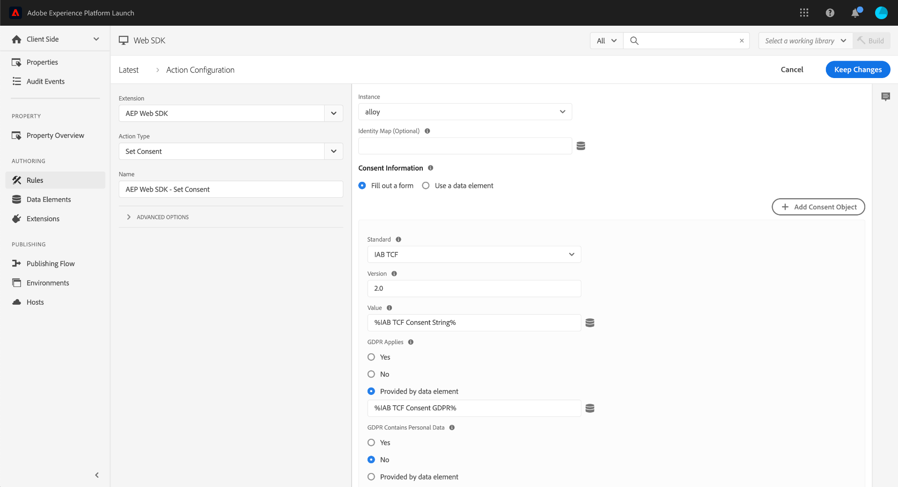

# Définir le consentement

L’action **[!UICONTROL Définir le consentement]** détermine si l’extension de balise doit envoyer des données (opt-in), les ignorer (opt-out) ou utiliser [le consentement par défaut](../configure/consent.md) (consentement inconnu). Lorsqu’un utilisateur autorise ou refuse le consentement sur votre site, vous pouvez utiliser cette action pour synchroniser ses préférences avec l’extension de balise. L’équivalent de la bibliothèque JavaScript de cette action est la commande [`setConsent`](/help/collection/js/commands/setconsent.md).

1. Connectez-vous à [CX Enterprise](https://experience.adobe.com?lang=fr) à l’aide de vos informations d’identification Adobe ID.
1. Accédez à **[!UICONTROL Collecte de données]** > **[!UICONTROL Balises]**.
1. Sélectionnez la propriété de balise de votre choix.
1. Accédez à **[!UICONTROL Règles]**, puis sélectionnez la règle de votre choix.
1. Sous [!UICONTROL Actions], sélectionnez une action existante ou créez-en une.
1. Définissez le champ déroulant [!UICONTROL Extension] sur **[!UICONTROL Adobe Experience Platform Web SDK]**, puis définissez le [!UICONTROL Type d’action] sur **[!UICONTROL Définir le consentement]**.

L’extension de balise prend en charge les normes suivantes :

* **[Adobe standard](/help/landing/governance-privacy-security/consent/adobe/overview.md)** : les normes 1.0 et 2.0 sont prises en charge.
* **[Transparence et cadre de consentement IAB](/help/landing/governance-privacy-security/consent/iab/overview.md)** : si vous utilisez cette norme, le profil client en temps réel du visiteur est mis à jour avec les informations de consentement si votre implémentation est correctement configurée :
   1. Le schéma de profil individuel XDM contient le groupe de champs de consentement [IAB TCF 2.0](/help/xdm/field-groups/profile/iab.md).
   1. Le schéma Événement d’expérience contient le groupe de champs de consentement [IAB TCF 2.0](/help/xdm/field-groups/event/iab.md).

Adobe vous recommande de stocker séparément toutes les préférences de boîte de dialogue de consentement, par exemple dans un élément de données. L’extension de balise ne permet pas de récupérer le consentement. Pour vous assurer que les préférences utilisateur restent synchronisées avec l’extension de balise, vous pouvez exécuter cette action à chaque chargement de page.

## Champs disponibles

Ce type d’action prend en charge les options de configuration suivantes :

* **[!UICONTROL Instance]** : instance SDK à laquelle l’action s’applique. Ce menu déroulant est désactivé si votre implémentation utilise une seule instance SDK.
* **[!UICONTROL Mappage d’identités]** : élément de données qui contrôle la manière dont un ECID est généré et à quels ID les informations de consentement sont liées.
* **[!UICONTROL Informations de consentement]** : détermine si vous souhaitez remplir un formulaire ou fournir un élément de données contenant des informations de consentement.
* **[!UICONTROL Standard]** : norme de consentement que vous souhaitez utiliser. Les options disponibles sont les suivantes : «  » et « [!UICONTROL IAB TCF] ».
* **[!UICONTROL Version]** : version de la norme de consentement que vous souhaitez utiliser.
* **[!UICONTROL Remplacements de la configuration des trains de données]** : cette commande prend en charge les remplacements de la configuration des trains de données, ce qui vous permet de contrôler les applications et les services qui reçoivent ces données. Lorsque vous définissez un remplacement de configuration de train de données à la fois dans une commande individuelle et dans les paramètres de configuration de l’extension de balise, la commande individuelle est prioritaire. Consultez [&#x200B; Remplacements de configuration de train de données &#x200B;](../configure/configuration-overrides.md) pour plus d’informations.

## Création d’une règle qui met à jour les informations de consentement

Le moment idéal pour utiliser cette action est lorsque les préférences de consentement d’un client ou d’une cliente ont changé. Vous pouvez créer une règle de balise pour prendre en compte cette modification.

1. Dans une propriété de balise, accédez à **[!UICONTROL Règles]** et sélectionnez **[!UICONTROL Ajouter une règle]**.
1. Attribuez un nom à la règle, puis sélectionnez l’icône « `+` » en regard de **[!UICONTROL Événements]**.
1. Définissez les propriétés suivantes sur la gauche :
   * **[!UICONTROL Extension]** : [!UICONTROL Core]
   * **[!UICONTROL Type EVent]** : [!UICONTROL Code personnalisé]
1. Ouvrez l’éditeur à droite et utilisez le code suivant comme modèle :

```javascript
// Wait for window.__tcfapi to be defined, then trigger when the customer has completed their consent and preferences.
function addEventListener() {
  if (window.__tcfapi) {
    window.__tcfapi("addEventListener", 2, function (tcData, success) {
      if (success && tcData.eventStatus === "useractioncomplete") {
        // save the tcData.tcString in a data element
        _satellite.setVar("IAB TCF Consent String", tcData.tcString);
        _satellite.setVar("IAB TCF Consent GDPR", tcData.gdprApplies);
        trigger();
      }
    });
  } else {
    // window.__tcfapi wasn't defined. Check again in 100 milliseconds
    setTimeout(addEventListener, 100);
  }
}
addEventListener();
```

1. Sélectionnez **[!UICONTROL Conserver les modifications]**.

Le bloc de code personnalisé ci-dessus effectue deux opérations :

* Déclenche la règle lorsque les préférences de consentement ont été modifiées.
* Définit deux éléments de données : **chaîne de consentement IAB TCF** et **RGPD de consentement IAB TCF**.

Ces éléments de données sont utiles lors de la définition de l’action « [!UICONTROL Définir le consentement] » :

1. Sélectionnez l’icône « `+` » en regard de **[!UICONTROL Actions]**.
1. Définissez les propriétés suivantes sur la gauche :
   * **[!UICONTROL Extension]** : [!UICONTROL Adobe Experience Platform Web SDK]
   * **[!UICONTROL Type d’action]** : [!UICONTROL Définir le consentement]
1. Définissez les propriétés suivantes sur la droite :
   * **[!UICONTROL Standard]** : [!UICONTROL IAB TCF]
   * **[!UICONTROL Version]** : [!UICONTROL 2.0]
   * **[!UICONTROL Valeur]** : `%IAB TCF Consent String%`
   * **[!UICONTROL Le RGPD s’applique-t-il à cette valeur de consentement]** : [!UICONTROL Fournissez un élément de données], avec la valeur `%IAB TCF Consent GDPR%`



>[!NOTE]
>
>Vous ne pouvez pas choisir ces éléments de données à l’aide du sélecteur d’éléments de données, car ils ont été créés via du code personnalisé. Vous devez saisir le nom de l’élément de données avec les signes de pourcentage.
