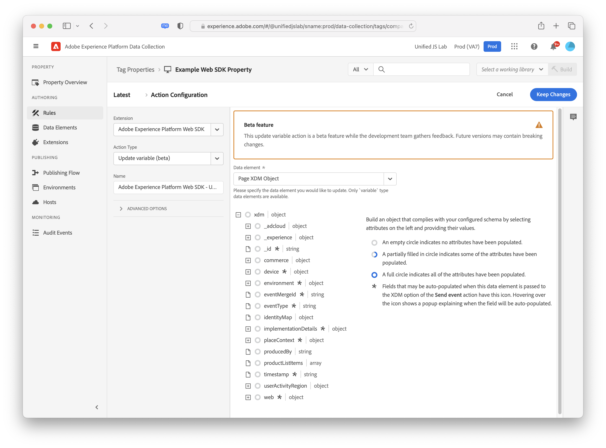
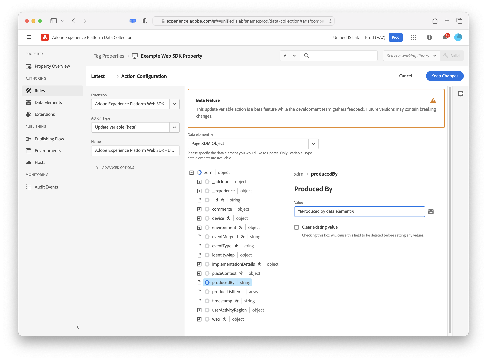
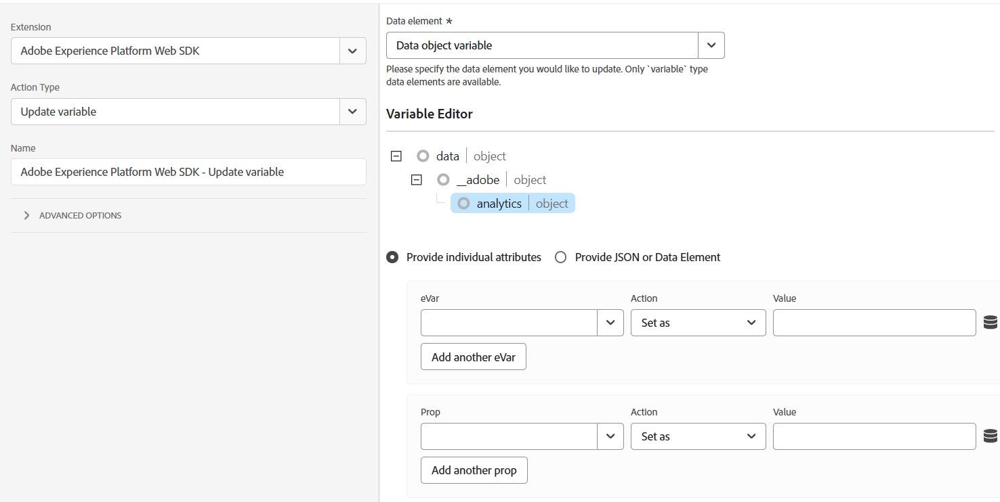

# Mettre à jour la variable

L’action **[!UICONTROL Update variable]** vous permet d’apporter des modifications partielles ou incrémentielles à un [élément de données variable](../data-element-types.md#variable). Vous pouvez utiliser cette action pour créer un objet qui pourra ensuite être référencé dans une action [[!UICONTROL Send event]](send-event.md). Le remplissage d’éléments de données et leur affectation à des propriétés dans un objet XDM correspond à la plupart des cas d’utilisation. Cette action offre plus de flexibilité pour vous permettre de définir de manière conditionnelle des propriétés à différents éléments de données en fonction des conditions de règle.

Avant d’utiliser cette action, vous devez déjà avoir créé un élément de données variable. Une fois que vous avez sélectionné un élément de données de variable à modifier, un éditeur s’affiche, vous permettant de définir tous les champs souhaités pour cette action.

Le schéma XDM utilisé dans l’éditeur correspond au schéma sélectionné dans l’élément de données variable. Vous pouvez définir une ou plusieurs propriétés de l’objet en développant les objets et en sélectionnant les propriétés souhaitées. Par exemple, dans la capture d’écran ci-dessous, la propriété `producedBy` est définie sur l’élément de données `%Produced by data element%`.

Si vous sélectionnez un élément de données variable qui utilise un objet de données au lieu d’un objet XDM, les champs disponibles dépendent des produits sélectionnés lors de la configuration de l’élément de données. Par exemple, si vous créez un objet de données qui inclut Adobe Analytics, champs , puis que vous sélectionnez l’élément de données variable dans cette interface utilisateur, vous obtiendrez les champs que vous pouvez remplir spécifiques à Adobe Analytics.

