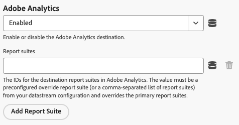
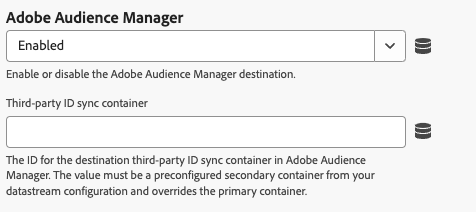
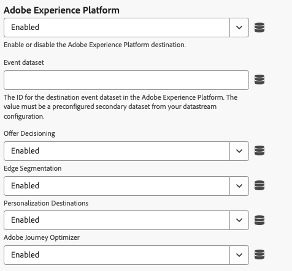
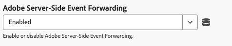
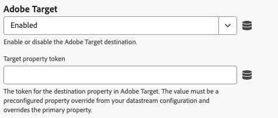

# Paramètres de remplacement de la configuration du train de données {#config-overrides}

>[!CONTEXTUALHELP]
>id="platform_tags_websdk_overrides"
>title="Remplacements de la configuration du train de données"
>abstract="Déclenchez de manière conditionnelle différents comportements de trains de données sans avoir besoin d’un train de données distinct. Le paramétrage de toute configuration de train de données côté client remplace, pour un environnement dans cette section, toute configuration de train de données dynamique côté serveur et les règles pour cet environnement."

Les remplacements de flux de données vous permettent de définir des configurations supplémentaires pour vos flux de données, qui sont transmises à Edge Network via le SDK Web. Cette fonctionnalité vous permet de déclencher de manière conditionnelle différents comportements de flux de données sans créer de flux de données ni modifier vos paramètres existants.

1. Connectez-vous à [CX Enterprise](https://experience.adobe.com?lang=fr) à l’aide de vos informations d’identification Adobe ID.
1. Accédez à **[!UICONTROL Collecte de données]** > **[!UICONTROL Balises]**.
1. Sélectionnez la propriété de balise de votre choix.
1. Accédez à **[!UICONTROL Extensions]**, puis sélectionnez **[!UICONTROL Configurer]** sur la vignette [!UICONTROL Adobe Experience Platform Web SDK].
1. Faites défiler l’écran jusqu’à la section **[!UICONTROL Remplacements de la configuration des flux de données]**.

Le remplacement de la configuration du train de données comporte deux étapes :

1. Tout d’abord, vous devez définir le remplacement de votre configuration de train de données lors de la [configuration d’un train de données](/help/datastreams/configure.md) dans l’interface utilisateur des trains de données. Consultez [Remplacements de la configuration des trains de données](/help/datastreams/overrides.md) dans la documentation sur les trains de données pour obtenir des instructions sur la configuration des remplacements.
1. Après avoir configuré le remplacement du flux de données dans l’interface utilisateur des flux de données, vous pouvez configurer l’extension de balise.

Les remplacements de flux de données doivent être configurés pour chaque environnement. Les environnements de développement, d’évaluation et de production ont tous des remplacements distincts. Vous pouvez copier les paramètres de remplacement dans n’importe quel environnement souhaité :

Par défaut, les remplacements de la configuration du train de données sont désactivés. L’option **[!UICONTROL Correspondre à la configuration du flux de données]** est sélectionnée par défaut.

Pour activer les remplacements de train de données dans l’extension de balise, sélectionnez **[!UICONTROL Activé]** dans le menu déroulant.

Après avoir activé les remplacements de la configuration du train de données, vous pouvez configurer les remplacements pour chaque service décrit ci-dessous. Ces paramètres de remplacement de train de données remplacent toutes les configurations et règles de train de données côté serveur pour l’environnement sélectionné.

## Adobe Analytics

Remplacez le routage des données par le service Adobe Analytics.

* **[!UICONTROL Activé]** / **[!UICONTROL Désactivé]** : active ou désactive le routage des données vers Adobe Analytics.
* **[!UICONTROL Suites de rapports]** : identifiants des suites de rapports de destination dans Adobe Analytics. La valeur doit être une suite de rapports de remplacement préconfigurée (ou une liste de suites de rapports séparées par des virgules) de votre configuration de train de données. Ce paramètre remplace les suites de rapports principales.
* **[!UICONTROL Ajouter une suite de rapports]** : sélectionnez cette option pour ajouter des suites de rapports supplémentaires.

## Adobe Audience Manager

Remplacez le routage des données par Adobe Audience Manager.

* **[!UICONTROL Activé]** / **[!UICONTROL Désactivé]** : active ou désactive le routage des données vers Adobe Audience Manager.
* **[!UICONTROL Conteneur de synchronisation des identifiants tiers]** : identifiant du conteneur de synchronisation des identifiants tiers de destination dans Audience Manager. La valeur doit être un conteneur secondaire préconfiguré de votre configuration de train de données et remplace le conteneur principal.

## Adobe Experience Platform

Remplacez le routage des données par Adobe Experience Platform.

* **[!UICONTROL Activé]** / **[!UICONTROL Désactivé]** : active ou désactive le routage des données vers Adobe Experience Platform.
* **[!UICONTROL Jeu de données d’événement]** : identifiant du jeu de données d’événement de destination dans le Adobe Experience Platform. La valeur doit être un jeu de données secondaire préconfiguré de votre configuration de train de données.
* **** : activez ou désactivez le routage des données vers le service [!DNL Offer Decisioning].
* **[!UICONTROL Segmentation Edge]** : activez ou désactivez le routage des données vers le service [!DNL Edge Segmentation].
* **[!UICONTROL Destinations Personalization]** : activez ou désactivez le routage des données vers les destinations de personnalisation.
* **** : activer ou désactiver le routage des données vers [!DNL Adobe Journey Optimizer].

## Transfert d’événement côté serveur Adobe

Remplacez le routage des données par le service Transfert d’événement côté serveur d’Adobe.

* **[!UICONTROL Activé]** / **[!UICONTROL Désactivé]** : active ou désactive le routage des données vers le service de transfert d’événement côté serveur d’Adobe.

## Adobe Target {#target}

Remplacez le routage des données par Adobe Target.

* **[!UICONTROL Activé]** / **[!UICONTROL Désactivé]** : active ou désactive le routage des données vers Adobe Target.
