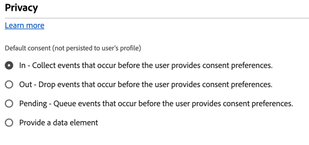

# Paramètres de configuration du consentement {#consent}

>[!CONTEXTUALHELP]
>id="platform_tags_websdk_consent"
>title="Consentement"
>abstract="Sélectionne le niveau de consentement par défaut supposé si aucune autre préférence de consentement explicite n’est fournie."

La section **[!UICONTROL Consentement]** vous permet de sélectionner le niveau de consentement par défaut supposé si aucune autre préférence de consentement explicite n’est fournie. Le niveau de consentement par défaut n’est pas enregistré dans les profils utilisateur.

1. Connectez-vous à [CX Enterprise](https://experience.adobe.com?lang=fr) à l’aide de vos informations d’identification Adobe ID.
1. Accédez à **[!UICONTROL Collecte de données]** > **[!UICONTROL Balises]**.
1. Sélectionnez la propriété de balise de votre choix.
1. Accédez à **[!UICONTROL Extensions]**, puis sélectionnez **[!UICONTROL Configurer]** sur la vignette [!UICONTROL Adobe Experience Platform Web SDK].
1. Faites défiler l’écran jusqu’à la section **[!UICONTROL Consentement]**.

Cette section contient un seul ensemble de boutons radio qui déterminent le niveau de consentement par défaut :

* **[!UICONTROL In]** : collectez les événements qui se produisent avant que l’utilisateur ne fournisse ses préférences de consentement.
* **[!UICONTROL Sortie]** : ignorez les événements qui se produisent avant que l’utilisateur ne fournisse des préférences de consentement.
* **[!UICONTROL En attente]** : événements de file d’attente qui se produisent avant que l’utilisateur ne fournisse ses préférences de consentement. Lorsque le consentement est accordé, les événements placés en file d’attente sont envoyés à Adobe. Lorsque le consentement est refusé, les événements placés en file d’attente sont ignorés.
* **[!UICONTROL Fournir un élément de données]** : sélectionnez un élément de données qui détermine l’un des paramètres de configuration ci-dessus. Les valeurs valides comprennent les chaînes `"in"`, `"out"` ou `"pending"`.

Si votre organisation nécessite le consentement explicite de l’utilisateur pour collecter des données, Adobe recommande de définir le consentement par défaut sur **[!UICONTROL Expiré]** ou **[!UICONTROL En attente]**.
