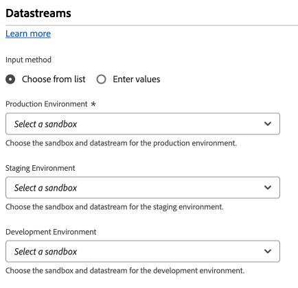

# Paramètres de configuration du train de données {#datastreams}

>[!CONTEXTUALHELP]
>id="platform_tags_websdk_datastreams"
>title="Flux de données"
>abstract="Obligatoire. Définit le train de données dans Edge Network auquel vous souhaitez envoyer des données."

Cette section de configuration vous permet de déterminer à quel [flux de données](/help/datastreams/overview.md) vous souhaitez envoyer des données. **Un identifiant de flux de données est requis pour toutes les données envoyées à Edge Network.**

1. Connectez-vous à [experience.adobe.com](https://experience.adobe.com?lang=fr) à l’aide de vos informations d’identification Adobe ID.
1. Accédez à **[!UICONTROL Data Collection]** > **[!UICONTROL Tags]**.
1. Sélectionnez la propriété de balise de votre choix.
1. Accédez à **[!UICONTROL Extensions]**, puis sélectionnez **[!UICONTROL Configure]** sur la carte [!UICONTROL Adobe Experience Platform Web SDK] .
1. Faites défiler l’écran jusqu’à la section **[!UICONTROL Datastreams]** .

Lors de la sélection de flux de données, vous pouvez le faire pour chaque [environnement](/help/tags/ui/publishing/environments.md) ([!UICONTROL Development], [!UICONTROL Staging] et [!UICONTROL Production]). Ces champs sont utiles lorsque vous souhaitez séparer les données envoyées entre les environnements de développement, d’évaluation et de production. Il active un workflow pratique où vous n’avez pas à vous soucier d’envoyer des données au mauvais flux de données, à condition d’installer le bon chargeur de balises dans chaque environnement respectif.

Vous pouvez renseigner les identifiants de train de données à l’aide de l’une des méthodes suivantes :

* **[!UICONTROL Choose from list]** : chaque environnement contient deux menus déroulants, ce qui vous permet de sélectionner le sandbox et le flux de données de l’environnement sélectionné. Les valeurs de chaque menu déroulant dépendent de vos [flux de données](/help/datastreams/overview.md) configurés dans chaque [sandbox](/help/sandboxes/ui/overview.md) respectif.

* **[!UICONTROL Enter values]** : au lieu d’utiliser des menus déroulants pour sélectionner le flux de données souhaité, vous pouvez spécifier manuellement l’identifiant du flux de données souhaité. Chaque environnement vous permet de saisir directement un identifiant de flux de données ou de renseigner ce champ à l’aide d’un [élément de données](/help/tags/ui/managing-resources/data-elements.md).
