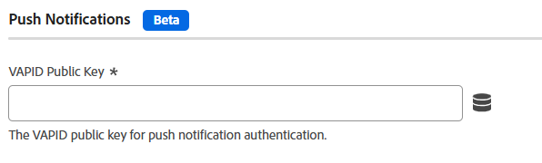

# Paramètres des notifications push {#push-notifications}

>[!CONTEXTUALHELP]
>id="platform_tags_websdk_pushnotifications"
>title="Notifications push"
>abstract="Définit une clé publique VAPID pour l’authentification par notification push."

Cette section de configuration vous permet de définir une clé publique VALIDE pour l’authentification par notification push.

>[!NOTE]
>
>Cette fonctionnalité doit d’abord être activée à l’aide de [Composants de version personnalisés](custom-build-components.md) ; elle est désactivée par défaut.

1. Connectez-vous à [experience.adobe.com](https://experience.adobe.com?lang=fr) à l’aide de vos informations d’identification Adobe ID.
1. Accédez à **[!UICONTROL Data Collection]** > **[!UICONTROL Tags]**.
1. Sélectionnez la propriété de balise de votre choix.
1. Accédez à **[!UICONTROL Extensions]**, puis cliquez sur **[!UICONTROL Configure]** sur la carte [!UICONTROL Adobe Experience Platform Web SDK].
1. Développez **[!UICONTROL Custom build components]**, puis activez **[!UICONTROL Push notifications]**.
1. Sous [!UICONTROL SDK instances], faites défiler vers le bas pour localiser la section [!UICONTROL Push Notifications].
1. Saisissez votre clé publique VALIDE dans le champ **[!UICONTROL VAPID Public Key]** .

Les champs disponibles sont les suivants :

## [!UICONTROL VAPID public key]

Clé publique VALIDE utilisée pour les abonnements aux notifications push. Il s’agit d’une chaîne codée en Base64.

## [!UICONTROL Application ID]

ID de l’application associé à la clé publique valide.

## [!UICONTROL Tracking dataset ID]

Identifiant du jeu de données pour le suivi et l’analyse des notifications push.

## Notifications push à l’aide de la bibliothèque JavaScript

Cette section est l’équivalent de la balise [`pushNotifications`](/help/collection/js/commands/configure/pushnotifications.md) lors de la configuration de la bibliothèque JavaScript. La page liée fournit également des informations sur les conditions préalables et la génération d’une clé publique VALIDE.
