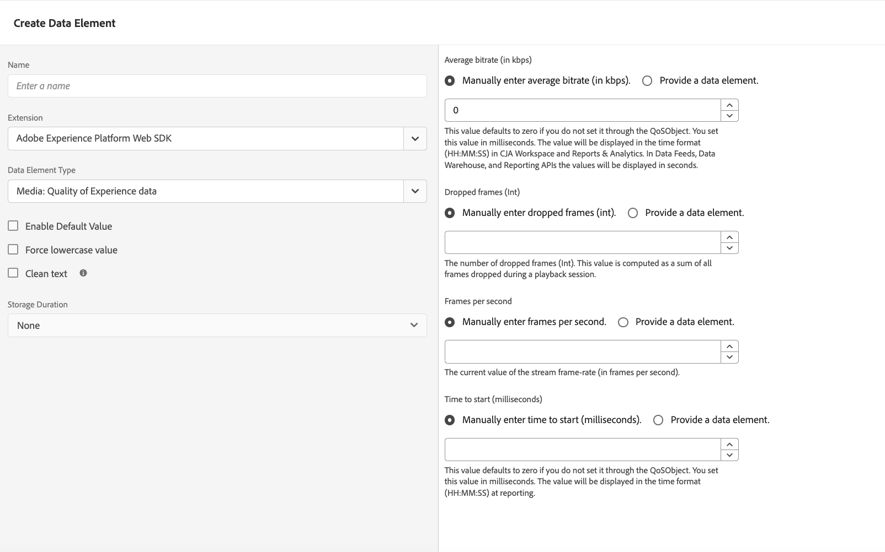

# Types d’éléments de données

Après avoir défini vos [types d’action](action-types.md) dans l’ [extension de balise SDK Web Adobe Experience Platform](web-sdk-extension-configuration.md), vous devez configurer vos types d’éléments de données. Cette page décrit les types d’éléments de données disponibles.

## Mappage d’identités {#identity-map}

Une carte des identités vous permet d’établir les identités du visiteur de votre page web. Un mappage d’identité se compose d’espaces de noms, tels que `CRMID`, `Phone` ou `Email`, chaque espace de noms contenant un ou plusieurs identifiants. Par exemple, si l’individu de votre site web a fourni deux numéros de téléphone, l’espace de noms de votre téléphone doit contenir deux identifiants.

Dans l’élément de données [!UICONTROL Identity Map] , vous fournissez les informations suivantes pour chaque identifiant :

* **[!UICONTROL ID]** : valeur identifiant le visiteur. Par exemple, si l’identifiant appartient à l’espace de noms _phone_, l’ [!UICONTROL ID] peut être _555-555-5555_. Cette valeur est généralement dérivée d’une variable JavaScript ou d’un autre élément de données sur votre page. Il est donc préférable de créer un élément de données qui référence les données de la page, puis de référencer l’élément de données dans le champ [!UICONTROL ID] au sein de l’élément de données [!UICONTROL Identity Map]. Si, lors de l’exécution sur votre page, la valeur de l’identifiant est autre qu’une chaîne renseignée, l’identifiant est automatiquement supprimé de la carte d’identité.
* **[!UICONTROL État authentifié]** : sélection indiquant si le visiteur est authentifié.
* **[!UICONTROL Principal]** : sélection indiquant si l’identifiant doit être utilisé comme identifiant principal de l’individu. Si aucun identifiant n’est marqué comme principal, l’ECID est utilisé comme identifiant principal.

>[!TIP]
>
>Adobe recommande d’envoyer des identités qui représentent une personne, telles que `Luma CRM Id` comme identité principale.
>
>Si la carte d’identité contient l’identifiant de personne (par exemple, `Luma CRM Id`), l’identifiant de personne deviendra l’identifiant principal. Sinon, `ECID` devient l’identité principale.

Vous ne devez pas fournir un [!DNL ECID] lors de la création d’une carte d’identité. Lors de l’utilisation du SDK, un [!DNL ECID] est automatiquement généré sur le serveur et inclus dans la carte d’identité.

L’élément de données de carte d’identité est souvent utilisé en tandem avec le type d’élément de données [[!UICONTROL objet XDM] &#x200B;](#xdm-object) et le type d’action [[!UICONTROL Définir le consentement]](action-types.md#set-consent).

En savoir plus sur [Adobe Experience Platform Identity Service](../../../../identity-service/home.md).

## Objet XDM {#xdm-object}

Le formatage de vos données en XDM est plus facile avec l’élément de données de l’objet XDM. La première fois que vous ouvrez cet élément de données, sélectionnez le sandbox et le schéma Adobe Experience Platform appropriés. Après avoir sélectionné votre schéma, vous voyez la structure de votre schéma, que vous pouvez facilement remplir.

Notez que lorsque vous ouvrez certains champs de votre schéma, tels que `web.webPageDetails.URL`, certains éléments sont automatiquement collectés. Même si plusieurs éléments sont collectés automatiquement, vous pouvez en remplacer certains, le cas échéant. Toutes les valeurs peuvent être renseignées manuellement ou en utilisant d’autres éléments de données.

>[!NOTE]
>
>Renseignez uniquement les informations que vous souhaitez recueillir. Tout ce qui n’est pas renseigné est omis lorsque les données sont envoyées aux solutions.

## Variable {#variable}

Vous pouvez créer des objets de charge utile à l’aide de l’élément de données **[!UICONTROL Variable]** . Les objets [!UICONTROL XDM] et [!UICONTROL Data] sont pris en charge.

* Lorsque vous sélectionnez [!UICONTROL XDM], sélectionnez le [!UICONTROL sandbox] et le [!UICONTROL schéma] de votre choix.
* Lorsque vous sélectionnez [!UICONTROL Data], sélectionnez les solutions souhaitées. Les solutions disponibles sont [!UICONTROL Adobe Analytics] et [!UICONTROL Adobe Target].

Après avoir créé cet élément de données, vous pouvez utiliser l’action [Mettre à jour la variable](./action-types.md#update-variable) pour la modifier. Une fois prêt, vous pouvez inclure cet élément de données dans l’action [Send event](./action-types.md#send-event) pour envoyer des données à un flux de données.

## Média : qualité de l’expérience {#quality-experience}

Un élément de données **[!UICONTROL Qualité de l’expérience]** s’avère utile lors de l’envoi d’événements de média en continu à Adobe Experience Platform. Vous pouvez ajouter cet élément lors de la création d’une session multimédia. Les événements multimédia suivants contiendront la mise à jour de la qualité des données d’expérience.

## Étapes suivantes {#next-steps}

Découvrez des cas d’utilisation spécifiques tels que [l’accès à l’ECID](accessing-the-ecid.md).
