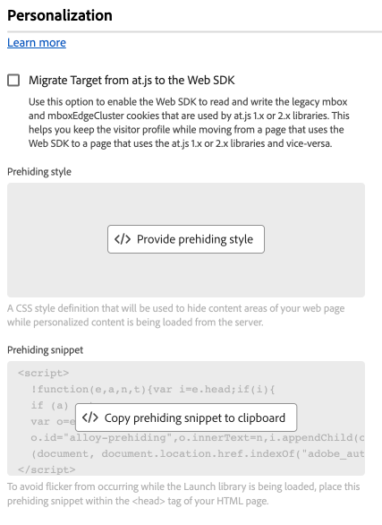

# Configuration de l’extension de balise du SDK Web

La variable [!DNL Web SDK] l’extension de balise envoie des données à Adobe Experience Cloud à partir de propriétés web par le biais du réseau Edge Experience Platform.

L’extension vous permet de diffuser des données dans Platform, de synchroniser les identités, de traiter les signaux de consentement du client et de collecter automatiquement des données contextuelles.

Ce document explique comment configurer l’extension de balise dans l’interface utilisateur de balises.

## Installation de l’extension de balise du SDK Web {#install}

Une propriété doit être installée sur l’extension de balise SDK Web. Si vous ne l’avez pas déjà fait, consultez la documentation sur [création d’une propriété de balise](https://experienceleague.adobe.com/docs/platform-learn/implement-in-websites/configure-tags/create-a-property.html?lang=fr).

Après avoir créé une propriété, ouvrez-la et sélectionnez l’option **[!UICONTROL Extensions]** de la barre de gauche.

Sélectionnez la variable **[!UICONTROL Catalogue]** . Recherchez le composant [!DNL Web SDK] extension et sélectionner **[!UICONTROL Installer]**.

Après avoir sélectionné **[!UICONTROL Installer]**, vous devez configurer l’extension de balise du SDK Web et enregistrer la configuration.

>[!NOTE]
>
>L’extension de balise n’est installée qu’après l’enregistrement de la configuration. Reportez-vous aux sections suivantes pour savoir comment configurer l’extension de balise.

## Configuration des paramètres d’instance {#general}

Les options de configuration en haut de la page indiquent à Adobe Experience Platform où acheminer les données et quelles configurations utiliser sur le serveur.

* **[!UICONTROL Nom]**: l’extension SDK Web de Adobe Experience Platform prend en charge plusieurs instances sur la page. Le nom est utilisé pour envoyer des données à plusieurs organisations avec une configuration de balise. Le nom de l’instance est défini par défaut sur `alloy`. Vous pouvez toutefois remplacer le nom de l’instance par n’importe quel nom d’objet JavaScript valide.
* **[!UICONTROL Identifiant de l’organisation IMS]**: identifiant de l’organisation à laquelle vous souhaitez envoyer les données dans Adobe. La plupart du temps, utilisez la valeur par défaut qui est renseignée automatiquement. Si la page contient plusieurs instances, renseignez ce champ avec la valeur de la deuxième organisation à laquelle vous souhaitez envoyer des données.
* **[!UICONTROL Domaine Edge]**: domaine à partir duquel l’extension envoie et reçoit des données. Adobe recommande d’utiliser un domaine propriétaire (CNAME) pour cette extension. Le domaine tiers par défaut fonctionne pour les environnements de développement, mais ne convient pas aux environnements de production. Les instructions de configuration d’un CNAME propriétaire sont répertoriées [ici](https://experienceleague.adobe.com/docs/core-services/interface/ec-cookies/cookies-first-party.html?lang=fr).

## Configuration des paramètres du flux de données {#datastreams}

Cette section vous permet de sélectionner les flux de données à utiliser pour chacun des trois environnements disponibles (production, évaluation et développement).

Lorsqu’une demande est envoyée au réseau Edge, un identifiant de flux de données est utilisé pour référencer la configuration côté serveur. Vous pouvez mettre à jour la configuration sans avoir à apporter de modifications au code sur votre site web.

Consultez le guide sur la [datastreams](../../../../datastreams/overview.md) pour savoir comment configurer un flux de données.

Vous pouvez choisir un flux de données dans les menus déroulants disponibles ou sélectionner **[!UICONTROL Saisir des valeurs]** et saisissez un identifiant de flux de données personnalisé pour chaque environnement.

## Configuration des paramètres de confidentialité {#privacy}

Cette section vous permet de configurer la manière dont le SDK Web traite les signaux de consentement des utilisateurs de votre site Web. Plus précisément, il vous permet de sélectionner le niveau de consentement par défaut supposé d’un utilisateur si aucune autre préférence de consentement explicite n’a été fournie.

Le niveau de consentement par défaut n’est pas enregistré dans le profil utilisateur.

| [!UICONTROL Niveau de consentement par défaut] | Description |
| --- | --- |
| [!UICONTROL Dans] | Collectez les événements qui se produisent avant que l’utilisateur ne fournisse ses préférences de consentement. |
| [!UICONTROL Out] | Ignorer les événements qui se produisent avant que l’utilisateur ne fournisse ses préférences de consentement. |
| [!UICONTROL En attente] | Événements de file d’attente qui se produisent avant que l’utilisateur ne fournisse ses préférences de consentement. Lorsque les préférences de consentement sont fournies, les événements sont collectés ou ignorés en fonction des préférences fournies. |
| [!UICONTROL Fourni par l’élément de données] | Le niveau de consentement par défaut est déterminé par un élément de données distinct que vous définissez. Lorsque vous utilisez cette option, vous devez spécifier l’élément de données à l’aide du menu déroulant fourni. |

>[!TIP]
>
>Utilisation **[!UICONTROL Out]** ou **[!UICONTROL En attente]** si vous avez besoin d’un consentement explicite de l’utilisateur pour vos activités commerciales.

## Configuration des paramètres d’identité {#identity}

Cette section vous permet de définir le comportement du SDK Web lorsqu’il s’agit de gérer l’identification des utilisateurs.

* **[!UICONTROL Migration de l’ECID depuis VisitorAPI]**: cette option est activée par défaut. Lorsque cette fonction est activée, le SDK peut lire la variable `AMCV` et `s_ecid` et définissez la variable `AMCV` cookie utilisé par [!DNL Visitor.js]. Cette fonctionnalité est importante lors de la migration vers le SDK Web, car certaines pages utilisent toujours [!DNL Visitor.js]. Cette option permet au SDK de continuer à utiliser la même [!DNL ECID] afin que les utilisateurs ne soient pas identifiés comme deux utilisateurs distincts.
* **[!UICONTROL Utilisation de cookies tiers]**: lorsque cette option est activée, le SDK Web tente de stocker un identifiant d’utilisateur dans un cookie tiers. En cas de réussite, l’utilisateur est identifié comme un utilisateur unique lorsqu’il navigue sur plusieurs domaines, plutôt que comme un utilisateur distinct sur chaque domaine. Si cette option est activée, le SDK peut toujours ne pas pouvoir stocker l’identifiant de l’utilisateur dans un cookie tiers si le navigateur ne prend pas en charge les cookies tiers ou s’il a été configuré par l’utilisateur pour ne pas autoriser les cookies tiers. Dans ce cas, le SDK stocke uniquement l’identifiant dans le domaine propriétaire.

## Configuration des paramètres de personnalisation {#personalization}

Cette section vous permet de configurer le mode de masquage de certaines parties d’une page lors du chargement du contenu personnalisé.

Vous pouvez spécifier les éléments à masquer dans l’éditeur de style de prémasquage. Vous pouvez ensuite copier le fragment de code de masquage préalable par défaut qui vous a été fourni et le coller dans le `<head>` élément du site [!DNL HTML] code.

* **[!UICONTROL Migration de Target depuis at.js vers le SDK Web]**: utilisez cette option pour activer [!DNL Web SDK] pour lire et écrire l’héritage `mbox` et `mboxEdgeCluster` cookies utilisés par at.js `1.x` ou `2.x` bibliothèques. Vous pouvez ainsi conserver le profil du visiteur lors du passage d’une page qui utilise le SDK Web à une page qui utilise at.js. `1.x` ou `2.x` et vice versa.

## Configuration des paramètres de collecte de données {#data-collection}

* **[!UICONTROL Fonction de rappel]**: la fonction de rappel fournie dans l’extension est également appelée [`onBeforeEventSend` function](https://experienceleague.adobe.com/docs/experience-platform/edge/fundamentals/configuring-the-sdk.html?lang=fr) dans la bibliothèque. Cette fonction vous permet de modifier les événements de manière globale avant qu’ils ne soient envoyés au réseau Edge. Vous trouverez des informations plus détaillées sur l’utilisation de cette fonction [here](../../../../edge/fundamentals/tracking-events.md#modifying-events-globally).
* **[!UICONTROL Activer la collecte de données de clic]**: le SDK Web peut automatiquement collecter des informations sur les clics sur les liens. Cette fonctionnalité est activée par défaut, mais elle peut être désactivée à l’aide de cette option. Les liens sont également étiquetés comme liens de téléchargement s’ils contiennent l’une des expressions de téléchargement répertoriées dans la variable [!UICONTROL Télécharger le qualificateur de lien] textbox. Adobe vous fournit quelques qualificateurs de lien de téléchargement par défaut. Vous pouvez les modifier en fonction de vos besoins.
* **[!UICONTROL Données contextuelles collectées automatiquement]**: par défaut, le SDK Web collecte certaines données contextuelles concernant l’appareil, le web, l’environnement et le contexte de lieu. Si vous souhaitez voir une liste des informations collectées par l&#39;Adobe, vous pouvez la trouver. [here](../../../../edge/data-collection/automatic-information.md). Si vous ne souhaitez pas que ces données soient collectées ou que certaines catégories de données soient uniquement collectées, sélectionnez **[!UICONTROL Informations contextuelles spécifiques]** et sélectionnez les données à collecter.

## Configurer les remplacements de trains de données {#datastream-overrides}

Les remplacements de trains de données vous permettent de définir des configurations supplémentaires pour vos trains de données, qui sont transmises au réseau Edge via le SDK Web.

Vous pouvez ainsi déclencher des comportements de trains de données différents de ceux par défaut, sans créer de train de données ni modifier vos paramètres existants.

Le remplacement de la configuration du train de données comporte deux étapes :

1. Tout d’abord, vous devez définir vos remplacements de configuration de trains de données sur la page de [configuration des trains de données](../../../../datastreams/configure.md).
2. Ensuite, vous devez envoyer les remplacements au réseau Edge par le biais d’une commande de SDK Web ou à l’aide de l’extension de balise du SDK Web.

Voir la structure de données [la documentation de remplacement de configuration](../../../../datastreams/overrides.md) pour obtenir des instructions détaillées sur la façon de remplacer les configurations datastream.

Au lieu de transmettre les remplacements par le biais d’une commande SDK Web, vous pouvez configurer les remplacements dans l’écran d’extension de balise illustré ci-dessous.

>[!IMPORTANT]
>
> Les remplacements de flux de données doivent être configurés par environnement. Les environnements de développement, d’évaluation et de production ont tous des remplacements distincts. Vous pouvez copier les paramètres entre eux à l’aide des options dédiées affichées dans l’écran ci-dessous.

## Configuration des paramètres avancés

Utilisez la variable **[!UICONTROL Chemin de base Edge]** si vous devez modifier le chemin de base utilisé pour interagir avec le réseau Edge. Cela ne doit pas nécessiter de mise à jour, mais dans le cas où vous participez à une version bêta ou alpha, l’Adobe peut vous demander de modifier ce champ.

