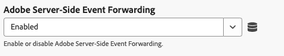

# Configuration de l’extension de balise du SDK Web

L’extension de balise [!DNL Web SDK] envoie des données à Adobe Experience Cloud à partir des propriétés web via Experience Platform Edge Network.

L’extension vous permet de diffuser des données dans Experience Platform, de synchroniser les identités, de traiter les signaux de consentement des clients et de collecter automatiquement des données contextuelles.

Ce document explique comment configurer l’extension de balise dans l’interface utilisateur des balises.

## Installation de l’extension de balise Web SDK {#install}

L’extension de balise Web SDK nécessite l’installation d’une propriété sur . Si vous ne l’avez pas déjà fait, consultez la documentation sur la [création d’une propriété de balise](https://experienceleague.adobe.com/docs/platform-learn/implement-in-websites/configure-tags/create-a-property.html?lang=fr).

Après avoir créé une propriété, ouvrez-la et sélectionnez l’onglet **[!UICONTROL Extensions]** dans la barre latérale gauche.

Sélectionnez l’onglet **[!UICONTROL Catalogue]**. Dans la liste des extensions disponibles, recherchez l’extension [!DNL Web SDK] et sélectionnez **[!UICONTROL Installer]**.

Après avoir sélectionné **[!UICONTROL Installer]**, vous devez configurer l’extension de balise Web SDK et enregistrer la configuration.

>[!NOTE]
>
>L’extension de balise n’est installée qu’après avoir enregistré la configuration. Consultez les sections suivantes pour savoir comment configurer l’extension de balise.

## Création d’une version de Web SDK personnalisée {#custom-build}

La bibliothèque Web SDK comprend plusieurs modules pour différentes fonctionnalités telles que la personnalisation, l’identité, le suivi des liens, etc. Selon vos cas d’utilisation, il se peut que vous n’ayez besoin que de fonctionnalités spécifiques au lieu de l’ensemble de la bibliothèque. La création d’une version Web SDK personnalisée vous permet de sélectionner uniquement les modules dont vous avez besoin, ce qui réduit la taille de la bibliothèque et améliore les performances.

Lorsque vous créez une version de Web SDK personnalisée, elle est utilisée par toutes vos instances de Web SDK.

>[!IMPORTANT]
>
>La désactivation des composants Web SDK peut interrompre votre implémentation existante. Chaque fois que vous désactivez un composant, veillez à tester minutieusement votre implémentation pour vous assurer que toutes les fonctionnalités dont vous avez besoin fonctionnent comme prévu.
>&#x200B;>Lorsque vous désactivez un composant, vous ne pouvez plus modifier les paramètres de ce composant.

Pour créer une version Web SDK personnalisée à l’aide de l’extension de balise Web SDK, procédez comme suit.

1. Sur la page de configuration de l’extension de balise, développez la section **[!UICONTROL Composants de version personnalisés]**.
1. Activez ou désactivez les composants en fonction de vos besoins. Vous pouvez sélectionner l’un des composants suivants :
   * **[!UICONTROL Collecteur d’activités]** : ce composant permet la collecte automatique de liens et le suivi d’Activity Map.
   * **[!UICONTROL Advertising]** : ce composant comprend tout le code JavaScript nécessaire pour Adobe Advertising. Elle ajoute également les paramètres [!UICONTROL Adobe Advertising] dans la section [!UICONTROL Instances SDK] et un paramètre [!UICONTROL Advertising] dans les règles de balise, pour définir la manière dont les données publicitaires sont utilisées pour la mesure d’attribution.
   * **[!UICONTROL Audiences]** : ce composant permet l’intégration d’Audience Manager, y compris les destinations d’URL et basées sur des cookies, ainsi que la synchronisation des identifiants.
   * **[!UICONTROL Consentement]** : ce composant permet les intégrations de consentement. La désactivation de ce composant désactive les éléments suivants :
      * [Définir le consentement](action-types.md#set-consent) type d’action
   * **[!UICONTROL Context]** : ce composant permet la collecte automatique des données contextuelles.
   * **[!UICONTROL Fusion d’événements]** : _obsolète_. La désactivation de ce composant désactive les éléments suivants :
      * Élément de données [ID de fusion d’événements](action-types.md#data)
      * **[!UICONTROL Réinitialiser l’ID de fusion d’événements]** type d’action
   * **[!UICONTROL Pont Media Analytics]** : ce composant active Edge Network Streaming Media à l’aide de l’interface Media Analytics. La désactivation de ce composant désactive les éléments suivants :
      * Type d’action [Get Media Analytics Tracker](action-types.md#get-media-analytics-tracker)
   * **[!UICONTROL Personalization]** : ce composant active les intégrations Adobe Target et Adobe Journey Optimizer. La désactivation de ce composant désactive les éléments suivants :
      * [Appliquer les propositions](action-types.md#apply-propositions)type d&#39;action
   * **[!UICONTROL Notifications push]** : ce composant active les notifications push web pour Adobe Journey Optimizer.
   * **[!UICONTROL Moteur de règles]** : ce composant active la prise de décision Adobe Journey Optimizer sur l’appareil. La désactivation de ce composant désactive les éléments suivants :
      * [Évaluer des ensembles de règles](action-types.md#evaluate-rulesets) type d’action
      * [Abonner des éléments d’ensemble de règles](event-types.md#subscribe-ruleset-items) type d’événement
   * **[!UICONTROL Streaming Media]** : ce composant active le streaming multimédia Edge Network. La désactivation de ce composant désactive les éléments suivants :
      * [Envoi d’événement multimédia](action-types.md#send-media-event) type d’action

## Configuration des paramètres d’instance {#general}

Les options de configuration en haut de la page indiquent à Adobe Experience Platform où acheminer les données et les configurations à utiliser sur le serveur.

* **[!UICONTROL Name]** : l’extension Adobe Experience Platform Web SDK prend en charge plusieurs instances sur la page. Le nom est utilisé pour envoyer des données à plusieurs organisations avec une configuration de balises. Le nom d’instance par défaut est `alloy`. Cependant, vous pouvez remplacer le nom de l’instance par n’importe quel nom d’objet JavaScript valide.
* **[!UICONTROL Identifiant de l’organisation IMS]** : l’identifiant de l’organisation à laquelle vous souhaitez que les données soient envoyées chez Adobe. La plupart du temps, utilisez la valeur par défaut qui est automatiquement renseignée. Lorsque la page comporte plusieurs instances, renseignez ce champ avec la valeur de la deuxième organisation à laquelle vous souhaitez envoyer des données.
* **[!UICONTROL domaine Edge]** : domaine vers lequel/à partir duquel l’extension envoie et reçoit des données. Adobe recommande d’utiliser un domaine propriétaire (CNAME) pour cette extension. Le domaine tiers par défaut fonctionne pour les environnements de développement, mais ne convient pas aux environnements de production. Les instructions de configuration d’un CNAME propriétaire sont répertoriées [ici](https://experienceleague.adobe.com/docs/core-services/interface/ec-cookies/cookies-first-party.html?lang=fr).
* **[!UICONTROL Adobe Advertising]** : disponible lorsque le composant `Advertising` est sélectionné. Paramètres pour les organisations utilisant Adobe Advertising DSP uniquement :
   * **[!UICONTROL Adobe Advertising DSP]** : active le suivi des affichages publicitaires.
   * **[!UICONTROL Publicitaires]** : disponible lorsque [!UICONTROL Adobe Advertising DSP] est activé. Annonceurs pour lesquels activer le suivi des affichages publicitaires.
   * **[!UICONTROL ID5 de partenaire]** : facultatif. Disponible lorsque [!UICONTROL Adobe Advertising DSP] est activé. Identifiant partenaire ID5 de votre organisation. Ce paramètre permet à Web SDK de collecter les identifiants universels ID5.
   * **[!UICONTROL Chemin JavaScript RampID]** : facultatif. Disponible lorsque [!UICONTROL Adobe Advertising DSP] est activé. Chemin d’accès au code JavaScript [!DNL LiveRamp RampID] de votre organisation (`ats.js`).  Ce paramètre permet à Web SDK de collecter les identifiants universels [!DNL RampID].

## Configurer les paramètres du flux de données {#datastreams}

Cette section vous permet de sélectionner les flux de données à utiliser pour chacun des trois environnements disponibles (production, évaluation et développement).

Lorsqu’une requête est envoyée à Edge Network, un identifiant de flux de données est utilisé pour référencer la configuration côté serveur. Vous pouvez mettre à jour la configuration sans avoir à apporter de modifications de code sur votre site web.

Consultez le guide sur [les flux de données](../../../../datastreams/overview.md) pour savoir comment configurer un flux de données.

Vous pouvez choisir un flux de données dans les menus déroulants disponibles ou sélectionner **[!UICONTROL Saisir des valeurs]** et saisir un identifiant de flux de données personnalisé pour chaque environnement.

## Configurer les paramètres de confidentialité {#privacy}

Cette section vous permet de configurer la manière dont Web SDK gère les signaux de consentement des utilisateurs de votre site web. Plus précisément, il vous permet de sélectionner le niveau de consentement par défaut supposé d’un utilisateur si aucune autre préférence de consentement explicite n’a été fournie.

Le niveau de consentement par défaut n’est pas enregistré dans le profil utilisateur.

| [!UICONTROL Niveau de consentement par défaut] | Description |
| --- | --- |
| [!UICONTROL In] | Collectez les événements qui se produisent avant que l’utilisateur ne fournisse des préférences de consentement. |
| [!UICONTROL Sortie] | Ignorer les événements qui se produisent avant que l’utilisateur ne fournisse des préférences de consentement. |
| [!UICONTROL En attente] | Événements de file d’attente qui se produisent avant que l’utilisateur ne fournisse des préférences de consentement. Lorsque des préférences de consentement sont fournies, les événements sont collectés ou ignorés selon les préférences fournies. |
| [!UICONTROL Fourni par l’élément de données] | Le niveau de consentement par défaut est déterminé par un élément de données distinct que vous définissez. Lorsque vous utilisez cette option, vous devez spécifier l’élément de données à l’aide du menu déroulant fourni. |

>[!TIP]
>
>Utilisez **[!UICONTROL Sortant]** ou **[!UICONTROL En attente]** si vous avez besoin du consentement explicite de l’utilisateur pour vos opérations commerciales.

## Configurer les paramètres d’identité {#identity}

Cette section vous permet de définir le comportement du SDK web en ce qui concerne la gestion de l’identification des utilisateurs.

* **[!UICONTROL Migrer l’ECID depuis l’API Visiteur]** : cette option est activée par défaut. Lorsque cette fonction est activée, le SDK peut lire les cookies `AMCV` et `s_ecid` et définir le cookie `AMCV` utilisé par [!DNL Visitor.js]. Cette fonctionnalité est importante lors de la migration vers Web SDK, car certaines pages peuvent encore utiliser [!DNL Visitor.js]. Cette option permet au SDK de continuer à utiliser le même [!DNL ECID], de sorte que les utilisateurs ne soient pas identifiés comme deux utilisateurs distincts.
* **[!UICONTROL Utiliser des cookies tiers]** : lorsque cette option est activée, Web SDK tente de stocker un identifiant utilisateur dans un cookie tiers. En cas de réussite, l’utilisateur est identifié comme un seul utilisateur lorsqu’il navigue sur plusieurs domaines, plutôt que comme un utilisateur distinct sur chaque domaine. Si cette option est activée, il se peut que le SDK ne puisse pas stocker l’identifiant de l’utilisateur dans un cookie tiers si le navigateur ne prend pas en charge les cookies tiers ou s’il a été configuré par l’utilisateur pour ne pas autoriser les cookies tiers. Dans ce cas, le SDK stocke uniquement l’identifiant dans le domaine propriétaire.

  >[!IMPORTANT]
  >&#x200B;>Les cookies tiers ne sont pas compatibles avec la fonctionnalité [Identifiant d’appareil interne](../../../../web-sdk/identity/first-party-device-ids.md) de Web SDK.
  >&#x200B;>Vous pouvez utiliser des identifiants d’appareil propriétaires ou des cookies tiers, mais vous ne pouvez pas utiliser les deux fonctionnalités simultanément.
  >

## Configurer les paramètres de personnalisation {#personalization}

Cette section vous permet de configurer la manière dont vous souhaitez masquer certaines parties d’une page lors du chargement du contenu personnalisé. Cela garantit que vos visiteurs ne voient que la page personnalisée.

* **[!UICONTROL Migration de Target d’at.js vers Web SDK]** : utilisez cette option pour permettre aux [!DNL Web SDK] de lire et d’écrire les `mbox` hérités et les cookies `mboxEdgeCluster` utilisés par les bibliothèques at.js `1.x` ou `2.x`. Cela vous permet de conserver le profil du visiteur lors du passage d’une page qui utilise Web SDK à une page qui utilise at.js `1.x` ou des bibliothèques `2.x` et vice versa.

### Style de masquage préalable {#prehiding-style}

L’éditeur de style de masquage préalable vous permet de définir des règles CSS personnalisées pour masquer des sections spécifiques d’une page. Lorsque la page est chargée, Web SDK utilise ce style pour masquer les sections à personnaliser, récupérer la personnalisation, puis annuler le masquage des sections de page personnalisées. Ainsi, vos visiteurs verront les pages déjà personnalisées, sans voir le processus de récupération de la personnalisation.

### Fragment de code de masquage préalable {#prehiding-snippet}

Le fragment de code de masquage préalable est utile lorsque la bibliothèque Web SDK est chargée de manière asynchrone. Dans ce cas, pour éviter le scintillement, il est recommandé de masquer le contenu avant le chargement de la bibliothèque Web SDK.

Pour utiliser le fragment de code de masquage préalable, copiez-le et collez-le dans l’élément `<head>` de votre page.

>[!IMPORTANT]
>
>Lors de l’utilisation du fragment de code de masquage préalable, Adobe recommande d’utiliser la même règle de [!DNL CSS] que celle utilisée par le [style de masquage préalable](#prehiding-style).

## Configurer les paramètres de collecte de données {#data-collection}

Gérez les paramètres de configuration de la collecte de données. Des paramètres similaires dans la bibliothèque JavaScript sont disponibles à l’aide de la commande [`configure`](/help/web-sdk/commands/configure/overview.md).

* **[!UICONTROL Activé avant le rappel d’envoi d’événement]** : fonction de rappel permettant d’évaluer et de modifier la payload envoyée à Adobe. Utilisez la variable `content` dans la fonction de rappel pour modifier la payload. Ce rappel est la balise équivalente à [`onBeforeEventSend`](/help/web-sdk/commands/configure/onbeforeeventsend.md) dans la bibliothèque JavaScript.
* **[!UICONTROL Collecter les clics sur les liens internes]** : une case à cocher qui permet la collecte de données de suivi des liens internes à votre site ou propriété. Lorsque vous activez cette case à cocher, les options de regroupement d&#39;événements s&#39;affichent :
   * **[!UICONTROL Aucun regroupement d’événements]** : les données de suivi des liens sont envoyées à Adobe dans des événements distincts. Les clics sur les liens envoyés dans des événements distincts peuvent accroître l’utilisation contractuelle des données envoyées à Adobe Experience Platform.
   * **[!UICONTROL Regroupement des événements à l’aide de l’enregistrement de session]** : stockez les données de suivi des liens dans l’enregistrement de session jusqu’à l’événement de page suivant. Sur la page suivante, les données de suivi des liens stockées et les données des pages vues sont envoyées simultanément à Adobe. Adobe recommande d’activer ce paramètre lors du suivi des liens internes.
   * **[!UICONTROL Regroupement d’événements à l’aide de l’objet local]** : stockez les données de suivi des liens dans un objet local jusqu’à l’événement de page suivant. Si un visiteur accède à une nouvelle page, les données de suivi des liens sont perdues. Ce paramètre est particulièrement utile dans le contexte des applications monopages.

  Lorsque vous choisissez un regroupement d’événements avec un stockage de session ou un objet local et que vous envoyez des données à Real-Time CDP, Customer Journey Analytics, Adobe Journey Optimizer ou Mix Modeler, vous devez mettre à jour vos règles de balisage. Assurez-vous que chaque événement de page vue mappe explicitement le nom de la page (sous la forme d’une chaîne) et la valeur de page vue (sous la forme d’un entier, généralement 1) à l’objet XDM avant d’envoyer les données à Adobe.

  Si vous envoyez des données à Adobe Analytics, ces valeurs sont incluses automatiquement et aucune configuration supplémentaire n’est nécessaire.

* **[!UICONTROL Collecter les clics sur les liens externes]** : une case à cocher qui permet de collecter les liens externes.
* **[!UICONTROL Collecter les clics sur les liens de téléchargement]** : une case à cocher qui permet de collecter les liens de téléchargement.
* **[!UICONTROL Qualificateur de lien de téléchargement]** : expression régulière qui qualifie une URL de lien comme un lien de téléchargement.
* **[!UICONTROL Propriétés des clics de filtre]** : fonction de rappel permettant d’évaluer et de modifier les propriétés associées aux clics avant la collection. Cette fonction s’exécute avant le rappel d’envoi d’événement [!UICONTROL &#x200B; On before &#x200B;].
* **Paramètres de contexte** : collecte automatiquement les informations sur les visiteurs, qui renseignent des champs XDM spécifiques pour vous. Vous pouvez choisir **[!UICONTROL Toutes les informations contextuelles par défaut]** ou **[!UICONTROL Informations contextuelles spécifiques]**. Il s’agit de la balise équivalente à [`context`](/help/web-sdk/commands/configure/context.md) dans la bibliothèque JavaScript.
   * **[!UICONTROL Web]** : collecte des informations sur la page active.
   * **[!UICONTROL Appareil]** : collecte des informations sur l’appareil de l’utilisateur.
   * **[!UICONTROL Environnement]** : collecte des informations sur le navigateur de l’utilisateur.
   * **[!UICONTROL Contexte d’emplacement]** : collecte des informations sur l’emplacement de l’utilisateur.
   * **[!UICONTROL Indications agent-utilisateur à entropie élevée]** : collecte des informations plus détaillées sur l’appareil de l’utilisateur.

>[!TIP]
>
>Le champ **[!UICONTROL Activé avant l’envoi du clic sur le lien]** est un rappel obsolète qui n’est visible que pour les propriétés qui l’ont déjà configuré. Il s’agit de la balise équivalente à [`onBeforeLinkClickSend`](/help/web-sdk/commands/configure/onbeforelinkclicksend.md) dans la bibliothèque JavaScript. Utilisez le rappel **[!UICONTROL Filtrer les propriétés des clics]** pour filtrer ou ajuster les données de clics, ou utilisez le rappel **[!UICONTROL Activé avant l’envoi de l’événement]** pour filtrer ou ajuster la payload globale envoyée à Adobe. Si les rappels **[!UICONTROL Filtrer les propriétés des clics]** et **[!UICONTROL Activer avant l’envoi du clic sur les liens]** sont définis, seul le rappel **[!UICONTROL Filtrer les propriétés des clics]** s’exécute.

## Configurer les paramètres de collecte de médias {#media-collection}

La fonctionnalité de collecte de médias vous permet de collecter des données relatives aux sessions multimédia sur votre site web.

Les données collectées peuvent inclure des informations sur les lectures de médias, les pauses, les terminaisons et d’autres événements associés. Une fois collectées, vous pouvez envoyer ces données à Adobe Experience Platform et/ou Adobe Analytics pour générer des rapports. Cette fonctionnalité fournit une solution complète pour suivre et comprendre le comportement de consommation des médias sur votre site web.

* **[!UICONTROL Canal]** : nom du canal sur lequel la collecte de médias a lieu. Exemple : `Video channel`.
* **[!UICONTROL Nom du lecteur]** : nom du lecteur multimédia.
* **[!UICONTROL Version de l’application]** : version de l’application du lecteur multimédia.
* **[!UICONTROL Intervalle de ping principal]** : fréquence des ping pour le contenu principal, en secondes. La valeur par défaut est `10`. Les valeurs peuvent aller de `10` à `50` secondes.  Si aucune valeur n’est spécifiée, la valeur par défaut est utilisée lors de l’utilisation de [sessions suivies automatiquement](../../../../web-sdk/commands/createmediasession.md#automatic).
* **[!UICONTROL Intervalle des ping des annonces]** : fréquence des ping pour le contenu des annonces, en secondes. La valeur par défaut est `10`. Les valeurs peuvent aller de `1` à `10` secondes. Si aucune valeur n’est spécifiée, la valeur par défaut est utilisée lors de l’utilisation de [&#x200B; sessions suivies automatiquement &#x200B;](../../../../web-sdk/commands/createmediasession.md#automatic)

## Configurer les remplacements de trains de données {#datastream-overrides}

Les remplacements de trains de données vous permettent de définir des configurations supplémentaires pour vos trains de données, qui sont transmises au réseau Edge via le SDK Web.

Vous pouvez ainsi déclencher des comportements de trains de données différents de ceux par défaut, sans créer de train de données ni modifier vos paramètres existants.

Le remplacement de la configuration du train de données comporte deux étapes :

1. Tout d’abord, vous devez définir vos remplacements de configuration de trains de données sur la page de [configuration des trains de données](/help/datastreams/configure.md).
2. Ensuite, vous devez envoyer les remplacements à Edge Network par le biais d’une commande Web SDK ou à l’aide de l’extension de balise Web SDK.

Consultez la documentation sur les remplacements de configuration du train de données [documentation sur les remplacements de configuration](/help/datastreams/overrides.md) pour obtenir des instructions détaillées sur le remplacement des configurations de train de données.

Au lieu de transmettre les remplacements par le biais d’une commande Web SDK, vous pouvez les configurer dans l’écran d’extension de balise illustré ci-dessous.

>[!IMPORTANT]
>
> Les remplacements de flux de données doivent être configurés pour chaque environnement. Les environnements de développement, d’évaluation et de production ont tous des remplacements distincts. Vous pouvez copier les paramètres entre eux à l’aide des options dédiées affichées dans l’écran ci-dessous.

Par défaut, le remplacement de la configuration du train de données est désactivé. L’option **[!UICONTROL Correspondre à la configuration du flux de données]** est sélectionnée par défaut.

Pour activer les remplacements de train de données dans l’extension de balise, sélectionnez **[!UICONTROL Activé]** dans le menu déroulant.

Après avoir activé les remplacements de la configuration du train de données, vous pouvez configurer les remplacements pour chaque service décrit ci-dessous.

Les paramètres de remplacement du flux de données ci-dessous remplacent toutes les configurations et règles de flux de données côté serveur pour l’environnement sélectionné.

### Adobe Analytics {#analytics}

Utilisez les paramètres de cette section pour remplacer le routage des données par le service Adobe Analytics.

* **[!UICONTROL Activé]** / **[!UICONTROL Désactivé]** : utilisez ce menu déroulant pour activer ou désactiver le routage des données vers le service Adobe Analytics.
* **[!UICONTROL Suites de rapports]** : identifiants des suites de rapports de destination dans Adobe Analytics. La valeur doit être une suite de rapports de remplacement préconfigurée (ou une liste de suites de rapports séparées par des virgules) de votre configuration de train de données. Ce paramètre remplace les suites de rapports principales.
* **[!UICONTROL Ajouter une suite de rapports]** : sélectionnez cette option pour ajouter des suites de rapports supplémentaires.

### Adobe Audience Manager {#audience-manager}

Utilisez les paramètres de cette section pour remplacer le routage des données par le service Adobe Audience Manager.

* **[!UICONTROL Activé]** / **[!UICONTROL Désactivé]** : utilisez ce menu déroulant pour activer ou désactiver le routage des données vers le service Adobe Audience Manager.
* **[!UICONTROL Conteneur de synchronisation des identifiants tiers]** : identifiant du conteneur de synchronisation des identifiants tiers de destination dans Audience Manager. La valeur doit être un conteneur secondaire préconfiguré de votre configuration de train de données et remplace le conteneur principal.

### Adobe Experience Platform {#experience-platform}

Utilisez les paramètres de cette section pour remplacer le routage des données par le service Adobe Experience Platform.

* **[!UICONTROL Activé]** / **[!UICONTROL Désactivé]** : utilisez ce menu déroulant pour activer ou désactiver le routage des données vers le service Adobe Experience Platform.
* **[!UICONTROL Jeu de données d’événement]** : identifiant du jeu de données d’événement de destination dans le Adobe Experience Platform. La valeur doit être un jeu de données secondaire préconfiguré de votre configuration de train de données.
* **[!UICONTROL Offer Decisioning]** : utilisez ce menu déroulant pour activer ou désactiver le routage des données vers le service [!DNL Offer Decisioning].
* **[!UICONTROL Segmentation Edge]** : utilisez ce menu déroulant pour activer ou désactiver le routage des données vers le service [!DNL Edge Segmentation].
* **[!UICONTROL Destinations Personalization]** : utilisez ce menu déroulant pour activer ou désactiver le routage des données vers les destinations de personnalisation.
* **[!UICONTROL Adobe Journey Optimizer]** : utilisez ce menu déroulant pour activer ou désactiver le routage des données vers le service [!DNL Adobe Journey Optimizer].

### Transfert d’événement côté serveur Adobe {#ssf}

Utilisez les paramètres de cette section pour remplacer le routage des données par le service de transfert d’événement côté serveur d’Adobe.

* **[!UICONTROL Activé]** / **[!UICONTROL Désactivé]** : utilisez ce menu déroulant pour activer ou désactiver le routage des données vers le service de transfert d’événement côté serveur d’Adobe.

### Adobe Target {#target}

Utilisez les paramètres de cette section pour remplacer le routage des données par le service Adobe Target.

* **[!UICONTROL Activé]** / **[!UICONTROL Désactivé]** : utilisez ce menu déroulant pour activer ou désactiver le routage des données vers le service Adobe Target.

## Configurer les paramètres avancés

Utilisez le champ **[!UICONTROL Chemin de base Edge]** si vous devez modifier le chemin de base utilisé pour interagir avec Edge Network. Cela ne devrait pas nécessiter de mise à jour, mais dans le cas où vous participez à une version bêta ou alpha, Adobe peut vous demander de modifier ce champ.

