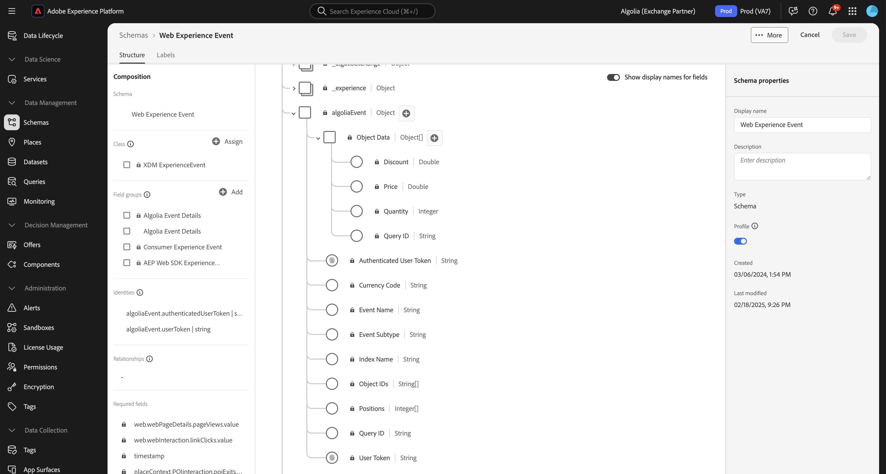

# Présentation de l’extension de transfert d’événement [!DNL Algolia] {#overview}

Utilisez [!DNL Algolia] pour offrir des expériences de recherche rapides, pertinentes et personnalisées. Grâce à l’optimisation optimisée par l’IA, vous pouvez améliorer les résultats de recherche et les recommandations afin d’aider les utilisateurs et les utilisatrices à trouver rapidement les produits, le contenu ou les informations dont ils ont besoin.

Utilisez l’extension de transfert d’événement [!DNL Algolia] pour envoyer des événements de comportement utilisateur à [!DNL Algolia] via le [!DNL Insights API]. Ces données comportementales permettent d’obtenir des recommandations optimisées par l’IA, des expériences personnalisées et des fonctionnalités de recherche intelligentes.

## Conditions préalables {#prerequisites}

Avant d’installer l’extension, vérifiez que vous disposez d’un compte [!DNL Algolia] avec un accès à l’[!DNL Insights API]. Si vous ne disposez pas d’un compte , [inscrivez-vous](https://dashboard.algolia.com/users/sign_up) et activez l’accès à l’API .

Assurez-vous également de comprendre comment utiliser le [!DNL Algolia] [!DNL Insights API]. Pour obtenir un aperçu sur l’envoi d’événements, reportez-vous à la section [Envoi d’événements avec l’API Insights](https://www.algolia.com/doc/guides/sending-events/getting-started/).

Rassemblez les valeurs suivantes à partir du tableau de bord de votre compte [!DNL Algolia] :
- **[!UICONTROL Application ID]**
- **[!UICONTROL Search API Key]**
- **[!UICONTROL Index Name]**

## Installation l’extension {#install}

Pour installer l’extension [!DNL Algolia], procédez comme suit :

Accédez à **[!UICONTROL Data Collection]** dans [!DNL Adobe Experience Platform]. Sélectionnez l’onglet **[!UICONTROL Extensions]** .

Ouvrez le **[!UICONTROL Catalog]** et localisez l’extension **[!UICONTROL Algolia Event Forwarding]**, puis sélectionnez **[!UICONTROL Install]**.

### Configurez l’extension {#configure-extension}

Pour configurer l’extension de transfert d’événement [!DNL Algolia], accédez à l’onglet **[!UICONTROL Extensions]** , sélectionnez l’extension **[!UICONTROL Algolia]**, puis sélectionnez **[!UICONTROL Configure]**.

| Propriété | Description |
|----------|-------------|
| **[!UICONTROL Application ID]** | Saisissez les [!UICONTROL Application ID] figurant dans le tableau de bord Algolia sous la section [Clés API](https://www.algolia.com/account/api-keys/all). |
| **[!UICONTROL Search API Key]** | Saisissez les [!UICONTROL Search API Key] figurant dans le tableau de bord Algolia sous la section [Clés API](https://www.algolia.com/account/api-keys/all). |
| **[!UICONTROL Index Name]** | Saisissez le [!UICONTROL Index Name] qui contient vos produits ou votre contenu. Cet index est utilisé comme valeur par défaut. |

{style="table-layout:auto"}

## [!DNL Algolia] types d’action d’extension de transfert d’événement {#action-types}

L’extension de transfert d’événement [!DNL Algolia] propose un type d’action unique qui peut être utilisé dans la section **[!UICONTROL Then]** d’une règle :

### Événement d’envoi {#send-event}

Configurez l’action **[!UICONTROL Send event]** pour transférer les événements vers [!DNL Algolia] :

Sélectionnez **[!UICONTROL Rules]** > **[!UICONTROL Add Rule]** ou sélectionnez une règle existante. Dans la partie **[!UICONTROL Then]** de la règle, ajoutez une action et sélectionnez **[!UICONTROL Extension]** : [!DNL Algolia] Transfert d’événement > **[!UICONTROL Action Type]** : **[!UICONTROL Send Events]**.

## Implémenter le groupe de champs d’événement [!DNL Algolia] {#algolia-field-group}

Veillez à ajouter le groupe de champs d’événement [!DNL Algolia] à votre schéma avant d’utiliser l’extension de transfert d’événement [!DNL Algolia]. Il s’agit de l’un des groupes de champs standard fournis par Experience Platform.

### Ajoutez le groupe de champs d’événement [!DNL Algolia] à votre schéma {#add-algolia-field-group}

Pour ajouter le groupe de champs d’événement [!DNL Algolia] :

Accédez à **[!UICONTROL Schemas]** et sélectionnez **[!UICONTROL Browse]**.

Ajoutez un nouveau schéma ou mettez à jour un schéma existant que vous utilisez pour envoyer des événements web et passez la souris sur l’icône **[!UICONTROL Add]**. Saisissez *[!DNL Algolia]* dans la zone de recherche pour affiner les résultats.

Sélectionnez le groupe de champs Détails de l’événement de **[!DNL Algolia]** > bouton **[!UICONTROL Add field group]** > **[!UICONTROL Save]**.

### Mapper et envoyer des données à l’aide de la balise [!UICONTROL Data Collection]

L’extension de transfert d’événement [!DNL Algolia] peut être utilisée avec la **[!DNL Adobe Experience Platform Web SDK]** pour envoyer des données de votre site web à [!DNL Algolia]. Pour ce faire, créez une propriété de balise, mappez les données à l’objet [!DNL XDM] et configurez des règles pour envoyer des événements.

#### Étape 1 : création d’une propriété de balise avec le SDK web

1. Créez une propriété de balise.
2. Installez l’extension [!DNL Adobe Experience Platform Web SDK].
3. Utilisez cette extension pour mapper les données d’HTML au groupe de champs **[!DNL Algolia]Event**.

#### Étape 2 : créer un élément de données pour [!DNL XDM] mappage

1. Créez un [!UICONTROL Data Element] à l’aide de l’**[!DNL Adobe Experience Platform Web SDK]** .
2. Sélectionnez **[!UICONTROL XDM object]** comme type d’élément de données.
3. Mappez vos données aux champs de [!DNL XDM] appropriés en veillant à ce que les champs spécifiques à [!DNL Algolia] soient renseignés.

#### Étape 3 : créer une règle pour envoyer des événements

1. Créez une règle dans la propriété de balise.
2. Ajoutez les déclencheurs d’événement requis tels que le chargement de page ou les événements de clic.
3. Ajoutez une action à l’aide de **[!DNL Adobe Experience Platform Web SDK]**.
4. Sélectionnez **[!UICONTROL Send event]** comme type d’action.
5. Configurez l’action pour utiliser l’élément de données [!DNL XDM].

#### Étape 4 : publier et tester

1. Publiez les règles et les modifications d’extension dans votre environnement cible.
2. Utilisez le [!DNL Adobe Experience Platform Debugger] pour vérifier que les données sont envoyées à Adobe Experience Platform et transférées à [!DNL Algolia].

### Vérifier les événements dans [!DNL Algolia]

Après avoir configuré l’extension de transfert d’événement [!DNL Algolia], vous pouvez vérifier que les événements sont correctement envoyés et reçus en procédant comme suit :

Accédez à votre tableau de bord [!DNL Algolia] et à **[!UICONTROL Data Sources > Events > Debugger]**.

Sélectionnez l’événement correspondant à l’événement envoyé à partir de l’extension de transfert d’événement de [!DNL Algolia] et vérifiez que les données attendues sont présentes dans l’événement.

## Scénarios d’implémentation courants

Utilisez l’extension de transfert d’événement [!DNL Algolia] pour capturer et envoyer des données d’interaction utilisateur pour divers cas d’utilisation, ce qui améliore la pertinence et la personnalisation des recherches.

### Suivi des vues de produit ou de contenu

Utilisez l’extension pour suivre le moment où les utilisateurs consultent les pages de produit ou de contenu, ce qui [!DNL Algolia] aide à comprendre les intérêts des utilisateurs.

### Suivi des événements de conversion

Effectuez le suivi des événements d’ajout au panier, des achats et d’autres événements de conversion pour optimiser les recommandations de [!DNL Algolia] optimisées par l’IA.

## Résolution des problèmes

Si vous rencontrez des problèmes lors de l’implémentation de l’extension de transfert d’événement [!DNL Algolia], tenez compte des étapes de dépannage suivantes :

### Les événements n’apparaissent pas dans les [!DNL Algolia]

Si les événements n’apparaissent pas dans [!DNL Algolia], vérifiez les points suivants :

- **Vérification des informations d’identification de l’API** : assurez-vous que les **[!UICONTROL Application ID]** et **[!UICONTROL API Key]** correspondent aux valeurs de votre tableau de bord [!DNL Algolia].
- **Vérifier le débogueur d’événement** : utilisez le débogueur d’événement [!DNL Algolia] pour confirmer si des événements sont reçus. Dans le cas contraire, vérifiez la configuration de la règle de transfert d’événement.
- **Inspecter le mappage XDM** : assurez-vous que tous les champs obligatoires du schéma [!DNL Algolia] sont correctement mappés dans l’objet [!DNL XDM].

### Données d’événement incorrectes

- Assurez-vous que l’élément de données de l’objet de [!DNL XDM] est mappé précisément au schéma [!DNL Algolia], avec tous les champs obligatoires.
- Vérifiez que les paramètres d’événement correspondent au format et à la structure attendus décrits dans la documentation de l’API Insights d’[!DNL Algolia].

## Étapes suivantes

Ce guide explique comment envoyer des données aux [!DNL Algolia] à l’aide de l’[!DNL Algolia Event Forwarding Extension] . Pour plus d’informations sur les fonctionnalités de transfert d’événement dans [!DNL Adobe Experience Platform], consultez la [présentation du transfert d’événement](../../../ui/event-forwarding/overview.md).

Pour plus d’informations sur le débogage de votre implémentation à l’aide du débogueur Experience Platform et de l’outil de surveillance du transfert d’événement, lisez la [présentation d’Adobe Experience Platform Debugger](../../../../debugger/home.md) et [Surveiller les activités dans le transfert d’événement](../../../ui/event-forwarding/monitoring.md).

## Ressources supplémentaires

- [[!DNL Algolia]  Documentation de l’API Insights ](https://www.algolia.com/doc/rest-api/insights/)
- [[!DNL Algolia] Documentation sur les événements](https://www.algolia.com/doc/guides/sending-events/getting-started/)
- [[!DNL Adobe Experience Platform] Documentation sur le transfert d’événement](https://experienceleague.adobe.com/docs/experience-platform/tags/event-forwarding/overview.html?lang=fr)
- [[!DNL Algolia] Présentation des fonctionnalités de l’IA](https://www.algolia.com/products/ai-search/)
