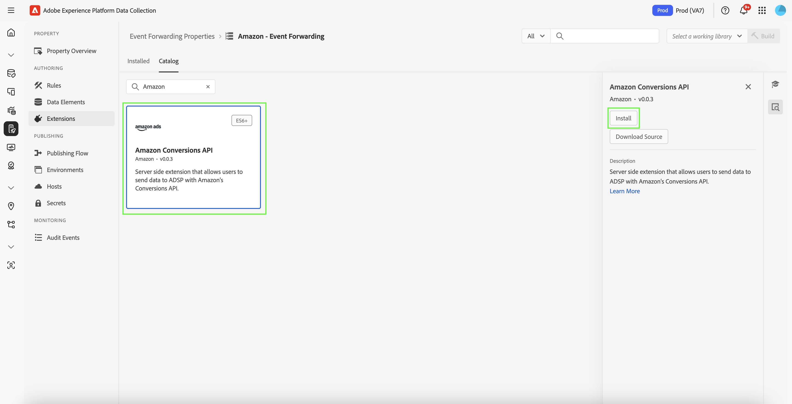
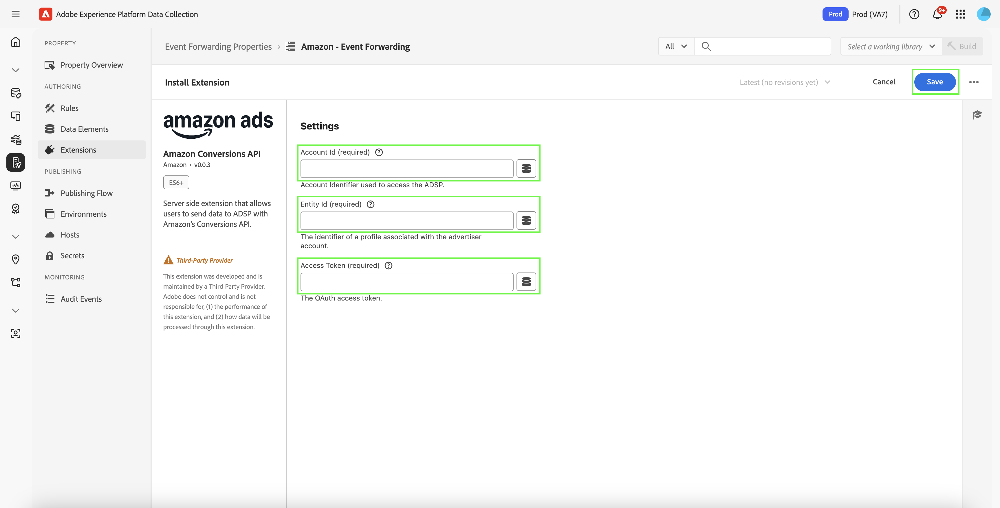
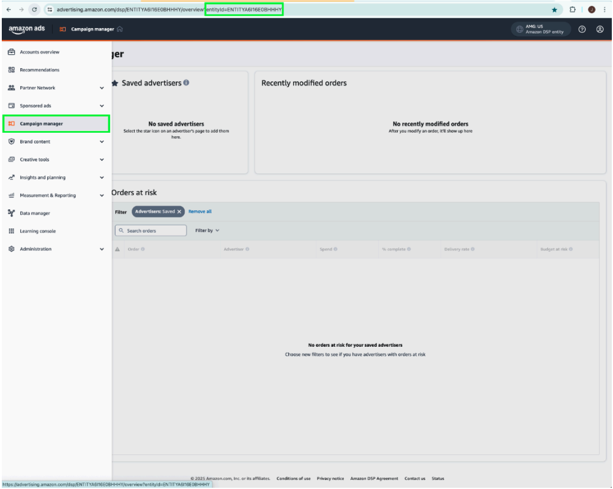
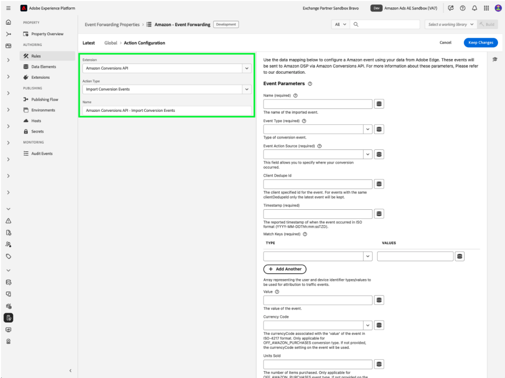
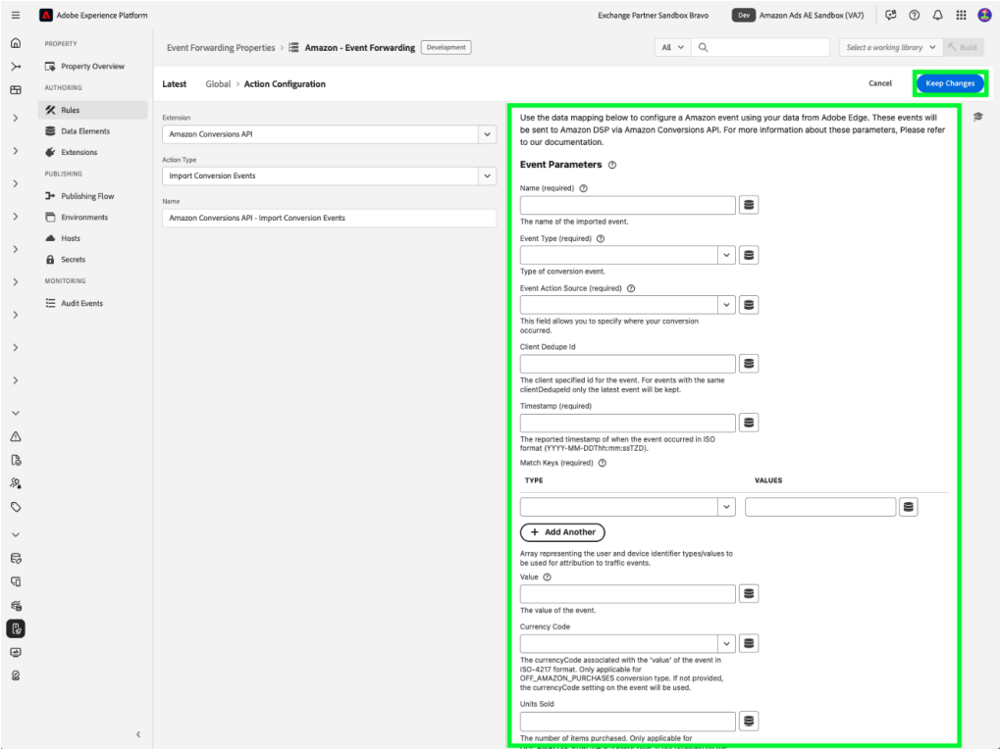
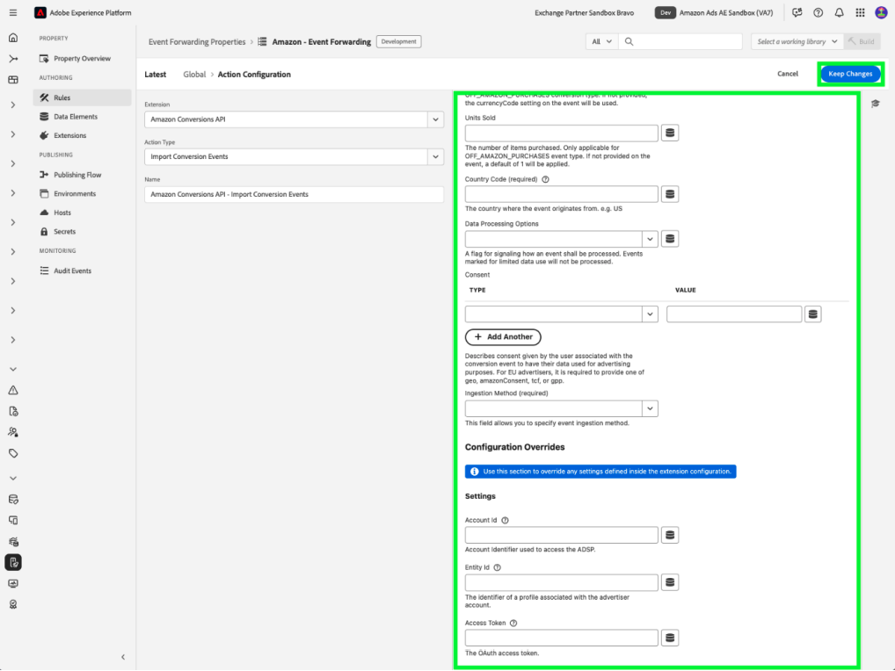

# Présentation de l’extension d’API d’événements web [!DNL Amazon]

L’extension [!DNL Amazon] Conversions API crée une connexion directe entre les données marketing du serveur d’un annonceur et [!DNL Amazon]. Il permet aux annonceurs d’évaluer l’efficacité des campagnes indépendamment de l’emplacement de conversion et d’optimiser les campagnes en conséquence. Cette extension fournit une attribution complète, la fiabilité des données et une diffusion optimisée.

## Conditions préalables de [!DNL Amazon] {#prerequisites}

Avant d’installer et de configurer l’extension d’API [!DNL Amazon] Conversions, effectuez les étapes préalables suivantes pour garantir une authentification et un accès aux données corrects :

### Créer un secret et un élément de données {#secret}

Créez un nouveau [!DNL Amazon] [secret de transfert d’événement](../../../ui/event-forwarding/secrets.md) et attribuez-lui un nom unique qui indique le membre d’authentification. Cela sera utilisé pour authentifier la connexion à votre compte tout en conservant la sécurité de la valeur.

Ensuite, [créez un élément de données](../../../ui/managing-resources/data-elements.md#create-a-data-element) à l’aide de l’extension [!UICONTROL Core] et d’un type d’élément de données [!UICONTROL Secret] pour référencer le secret de `Amazon` que vous venez de créer.

### Collecter les détails de configuration requis {#configuration-details}

Pour connecter Experience Platform à [!DNL Amazon], saisissez les détails suivants :

| Type de clé | Description |
| --- | --- |
| Identifiant de compte | Identifiant de compte unique de votre compte [!DNL Amazon]. |
| ID de l’entité | Identifiant d’un profil associé au compte de l’annonceur. Elle se trouve dans l’URL du portail du gestionnaire de campagne, précédée du préfixe `entity`. |
| Jeton d’accès | Jeton d’accès non expirant de votre application, utilisé pour s’authentifier auprès de l’API [!DNL Amazon] via OAuth. Reportez-vous à la documentation de l’API Amazon [sur l’authentification](https://developer.amazon.com/docs/app-porting/device-messaging-fit-obtain-api-key.html) pour obtenir des conseils. |

## Installation et configuration de l’extension [!DNL Amazon] {#install-configure}

Pour installer et configurer l’extension d’API [!DNL Amazon] Conversions, procédez comme suit :

1. Créez ou modifiez une propriété de transfert d’événement.
2. Accédez à **Extensions** dans le panneau de navigation de gauche, puis sélectionnez l’extension [!DNL Amazon] dans l’onglet Catalogue.
3. Sélectionnez **Installer**.

   

4. Configurez l’extension avec les détails suivants :
   - **Jeton d’accès** : secret de l’élément de données contenant le jeton OAuth 2.

     

   - **Identifiant d’entité** : votre identifiant d’entité (qui se trouve dans l’URL du portail du gestionnaire de campagnes avec le préfixe « entité »).

     

5. Sélectionnez **Enregistrer** pour terminer la configuration.

## Configurer une règle de transfert d’événement {#config-rule}

Une fois tous vos éléments de données configurés, créez des règles de transfert d’événement pour déterminer quand et comment vos événements sont envoyés à [!DNL Amazon].

1. Accédez à **Règles** et créez une règle de transfert d’événement.
2. Sous **Actions**, sélectionnez **Extension de l’API Conversions Amazon**.
3. Définissez le **Type d’action** sur **Importer les événements de conversion**.

   

### Configuration des données d’événement de conversion {#conversion-event-data}

Les données d’événement de conversion sont essentielles pour effectuer le suivi des interactions utilisateur et mesurer l’efficacité de vos campagnes. En transmettant ces données à [!DNL Amazon], vous pouvez obtenir des informations sur le comportement des utilisateurs, optimiser vos campagnes et garantir une attribution précise pour les conversions.

Le tableau ci-dessous décrit les propriétés clés requises pour configurer et transférer les données d’événement de conversion :

| Entrée | Description | Obligatoire | Exemple |
| --- | --- | --- | --- |
| `name` | Nom de l’événement importé. | Oui | `My Event Name` |
| `eventType` | Type d’événement Amazon standard associé à l’événement et utilisé pour la création de rapports. | Oui | `Add to Shopping Cart` |
| `eventActionSource` | Plateforme d’où provient l’événement. | Oui | `WEBSITE` |
| `clientDedupeId` | `id` spécifié par l’annonceur pour l’événement de conversion. Pour les événements de même `clientDedupeId`, seul le premier événement est conservé et tous les événements suivants sont ignorés. | Facultatif | `3234A398932` |
| `timestamp` | Date et heure signalées du moment où l’événement s’est produit. L’horodatage peut prendre jusqu’à 7 jours avant l’envoi d’un événement. Les données datant de plus de 7 jours ne seront pas traitées. | Oui | `2023-05-08T14:04:28Z` |
| `matchKeys` | Tableau représentant les types/valeurs d’identifiants de client et d’appareil à utiliser pour l’attribution aux événements de trafic. | Oui | --- |
| `matchKeys > type` | Type d’identifiant utilisé pour l’attribution. | Oui | --- |
| `matchKeys > value` | Valeur d’identifiant utilisée pour l’attribution. | Oui | Liste des valeurs d’identifiant hachées SHA-256 du client qui a exécuté l’événement. |
| `value` | Valeur de l’événement. | Facultatif | `5` ou `0.99` |
| `currencyCode` | Code de devise associé au `value` de l’événement au format ISO-4217. Applicable uniquement au type d’événement Achats hors Amazon . S’il n’est pas fourni, le paramètre de code de devise sur la définition de conversion est utilisé. | Facultatif | `USD`, `EUR`, `GBP`, etc. |
| `unitsSold` | Nombre d’articles achetés. Applicable uniquement au type d’événement Achats hors Amazon . Si elle n’est pas fournie dans l’événement de conversion, une valeur par défaut de `1` est appliquée. | Facultatif | --- |
| `countryCode` | Cette valeur est basée sur la norme ISO 3166-1 alpha-2, codes pays à deux lettres définis dans la norme ISO 3166-1, qui fait partie de la norme ISO 3166 publiée par l’Organisation internationale de normalisation (ISO), pour représenter les pays, les territoires dépendants et les zones géographiques spéciales d’intérêt. | Oui | --- |
| `dataProcessingOptions` | Indique le consentement de l’utilisateur pour l’utilisation des données publicitaires. | Facultatif | LIMITED_DATA_USE |

- Sélectionnez **[!UICONTROL Conserver les modifications]** pour enregistrer la règle.

## Déduplication des événements {#deduplication}

La déduplication est essentielle pour garantir la précision des rapports et empêcher le décompte de conversions exagéré lors de l’utilisation de la balise Advertising [!DNL Amazon] (AAT) et de l’extension de l’API de conversions [!DNL Amazon] pour suivre les mêmes événements.

### Quand la déduplication est-elle requise ?

- **Obligatoire** : si le même événement est envoyé à la fois par le client (AAT) et le serveur (API de conversions).
- **Non requis** : si des types d’événements distincts sont envoyés depuis le client et le serveur sans chevauchement.

### Activation de la déduplication

Pour activer la déduplication, incluez le champ `clientDedupeId` dans chaque événement partagé. Cet identifiant unique [!DNL Amazon] permet de faire la distinction entre les événements côté client et côté serveur et d’empêcher les entrées en double.

En configurant correctement la déduplication, vous pouvez vous assurer que les données d’optimisation restent exactes et que les rapports ne sont pas affectés négativement.

Pour plus d’informations, consultez le [Guide de déduplication des événements d’](https://advertising.amazon.com/).

## Étapes suivantes {#next-steps}

Ce guide explique comment configurer et envoyer des événements de conversion à [!DNL Amazon] à l’aide de l’extension d’API [!DNL Amazon] Conversions. Pour plus d’informations sur les fonctionnalités de transfert d’événement dans [!DNL Adobe Experience Platform], reportez-vous à la section [présentation du transfert d’événement](../../../ui/event-forwarding/overview.md).

Pour plus d’informations sur le débogage de votre implémentation à l’aide du débogueur Experience Platform et de l’outil de surveillance du transfert d’événement, lisez la [présentation d’Adobe Experience Platform Debugger](/help/debugger/home.md) et [activités de surveillance](../../../ui/event-forwarding/monitoring.md) dans le transfert d’événement.
