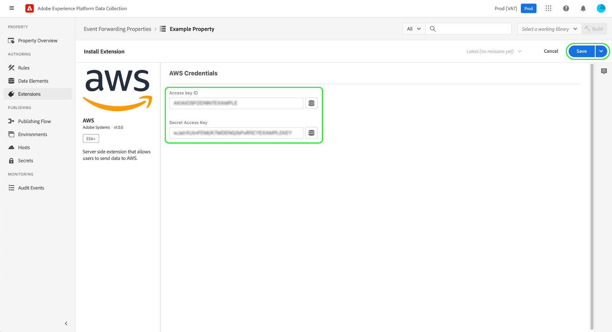

# Présentation de l’extension [!DNL AWS]

[[!DNL Amazon Web Services] ([!DNL AWS])](https://aws.amazon.com/) est une plateforme d&#39;informatique en nuage qui offre une grande variété de services tels que l&#39;informatique distribuée, le stockage de bases de données, la diffusion de contenu et les services d&#39;intégration de logiciel en tant que service (SaaS) pour la gestion de la relation client (CRM) et la planification des ressources de l&#39;entreprise (ERP).

L’extension [!DNL AWS] [transfert d’événement](../../../ui/event-forwarding/overview.md) tire parti de [[!DNL Amazon Kinesis Data Streams]](https://docs.aws.amazon.com/streams/latest/dev/introduction.html) pour envoyer des événements de l’Edge Network Adobe Experience Platform à [!DNL AWS] en vue d’un traitement ultérieur. Ce guide explique comment installer l’extension et utiliser ses fonctionnalités dans une règle de transfert d’événement.

## Conditions préalables

Pour utiliser cette extension, vous devez disposer d’un compte [!DNL AWS] avec un flux de données [!DNL Kinesis] existant. Si vous ne disposez pas d’un flux de données préexistant, consultez la documentation [!DNL AWS] sur la [création d’un flux de données à l’aide de la console  [!DNL AWS]  gestion](https://docs.aws.amazon.com/streams/latest/dev/how-do-i-create-a-stream.html).

## Installation l’extension {#install}

Pour installer l’extension [!DNL AWS], accédez à l’interface utilisateur de la collecte de données ou d’Experience Platform et sélectionnez **[!UICONTROL Transfert d’événement]** dans le volet de navigation de gauche. À partir de là, sélectionnez une propriété à laquelle ajouter l’extension ou créez-en une nouvelle.

Une fois la propriété sélectionnée ou créée, sélectionnez **[!UICONTROL Extensions]** dans le volet de navigation de gauche, puis sélectionnez l’onglet **[!UICONTROL Catalogue]**. Recherchez la carte , puis sélectionnez **[!UICONTROL Installer]**.

![Le bouton [!UICONTROL Installer] sélectionné pour l’extension [!UICONTROL AWS] dans l’interface utilisateur de collecte de données.](../../../images/extensions/server/aws/install.png)

Sur l’écran suivant, vous devez fournir les informations de connexion à votre compte [!DNL AWS]. Plus précisément, vous devez fournir votre identifiant de clé d’accès [!DNL AWS] et votre clé d’accès secrète. Si vous ne connaissez pas ces valeurs, consultez la documentation [!DNL AWS] sur [comment obtenir votre identifiant de clé d’accès et votre clé d’accès secrète](https://docs.aws.amazon.com/powershell/latest/userguide/pstools-appendix-sign-up.html).

>[!IMPORTANT]
>
>Une politique d’accès doit être associée au compte [!DNL AWS] utilisé pour générer les informations d’identification d’accès. Cette politique doit être configurée pour accorder des droits d’accès afin d’envoyer des données au flux de données [!DNL Kinesis]. Reportez-vous à **Exemple 2** dans le document [!DNL AWS] sur [exemple de politique pour [!DNL Kinesis Data Streams]](https://docs.aws.amazon.com/streams/latest/dev/controlling-access.html#kinesis-using-iam-examples) pour savoir comment la politique doit être définie.

Lorsque vous avez terminé, sélectionnez **[!UICONTROL Enregistrer]** et l’extension est installée.

## Configurer une règle de transfert d’événement {#rule}

Après avoir installé l’extension, créez une nouvelle [règle](../../../ui/managing-resources/rules.md) de transfert d’événement et configurez ses conditions selon vos besoins. Lors de la configuration des actions pour la règle, sélectionnez l’extension ****, puis sélectionnez **[!UICONTROL Envoyer les données au flux de données Kinesis]** pour le type d’action.

![Le type d’action [!UICONTROL Envoyer des données au flux de données Kinesis] sélectionné pour une règle dans l’interface utilisateur de collecte de données.](../../../images/extensions/server/aws/select-action-type.png)

Le panneau de droite se met à jour pour afficher les options de configuration relatives à la manière dont les données doivent être envoyées. Plus précisément, vous devez attribuer des [éléments de données](../../../ui/managing-resources/data-elements.md) aux différentes propriétés qui représentent votre configuration [!DNL Event Hub].

![Les options de configuration du type d’action [!UICONTROL Envoyer des données au flux de données Kinesis] affiché dans l’interface utilisateur.](../../../images/extensions/server/aws/data-stream-details.png)

**[!UICONTROL Détails du flux de données Kinesis]**

| Entrée | Description |
| --- | --- |
| [!UICONTROL Nom du flux] | Nom du flux vers lequel cette règle de transfert d’événement enverra les enregistrements de données. |
| [!UICONTROL Région AWS] | Région [!DNL AWS] dans laquelle le flux de données [!DNL Kinesis] est créé. |
| [!UICONTROL Clé de partition] | La [clé de partition](https://docs.aws.amazon.com/streams/latest/dev/key-concepts.html#partition-key) que l’extension utilisera lors de l’envoi de données au flux de données.  [!DNL Kinesis Data Streams] sépare les enregistrements de données appartenant à un flux en plusieurs partitions. Elle utilise la clé de partition envoyée avec chaque enregistrement de données pour déterminer à quelle partition appartient un enregistrement de données donné.   Une bonne clé de partition pour distribuer les clients peut être le numéro de client, puisqu’il est différent pour chaque client. Une clé de partition de mauvaise qualité pourrait avoir son code postal, car ils peuvent tous vivre dans la même zone à proximité. En règle générale, vous devez choisir une clé de partition qui possède la plage la plus élevée de différentes valeurs potentielles. Consultez l’article [!DNL AWS] sur [mise à l’échelle de vos flux  [!DNL Kinesis]  données](https://aws.amazon.com/blogs/big-data/under-the-hood-scaling-your-kinesis-data-streams/) pour connaître les bonnes pratiques de gestion des clés de partition. |

{style="table-layout:auto"}

**[!UICONTROL Data]** (Données)

| Entrée | Description |
| --- | --- |
| [!UICONTROL Payload] | Ce champ contient les données qui seront transférées au flux de données [!DNL Kinesis], au format JSON.  Sous l’option **[!UICONTROL Raw]**, vous pouvez coller l’objet JSON directement dans le champ de texte fourni ou sélectionner l’icône d’élément de données () à sélectionner dans une liste d’éléments de données existants pour représenter la payload.  Vous pouvez également utiliser l’option **[!UICONTROL Éditeur de paires clé-valeur JSON]** pour ajouter manuellement chaque paire clé-valeur par le biais d’un éditeur d’interface utilisateur. Chaque valeur peut être représentée par une entrée brute ou un élément de données peut être sélectionné à la place. |

{style="table-layout:auto"}

Lorsque vous avez terminé, sélectionnez **[!UICONTROL Conserver les modifications]** pour ajouter l’action à la configuration de la règle. Lorsque la règle vous convient, sélectionnez **[!UICONTROL Enregistrer dans la bibliothèque]**.

Enfin, publiez un nouveau transfert d’événement [build](../../../ui/publishing/builds.md) pour activer les modifications apportées à la bibliothèque.

## Étapes suivantes

Ce guide explique comment envoyer des données aux [!DNL Kinesis Data Streams] à l’aide de l’extension de transfert d’événement [!DNL AWS]. Pour plus d’informations sur les fonctionnalités de transfert d’événement d’Experience Platform, consultez la [présentation du transfert d’événement](../../../ui/event-forwarding/overview.md).
