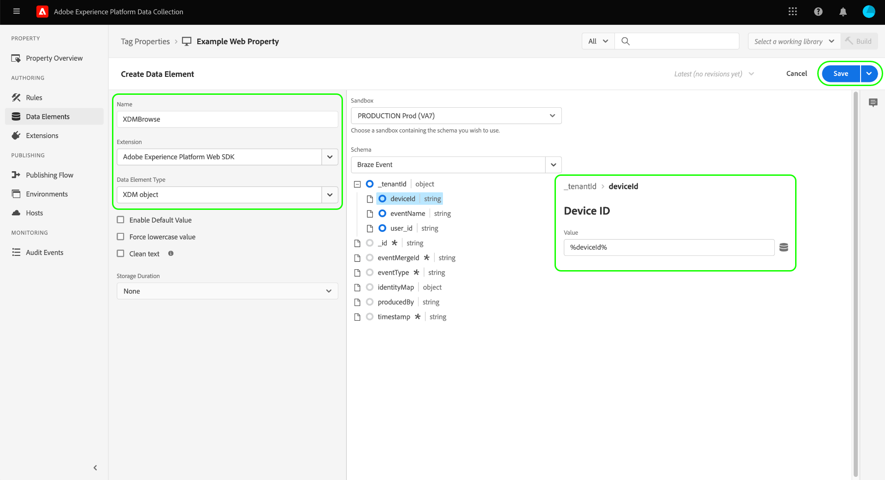
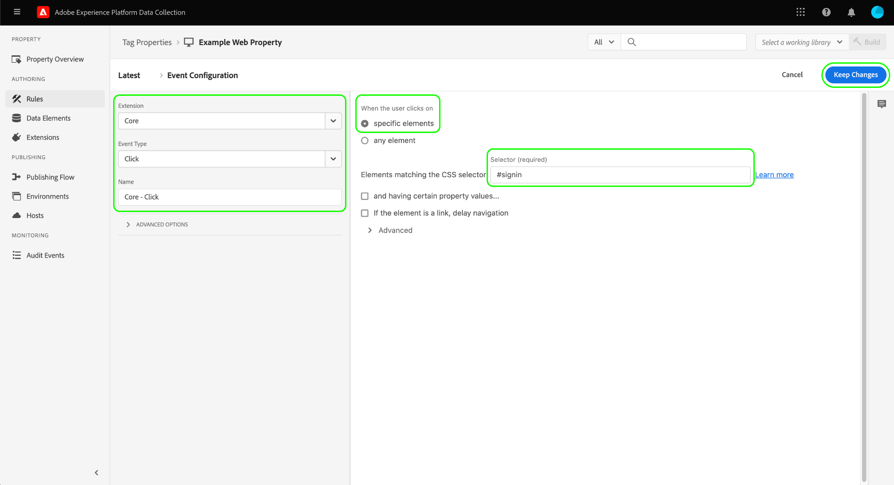

# [!DNL Braze Track Events API] extension de transfert d’événement

[[!DNL Braze]](https://www.braze.com) est une plateforme d’engagement client qui alimente en temps réel les interactions centrées sur le client entre les consommateurs et les marques. Utilisation [!DNL Braze], vous pouvez effectuer les opérations suivantes :

* Diffusez des données (comme des messages marketing) à des utilisateurs ciblés en fonction de leurs préférences linguistiques, de leurs préférences d’emplacement, etc., afin d’augmenter les taux de conversion et de prendre en charge les principaux objectifs de l’entreprise.
* Envoyez aux clients des messages personnalisés sur plusieurs canaux, y compris des e-mails, des notifications push et des messages in-app, au bon moment et dans les langues de leur choix.
* Ciblez des utilisateurs spécifiques pour les campagnes marketing et promotionnelles afin d’augmenter le nombre de clients réguliers.
* Étudiez le comportement et les schémas des utilisateurs pour cibler des audiences spécifiques avec des messages personnalisés, ce qui peut contribuer à augmenter les recettes.

Le [!DNL Braze Track Events API] [transfert d’événement](../../../ui/event-forwarding/overview.md) l’extension vous permet d’exploiter les données capturées dans Adobe Experience Platform Edge Network et de les envoyer à [!DNL Braze] sous la forme d’événements côté serveur à l’aide de la variable [[!DNL Braze User Identify]](https://www.braze.com/docs/api/endpoints/user_data/post_user_identify) et [[!DNL Braze User Track]](https://www.braze.com/docs/api/endpoints/user_data/post_user_track) API.

Ce document couvre les cas d’utilisation de l’extension, comment l’installer dans vos bibliothèques de transfert d’événements et comment utiliser ses fonctionnalités dans un transfert d’événement. [règle](../../../ui/managing-resources/rules.md).

## Cas d’utilisation

Cette extension doit être utilisée si vous souhaitez utiliser les données du réseau Edge dans [!DNL Braze] pour tirer parti de ses capacités de ciblage et d’analyse client.

Prenons l’exemple d’une entreprise de vente au détail présente sur plusieurs canaux (site web et mobile) et qui capture des entrées transactionnelles ou conversationnelles en tant que données d’événement de son site web et de ses plateformes mobiles. Utiliser divers [tag](../../../home.md) règles, ces données sont envoyées au réseau Edge en temps réel. À partir de là, le [!DNL Braze] l’extension de transfert d’événement envoie automatiquement les événements pertinents à [!DNL Braze] du côté serveur.

Une fois les données envoyées, les équipes d’analyse de l’entreprise peuvent alors tirer parti des [!DNL Braze's] fonctionnalités permettant de traiter les jeux de données et d’obtenir des informations sur l’entreprise afin de générer des graphiques, des tableaux de bord ou d’autres visualisations pour informer les parties prenantes de l’entreprise. Reportez-vous à la section [[!DNL Braze] clients](https://www.braze.com/customers) pour plus d’informations sur les différents cas d’utilisation de la plateforme.

## [!DNL Braze] conditions préalables et barrières de sécurité {#prerequisites}

Vous devez disposer d’un [!DNL Braze] afin d&#39;utiliser ses technologies. Si vous ne disposez pas d’un compte, accédez à la variable [Page Prise en main](https://www.braze.com/get-started/) on [!DNL Braze] pour se connecter à [!DNL Braze Sales] et démarrez le processus de création de compte.

### Protections des API

L’extension utilise deux des [!DNL Braze]Les API de d’ et leurs limites sont décrites ci-dessous :

| API | Limites de taux |
| --- | --- |
| [!DNL User Track] | 50 000 demandes par minute.  Reportez-vous à la section [[!DNL User Track] Documentation des API](https://www.braze.com/docs/api/endpoints/user_data/post_user_track#rate-limit) pour plus d’informations. |
| [!DNL User Identify] | 20 000 demandes par minute.  Reportez-vous à la section [[!DNL User Identify] Documentation des API](https://www.braze.com/docs/api/endpoints/user_data/post_user_identify#rate-limit) pour plus d’informations. |

>[!NOTE]
>
>Reportez-vous au guide sur la [[!DNL Braze] Limites de l’API](https://www.braze.com/docs/api/api_limits/) pour plus de détails sur les limites qu&#39;ils imposent.

### Présentation du cycle de vie du profil utilisateur

[!DNL Braze] crée des profils utilisateur anonymes à l&#39;aide de l&#39;identifiant unique, `deviceId`, défini par [!DNL Braze]. Une fois qu’un utilisateur est identifié en fournissant un identifiant utilisateur, un profil utilisateur identifié est créé.

Lors de la première instance d’attribution d’une `external_id` dans un profil utilisateur inconnu, toutes les données de profil utilisateur existantes et tous les événements anonymes sont migrés vers le nouveau profil utilisateur. Profils utilisateur anonymes partageant le même `deviceId` sont également associés au profil utilisateur identifié.

[!DNL Braze] fusionne et conserve toutes les données associées au profil alias uniquement. Cependant, toutes les données utilisateur anonymes suivantes seront orphelines. Reportez-vous à la section [!DNL Braze] pages de documentation sur [profils utilisateur identifiés](https://www.braze.com/docs/user_guide/data_and_analytics/user_data_collection/user_profile_lifecycle/#identified-user-profiles) et [bonnes pratiques de collecte de données](https://www.braze.com/docs/user_guide/data_and_analytics/user_data_collection/best_practices/#overview) pour plus d’informations.

### Points de données facturables

Envoi d’attributs personnalisés supplémentaires à [!DNL Braze] peut augmenter votre [!DNL Braze] consommation des points de données. Consultez votre [!DNL Braze] gestionnaire de compte avant d’envoyer des attributs personnalisés supplémentaires. Reportez-vous à la section [!DNL Braze] documentation sur [points de données facturables](https://www.braze.com/docs/user_guide/onboarding_with_braze/data_points/#billable-data-points) pour plus d’informations.

### Collecte des détails de configuration requis {#configuration-details}

Pour connecter le réseau Edge à [!DNL Braze], les entrées suivantes sont requises :

| Type de clé | Description | Exemple |
| --- | --- | --- |
| [!DNL Braze] Instance | Le point de terminaison REST associé à la variable [!DNL Braze] compte . Reportez-vous à la section [!DNL Braze] documentation sur [instances](https://www.braze.com/docs/user_guide/administrative/access_braze/braze_instances) pour obtenir des conseils. | `rest.iad-03.braze.com` |
| Clé API | Le [!DNL Braze] Clé API associée à [!DNL Braze] compte .  Reportez-vous à la section [!DNL Braze] la documentation relative à la [Clé API REST](https://www.braze.com/docs/api/basics/#rest-api-key) pour obtenir des conseils. | `YOUR-BRAZE-REST-API-KEY` |

## Conditions préalables des Experience Cloud

Cette section décrit les étapes préalables requises dans Experience Cloud pour toutes les implémentations. En fonction de vos besoins de mise en oeuvre, il peut s’avérer utile de configurer les éléments suivants avant de configurer l’extension :

1. A [schema](../../../../xdm/schema/composition.md) pour décrire la structure des données que vous ingérez dans Experience Cloud
1. A [datastream](https://experienceleague.adobe.com/docs/platform-learn/data-collection/event-forwarding/set-up-a-datastream.html) pour acheminer les données entrantes vers les applications Adobe Experience Cloud appropriées
1. A [dataset](https://experienceleague.adobe.com/docs/platform-learn/tutorials/data-ingestion/create-datasets-and-ingest-data.html?lang=fr) pour stocker les données collectées

Pour toutes les implémentations, les éléments suivants sont requis côté Experience Cloud :

1. [Créer un secret](#create-a-secret)
1. [Configuration des propriétés de balise](#set-up-tag-properties)
1. [Ajout d’éléments de données dans les propriétés de balise](#add-data-elements-within-tag-properties)
1. [Ajout de règles aux propriétés de balise](#add-rules-within-tag-properties)

### Créer un secret

Créer [secret de transfert d’événement](../../../ui/event-forwarding/secrets.md) et définissez la valeur sur votre [[!DNL Braze] Clé API](#configuration-details). Elle sera utilisée pour authentifier la connexion à votre compte tout en conservant la valeur en sécurité.

### Configuration des propriétés de balise

[Création d’une propriété de balise](https://experienceleague.adobe.com/docs/platform-learn/implement-in-websites/configure-tags/create-a-property.html?lang=en) ou choisissez une propriété existante à modifier. Cette propriété sera configurée pour collecter les structures de données nécessaires pour [!DNL Braze] car elles sont introduites dans le réseau Edge avant d’être envoyées à l’aide du transfert d’événement.

### Ajout d’éléments de données dans les propriétés de balise

Si votre site web utilise la variable [!DNL Braze] SDK, vous devez [créer un élément de données ;](../../../ui/managing-resources/data-elements.md) qui utilise la variable **[!UICONTROL Cookie]** type (fourni par [[!UICONTROL Core] extension de balise](../../client/core/overview.md)). [!DNL Braze] `deviceId` peut être lu à partir du cookie .

Le **[!UICONTROL Nom du cookie]** doit correspondre à la valeur [!DNL Braze] nom du cookie du site web. Le nom doit avoir un format similaire à `ab.storage.deviceId.{BRAZE_PROJECT_TOKEN_FOR_WEBSITE}`. Lorsque vous avez terminé, cliquez sur **[!UICONTROL Enregistrer]**.

Pour le deuxième élément de données, définissez le type sur **[!UICONTROL Objet XDM]** (de la fonction [Extension SDK Web Adobe Experience Platform](../../client/sdk/overview.md)) et le mapper au schéma créé précédemment. Lorsque vous mappez les données, assurez-vous que la valeur de la variable `deviceId` élément de données (qui contient le [!DNL Braze] `deviceId` du cookie) est référencée en tant que valeur dans l’un de vos champs de schéma.

>[!NOTE]
>
>Si votre site web n’exécute pas la variable [!DNL Braze] SDK, un Adobe Experience Cloud ID (ECID) sera utilisé comme solution de secours. `deviceId` valeur à transmettre avec l’événement envoyé à [!DNL Braze].

Selon votre scénario, vous devrez peut-être créer un autre élément de données qui pourra être utilisé pour mapper le nom de l’événement dans le schéma. Pour ce faire, utilisez la méthode **[!UICONTROL Constante]** type fourni par [!UICONTROL Core] extension .

### Ajout de règles aux propriétés de balise

La dernière étape avant d’installer le [!DNL Braze] est de créer une balise. [règle](../../../ui/managing-resources/rules.md) (ou plusieurs règles de balise) qui est déclenchée pour les événements d’identification de l’utilisateur qui font l’objet d’un suivi, tels que les connexions, les abonnements, les inscriptions, etc.

Lors de la configuration de la variable **[!UICONTROL Événements]** pour la règle, sélectionnez les types d’événement appropriés qui déclencheront la règle. Vous trouverez ci-dessous un exemple d’événement qui déclenche la règle de connexion lors d’un clic de l’utilisateur :

Enfin, lors de la sélection de la variable **[!UICONTROL Actions]** pour la règle, sélectionnez l’événement **[!UICONTROL Envoyer un événement]** type d’action fourni par l’extension SDK Web. Sous **[!UICONTROL Données XDM]**, sélectionnez la variable [!UICONTROL Objet XDM] type de données que vous avez créé [previous](#add-data-elements-within-tag-properties).

## Installez et configurez le [!DNL Braze] extension {#install}

Pour installer l’extension, [création d’une propriété de transfert d’événement](../../../ui/event-forwarding/overview.md#properties) ou choisissez une propriété existante à modifier.

Sélectionner **[!UICONTROL Extensions]** dans le volet de navigation de gauche. Dans le **[!UICONTROL Catalogue]** onglet, sélectionnez **[!UICONTROL Installer]** sur la carte de la variable [!DNL Braze] extension .

![[!DNL Braze]Installation l’extension.](../../../images/extensions/server/braze/install-extension.png)

Dans l’écran suivant, saisissez ce qui suit : [valeurs de configuration](#configuration-details) que vous avez précédemment rassemblé à partir de [!DNL Braze]:

* **[!UICONTROL URL du point de terminaison de la fonction de blocage]**: Vous pouvez saisir la valeur de la variable [!DNL Braze] URL du point de terminaison rest en tant que texte brut dans l’entrée fournie.
* **[!UICONTROL Clé API]**: Sélectionnez la [élément de données secret](#create-a-secret) que vous avez créé précédemment, qui contient les [!DNL Braze] Clé API.

Lorsque vous avez terminé, cliquez sur **[!UICONTROL Enregistrer]**.

![Le [!DNL Braze] page de configuration de l’extension.](../../../images/extensions/server/braze/configure-extension.png)

## Configuration des éléments de données de transfert d’événement

Après avoir installé et configuré l’extension, l’étape suivante consiste à créer des éléments de données de transfert d’événement qui captureront les éléments de données nécessaires qui seront envoyés à [!DNL Braze].

### Créez un `deviceId` élément de données

Si votre site est configuré avec la variable [!DNL Braze] Vous avez ensuite défini un SDK. [élément de données secret](#add-data-elements-within-tag-properties) qui contient le paramètre [!DNL Braze] `deviceId` sur la propriété de balise. Vous devez maintenant configurer un élément de données distinct sous le transfert d’événement qui pointe vers cette valeur lorsqu’elle est envoyée au format XDM.

Lors de la création de l’élément de données, sélectionnez **[!UICONTROL Core]** pour l’extension, puis sélectionnez **[!UICONTROL Chemin]** pour le type d’élément de données. Pour la valeur, saisissez le chemin de notation par point vers la propriété `deviceId` tel qu’il existe dans votre schéma. Lorsque vous avez terminé, cliquez sur **[!UICONTROL Enregistrer]**.

### Créez un `EventName` élément de données

Dans la propriété de transfert d’événement, créez un élément de données qui utilise la variable **[!UICONTROL Chemin]** à partir du **[!UICONTROL Core]** extension . Pour la valeur , saisissez le chemin de notation par points au nom de l’événement tel qu’il existe dans votre schéma.

### Création d’éléments de données pour les événements et les achats

Le [[!DNL Braze User Track] API](https://www.braze.com/docs/api/endpoints/user_data/post_user_track) prend en charge deux actions distinctes : custom [events](https://www.braze.com/docs/api/objects_filters/event_object/#what-is-the-event-object) et [achats](https://www.braze.com/docs/api/objects_filters/purchase_object/#what-is-a-purchase-object). L’API prend également en charge [Attributs](https://www.braze.com/docs/api/objects_filters/user_attributes_object/) qui correspondent à [!DNL Braze] points de données.

Les éléments de données pour `deviceId` et `EventName` sont requis pour les événements personnalisés et les achats, mais des éléments de données supplémentaires peuvent être inclus pour l’un ou l’autre type d’événement. Ces sont énoncés ci-dessous.

>[!NOTE]
>
>Tous les éléments de données répertoriés ci-dessous doivent utiliser la variable **[!UICONTROL Chemin]** type afin qu’ils puissent mapper sur des champs spécifiques de votre schéma, comme indiqué dans la section **Chemin du schéma** colonne .

#### Événements personnalisés

| [!DNL Braze] triggers | Chemin du schéma | Description | Obligatoire |
| --- | --- | --- | --- |
| [!DNL Braze] ID de périphérique | `arc.event.xdm._extconndev.brazeDeviceId` | `deviceId` identifie l’utilisateur qui a exécuté l’événement. `deviceId` doit être spécifié sur chaque événement, car il est essentiel pour [!DNL Braze] pour exécuter l’analyse. | Oui |
| Type d’événement | `arc.event.xdm._extconndev.event_Type` | Nom de l’événement. | Oui |
| Identifiant utilisateur | `arc.event.xdm._extconndev.userId` | Adresse électronique ou identifiant de connexion de l’utilisateur, le cas échéant. |  |
| ID d’application | `arc.event.xdm._extconndev.appId` | Chaîne indiquant où l’événement a été déclenché. |  |
| Champs d’événement | `arc.event.xdm._extconndev.event_Properties` | Objet JSON représentant tous les attributs de l’événement. |  |

{style="table-layout:auto"}

#### Achats

| [!DNL Braze] triggers | Chemin du schéma | Description | Obligatoire |
| --- | --- | --- | --- |
| [!DNL Braze] ID de périphérique | `arc.event.xdm._extconndev.brazeDeviceId` | `deviceId` identifie l’utilisateur qui a exécuté l’événement. `deviceId` doit être spécifié sur chaque événement, car il est essentiel pour [!DNL Braze] pour exécuter l’analyse. | Oui |
| Type d’événement | `arc.event.xdm._extconndev.event_Type` | Nom de l’événement. | Oui |
| Identifiant utilisateur | `arc.event.xdm._extconndev.userId` | Adresse électronique ou identifiant de connexion de l’utilisateur, le cas échéant. |  |
| ID d’application | `arc.event.xdm._extconndev.appId` | Chaîne indiquant où l’événement a été déclenché. |  |
| ID de produit | `arc.event.xdm._extconndev.product_Id` | Identifiant de l’achat, tel que CUP, ISBN, catégorie de produits ou nom de produit. | Oui |
| Devise | `arc.event.xdm._extconndev.currency` | Devise utilisée pour l’achat, dans [Format de code ISO 4217](https://www.iso.org/iso-4217-currency-codes.html). | Oui |
| Prix | `arc.event.xdm._extconndev.price` | La valeur de l’achat en chiffres. | Oui |
| Quantité | `arc.event.xdm._extconndev.quantity` | La quantité de produits achetés. | Oui |
| Champs supplémentaires | `arc.event.xdm._extconndev.event_Properties` | Objet JSON représentant des attributs supplémentaires sur l’événement. Reportez-vous à la section [[!DNL Braze] documentation](https://www.braze.com/docs/user_guide/onboarding_with_braze/data_points/#billable-data-points) pour plus d’informations sur les points de données facturés. |  |

{style="table-layout:auto"}

## Configuration des règles de transfert d’événement

Une fois tous vos éléments de données configurés, vous pouvez commencer à créer des règles de transfert d’événement qui déterminent à quel moment et comment vos événements et achats personnalisés seront envoyés à [!DNL Braze].

Depuis la variable [!DNL Braze User Track] L’API prend en charge les événements et achats personnalisés comme deux actions distinctes. Vous devez créer au moins deux règles afin que [!DNL Braze's] il est possible d’exploiter de manière appropriée les analyses pour chacune d’elles.

Par conséquent, la variable [!DNL Braze] l’extension vous permet d’ajouter les types d’action suivants à vos règles :

* **[!UICONTROL Événement de braquage]**
* **[!UICONTROL Événement d’achat de braquage]**

>[!IMPORTANT]
>
>Vous devez avoir au moins une règle avec un type d’action de **[!UICONTROL Événement de braquage]**. Sans cette règle, le réseau Edge n’enverra pas d’événements à [!DNL Braze].

### Créez un [!DNL Track Event] règle {#tracking-rule}

Commencez à créer une règle dans votre propriété de transfert d’événement. Sous **[!UICONTROL Conditions]**, ajoutez une **[!UICONTROL Value Comparison]** type de condition (fourni par [!UICONTROL Core] ) pour vérifier que `EventName` n’est pas `Purchase`. Cela permet de s’assurer que les événements sont envoyés avec la charge utile d’objet correcte à la variable [!DNL Braze] API.

Sous **[!UICONTROL Actions]**, ajoutez une nouvelle action et définissez l’extension sur **[!UICONTROL Braze]**. Définissez ensuite le type d’action sur **[!UICONTROL Événement de braquage]** pour envoyer des événements Adobe Experience Edge Network à [!DNL Braze].

À partir de là, vous devez mapper la variable **[!UICONTROL Nom de l’événement]** à la propriété de nom de l’événement entrant, ainsi que la propriété **[!UICONTROL Heure de l’événement]**. Les autres champs facultatifs sont les suivants : [!UICONTROL Identifiant utilisateur externe], [!UICONTROL Braquer l’identifiant utilisateur], [!UICONTROL Libellé d’alias], [!UICONTROL Nom de l’alias], et [!UICONTROL Identifiant de l’application].

>[!NOTE]
>
>Le **[!UICONTROL Événement de braquage]** une action ne requiert qu’un **[!UICONTROL Nom de l’événement]** et **[!UICONTROL Heure de l’événement]** à spécifier, mais vous devez inclure autant d’informations que possible dans les champs restants. Pour plus d’informations sur la variable [!DNL Braze] , voir [documentation officielle](https://www.braze.com/docs/api/objects_filters/event_object/).

Une fois que la variable [!UICONTROL Événement de braquage] est ajoutée à la règle, vous pouvez également inclure une **[!UICONTROL Achat de braquage]** si l’événement dont vous effectuez le suivi est un événement d’achat. Vous trouverez ci-dessous un exemple de configuration pour l’action d’achat :

>[!NOTE]
>
>Pour plus d’informations sur la variable [!DNL Braze] objet d’achat, reportez-vous à la section [documentation officielle](https://www.braze.com/docs/api/objects_filters/purchase_object/).

Le [!DNL Track Event] est terminée et doit ressembler à l’image ci-dessous. Sélectionner **[!UICONTROL Enregistrer]** pour ajouter la règle à la bibliothèque.

>[!IMPORTANT]
>
>Si votre site web utilise la variable [!DNL Braze] SDK, vous pouvez passer à l’étape suivante de [validation de vos données dans [!DNL Braze]](#validate). Si vous n’utilisez pas la variable [!DNL Braze] SDK, vous devez [créer une règle de suivi d’identité distincte](#create-an-identity-tracking-rule) pour s’assurer que les événements appropriés et `deviceId` sont envoyées à [!DNL Braze] lorsqu’un événement d’identification utilisateur se produit.

### Création d’une règle de suivi des identités

Si vous n’utilisez pas la variable [!DNL Braze SDK], l’étape suivante consiste à créer une autre règle qui utilise à la fois la variable **[!UICONTROL Événement de braquage]** et **[!UICONTROL Alias de braquage]** types d’action. Cette règle garantit que, chaque fois qu’un événement d’identification d’utilisateur se produit sur le site web (comme une connexion, une inscription, un enregistrement, etc.), les événements appropriés et `deviceId` sont envoyées à [!DNL Braze].

Commencez à définir une nouvelle règle pour effectuer le suivi des événements d’identité. Dans cet exemple, une règle est définie spécifiquement pour un événement d’enregistrement.

Semblable au [!DNL Track Event] règle, sous **[!UICONTROL Conditions]**, incluez une **[!UICONTROL Value Comparison]** type de condition qui vérifie que `EventName` est égal à `Registration`. Cela garantit que cet événement se déclenche uniquement pour les événements d’enregistrement.

![Configuration de l’action pour [!DNL Braze] types d’actions Alias et Identifier.](../../../images/extensions/server/braze/ef-registration-condition.png)

Pour garantir que [!DNL Braze] Vous pouvez fusionner automatiquement les identités de l’utilisateur. Vous devez ajouter les types d’action suivants à la règle, qui sont fournis par la variable [!DNL Braze] extension :

* **[!UICONTROL Événement de braquage]**
* **[!UICONTROL Événement Alias de braquage]**

Configurez la variable **[!UICONTROL Événement de braquage]** de la même manière que la variable [règle de suivi des événements](#tracking-rule), y compris le plus d’informations possible dans les champs fournis.

![Configuration de la variable [!DNL Braze] Action d’événement](../../../images/extensions/server/braze/registration-braze-event.png)

Le  **[!UICONTROL Événement Alias de braquage]** une action requiert une [identifiant de l&#39;utilisateur](https://www.braze.com/docs/api/objects_filters/aliases_to_identify), et vous pouvez éventuellement fournir une [identifiant de l&#39;application](https://www.braze.com/docs/api/identifier_types/) le cas échéant.

![Configuration de la variable [!DNL Braze] Action Alias](../../../images/extensions/server/braze/registration-braze-alias.png)

Une fois les deux actions ajoutées à la règle, sélectionnez **[!UICONTROL Enregistrer]** pour ajouter la règle à votre bibliothèque de travail. À partir de là, vous pouvez créer la bibliothèque dans l’un de vos environnements afin de vérifier si elle fonctionne comme prévu.

![Les [!DNL Braze] Les actions sont ajoutées à la règle](../../../images/extensions/server/braze/registration-rule-complete.png)

## Validation des données dans [!DNL Braze] {#validate}

Si la collecte d’événements et [!DNL Adobe Experience Platform] l’intégration a réussi, vous verrez des événements dans la variable [!DNL Braze] lors de la console [affichage des profils utilisateur](https://www.braze.com/docs/user_guide/engagement_tools/segments/user_profiles/). Plus précisément, les nouvelles données d’événement envoyées à [!DNL Braze] est reflété dans la variable [!DNL Purchases] de la section d’un utilisateur particulier [onglet aperçu](https://www.braze.com/docs/user_guide/engagement_tools/segments/user_profiles/#overview-tab).

## Étapes suivantes

Ce guide explique comment envoyer des événements de conversion à [!DNL Braze] à l’aide du transfert d’événement. Pour plus d’informations sur les applications en aval pour les données d’événement envoyées à [!DNL Braze], reportez-vous à la section [documentation officielle](https://www.braze.com/docs).

Pour plus d’informations sur les fonctionnalités de transfert d’événement dans Experience Platform, reportez-vous à la section [transfert d’événement - Aperçu](../../../ui/event-forwarding/overview.md).