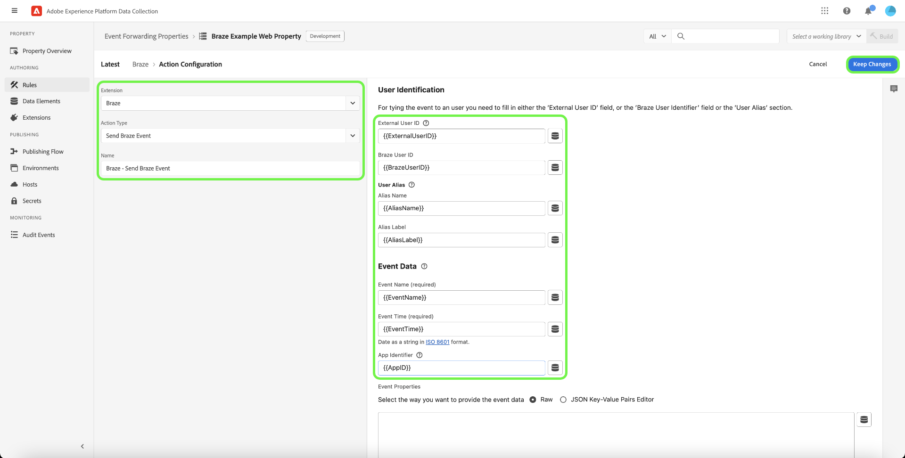
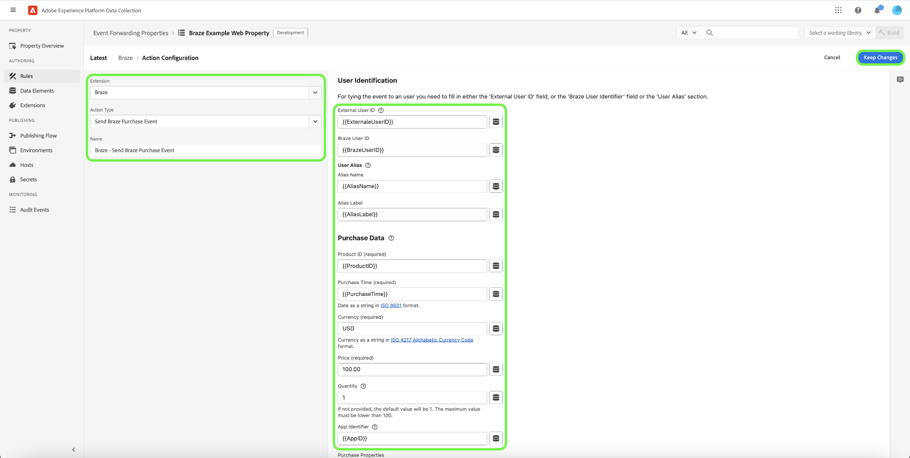

# Extension de transfert d’événement [!DNL Braze Track Events API]

[[!DNL Braze]](https://www.braze.com) est une plateforme d’engagement client qui alimente en temps réel les interactions axées sur les clients entre les consommateurs et les marques. À l’aide de [!DNL Braze], vous pouvez effectuer les opérations suivantes :

- Diffusez des données (telles que des messages marketing) à des utilisateurs ciblés en fonction de leurs préférences linguistiques et géographiques, etc., afin d’augmenter les taux de conversion et de soutenir les objectifs commerciaux clés.
- Envoyez aux clients des messages personnalisés sur plusieurs canaux, y compris des e-mails, des notifications push et des messages in-app, au bon moment et dans la langue de leur choix.
- Ciblez des utilisateurs et utilisatrices spécifiques pour les campagnes marketing et promotionnelles afin d’augmenter le nombre de clients et clientes réguliers.
- Étudiez les comportements et les modèles des utilisateurs et utilisatrices afin de cibler des audiences spécifiques avec des messages personnalisés, ce qui pourrait augmenter les recettes.

L’extension [!DNL Braze Track Events API] [transfert d’événement](../../../ui/event-forwarding/overview.md) vous permet d’exploiter les données capturées dans l’Edge Network Adobe Experience Platform et de les envoyer à [!DNL Braze] sous la forme d’événements côté serveur à l’aide de l’API [[!DNL Braze User Track]](https://www.braze.com/docs/api/endpoints/user_data/post_user_track).

Ce document couvre les cas d’utilisation de l’extension, comment l’installer dans vos bibliothèques de transfert d’événements et comment utiliser ses fonctionnalités dans une [règle](../../../ui/managing-resources/rules.md) de transfert d’événements.

## Cas d’utilisation

Cette extension doit être utilisée si vous souhaitez utiliser les données d’Edge Network en [!DNL Braze] pour tirer parti de ses fonctionnalités d’analyse et de ciblage des clients.

Prenons l’exemple d’une organisation de vente au détail ayant une présence multicanale (site web et mobile) et qui capture des entrées transactionnelles ou conversationnelles en tant que données d’événement à partir de son site web et de ses plateformes mobiles. À l’aide de différentes règles [tag](../../../home.md), ces données sont envoyées à Edge Network en temps réel. À partir de là, l’extension de transfert d’événement [!DNL Braze] envoie automatiquement les événements pertinents aux [!DNL Braze] à partir du côté serveur.

Une fois les données envoyées, les équipes d’analyse de l’organisation peuvent ensuite exploiter [!DNL Braze's] fonctionnalités pour traiter les jeux de données et extraire les informations commerciales afin de générer des graphiques, des tableaux de bord ou d’autres visualisations pour informer les parties prenantes de l’entreprise. Reportez-vous à la page [[!DNL Braze] clients](https://www.braze.com/customers) pour plus d’informations sur les différents cas d’utilisation de la plateforme.

## Conditions préalables et mécanismes de sécurisation [!DNL Braze] {#prerequisites}

Vous devez disposer d’un compte [!DNL Braze] pour pouvoir utiliser ses technologies. Si vous ne disposez pas d’un compte, accédez à la page [Prise en main](https://www.braze.com/get-started/) sur [!DNL Braze] pour vous connecter à [!DNL Braze Sales] et lancer le processus de création de compte.

### Mécanismes de sécurisation des API

L’extension utilise deux des API de [!DNL Braze] et leurs limites sont décrites ci-dessous :

| API | Limites de taux |
| --- | --- |
| [!DNL User Track] | 50 000 requêtes par minute.  Voir la documentation [[!DNL User Track] API](https://www.braze.com/docs/api/endpoints/user_data/post_user_track#rate-limit) pour plus d’informations. |
| [!DNL User Identify] | 20 000 requêtes par minute.  Voir la documentation [[!DNL User Identify] API](https://www.braze.com/docs/api/endpoints/user_data/post_user_identify#rate-limit) pour plus d’informations. |

>[!NOTE]
>
> Reportez-vous au guide sur les [[!DNL Braze] limites d’API](https://www.braze.com/docs/api/api_limits/) pour plus de détails sur les limites qu’elles imposent.

### Points de données facturables

L’envoi d’attributs personnalisés supplémentaires à [!DNL Braze] peut augmenter la consommation de points de données [!DNL Braze]. Consultez votre gestionnaire de compte [!DNL Braze] avant d’envoyer des attributs personnalisés supplémentaires. Pour plus d’informations, consultez la documentation [!DNL Braze] sur les [points de données facturables](https://www.braze.com/docs/user_guide/data_and_analytics/data_points/?tab=billable).

### Collecter les détails de configuration requis {#configuration-details}

Pour connecter Edge Network à [!DNL Braze], les entrées suivantes sont requises :

| Type de clé | Description | Exemple |
| --- | --- | --- |
| Instance [!DNL Braze] | Point d’entrée REST associé au compte [!DNL Braze]. Reportez-vous à la documentation [!DNL Braze] sur les [instances](https://www.braze.com/docs/user_guide/administrative/access_braze/sdk_endpoints) pour obtenir des conseils. | `https://rest.iad-03.braze.com` |
| Clé API | Clé API [!DNL Braze] associée au compte [!DNL Braze].  Reportez-vous à la documentation [!DNL Braze] sur la [clé API REST](https://www.braze.com/docs/api/basics/#rest-api-key) pour obtenir des conseils. | `YOUR-BRAZE-REST-API-KEY` |

### Créer un secret

Créez un [secret de transfert d’événement](../../../ui/event-forwarding/secrets.md) et définissez la valeur sur votre [[!DNL Braze] clé API](#configuration-details). Cela sera utilisé pour authentifier la connexion à votre compte tout en conservant la sécurité de la valeur.

## Installation et configuration de l’extension [!DNL Braze] {#install}

Pour installer l’extension, [créez une propriété de transfert d’événement](../../../ui/event-forwarding/overview.md#properties) ou choisissez plutôt une propriété existante à modifier.

Sélectionnez **[!UICONTROL Extensions]** dans le volet de navigation de gauche. Dans l’onglet **[!UICONTROL Catalog]** , sélectionnez **[!UICONTROL Install]** sur la carte de l’extension [!DNL Braze].

![Installez l’extension [!DNL Braze].](../../../images/extensions/server/braze/install-extension.png)

Dans l’écran suivant, saisissez les [valeurs de configuration](#configuration-details) suivantes que vous avez précédemment collectées à partir de [!DNL Braze] :

- **[!UICONTROL Braze Rest Endpoint URL]** : vous pouvez saisir la valeur de votre URL de point d’entrée REST [!DNL Braze] en tant que texte brut dans l’entrée fournie.
- **[!UICONTROL API Key]** : sélectionnez l’[élément de données secret](#create-a-secret) que vous avez créé précédemment et qui contient votre clé API [!DNL Braze].

Sélectionnez **[!UICONTROL Save]** (Enregistrer) une fois terminé.

![Page de configuration de l’extension [!DNL Braze].](../../../images/extensions/server/braze/configure-extension.png)

## Créer une règle de [!DNL Send Event] {#tracking-rule}

Après avoir installé l’extension, créez une nouvelle [règle](../../../ui/managing-resources/rules.md) de transfert d’événement et configurez ses conditions selon vos besoins. Lors de la configuration des actions pour la règle, cliquez sur l’extension **[!UICONTROL Braze]**, puis sélectionnez **[!UICONTROL Send Event]** pour le type d’action.

**[!UICONTROL User Identification]**

| Entrée | Description |
| --- | --- |
| [!UICONTROL External User ID] | UUID ou GUID long, aléatoire et bien distribué. Si vous choisissez une autre méthode pour nommer vos identifiants d’utilisateur, ils doivent également être longs, aléatoires et bien répartis. En savoir plus sur la [convention d’affectation des noms d’utilisateur suggérée](https://www.braze.com/docs/developer_guide/platform_integration_guides/web/analytics/setting_user_ids#suggested-user-id-naming-convention). |
| [!UICONTROL Braze User ID] | Identifiant utilisateur Braze. |
| [!UICONTROL User Alias] | Un alias sert d’identifiant utilisateur unique alternatif. Utilisez des alias pour identifier les utilisateurs selon différentes dimensions par rapport à votre ID d’utilisateur principal.    L&#39;objet alias utilisateur se compose de deux parties : un alias_name pour l&#39;identifiant lui-même, et un alias_label indiquant le type d&#39;alias. Les utilisateurs peuvent avoir plusieurs alias avec des libellés différents, mais un seul nom_alias par libellé_alias. |

{style="table-layout:auto"}

>[!NOTE]
>
> Pour lier l’événement à un utilisateur, vous devez renseigner le champ [!UICONTROL External User ID], le champ [!UICONTROL Braze User Identifier] ou la section [!UICONTROL User Alias] .

**[!UICONTROL Event Data]**

| Entrée | Description | Obligatoire |
| --- | --- | --- |
| [!UICONTROL Event Name &#x200B;] | Nom de l’événement. | Oui |
| [!UICONTROL Event Time] | Date et heure sous forme de chaîne au format ISO 8601 ou `yyyy-MM-dd'T'HH:mm:ss:SSSZ`. | Oui |
| [!UICONTROL App Identifier] | L’identifiant d’application ou <strong>app_id</strong> est un paramètre associant une activité à une application spécifique de votre groupe d’applications. Il désigne l’application au sein du groupe d’applications avec lequel vous interagissez. En savoir plus sur les [types d’identifiants d’API](https://www.braze.com/docs/api/identifier_types/). | |
| [!UICONTROL Event Properties &#x200B;] | Un objet JSON contenant les propriétés personnalisées de l’événement. |  |

{style="table-layout:auto"}

>[!NOTE]
>
> L’action **[!UICONTROL Braze Send Event]** ne nécessite que la spécification d’un **[!UICONTROL Event Name]** et d’un **[!UICONTROL Event Time]**, mais vous devez inclure autant d’informations que possible dans le champ des propriétés personnalisées. Pour plus d’informations sur l’objet d’événement [!DNL Braze], consultez la [documentation officielle](https://www.braze.com/docs/api/objects_filters/event_object/).

**[!UICONTROL User Attributes]**

Les attributs utilisateur peuvent être un objet JSON contenant des champs qui créent ou mettent à jour un attribut avec le nom et la valeur fournis sur le profil utilisateur spécifié. Les propriétés suivantes sont prises en charge :

| Attribut de l’utilisateur | Description |
| --- | --- |
| [!UICONTROL First Name] | |
| [!UICONTROL Last Name] | |
| [!UICONTROL Phone] | |
| [!UICONTROL Email] | |
| [!UICONTROL Gender] | L&#39;une des chaînes suivantes : « M », « F », « O » (autre), « N » (sans objet), « P » (ne pas dire). |
| [!UICONTROL City] | |
| [!UICONTROL Country] | Pays sous forme de chaîne au format [ISO-3166-1 alpha-2](https://en.wikipedia.org/wiki/ISO_3166-1_alpha-2). |
| [!UICONTROL Language] | Langue sous forme de chaîne au format [ISO-639-1](https://en.wikipedia.org/wiki/List_of_ISO_639-1_codes). |
| [!UICONTROL Date of Birth] | Chaîne au format « AAAA-MM-JJ » (par exemple, 1980-12-21). |
| [!UICONTROL Time Zone] | Nom du fuseau horaire [Base de données des fuseaux horaires IANA](https://en.wikipedia.org/wiki/List_of_tz_database_time_zones) (par exemple, &#39;America/New_York&#39; ou &#39;Heure de l&#39;Est (États-Unis &amp; Canada)&#39;). |
| [!UICONTROL Facebook] | Hachage contenant n’importe quel identifiant (chaîne), likes (tableau de chaînes), num_amis (entier). |
| [!UICONTROL Twitter] | Hachage contenant n’importe quel identifiant (entier), nom_écran (chaîne, pseudo Twitter), nombre_abonnés (entier), nombre_amis (entier), statuts_nombre (entier). |

{style="table-layout:auto"}

## Créer une règle de [!DNL Send Purchase Event] {#purchase-rule}

Après avoir installé l’extension, créez une nouvelle [règle](../../../ui/managing-resources/rules.md) de transfert d’événement et configurez ses conditions selon vos besoins. Lors de la configuration des actions pour la règle, cliquez sur l’extension **[!UICONTROL Braze]**, puis sélectionnez **[!UICONTROL Send Purchase Event]** pour le type d’action.

**[!UICONTROL User Identification]**

| Entrée | Description |
| --- | --- |
| [!UICONTROL External User ID] | UUID ou GUID long, aléatoire et bien distribué. Si vous choisissez une autre méthode pour nommer vos identifiants d’utilisateur, ils doivent également être longs, aléatoires et bien répartis. En savoir plus sur la [convention d’affectation des noms d’utilisateur suggérée](https://www.braze.com/docs/developer_guide/platform_integration_guides/web/analytics/setting_user_ids#suggested-user-id-naming-convention). |
| [!UICONTROL Braze User ID] | Identifiant utilisateur Braze. |
| [!UICONTROL User Alias] | Un alias sert d’identifiant utilisateur unique alternatif. Utilisez des alias pour identifier les utilisateurs selon différentes dimensions par rapport à votre ID d’utilisateur principal.    L&#39;objet alias utilisateur se compose de deux parties : un alias_name pour l&#39;identifiant lui-même, et un alias_label indiquant le type d&#39;alias. Les utilisateurs peuvent avoir plusieurs alias avec des libellés différents, mais un seul nom_alias par libellé_alias. |

{style="table-layout:auto"}

>[!NOTE]
>
> Pour lier l’événement à un utilisateur, vous devez renseigner le champ [!UICONTROL External User ID], le champ [!UICONTROL Braze User Identifier] ou la section [!UICONTROL User Alias] .

**[!UICONTROL Purchase Data]**

| Entrée | Description | Obligatoire |
| --- | --- | --- |
| [!UICONTROL Product ID &#x200B;] | Identifiant de l’achat. (par exemple, nom du produit ou catégorie de produits) | Oui |
| [!UICONTROL Purchase Time] | Date et heure sous forme de chaîne au format ISO 8601 ou `yyyy-MM-dd'T'HH:mm:ss:SSSZ`. | Oui |
| [!UICONTROL Currency &#x200B;] | Devise sous forme de chaîne au format [code de devise alphabétique ISO 4217](https://fr.wikipedia.org/wiki/ISO_4217). | Oui |
| [!UICONTROL Price &#x200B;] | Prix. | Oui |
| [!UICONTROL Quantity &#x200B;] | Si elle n’est pas fournie, la valeur par défaut est 1. La valeur maximale doit être inférieure à 100. | |
| [!UICONTROL App Identifier] | L’identifiant d’application ou <strong>app_id</strong> est un paramètre associant une activité à une application spécifique de votre groupe d’applications. Il désigne l’application au sein du groupe d’applications avec lequel vous interagissez. En savoir plus sur les [types d’identifiants d’API](https://www.braze.com/docs/api/identifier_types/). | |
| [!UICONTROL Purchase Properties &#x200B;] | Un objet JSON contenant les propriétés personnalisées de l’achat. |  |

{style="table-layout:auto"}

>[!NOTE]
>
> L’action **[!UICONTROL Braze Send Event]** ne nécessite que la spécification d’un **[!UICONTROL Event Name]** et d’un **[!UICONTROL Event Time]**. Vous devez toutefois inclure autant d’informations que possible dans le champ des propriétés personnalisées. Pour plus d’informations sur l’objet d’événement [!DNL Braze], consultez la [documentation officielle](https://www.braze.com/docs/api/objects_filters/event_object/).

**[!UICONTROL User Attributes]**

Les attributs utilisateur peuvent être un objet JSON contenant des champs qui créent ou mettent à jour un attribut avec le nom et la valeur fournis sur le profil utilisateur spécifié. Les propriétés suivantes sont prises en charge :

| Attribut de l’utilisateur | Description |
| --- | --- |
| [!UICONTROL First Name] | |
| [!UICONTROL Last Name] | |
| [!UICONTROL Phone] | |
| [!UICONTROL Email] | |
| [!UICONTROL Gender] | L&#39;une des chaînes suivantes : « M », « F », « O » (autre), « N » (sans objet), « P » (ne pas dire). |
| [!UICONTROL City] | |
| [!UICONTROL Country] | Pays sous forme de chaîne au format [ISO-3166-1 alpha-2](https://en.wikipedia.org/wiki/ISO_3166-1_alpha-2). |
| [!UICONTROL Language] | Langue sous forme de chaîne au format [ISO-639-1](https://en.wikipedia.org/wiki/List_of_ISO_639-1_codes). |
| [!UICONTROL Date of Birth] | Chaîne au format « AAAA-MM-JJ » (par exemple, 1980-12-21). |
| [!UICONTROL Time Zone] | Nom du fuseau horaire [Base de données des fuseaux horaires IANA](https://en.wikipedia.org/wiki/List_of_tz_database_time_zones) (par exemple, &#39;America/New_York&#39; ou &#39;Heure de l&#39;Est (États-Unis &amp; Canada)&#39;). |
| [!UICONTROL Facebook] | Hachage contenant n’importe quel identifiant (chaîne), likes (tableau de chaînes), num_amis (entier). |
| [!UICONTROL Twitter] | Hachage contenant n’importe quel identifiant (entier), nom_écran (chaîne, pseudo Twitter), nombre_abonnés (entier), nombre_amis (entier), statuts_nombre (entier). |

{style="table-layout:auto"}

## Valider les données dans [!DNL Braze] {#validate}

Si la collecte d’événements et l’intégration des [!DNL Adobe Experience Platform] ont été effectuées avec succès, des événements s’affichent dans la console [!DNL Braze] lors de l’[affichage des profils utilisateur](https://www.braze.com/docs/user_guide/engagement_tools/segments/user_profiles/). Plus précisément, les nouvelles données d’événement envoyées à [!DNL Braze] sont reflétées dans la section [!DNL Purchases] de l’onglet [aperçu](https://www.braze.com/docs/user_guide/engagement_tools/segments/user_profiles/#overview-tab) d’un utilisateur spécifique.

## Étapes suivantes

Ce guide explique comment envoyer des événements de conversion à [!DNL Braze] à l’aide du transfert d’événement. Pour plus d’informations sur les applications en aval pour les données d’événement envoyées à [!DNL Braze], reportez-vous à la [documentation officielle](https://www.braze.com/docs).

Pour plus d’informations sur les fonctionnalités de transfert d’événement d’Experience Platform, consultez la [présentation du transfert d’événement](../../../ui/event-forwarding/overview.md).
