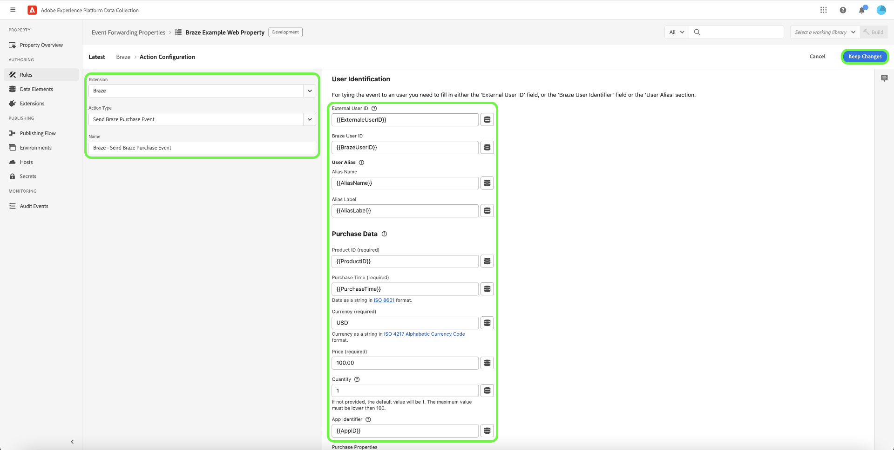

# Extension de transfert d’événement [!DNL Braze Track Events API]

[[!DNL Braze]](https://www.braze.com) est une plateforme d’engagement client qui alimente en temps réel les interactions centrées sur le client entre les consommateurs et les marques. Utilisation [!DNL Braze], vous pouvez effectuer les opérations suivantes :

- Diffusez des données (comme des messages marketing) à des utilisateurs ciblés en fonction de leurs préférences linguistiques, de leurs préférences d’emplacement, etc., afin d’augmenter les taux de conversion et de prendre en charge les principaux objectifs de l’entreprise.
- Envoyez aux clients des messages personnalisés sur plusieurs canaux, y compris des e-mails, des notifications push et des messages in-app, au bon moment et dans les langues de leur choix.
- Ciblez des utilisateurs spécifiques pour les campagnes marketing et promotionnelles afin d’augmenter le nombre de clients réguliers.
- Étudiez le comportement et les schémas des utilisateurs pour cibler des audiences spécifiques avec des messages personnalisés, ce qui peut contribuer à augmenter les recettes.

Le [!DNL Braze Track Events API] [transfert d’événement](../../../ui/event-forwarding/overview.md) l’extension vous permet d’exploiter les données capturées dans Adobe Experience Platform Edge Network et de les envoyer à [!DNL Braze] sous la forme d’événements côté serveur à l’aide de la variable [[!DNL Braze User Track]](https://www.braze.com/docs/api/endpoints/user_data/post_user_track) API.

Ce document couvre les cas d’utilisation de l’extension, comment l’installer dans vos bibliothèques de transfert d’événements et comment utiliser ses fonctionnalités dans un transfert d’événement. [règle](../../../ui/managing-resources/rules.md).

## Cas d’utilisation

Cette extension doit être utilisée si vous souhaitez utiliser les données du réseau Edge dans [!DNL Braze] pour tirer parti de ses capacités de ciblage et d’analyse client.

Prenons l’exemple d’une entreprise de vente au détail présente sur plusieurs canaux (site web et mobile) et qui capture des entrées transactionnelles ou conversationnelles en tant que données d’événement de son site web et de ses plateformes mobiles. Utiliser divers [tag](../../../home.md) règles, ces données sont envoyées au réseau Edge en temps réel. À partir de là, le [!DNL Braze] l’extension de transfert d’événement envoie automatiquement les événements pertinents à [!DNL Braze] du côté serveur.

Une fois les données envoyées, les équipes d’analyse de l’entreprise peuvent alors tirer parti des [!DNL Braze's] fonctionnalités permettant de traiter les jeux de données et d’obtenir des informations sur l’entreprise afin de générer des graphiques, des tableaux de bord ou d’autres visualisations pour informer les parties prenantes de l’entreprise. Reportez-vous à la section [[!DNL Braze] clients](https://www.braze.com/customers) pour plus d’informations sur les différents cas d’utilisation de la plateforme.

## [!DNL Braze] conditions préalables et barrières de sécurité {#prerequisites}

Vous devez disposer d’un [!DNL Braze] afin d&#39;utiliser ses technologies. Si vous ne disposez pas d’un compte, accédez à la variable [Page Prise en main](https://www.braze.com/get-started/) on [!DNL Braze] pour se connecter à [!DNL Braze Sales] et démarrez le processus de création de compte.

### Protections des API

L’extension utilise deux des [!DNL Braze]Les API de d’ et leurs limites sont décrites ci-dessous :

| API | Limites de taux |
| --- | --- |
| [!DNL User Track] | 50 000 demandes par minute.  Reportez-vous à la section [[!DNL User Track] Documentation des API](https://www.braze.com/docs/api/endpoints/user_data/post_user_track#rate-limit) pour plus d’informations. |
| [!DNL User Identify] | 20 000 demandes par minute.  Reportez-vous à la section [[!DNL User Identify] Documentation des API](https://www.braze.com/docs/api/endpoints/user_data/post_user_identify#rate-limit) pour plus d’informations. |

>[!NOTE]
>
> Reportez-vous au guide sur la [[!DNL Braze] Limites de l’API](https://www.braze.com/docs/api/api_limits/) pour plus de détails sur les limites qu&#39;ils imposent.

### Points de données facturables

Envoi d’attributs personnalisés supplémentaires à [!DNL Braze] peut augmenter votre [!DNL Braze] consommation des points de données. Consultez votre [!DNL Braze] gestionnaire de compte avant d’envoyer des attributs personnalisés supplémentaires. Reportez-vous à la section [!DNL Braze] documentation sur [points de données facturables](https://www.braze.com/docs/user_guide/onboarding_with_braze/data_points/#billable-data-points) pour plus d’informations.

### Collecte des détails de configuration requis {#configuration-details}

Pour connecter le réseau Edge à [!DNL Braze], les entrées suivantes sont requises :

| Type de clé | Description | Exemple |
| --- | --- | --- |
| [!DNL Braze] Instance | Le point de terminaison REST associé à la variable [!DNL Braze] compte . Reportez-vous à la section [!DNL Braze] documentation sur [instances](https://www.braze.com/docs/user_guide/administrative/access_braze/braze_instances) pour obtenir des conseils. | `https://rest.iad-03.braze.com` |
| Clé API | Le [!DNL Braze] Clé API associée à [!DNL Braze] compte .  Reportez-vous à la section [!DNL Braze] la documentation relative à la [Clé API REST](https://www.braze.com/docs/api/basics/#rest-api-key) pour obtenir des conseils. | `YOUR-BRAZE-REST-API-KEY` |

### Créer un secret

Créer [secret de transfert d’événement](../../../ui/event-forwarding/secrets.md) et définissez la valeur sur votre [[!DNL Braze] Clé API](#configuration-details). Elle sera utilisée pour authentifier la connexion à votre compte tout en conservant la valeur en sécurité.

## Installez et configurez le [!DNL Braze] extension {#install}

Pour installer l’extension, [création d’une propriété de transfert d’événement](../../../ui/event-forwarding/overview.md#properties) ou choisissez une propriété existante à modifier.

Sélectionner **[!UICONTROL Extensions]** dans le volet de navigation de gauche. Dans le **[!UICONTROL Catalogue]** onglet, sélectionnez **[!UICONTROL Installer]** sur la carte de la variable [!DNL Braze] extension .

![[!DNL Braze]Installation l’extension.](../../../images/extensions/server/braze/install-extension.png)

Dans l’écran suivant, saisissez ce qui suit : [valeurs de configuration](#configuration-details) que vous avez précédemment rassemblé à partir de [!DNL Braze]:

- **[!UICONTROL URL du point de terminaison de la fonction de blocage]**: Vous pouvez saisir la valeur de la variable [!DNL Braze] URL du point de terminaison rest en tant que texte brut dans l’entrée fournie.
- **[!UICONTROL Clé API]**: Sélectionnez la [élément de données secret](#create-a-secret) que vous avez créé précédemment, qui contient les [!DNL Braze] Clé API.

Lorsque vous avez terminé, cliquez sur **[!UICONTROL Enregistrer]**.

![Le [!DNL Braze] page de configuration de l’extension.](../../../images/extensions/server/braze/configure-extension.png)

## Créez un [!DNL Send Event] règle {#tracking-rule}

Après l’installation de l’extension, créez un transfert d’événement. [règle](../../../ui/managing-resources/rules.md) et configurez ses conditions selon vos besoins. Lors de la configuration des actions de la règle, sélectionnez l’événement **[!UICONTROL Braze]** extension, puis sélectionnez **[!UICONTROL Envoyer un événement]** pour le type d’action.

**[!UICONTROL Identification de l’utilisateur]**

| Entrée | Description |
| --- | --- |
| [!UICONTROL Identifiant utilisateur externe] | UUID ou GUID longs, aléatoires et bien répartis. Si vous choisissez une autre méthode pour nommer vos ID utilisateur, ceux-ci doivent également être longs, aléatoires et bien répartis. En savoir plus sur [convention d’affectation des noms d’utilisateur suggérée](https://www.braze.com/docs/developer_guide/platform_integration_guides/web/analytics/setting_user_ids#suggested-user-id-naming-convention). |
| [!UICONTROL Braquer l’identifiant utilisateur] | Identifiant de l’utilisateur de Braze. |
| [!UICONTROL Alias utilisateur] | Un alias sert d’autre identifiant d’utilisateur unique. Utilisez des alias pour identifier les utilisateurs selon différentes dimensions que votre ID utilisateur principal.    L’objet user alias se compose de deux parties : un nom_alias pour l&#39;identifiant lui-même et un libellé_alias indiquant le type d&#39;alias. Les utilisateurs peuvent avoir plusieurs alias avec des libellés différents, mais un seul alias par alias_label. |

{style="table-layout:auto"}

>[!NOTE]
>
> Pour lier l’événement à un utilisateur, vous devez renseigner la variable [!UICONTROL Identifiant utilisateur externe] ou la variable [!UICONTROL Identifiant utilisateur de braquage] ou le champ [!UICONTROL Alias utilisateur] .

**[!UICONTROL Données d’événement]**

| Entrée | Description | Obligatoire |
| --- | --- | --- |
| [!UICONTROL Nom de l’événement &#x200B;] | Nom de l’événement. | Oui |
| [!UICONTROL Heure de l’événement ] | Date-time sous forme de chaîne dans ISO 8601 ou dans `yyyy-MM-dd'T'HH:mm:ss:SSSZ` format. | Oui |
| [!UICONTROL Identifiant de l’application] | L’identifiant de l’application ou <strong>app_id</strong> est un paramètre qui associe une activité à une application spécifique de votre groupe d’applications. Il désigne l’application dans le groupe d’applications avec lequel vous interagissez. En savoir plus sur les [Types d’identificateur d’API](https://www.braze.com/docs/api/identifier_types/). |  |
| [!UICONTROL Propriétés de l’événement &#x200B;] | Objet JSON contenant des propriétés personnalisées de l’événement. |  |

{style="table-layout:auto"}

>[!NOTE]
>
> Le **[!UICONTROL Événement d’envoi de braquage]** une action ne requiert qu’un **[!UICONTROL Nom de l’événement]** et **[!UICONTROL Heure de l’événement]** à spécifier, mais vous devez inclure autant d’informations que possible dans le champ des propriétés personnalisées. Pour plus d’informations sur la variable [!DNL Braze] , voir [documentation officielle](https://www.braze.com/docs/api/objects_filters/event_object/).

**[!UICONTROL Attributs d’utilisateur]**

Les attributs utilisateur peuvent être un objet JSON contenant des champs qui créeront ou mettront à jour un attribut avec le nom et la valeur fournis sur le profil utilisateur spécifié. Les propriétés suivantes sont prises en charge :

| Attribut utilisateur | Description |
| --- | --- |
| [!UICONTROL Prénom] |  |
| [!UICONTROL Nom] |  |
| [!UICONTROL Téléphone] |  |
| [!UICONTROL E-mail.] |  |
| [!UICONTROL Genre] | L’une des chaînes suivantes : &quot;M&quot;, &quot;F&quot;, &quot;O&quot; (autre), &quot;N&quot; (non applicable), &quot;P&quot; (préférez ne pas dire). |
| [!UICONTROL Ville] |  |
| [!UICONTROL Pays] | Pays sous forme de chaîne dans [ISO-3166-1 alpha-2](https://en.wikipedia.org/wiki/ISO_3166-1_alpha-2) format. |
| [!UICONTROL Langue] | Langue sous forme de chaîne dans [ISO-639-1](https://fr.wikipedia.org/wiki/Liste_des_codes_ISO_639-1) format. |
| [!UICONTROL Date de naissance] | Chaîne au format &quot;AAAA-MM-JJ&quot; (par exemple, 1980-12-21). |
| [!UICONTROL Fuseau horaire] | Nom du fuseau horaire à partir de [Base de données des fuseaux horaires IANA](https://en.wikipedia.org/wiki/List_of_tz_database_time_zones) (par exemple, &quot;Amérique/New_York&quot; ou &quot;Heure de l’Est (États-Unis et Canada)&quot;). |
| [!UICONTROL Facebook] | Hachage contenant n’importe quel identifiant (chaîne), mentions &quot;J’aime&quot; (tableau de chaînes), num_friend (entier). |
| [!UICONTROL Twitter] | Hachage contenant n’importe quel ID (entier), screen_name (chaîne, pseudo Twitter), followers_count (entier), friend_count (entier), statuses_count(entier). |

{style="table-layout:auto"}

## Créez un [!DNL Send Purchase Event] règle {#purchase-rule}

Après l’installation de l’extension, créez un transfert d’événement. [règle](../../../ui/managing-resources/rules.md) et configurez ses conditions selon vos besoins. Lors de la configuration des actions de la règle, sélectionnez l’événement **[!UICONTROL Braze]** extension, puis sélectionnez **[!UICONTROL Envoyer un événement d’achat]** pour le type d’action.

**[!UICONTROL Identification de l’utilisateur]**

| Entrée | Description |
| --- | --- |
| [!UICONTROL Identifiant utilisateur externe] | UUID ou GUID longs, aléatoires et bien répartis. Si vous choisissez une autre méthode pour nommer vos ID utilisateur, ceux-ci doivent également être longs, aléatoires et bien répartis. En savoir plus sur [convention d’affectation des noms d’utilisateur suggérée](https://www.braze.com/docs/developer_guide/platform_integration_guides/web/analytics/setting_user_ids#suggested-user-id-naming-convention). |
| [!UICONTROL Braquer l’identifiant utilisateur] | Identifiant de l’utilisateur de Braze. |
| [!UICONTROL Alias utilisateur] | Un alias sert d’autre identifiant d’utilisateur unique. Utilisez des alias pour identifier les utilisateurs selon différentes dimensions que votre ID utilisateur principal.    L’objet user alias se compose de deux parties : un nom_alias pour l&#39;identifiant lui-même et un libellé_alias indiquant le type d&#39;alias. Les utilisateurs peuvent avoir plusieurs alias avec des libellés différents, mais un seul alias par alias_label. |

{style="table-layout:auto"}

>[!NOTE]
>
> Pour lier l’événement à un utilisateur, vous devez effectuer l’une des opérations suivantes : [!UICONTROL Identifiant utilisateur externe] , le champ [!UICONTROL Identifiant utilisateur de braquage] ou la variable [!UICONTROL Alias utilisateur] .

**[!UICONTROL Données d’achat]**

| Entrée | Description | Obligatoire |
| --- | --- | --- |
| [!UICONTROL ID de produit &#x200B;] | Identifiant de l’achat. (par exemple, Nom du produit ou Catégorie de produit) | Oui |
| [!UICONTROL Temps d’achat ] | Date-time sous forme de chaîne dans ISO 8601 ou dans `yyyy-MM-dd'T'HH:mm:ss:SSSZ` format. | Oui |
| [!UICONTROL Devise &#x200B;] | Devise en tant que chaîne dans [ISO 4217](https://fr.wikipedia.org/wiki/ISO_4217) Format de code de devise alphabétique. | Oui |
| [!UICONTROL Prix &#x200B;] | Prix. | Oui |
| [!UICONTROL Quantité &#x200B;] | Si elle n’est pas fournie, la valeur par défaut est 1. La valeur maximale doit être inférieure à 100. |  |
| [!UICONTROL Identifiant de l’application] | L’identifiant de l’application ou <strong>app_id</strong> est un paramètre qui associe une activité à une application spécifique de votre groupe d’applications. Il désigne l’application dans le groupe d’applications avec lequel vous interagissez. En savoir plus sur les [Types d’identificateur d’API](https://www.braze.com/docs/api/identifier_types/). |  |
| [!UICONTROL Propriétés d’achat &#x200B;] | Objet JSON contenant les propriétés personnalisées de l’achat. |  |

{style="table-layout:auto"}

>[!NOTE]
>
> Le **[!UICONTROL Événement d’envoi de braquage]** une action ne requiert qu’un **[!UICONTROL Nom de l’événement]** et **[!UICONTROL Heure de l’événement]** à spécifier, mais vous devez inclure autant d’informations que possible dans le champ des propriétés personnalisées. Pour plus d’informations sur la variable [!DNL Braze] , voir [documentation officielle](https://www.braze.com/docs/api/objects_filters/event_object/).

**[!UICONTROL Attributs d’utilisateur]**

Les attributs utilisateur peuvent être un objet JSON contenant des champs qui créeront ou mettront à jour un attribut avec le nom et la valeur fournis sur le profil utilisateur spécifié. Les propriétés suivantes sont prises en charge :

| Attribut utilisateur | Description |
| --- | --- |
| [!UICONTROL Prénom] |  |
| [!UICONTROL Nom] |  |
| [!UICONTROL Téléphone] |  |
| [!UICONTROL E-mail.] |  |
| [!UICONTROL Genre] | L’une des chaînes suivantes : &quot;M&quot;, &quot;F&quot;, &quot;O&quot; (autre), &quot;N&quot; (non applicable), &quot;P&quot; (préférez ne pas dire). |
| [!UICONTROL Ville] |  |
| [!UICONTROL Pays] | Pays sous forme de chaîne dans [ISO-3166-1 alpha-2](https://en.wikipedia.org/wiki/ISO_3166-1_alpha-2) format. |
| [!UICONTROL Langue] | Langue sous forme de chaîne dans [ISO-639-1](https://fr.wikipedia.org/wiki/Liste_des_codes_ISO_639-1) format. |
| [!UICONTROL Date de naissance] | Chaîne au format &quot;AAAA-MM-JJ&quot; (par exemple, 1980-12-21). |
| [!UICONTROL Fuseau horaire] | Nom du fuseau horaire à partir de [Base de données des fuseaux horaires IANA](https://en.wikipedia.org/wiki/List_of_tz_database_time_zones) (par exemple, &quot;Amérique/New_York&quot; ou &quot;Heure de l’Est (États-Unis et Canada)&quot;). |
| [!UICONTROL Facebook] | Hachage contenant n’importe quel identifiant (chaîne), mentions &quot;J’aime&quot; (tableau de chaînes), num_friend (entier). |
| [!UICONTROL Twitter] | Hachage contenant n’importe quel ID (entier), screen_name (chaîne, pseudo Twitter), followers_count (entier), friend_count (entier), statuses_count(entier). |

{style="table-layout:auto"}

## Validation des données dans [!DNL Braze] {#validate}

Si la collecte d’événements et [!DNL Adobe Experience Platform] l’intégration a réussi, vous verrez des événements dans la variable [!DNL Braze] lors de la console [affichage des profils utilisateur](https://www.braze.com/docs/user_guide/engagement_tools/segments/user_profiles/). Plus précisément, les nouvelles données d’événement envoyées à [!DNL Braze] est reflété dans la variable [!DNL Purchases] de la section d’un utilisateur particulier [onglet aperçu](https://www.braze.com/docs/user_guide/engagement_tools/segments/user_profiles/#overview-tab).

## Étapes suivantes

Ce guide explique comment envoyer des événements de conversion à [!DNL Braze] à l’aide du transfert d’événement. Pour plus d’informations sur les applications en aval pour les données d’événement envoyées à [!DNL Braze], reportez-vous à la section [documentation officielle](https://www.braze.com/docs).

Pour plus d’informations sur les fonctionnalités de transfert d’événement dans Experience Platform, reportez-vous à la section [transfert d’événement - Aperçu](../../../ui/event-forwarding/overview.md).
