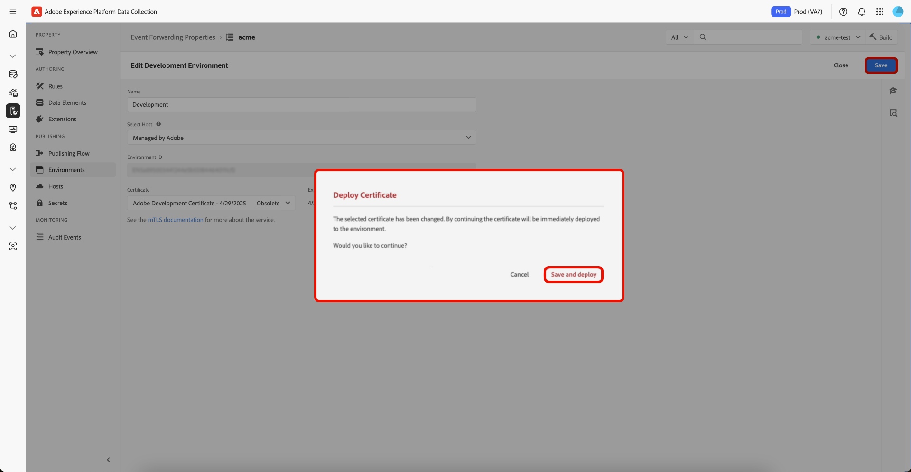

# Présentation de Mutual Transport Layer Security ([!DNL mTLS])

Liez les certificats Mutual Transport Layer Security ([!DNL mTLS]) dans l’interface utilisateur [!UICONTROL Environnements] pour contrôler la sécurité de votre extension. Le certificat [!DNL mTLS] est une information d’identification numérique qui prouve l’identité d’un serveur ou d’un client dans des communications sécurisées. Lorsque vous utilisez l’API [!DNL mTLS] Service, ces certificats vous aident à vérifier et à chiffrer vos interactions avec le transfert d’événement Adobe Experience Platform. Ce processus protège non seulement vos données, mais garantit également que chaque connexion provient d’un partenaire de confiance.

## Implémentation de [!DNL mTLS] dans un nouvel environnement {#implement-mtls}

Configurez l’environnement de transfert d’événement pour vous assurer que les versions de bibliothèque sont déployées correctement sur le réseau Edge. Pendant la configuration, vous pouvez sélectionner l’option d’hébergement qui correspond le mieux à vos besoins de déploiement. Un certificat [!DNL mTLS] est également automatiquement ajouté à votre nouvel environnement pour une communication sécurisée.

Pour créer un environnement, sélectionnez l’onglet **[!UICONTROL Environnements]** dans le panneau de gauche de vos propriétés de transfert d’événement, puis sélectionnez **[!UICONTROL Ajouter un environnement]**.

![Propriétés de transfert d’événement affichant les environnements existants et mettant en surbrillance [!UICONTROL Ajouter un environnement].](../../../images/extensions/server/cloud-connector/add-environment.png)

Sur la page suivante, sélectionnez l’environnement que vous souhaitez utiliser pour cette configuration. Trois environnements sont disponibles :

>[!NOTE]
>
>Une propriété est limitée à un environnement de développement, un environnement d’évaluation et un environnement de production.

| Environnement | Description |
| --- | --- |
| Développement | L’environnement de développement permet aux membres de l’équipe de tester les bibliothèques ou les modifications dans le transfert d’événement. |
| Évaluation | L’environnement d’évaluation est facultatif et permet aux membres de l’équipe approuvés de tester et d’approuver une bibliothèque avant sa publication. |
| Production | L’environnement de production est utilisé pour les données de production en direct. |

![Écran de sélection de l’environnement, mettant en surbrillance [!UICONTROL Sélectionner] pour le développement.](../../../images/extensions/server/cloud-connector/select-environment.png)

Sur la page **[!UICONTROL Créer un environnement]**, saisissez un **[!UICONTROL Nom]** et sélectionnez ***Adobe Managed*** dans le menu déroulant **[!UICONTROL Sélectionner l’hôte]**. Le **[!UICONTROL certificat]** est ***automatiquement ajouté***. Enfin, sélectionnez **[!UICONTROL Enregistrer]**.

![Page Créer un environnement de développement, en surbrillance [!UICONTROL Nom], [!UICONTROL Sélectionner l’hôte] et [!UICONTROL Enregistrer].](../../../images/extensions/server/cloud-connector/create-environment.png)

L’environnement est créé avec succès et vous revenez sur l’onglet **[!UICONTROL Environnements]** qui affiche votre nouvel environnement.

![Onglet [!UICONTROL  Environnements] mettant en surbrillance l’environnement de développement.](../../../images/extensions/server/cloud-connector/new-environment-created.png)

## Affichage des détails du certificat d’environnement {#view-certificate}

Pour afficher les détails du certificat d’un environnement, sélectionnez l’onglet **[!UICONTROL Environnements]** dans le panneau de gauche de vos propriétés de transfert d’événement, puis sélectionnez l’environnement pour afficher les détails.

Les détails suivants du certificat s’affichent :

| Nom du champ | Description |
| --- | --- |
| Certificat | Détails du certificat, notamment :<ul><li>**Nom** : le nom du certificat.</li><li>**Date de création** : date à laquelle le certificat a été créé.</li><li>**Statut** : statut actuel du certificat :<ul><li>**Actuel** : le certificat est en cours d’utilisation.</li><li>**Obsolète** : le certificat n&#39;est pas en cours d&#39;utilisation mais n&#39;a pas encore expiré. Il peut toujours être sélectionné pour utilisation.</li><li>**Expiré** : le certificat a expiré, est grisé et n’est plus disponible.</li></ul></ul> |
| Expires | Date d’expiration du certificat. |
| Variable Name | Nom de variable du certificat. |
| Statut | Statut actuel du certificat :<ul><li>**Déployé** : le certificat a été déployé avec succès et est actif.</li><li>**Déploiement** : le certificat est en cours de déploiement.</li><li>**Déploiement requis** : ce statut s’affiche lorsqu’un certificat obsolète est sélectionné.</li></ul> |

![Page Modifier l’environnement de développement, présentant les détails du [!UICONTROL Certificat].](../../../images/extensions/server/cloud-connector/certificate-details.png)

### Sélection et déploiement d’un certificat obsolète {#deploy-obsolete-certificate}

Pour utiliser un certificat obsolète, accédez à l’onglet **[!UICONTROL Environnements]** dans le panneau de gauche de vos propriétés de transfert d’événement, puis sélectionnez l’environnement pour afficher ses détails.

![Onglet [!UICONTROL  Environnements] mettant en surbrillance l’environnement de développement.](../../../images/extensions/server/cloud-connector/new-environment-created.png)

Dans le menu déroulant **[!UICONTROL Certificat]**, sélectionnez un certificat obsolète, puis sélectionnez **[!UICONTROL Enregistrer]**.

![Page Modifier l’environnement de développement, avec le menu déroulant [!UICONTROL Certificat] avec le certificat obsolète et Enregistrer en surbrillance.](../../../images/extensions/server/cloud-connector/obsolete-certificate.png)

Pour déployer le certificat, sélectionnez **[!UICONTROL Enregistrer et déployer]** dans la boîte de dialogue **[!UICONTROL Déployer le certificat]**.

## Étapes suivantes {#next-steps}

Ce document vous a montré comment créer un environnement pour votre propriété Transfert d’événement, ajouter un certificat et utiliser un certificat obsolète. Pour plus d’informations sur les certificats [!DNL mTLS], voir [[!DNL mTLS] Présentation de l’API Service](../../../../data-governance/mtls-api/overview.md)

Pour savoir comment utiliser les certificats [!DNL mTLS] dans les règles de transfert d’événement, reportez-vous à la présentation de l’extension [Cloud Connector](../cloud-connector/overview.md#mtls-rules).
