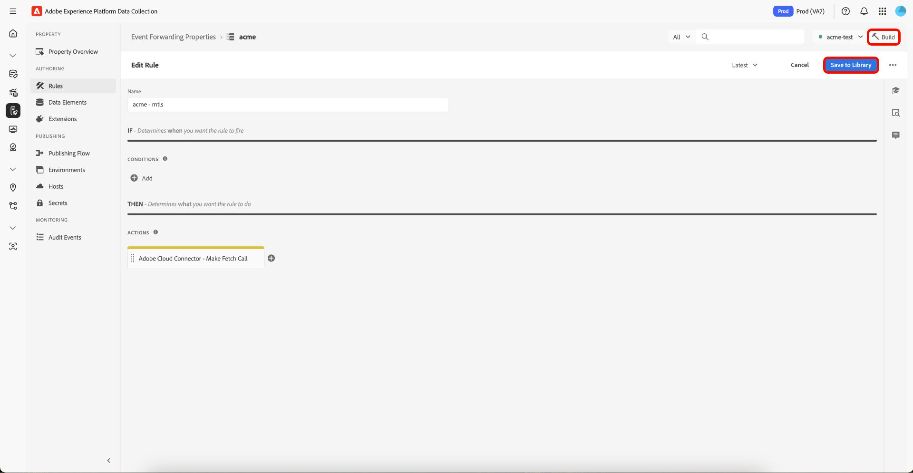

# Présentation de l’extension Cloud Connector

L’extension de transfert d’événement Cloud Connector vous permet de créer des requêtes HTTP personnalisées pour envoyer des données à une destination ou récupérer des données d’une destination. L’extension Cloud Connector est semblable à Postman sur Adobe Experience Platform Edge Network et peut être utilisée pour envoyer des données à un point d’entrée qui n’a pas encore d’extension dédiée.

Utilisez cette référence pour obtenir des informations sur les options disponibles lors de l’utilisation de cette extension pour créer une règle.

## Type d’action d’extension Cloud Connector

Cette section décrit le type d’action Envoyer les données disponible dans l’extension Adobe Experience Platform Cloud Connector.

### Type de requête

Pour sélectionner le type de requête requis par le point d’entrée, sélectionnez le type approprié dans la liste déroulante [!UICONTROL Request Type].

| Méthode | Description |
|---|---|
| [GET](https://developer.mozilla.org/fr-FR/docs/Web/HTTP/Methods/GET) | Demande une représentation de la ressource spécifiée. Les requêtes utilisant GET doivent uniquement récupérer des données. |
| [POST](https://developer.mozilla.org/fr-FR/docs/Web/HTTP/Methods/POST) | Envoie une entité à la ressource spécifiée, provoquant souvent un changement d’état ou des effets secondaires sur le serveur. |
| [PUT](https://developer.mozilla.org/fr-FR/docs/Web/HTTP/Methods/PUT) | Remplace toutes les représentations actuelles de la ressource cible par la payload de la requête. |
| [PATCH](https://developer.mozilla.org/fr-FR/docs/Web/HTTP/Methods/PATCH) | Applique des modifications partielles à une ressource. |
| [DELETE](https://developer.mozilla.org/fr-FR/docs/Web/HTTP/Methods/DELETE) | Supprime la ressource spécifiée. |

### URL du point d’entrée

Dans le champ de texte en regard du menu déroulant Type de requête, saisissez l’URL du point d’entrée auquel vous envoyez des données.

### Paramètres de requête, en-têtes et configuration du corps

Utilisez chacun de ces onglets (Paramètres de requête, En-têtes et Éléments de données de contenu) pour contrôler les données envoyées à un point d’entrée donné.

#### Paramètres de requête

Définissez une clé et une valeur pour chaque paire clé-valeur à envoyer en tant que paramètre de chaîne de requête. Pour entrer manuellement un élément de données, utilisez la segmentation en unités lexicales de l’élément de données pour le transfert d&#39;événement. Pour référencer la valeur d’un élément de données nommé « siteSection » en tant que clé ou valeur, saisissez `{{siteSection}}`. Vous pouvez également sélectionner l’élément de données créé précédemment en le sélectionnant dans le menu déroulant.

Pour ajouter d’autres paramètres de requête, sélectionnez **[!UICONTROL Add Another]**.

#### En-têtes

Définissez une clé et une valeur pour chaque paire clé-valeur que vous voulez envoyer en tant qu’en-tête. Pour entrer manuellement un élément de données, utilisez la segmentation en unités lexicales de l’élément de données pour le transfert d&#39;événement. Pour référencer la valeur d’un élément de données nommé « pageName » en tant que clé ou valeur, saisissez `{{pageName}}`. Vous pouvez également sélectionner l’élément de données créé précédemment en le sélectionnant dans le menu déroulant.

Pour ajouter d’autres en-têtes, sélectionnez **[!UICONTROL Add Another]**.

Le tableau suivant répertorie les en-têtes prédéfinis. Vous n’êtes pas limité à ces en-têtes et vous pouvez ajouter vos propres en-têtes personnalisés si nécessaire, mais ils sont mis à votre disposition pour votre commodité.

>[!NOTE]
>
>Pour plus d’informations sur ces en-têtes, consultez le site [https://developer.mozilla.org/fr-FR/docs/Web/HTTP/Headers](https://developer.mozilla.org/fr-FR/docs/Web/HTTP/Headers).

| Header | Description |
|---|---|
| [A-IM](https://developer.mozilla.org/fr-FR/docs/Web/HTTP/Headers/Accept) | |
| [Accept](https://developer.mozilla.org/fr-FR/docs/Web/HTTP/Headers/Accept) | |
| [Accept-Charset](https://developer.mozilla.org/fr-FR/docs/Web/HTTP/Headers/Accept-Charset) | |
| [Accept-Encoding](https://developer.mozilla.org/fr-FR/docs/Web/HTTP/Headers/Accept-Encoding) | |
| [Accept-Language](https://developer.mozilla.org/fr-FR/docs/Web/HTTP/Headers/Accept-Language) | |
| [Accept-Datetime](https://developer.mozilla.org/fr-FR/docs/Web/HTTP/Headers/Accept) | Transmis par un agent utilisateur pour indiquer qu’il souhaite avoir accès à un état passé d’une ressource originale. À cette fin, l’en-tête `Accept-Datetime` est transmis dans une requête HTTP émise par rapport à un TimeGate pour une ressource d’origine, et sa valeur indique la date et l’heure (datetime) de l’état passé recherché de la ressource d’origine. |
| Access-Control-Request-Headers | Utilisé par les navigateurs lors de l’émission d’une demande de contrôle en amont de la [requête preflight](https://developer.mozilla.org/fr-FR/docs/Glossary/preflight_request), pour indiquer au serveur quels en-têtes [HTTP](https://developer.mozilla.org/fr-FR/docs/Web/HTTP/Headers) le client peut envoyer lorsque la demande réelle est effectuée. |
| Access-Control-Request-Method | Utilisé par les navigateurs lors de l’émission d’une [requête preflight](https://developer.mozilla.org/fr-FR/docs/Glossary/preflight_request), pour indiquer au serveur la méthode [HTTP](https://developer.mozilla.org/fr-FR/docs/Web/HTTP/Methods) qui sera utilisée quand la demande réelle sera effectuée. Cet en-tête est nécessaire parce que la requête preflight est toujours une [OPTION](https://developer.mozilla.org/fr-FR/docs/Web/HTTP/Methods/OPTIONS) et n’utilise pas la même méthode que la requête réelle. |
| Authorization | Contient les informations d’identification permettant d’authentifier un agent utilisateur auprès d’un serveur. |
| [Cache-Control](https://developer.mozilla.org/fr-FR/docs/Web/HTTP/Headers/Cache-Control) | Directives pour les mécanismes de mise en cache dans les requêtes et les réponses. |
| [Connexion](https://developer.mozilla.org/fr-FR/docs/Web/HTTP/Headers/Connection) | Contrôle si la connexion réseau reste ouverte une fois la transaction en cours terminée. |
| [Content-Length](https://developer.mozilla.org/fr-FR/docs/Web/HTTP/Headers/Content-Length) | Taille de la ressource, en nombre décimal d’octets. |
| [Content-Type](https://developer.mozilla.org/fr-FR/docs/Web/HTTP/Headers/Content-Type) | Indique le type de support de la ressource. |
| Cookie | Contient les [cookies HTTP](https://developer.mozilla.org/fr-FR/docs/Web/HTTP/Cookies) stockés précédemment envoyés par le serveur avec l’en-tête [`Set-Cookie`](https://developer.mozilla.org/fr-FR/docs/Web/HTTP/Headers/Set-Cookie). |
| Date | L’en-tête HTTP général contient la date et l’heure auxquelles le message a été généré. |
| [DNT](https://developer.mozilla.org/fr-FR/docs/Web/HTTP/Headers/DNT) | Exprime la préférence de suivi de l’utilisateur. |
| Attente | Indique les attentes que le serveur doit satisfaire pour pouvoir gérer correctement la requête. |
| Transféré | Contient des informations provenant des [serveurs proxy inverse](https://developer.mozilla.org/en-US/docs/Web/HTTP/Proxy_servers_and_tunneling) qui sont modifiées ou perdues lorsqu’un proxy est impliqué dans le chemin de la requête. |
| De | Contient une adresse e-mail Internet pour un utilisateur humain qui contrôle l’agent utilisateur requérant. |
| Hôte | Indique l’hôte et le numéro de port du serveur auquel la requête est envoyée. |
| If-Match | |
| If-Modified-Since | |
| [If-None-Match](https://developer.mozilla.org/fr-FR/docs/Web/HTTP/Headers/If-None-Match) | |
| [If-Range](https://developer.mozilla.org/en-US/docs/Web/HTTP/Headers/If-Range) | |
| [If-Unmodified-Since](https://developer.mozilla.org/en-US/docs/Web/HTTP/Headers/If-Unmodified-Since) | |
| [Max-Forwards](https://developer.mozilla.org/en-US/docs/Web/HTTP/Headers/If-Unmodified-Since) | |
| [Origin](https://developer.mozilla.org/fr-FR/docs/Web/HTTP/Headers/Origin) | |
| [Pragma](https://developer.mozilla.org/en-US/docs/Web/HTTP/Headers/Pragma) | En-tête spécifique à l’implémentation qui peut avoir divers effets n’importe où le long de la chaîne requête-réponse. Utilisé pour la rétrocompatibilité avec les caches HTTP/1.0 où l’en-tête Cache-Control n’est pas encore présent. |
| [Proxy-Authorization](https://developer.mozilla.org/en-US/docs/Web/HTTP/Headers/Proxy-Authorization) |  |
| [Plage](https://developer.mozilla.org/en-US/docs/Web/HTTP/Headers/Range) | Indique la partie d’un document que le serveur doit renvoyer. |
| [Referer](https://developer.mozilla.org/fr-FR/docs/Web/HTTP/Headers/Referer) | Adresse de la page web précédente à partir de laquelle un lien vers la page actuellement requise a été suivi. |
| TE | Indique les codages de transfert que l’agent utilisateur est prêt à accepter. (Vous pouvez l’appeler de manière informelle `Accept-Transfer-Encoding`, ce qui serait plus intuitif). |
| Mise à niveau | Le document RFC correspondant au champ d’en-tête [`Upgrade` est RFC 7230, section 6.7](https://tools.ietf.org/html/rfc7230#section-6.7). Le standard établit des règles pour la mise à niveau ou la modification d’un protocole différent sur la connexion actuelle du client, du serveur, du protocole de transport. Par exemple, ce standard pour l’en-tête permet à un client de passer de HTTP 1.1 à HTTP 2.0, en supposant que le serveur décide de reconnaître et d’implémenter le champ d’en-tête `Upgrade`. Aucune des parties n’est tenue d’accepter les termes spécifiés dans le champ d’en-tête `Upgrade`. Ce champ peut être utilisé dans les en-têtes client et serveur. Si le champ d’en-tête `Upgrade` est spécifié, l’expéditeur DOIT également envoyer le champ d’en-tête `Connection` en spécifiant l’option `upgrade`. |
| [User-Agent](https://developer.mozilla.org/en-US/docs/Web/HTTP/Headers/User-Agent) | Contient une chaîne caractéristique qui permet aux pairs du protocole réseau d’identifier le type d’application, le système d’exploitation, le fournisseur de logiciel ou la version logicielle de l’agent utilisateur du logiciel présentant la requête. |
| [Via](https://developer.mozilla.org/en-US/docs/Web/HTTP/Headers/Via) | Ajouté par des proxies, proxies de transfert et proxies inverses, susceptible d’apparaître dans les en-têtes de requête et dans ceux de réponse. |
| [Avertissement](https://developer.mozilla.org/en-US/docs/Web/HTTP/Headers/Warning) | Informations d’avertissement générales sur les problèmes possibles. |
| X-CSRF-Token | |
| X-Requested-With | |

#### Corps en tant que JSON

Définissez une clé et une valeur pour chaque paire clé-valeur que vous voulez envoyer dans le corps de la requête. Pour entrer manuellement un élément de données, utilisez la segmentation en unités lexicales de l’élément de données pour le transfert d&#39;événement. Pour référencer la valeur d’un élément de données nommé « appSection » en tant que clé ou valeur, saisissez `{{appSection}}`. Vous pouvez également sélectionner l’élément de données créé précédemment en le sélectionnant dans le menu déroulant.

Pour ajouter des paires clé-valeur supplémentaires, sélectionnez **[!UICONTROL Add Another]**.

#### Corps comme brut

Définissez une clé et une valeur pour chaque paire clé-valeur que vous voulez envoyer dans le corps de la requête. Pour entrer manuellement un élément de données, utilisez la segmentation en unités lexicales de l’élément de données pour le transfert d&#39;événement. Pour référencer la valeur d’un élément de données nommé « appSection » en tant que clé ou valeur, saisissez `{{appSection}}`. Vous pouvez également sélectionner l’élément de données créé précédemment en le sélectionnant dans le menu déroulant. Vous pouvez ajouter un ou plusieurs éléments de données.

### Advanced

Les actions dans les règles du transfert d’événement s’exécutent de manière séquentielle. Dans certaines situations, vous pourriez souhaiter récupérer des données provenant d’une source externe non présente sur l’événement entrant du client, puis prendre cette réponse et transformer ou envoyer ces données vers une destination finale lors d’une action ultérieure au sein d’une seule règle. L’option « Enregistrer la réponse à la requête » de la section avancée l’active.

Pour enregistrer le corps de la réponse à partir d’un point d’entrée, cochez la case **[!UICONTROL Save the request response]** et définissez une clé de réponse dans le champ de texte.

Si vous avez défini la clé de réponse comme `productDetails`, référencez ces données dans un élément de données, puis référencez cet élément de données dans une action ultérieure au sein de la même règle. Pour créer un élément de données qui référence `productDetail`, créez un élément de données de type `path` et saisissez le chemin suivant :

```Json
arc.ruleStash.[EXTENSION-NAME-HERE].responses.[RESPONSE-KEY-HERE] 

arc.ruleStash.adobe-cloud-connector.reponses.productDetails 
```

## Ajoutez une règle Mutual Transport Layer Security ([!DNL mTLS]) à votre bibliothèque de transfert d’événement {#mtls-rules}

Le certificat [!DNL mTLS] est une information d’identification numérique qui prouve l’identité d’un serveur ou d’un client dans des communications sécurisées. Lorsque vous utilisez l’API [!DNL mTLS] Service, ces certificats vous aident à vérifier et à chiffrer vos interactions avec le transfert d’événement Adobe Experience Platform. Ce processus protège non seulement vos données, mais garantit également que chaque connexion provient d’un partenaire de confiance.

### Installation de l’extension Adobe Cloud Connector {#install}

Pour installer l’extension, [créez une propriété de transfert d’événement](../../../ui/event-forwarding/overview.md#properties) ou sélectionnez une propriété existante à modifier à la place.

Sélectionnez **[!UICONTROL Extensions]** dans le panneau de gauche. Dans l’onglet **[!UICONTROL Catalog]** , sélectionnez la vignette **[!UICONTROL Adobe Cloud Connector]** , puis **[!UICONTROL Install]**.

![Catalogue d’extensions affichant la carte d’extension [!DNL Adobe Cloud Connector] mettant en surbrillance install.](../../../images/extensions/server/cloud-connector/install-extension.png)

### Configurer une règle de transfert d’événement {#rule}

>[!NOTE]
>
>Pour configurer une règle afin d’utiliser [!DNL mTLS], Adobe Cloud Connector version 1.2.4 ou ultérieure doit être installé.

Après avoir installé l’extension, vous pouvez créer une règle de transfert d’événement qui utilise [!DNL mTLS] et l’ajouter à votre bibliothèque.

Créez une [règle](../../../ui/managing-resources/rules.md) de transfert d’événement dans votre propriété de transfert d’événement. Attribuez un nom à votre règle, puis, sous **[!UICONTROL Actions]**, ajoutez une nouvelle action et définissez l’extension sur **[!UICONTROL Adobe Cloud Connector]**. Sélectionnez ensuite **[!UICONTROL Make Fetch Call]** pour le **[!UICONTROL Action Type]**.


Une fois votre sélection effectuée, des commandes supplémentaires s’affichent pour configurer la méthode et la destination de la requête [!DNL mTLS]. Pour activer l’utilisation de certificats actifs dans les environnements, sélectionnez **[!UICONTROL Enable in [!DNL mTLS]]**, puis **[!UICONTROL Keep Changes]** pour enregistrer la règle.


Votre nouvelle règle est maintenant prête. Sélectionnez **[!UICONTROL Save to Library]**, puis **[!UICONTROL Build]** pour le déployer. La requête [!DNL mTLS] est maintenant active et disponible dans votre bibliothèque.



## Étapes suivantes

Ce guide explique comment configurer des règles mTLS dans le transfert d’événement. Pour plus d’informations sur la configuration de mTLS pour un environnement, reportez-vous au guide [ Mutual Transport Layer Security ([!DNL mTLS])](../cloud-connector/mtls.md).

Pour plus d’informations sur les fonctionnalités de transfert d’événement d’Experience Platform, consultez la [présentation du transfert d’événement](../../../ui/event-forwarding/overview.md).
