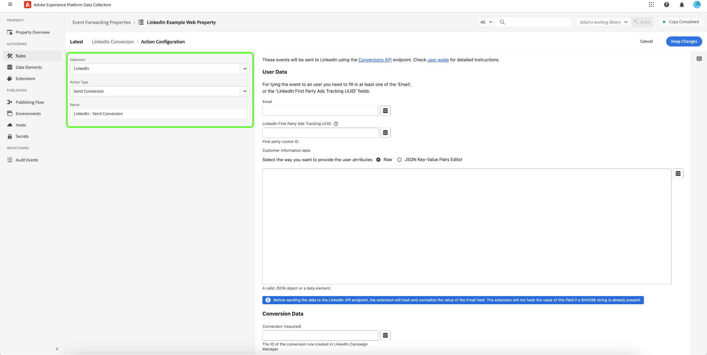

# Extension de l’API de conversions [!DNL LinkedIn]

[[!DNL LinkedIn Conversions API]](https://learn.microsoft.com/en-us/linkedin/marketing/integrations/ads-reporting/conversions-api) est un outil de suivi des conversions qui crée une connexion directe entre les données marketing du serveur d’un annonceur et [!DNL LinkedIn]. Cela permet aux annonceurs d’évaluer l’efficacité de leurs campagnes marketing [!DNL LinkedIn], quel que soit l’emplacement de la conversion et d’utiliser ces informations pour orienter l’optimisation des campagnes. L’extension [!DNL LinkedIn Conversions API] peut contribuer à renforcer les performances et à réduire le coût par action avec une attribution plus complète, une fiabilité des données améliorée et une diffusion mieux optimisée.

## Conditions préalables {#prerequisites}

Vous devez [créer une règle de conversion](https://www.linkedin.com/help/lms/answer/a1657171) dans votre compte [!DNL LinkedIn Campaign Manager]. [!DNL Adobe] recommande d’inclure « CAPI » au début du nom de la règle de conversation pour la distinguer des autres types de règle de conversion que vous avez configurés.

### Créer un secret et un élément de données

Créez un nouveau [!DNL LinkedIn] [secret de transfert d’événement](../../../ui/event-forwarding/secrets.md) et attribuez-lui un nom unique qui indique le membre d’authentification. Cela sera utilisé pour authentifier la connexion à votre compte tout en conservant la sécurité de la valeur.

Ensuite, [créez un élément de données](../../../ui/managing-resources/data-elements.md#create-a-data-element) à l’aide de l’extension [!UICONTROL Core] et d’un type d’élément de données [!UICONTROL Secret] pour référencer le secret de `LinkedIn` que vous venez de créer.

## Installation et configuration de l’extension [!DNL LinkedIn] {#install}

Pour installer l’extension, [créez une propriété de transfert d’événement](../../../ui/event-forwarding/overview.md#properties) ou sélectionnez une propriété existante à modifier.

Sélectionner **[!UICONTROL Extensions]** dans le volet de navigation de gauche. Dans l’onglet **[!UICONTROL Catalogue]**, sélectionnez l’extension **[!UICONTROL LinkedIn]** puis sélectionnez **[!UICONTROL Installer]**.

![Catalogue d’extensions affichant la carte d’extension [!DNL LinkedIn] mettant en surbrillance install.](../../../images/extensions/server/linkedin/install-extension.png)

Dans l’écran suivant, saisissez le secret de l’élément de données que vous avez créé précédemment dans le champ `Access Token` . Le secret de l’élément de données contiendra votre jeton OAuth 2 [!DNL LinkedIn]. Lorsque vous avez terminé, cliquez sur **[!UICONTROL Enregistrer]**.

![Page de configuration de l’extension [!DNL LinkedIn] avec le champ [!UICONTROL Jeton d’accès] et [!UICONTROL Enregistrer] en surbrillance.](../../../images/extensions/server/linkedin/configure-extension.png)

## Créer une règle de [!DNL Send Conversion] {#tracking-rule}

Une fois tous vos éléments de données configurés, vous pouvez commencer à créer des règles de transfert d’événement qui déterminent quand et comment vos événements seront envoyés à [!DNL LinkedIn].

Créez une [règle](../../../ui/managing-resources/rules.md) de transfert d’événement dans votre propriété de transfert d’événement. Sous **[!UICONTROL Actions]**, ajoutez une nouvelle action et définissez l’extension sur **[!UICONTROL LinkedIn]**. Sélectionnez ensuite **[!UICONTROL Envoyer la conversion]** pour le **[!UICONTROL Type d’action]**.

Après la sélection, des commandes supplémentaires apparaissent pour configurer plus en détail l’événement. Sélectionnez **[!UICONTROL Conserver les modifications]** pour enregistrer la règle.

**[!UICONTROL Données utilisateur]**

| Entrée | Description |
| --- | --- |
| [!UICONTROL E-mail] | Adresse e-mail du contact associé à l’événement de conversion. La valeur de l’e-mail sera codée par le code d’extension dans SHA256, sauf si la valeur fournie est déjà une chaîne SHA256. |
| [!UICONTROL UUID de suivi des publicités propriétaires LinkedIn] | Il s’agit d’un identifiant de cookie propriétaire. Les annonceurs doivent activer le suivi de conversion amélioré à partir de [[!DNL LinkedIn Campaign Manager]](https://www.linkedin.com/help/lms/answer/a423304/enable-first-party-cookies-on-a-linkedin-insight-tag) afin d’activer les cookies propriétaires qui ajoutent un paramètre d’identifiant de clic `li_fat_id` aux URL de clic. |
| [!UICONTROL Données d’informations sur le client] | Ce champ contient un objet JSON avec des attributs supplémentaires qui seront envoyés avec le message.  Sous l’option **[!UICONTROL Raw]**, vous pouvez coller l’objet JSON directement dans le champ de texte fourni ou sélectionner l’icône d’élément de données () à sélectionner dans une liste d’éléments de données existants pour représenter les données.  Vous pouvez également utiliser l’option **[!UICONTROL Éditeur de paires clé-valeur JSON]** pour ajouter manuellement chaque paire clé-valeur par le biais d’un éditeur d’interface utilisateur. Chaque valeur peut être représentée par une entrée brute ou un élément de données peut être sélectionné à la place. Les valeurs de clé acceptées sont les suivantes : `firstName`, `lastName`, `companyName`, `title` et `country`. |

{style="table-layout:auto"}

![Section [!DNL User Data] présentant un exemple de saisie de données dans les champs.](../../../images/extensions/server/linkedin/configure-extension-user-data.png)

**[!UICONTROL Données de conversion]**

| Entrée | Description |
| --- | --- |
| [!UICONTROL  Conversion ] | Identifiant de la règle de conversion créée dans [LinkedIn Campaign Manager](https://www.linkedin.com/help/lms/answer/a1657171). Sélectionnez la règle de conversion pour obtenir l’identifiant, puis copiez l’identifiant de l’URL du navigateur (par exemple, `/campaignmanager/accounts/508111232/conversions/15588877`) comme `/conversions/<id>`. |
| [!UICONTROL Heure de conversion] | Chaque horodatage en millisecondes auquel l’événement de conversion s’est produit.    Remarque : si votre source enregistre la date et l&#39;heure de la conversion en secondes, insérez 000 à la fin pour la transformer en millisecondes. |
| [!UICONTROL Devise] | Code de devise au format ISO. |
| [!UICONTROL Montant] | Valeur de la conversion sous forme de chaîne décimale (par exemple, « 100.05 »). |
| [!UICONTROL Identifiant de l’événement] | Identifiant unique généré par les annonceurs pour indiquer chaque événement. Il s’agit d’un champ facultatif qui est utilisé pour [déduplication](https://learn.microsoft.com/en-us/linkedin/marketing/conversions/deduplication?view=li-lms-2024-02). |

{style="table-layout:auto"}

![Section [!DNL Conversion Data] présentant des exemples de données dans les champs.](../../../images/extensions/server/linkedin/configure-extension-conversions-data.png)

**[!UICONTROL Remplacements de configuration]**

>REMARQUE
>
>Le champ [!UICONTROL Remplacements de configuration] permet à un utilisateur de définir un jeton d’accès [!DNL LinkedIn] différent pour chaque règle, ce qui permet à chaque règle d’utiliser un jeton d’accès pouvant avoir accès à différents comptes d’annonces [!DNL LinkedIn].

| Entrée | Description |
| --- | --- |
| [!UICONTROL  Jeton d’accès ] | Jeton d’accès [!DNL LinkedIn]. |

![Section [!DNL Configuration Overrides] présentant un exemple de saisie de données dans le champ.](../../../images/extensions/server/linkedin/configure-extension-configuration-override.png)

## Étapes suivantes

Ce guide explique comment envoyer des données aux [!DNL LinkedIn] à l’aide de l’extension de transfert d’événement [!DNL LinkedIn Conversions API]. Pour plus d’informations sur les fonctionnalités de transfert d’événement dans [!DNL Adobe Experience Platform], consultez la [présentation du transfert d’événement](../../../ui/event-forwarding/overview.md).

Pour plus d’informations sur le débogage de votre implémentation à l’aide du débogueur Experience Platform et de l’outil de surveillance du transfert d’événement, lisez la [présentation d’Adobe Experience Platform Debugger](../../../../debugger/home.md) et [Surveiller les activités dans le transfert d’événement](../../../ui/event-forwarding/monitoring.md).
