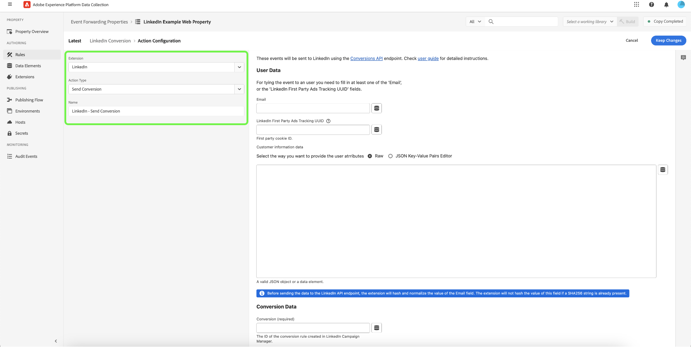

# Extension de l’API de conversions [!DNL LinkedIn]

[[!DNL LinkedIn Conversions API]](https://learn.microsoft.com/en-us/linkedin/marketing/integrations/ads-reporting/conversions-api) est un outil de suivi de conversion qui crée une connexion directe entre les données marketing du serveur d’un annonceur et [!DNL LinkedIn]. Cela permet aux annonceurs d’évaluer l’efficacité de leurs campagnes marketing [!DNL LinkedIn] quel que soit l’emplacement de la conversion et d’utiliser ces informations pour stimuler l’optimisation de la campagne. L’extension [!DNL LinkedIn Conversions API] peut contribuer à renforcer les performances et à réduire le coût par action grâce à une attribution plus complète, une meilleure fiabilité des données et une meilleure diffusion optimisée.

## Conditions préalables {#prerequisites}

Vous devez [créer une règle de conversion](https://www.linkedin.com/help/lms/answer/a1657171) dans votre compte [!DNL LinkedIn Campaign Manager]. [!DNL Adobe] recommande d’inclure &quot;CAPI&quot; au début du nom de la règle de conversation pour la différencier des autres types de règles de conversion que vous avez peut-être configurés.

### Créer un secret et un élément de données

Créez un nouveau [!DNL LinkedIn] [secret de transfert d&#39;événement](../../../ui/event-forwarding/secrets.md) et indiquez-lui un nom unique qui signifie membre d&#39;authentification. Elle sera utilisée pour authentifier la connexion à votre compte tout en conservant la valeur en sécurité.

Ensuite, [créez un élément de données](../../../ui/managing-resources/data-elements.md#create-a-data-element) à l’aide de l’extension [!UICONTROL Core] et d’un type d’élément de données [!UICONTROL Secret] pour référencer le secret `LinkedIn` que vous venez de créer.

## Installation et configuration de l’extension [!DNL LinkedIn] {#install}

Pour installer l’extension, [créez une propriété de transfert d’événement](../../../ui/event-forwarding/overview.md#properties) ou sélectionnez une propriété existante à modifier.

Sélectionner **[!UICONTROL Extensions]** dans le volet de navigation de gauche. Dans l&#39;onglet **[!UICONTROL Catalog]**, sélectionnez l&#39;extension **[!UICONTROL LinkedIn]**, puis sélectionnez **[!UICONTROL Install]**.

![Le catalogue d’extensions présentant l’installation de mise en surbrillance de la carte d’extension [!DNL LinkedIn].](../../../images/extensions/server/linkedin/install-extension.png)

Dans l’écran suivant, saisissez le secret de l’élément de données que vous avez créé précédemment dans le champ `Access Token` . Le secret de l’élément de données contiendra votre jeton [!DNL LinkedIn] OAuth 2. Lorsque vous avez terminé, cliquez sur **[!UICONTROL Enregistrer]**.

![La page de configuration de l’extension [!DNL LinkedIn] avec le champ [!UICONTROL  Access Token] et [!UICONTROL Save] en surbrillance.](../../../images/extensions/server/linkedin/configure-extension.png)

## Création d’une règle [!DNL Send Conversion] {#tracking-rule}

Une fois tous vos éléments de données configurés, vous pouvez commencer à créer des règles de transfert d’événement qui déterminent quand et comment vos événements seront envoyés à [!DNL LinkedIn].

Créez un nouveau transfert d’événement [rule](../../../ui/managing-resources/rules.md) dans votre propriété de transfert d’événement. Sous **[!UICONTROL Actions]**, ajoutez une nouvelle action et définissez l’extension sur **[!UICONTROL LinkedIn]**. Ensuite, sélectionnez **[!UICONTROL Envoyer la conversion]** pour le **[!UICONTROL Type d’action]**.

Une fois la sélection effectuée, d’autres commandes s’affichent pour configurer davantage l’événement. Sélectionnez **[!UICONTROL Conserver les modifications]** pour enregistrer la règle.

**[!UICONTROL Données utilisateur]**

| Entrée | Description |
| --- | --- |
| [!UICONTROL E-mail.] | Adresse électronique du contact associé à l’événement de conversion. La valeur de l’email sera encodée par le code d’extension dans SHA256, sauf si la valeur fournie est déjà une chaîne SHA256. |
| [!UICONTROL LinkedIn First Party Ads Tracking UID] | Il s’agit d’un identifiant de cookie propriétaire. Les annonceurs doivent activer le suivi de conversion amélioré à partir de [[!DNL LinkedIn Campaign Manager]](https://www.linkedin.com/help/lms/answer/a423304/enable-first-party-cookies-on-a-linkedin-insight-tag) afin d’activer les cookies propriétaires qui ajoutent un paramètre d’ID de clic `li_fat_id` aux URL de clic. |
| [!UICONTROL Données d’informations client] | Ce champ contient un objet JSON avec des attributs supplémentaires qui seront envoyés avec le message.  Sous l’option **[!UICONTROL Brut]**, vous pouvez coller l’objet JSON directement dans le champ de texte fourni, ou vous pouvez sélectionner l’icône d’élément de données () pour effectuer une sélection dans une liste d’éléments de données existants pour représenter les données.  Vous pouvez également utiliser l’option **[!UICONTROL Éditeur de paires clé-valeur JSON]** pour ajouter manuellement chaque paire clé-valeur via un éditeur d’interface utilisateur. Chaque valeur peut être représentée par une entrée brute ou un élément de données peut être sélectionné à la place. Les valeurs de clé acceptées sont : `firstName`, `lastName`, `companyName`, `title` et `country`. |

{style="table-layout:auto"}

![La section [!DNL User Data] présentant des exemples de saisie de données dans les champs.](../../../images/extensions/server/linkedin/configure-extension-user-data.png)

**[!UICONTROL Données de conversion]**

| Entrée | Description |
| --- | --- |
| [!UICONTROL Conversion] | ID de la règle de conversion créée dans [LinkedIn Campaign Manager](https://www.linkedin.com/help/lms/answer/a1657171). Sélectionnez la règle de conversion pour obtenir l’ID, puis copiez l’ID à partir de l’URL du navigateur (par exemple, `/campaignmanager/accounts/508111232/conversions/15588877`) en tant que `/conversions/<id>`. |
| [!UICONTROL Temps de conversion] | Horodatage en millisecondes au cours duquel l’événement de conversion s’est produit.    Remarque : Si votre source enregistre l’horodatage de conversion en secondes, insérez 000 à la fin pour le transformer en millisecondes. |
| [!UICONTROL Devise] | Code de devise au format ISO. |
| [!UICONTROL Amount] | Valeur de la conversion dans la chaîne décimale (par exemple, &quot;100.05&quot;). |
| [!UICONTROL ID d’événement] | Identifiant unique généré par les annonceurs pour indiquer chaque événement. Il s’agit d’un champ facultatif qui est utilisé pour la [déduplication](https://learn.microsoft.com/en-us/linkedin/marketing/conversions/deduplication?view=li-lms-2024-02). |

{style="table-layout:auto"}

![La section [!DNL Conversion Data] présentant des exemples de données dans les champs.](../../../images/extensions/server/linkedin/configure-extension-conversions-data.png)

**[!UICONTROL Remplacements de configuration]**

>REMARQUE
>
>Le champ [!UICONTROL Configurations Overrides] permet à un utilisateur de définir un jeton d’accès [!DNL LinkedIn] différent sur chaque règle, ce qui permet à chaque règle d’utiliser un jeton d’accès pouvant avoir accès à différents comptes publicitaires [!DNL LinkedIn].

| Entrée | Description |
| --- | --- |
| [!UICONTROL Jeton d’accès] | Jeton d’accès [!DNL LinkedIn]. |

![La section [!DNL Configuration Overrides] présentant des exemples de saisie de données dans le champ.](../../../images/extensions/server/linkedin/configure-extension-configuration-override.png)

## Étapes suivantes

Ce guide explique comment envoyer des données à [!DNL LinkedIn] à l’aide de l’extension de transfert d’événement [!DNL LinkedIn Conversions API]. Pour plus d’informations sur les fonctionnalités de transfert d’événement dans [!DNL Adobe Experience Platform], consultez la [présentation du transfert d’événement](../../../ui/event-forwarding/overview.md).

Pour plus d’informations sur la façon de déboguer votre mise en oeuvre à l’aide de l’outil Experience Platform Debugger et Event Forwarding Monitoring, consultez les [ {présentation des Adobes Experience Platform Debugger](../../../../debugger/home.md) et [Surveillance des activités dans le transfert d’événement](../../../ui/event-forwarding/monitoring.md).
