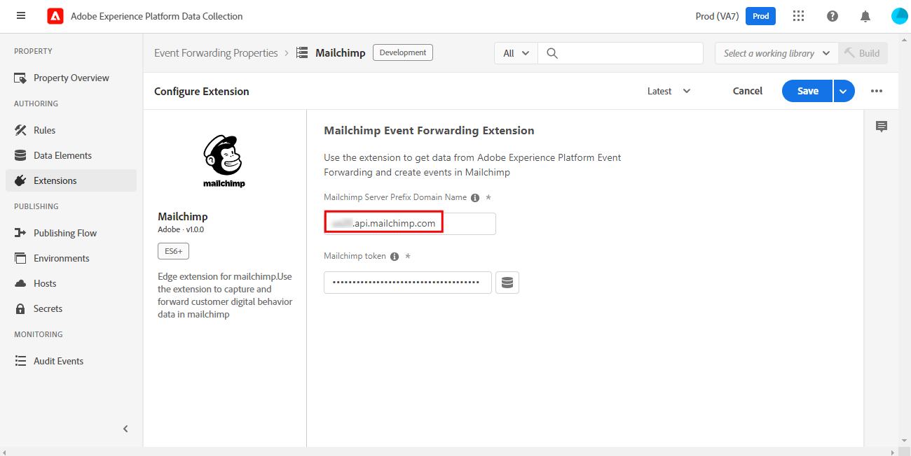

# Présentation de l’extension de transfert d’événement Mailchimp

>[!NOTE]
>  
>Adobe Experience Platform Launch est désormais une suite de technologies destinées à la collecte de données dans Adobe Experience Platform. Plusieurs modifications terminologiques ont par conséquent été apportées à la documentation du produit. Reportez-vous au [document](https://experienceleague.adobe.com/docs/experience-platform/tags/term-updates.html?lang=fr) suivant pour consulter une référence consolidée des modifications terminologiques.

L’extension Mailchimp [transfert d’événement](../../../ui/event-forwarding/overview.md) envoie des événements à l’API marketing Mailchimp qui peut déclencher des e-mails pour les campagnes marketing, les parcours ou les transactions Mailchimp.

Ce document explique comment configurer l’extension et les règles à l’aide de l’action Ajouter un événement .

## Conditions préalables

Ce document suppose que vous connaissez les produits Mailchimp pertinents utilisés par l’extension. Pour plus d’informations, consultez la documentation d’aide Mailchimp pour [campagnes](https://mailchimp.com/help/getting-started-with-campaigns/), [parcours &#x200B;](https://mailchimp.com/help/about-customer-journeys/) et [transactions](https://mailchimp.com/help/transactional/).

Un compte Mailchimp est requis pour utiliser cette extension. Vous pouvez créer un compte [ici](https://login.mailchimp.com/signup/). Dans le tableau de bord du compte Mailchimp, notez les valeurs suivantes à utiliser dans ce guide :

- Votre préfixe de domaine Mailchimp
- Votre clé API
- L’ID d’audience
- Adresse e-mail « de » par défaut

En fonction de votre plan de compte Mailchimp, vous pouvez avoir un accès limité aux outils de Parcours client Mailchimp.

>[!TIP]
>  
>Si vous utilisez des automatisations Mailchimp telles que les e-mails transactionnels ou les Parcours client, les étapes et les écrans peuvent être légèrement différents de ceux répertoriés ici. Toutefois, vous avez toujours besoin des mêmes informations pour utiliser cette extension comme décrit ci-dessus. Consultez le [Centre d’aide Mailchimp](https://mailchimp.com/help/) pour plus d’informations sur chacune de ces valeurs pour votre compte et votre plan spécifiques.

### Préfixe de domaine

Après vous être connecté à Mailchimp et avoir accédé à la vue Tableau de bord , la barre d’adresse de votre navigateur doit afficher une URL de type `https://us11.admin.mailchimp.com` ou simplement `us11.admin.mailchimp.com`. Dans cet exemple, le préfixe `us11` n’est qu’un espace réservé et votre valeur sera différente. Enregistrez votre URL avec votre préfixe pour une étape ultérieure.

### Clé API

Pour trouver la clé API de votre compte, sélectionnez l’icône de votre profil dans l’interface utilisateur de Mailchimp, puis sélectionnez **Profil**. Vous devriez voir une URL comme `https://us11.admin.mailchimp.com/account/profile/`, mais avec **votre** préfixe au lieu de `us11`.

Sélectionnez **Extras**, puis **Clés API** :

Sous **Vos clés API**, vous pouvez choisir une clé existante ou sélectionner **Créer une clé** pour en créer une nouvelle. Vous pouvez créer une clé à utiliser spécifiquement avec cette extension. Copiez la clé API et enregistrez-la pour une étape ultérieure. Pour plus d’informations, consultez la documentation de Mailchimp sur la [génération de votre clé API](https://mailchimp.com/developer/marketing/guides/quick-start/#generate-your-api-key).

### ID d’audience et adresse d’expédition

Sélectionnez **Audience** dans le volet de navigation de gauche, puis **Tableau de bord de l’audience**. Sélectionnez ensuite l’audience que vous prévoyez d’utiliser avec cette extension. Pour en savoir plus, consultez le document Mailchimp sur la [création d’une audience](https://mailchimp.com/help/create-audience/).

Une fois votre audience créée et sélectionnée, sélectionnez le menu déroulant **Gérer l’audience** et choisissez **Paramètres**. Cet écran affiche différents paramètres pour votre audience.

En bas de l’écran Paramètres , vous devriez voir `Unique id for audience [audience name]` où `[audience name]` correspond au nom de votre audience réelle. Copiez l’ID d’audience et enregistrez-le pour une étape ultérieure.

Sélectionnez **Nom de l’audience et valeurs par défaut** et vérifiez que **Adresse e-mail de l’expéditeur par défaut** a la valeur correcte pour vos campagnes. Notez que l’ID d’audience est également répertorié en haut de cette page et correspond à la valeur que vous avez copiée à la dernière étape.

## Automatisations Mailchimp

Selon votre plan Mailchimp et selon que vous utilisez des e-mails transactionnels, des Parcours client ou d’autres automatisations Mailchimp, vos paramètres de parcours spécifiques peuvent varier.

>[!IMPORTANT]
>  
>Le nom d’événement que vous avez choisi pour déclencher votre automatisation ou votre parcours dans Mailchimp est le même nom d’événement que vous devez envoyer avec cette extension. Notez le nom de l’événement dans votre automatisation Mailchimp et enregistrez-le pour une étape ultérieure.

## Installation et configuration

Cette section répertorie les étapes à suivre pour installer et configurer l’extension. Pour enregistrer la clé API Mailchimp en toute sécurité, vous devez utiliser le transfert d’événement [secrets](../../../ui/event-forwarding/secrets.md).

### Créer un secret et un élément de données

Dans une propriété de transfert d’événement, [créez un secret [!UICONTROL Token]](../../../ui/event-forwarding/secrets.md#token) appelé `Mailchimp API Key`.

Ensuite, [créez un élément de données](../../../ui/managing-resources/data-elements.md#create-a-data-element) à l’aide de l’extension [!UICONTROL Core] et d’un type d’élément de données [!UICONTROL Secret] pour référencer le secret de `Mailchimp API Key` que vous venez de créer. Saisissez `Mailchimp Token` comme nom de l’élément de données.

### Installation et configuration de l’extension 

Dans la même propriété de transfert d’événement, sélectionnez **[!UICONTROL Extensions],** puis **[!UICONTROL Catalogue]** pour afficher les extensions disponibles à l’installation. À partir de là, recherchez l’extension Mailchimp et sélectionnez **[!UICONTROL Installer]**.

L’écran de configuration s’affiche. Sous **[!UICONTROL Nom de domaine du préfixe du serveur Mailchimp]**, saisissez le domaine que vous avez copié précédemment à partir de votre compte Mailchimp, y compris votre préfixe de domaine unique.

>[!IMPORTANT]
>
>N’incluez ni `http://` ni `https://` dans ce champ.

Sous **[!UICONTROL Jeton Mailchimp]**, sélectionnez l’icône de l’élément de données et choisissez l’élément de données `Mailchimp Token` que vous avez créé précédemment. Sélectionnez **[!UICONTROL Enregistrer]** pour enregistrer les modifications.

L’extension est maintenant installée et configurée pour être utilisée dans votre propriété.

## Collecte de données

Lors de l’utilisation de cette extension dans une [règle](../../../ui/managing-resources/rules.md), il existe plusieurs valeurs de données que l’extension envoie à Mailchimp avec chaque événement. Pour une implémentation standard, vous pouvez configurer l’extension [Adobe Experience Platform Web SDK](../../client/web-sdk/overview.md) pour envoyer ces données à [!DNL Experience Platform Edge Network] en vue de leur utilisation par l’extension dans la propriété de transfert d’événement.

Les données requises par cette extension peuvent être envoyées à partir de Web SDK sous la forme de données XDM (à l’aide de l’objet [`xdm`](/help/web-sdk/commands/sendevent/xdm.md) ) ou de données non XDM (à l’aide de l’objet [`data`](/help/web-sdk/commands/sendevent/data.md) ).

Par exemple, si un client effectue un achat ou s’inscrit à un événement sur votre site, vous pouvez envoyer un e-mail de confirmation via Mailchimp avec cette extension. Une fois que vous avez envoyé les informations requises de Web SDK à Edge Network, l’extension déclenche l’e-mail avec Mailchimp.

### Éléments de données

La capture d’écran de la section précédente affiche les données que vous pouvez envoyer avec chaque événement de cette extension à Mailchimp. Une fois que vous avez configuré Web SDK pour envoyer ces données à Edge Network, vous pouvez créer des éléments de données dans la propriété de transfert d’événement afin que l’extension puisse accéder à ces valeurs.

Le tableau ci-dessous fournit plus de détails sur chaque valeur possible.

| Nom | Exemple de chemin | Type | Description | Obligatoire | Limites |
|:---|:---:|:---:|:---|:---:|:---|
| `email` | `arc.event.xdm._tenant.emailId`  ou   `arc.event.data._tenant.emailId` | Chaîne | Adresse qui reçoit l’e-mail | **Oui** | Doit exister dans l’audience Mailchimp |
| `listId` | `arc.event.xdm._tenant.listId`  ou   `arc.event.data._tenant.listid` | Chaîne | ID de l’audience | **Oui** | Doit correspondre à un ID d’audience existant |
| `name` | `arc.event.xdm._tenant.name`  ou   `arc.event.data._tenant.name` | Chaîne | Nom de l’événement | **Oui** | 2-30 caractères de longueur |
| `properties` | `arc.event.xdm._tenant.properties`  ou   `arc.event.data._tenant.properties` | Objet | Liste facultative des propriétés au format JSON avec des détails sur l’événement | Non |  |
| `isSyncing` | `arc.event.xdm._tenant.isSyncing`  ou   `arc.event.data._tenant.isSyncing` | Booléen | Les événements créés avec `is_syncing` défini sur `true` **ne déclencheront pas** d’automatisation | Non |  |
| `occurredAt` | `arc.event.xdm._tenant.occuredAt`  ou `arc.event.data._tenant.occuredAt`. | Chaîne | Horodatage ISO 8601 du moment où l’événement s’est produit | Non |  |

{style="table-layout:auto"}

>[!IMPORTANT]
>  
>Les valeurs **Exemple de chemin** ci-dessus sont données à titre d’exemple uniquement. Les noms de champ et les [chemins](../../../ui/event-forwarding/overview.md#data-element-path) référencés dans ces éléments de données peuvent être différents dans votre propriété, selon la manière dont vous avez nommé et configuré Web SDK dans les étapes ci-dessus.

Dans votre propriété de transfert d’événement , vous pouvez créer un élément de données pour chacun des champs décrits ci-dessus. Une fois créés, vous pouvez référencer les éléments de données dans l’action [!UICONTROL Ajouter un événement] de cette extension.

Vous pouvez désormais utiliser cette extension et l’action Ajouter un événement pour déclencher des e-mails Mailchimp pour vos audiences.

## Validation des données

Lorsque vous utilisez des extensions de transfert d’événement, l’[Adobe Experience Platform Debugger](https://chrome.google.com/webstore/detail/adobe-experience-platform/bfnnokhpnncpkdmbokanobigaccjkpob) est très utile. Dans la section Journaux , sous Journaux Edge , vous pouvez voir les requêtes effectuées par vos règles de transfert d’événement après leur déclenchement. Les captures d’écran suivantes montrent une requête envoyée à l’API Mailchimp par l’extension .

Dans le tableau de bord Mailchimp, dans la vue Flux d’activités de votre audience ou membre d’audience, une liste d’événements pour cette audience ou ce membre d’audience est fournie. Cela doit correspondre aux événements envoyés par l’extension et afficher toutes les données facultatives envoyées, ainsi que l’e-mail ou la campagne qu’ils ont reçus. Pour plus d’informations, consultez les guides d’aide [Automatisation Mailchimp](https://mailchimp.com/help/automation/).
