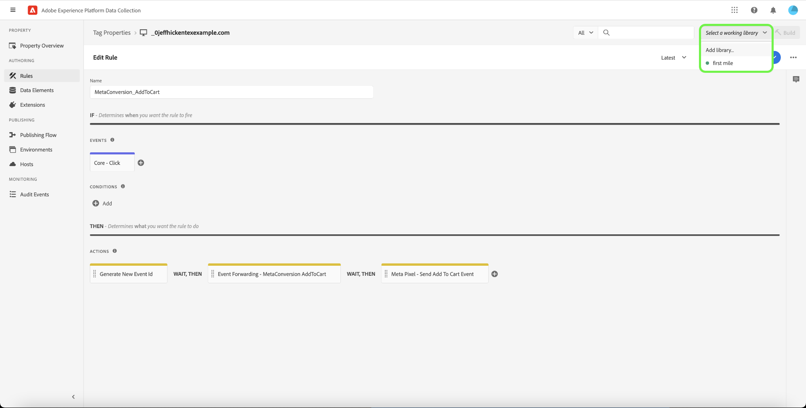

# Présentation de l’extension [!DNL Meta Conversions API]

Le [[!DNL Meta Conversions API]](https://developers.facebook.com/docs/marketing-api/conversions-api/) vous permet de connecter vos données marketing côté serveur aux technologies [!DNL Meta] afin d’optimiser le ciblage de vos annonces, de réduire le coût par action et de mesurer les résultats. Les événements sont liés à un ID de [[!DNL Meta Pixel]](https://developers.facebook.com/docs/meta-pixel/) et sont traités de la même manière que les événements côté client.

À l’aide de l’extension [!DNL Meta Conversions API], vous pouvez tirer parti des fonctionnalités de l’API dans vos règles [transfert d’événement](../../../ui/event-forwarding/overview.md) pour envoyer des données aux [!DNL Meta] à partir de l’Edge Network Adobe Experience Platform. Ce document explique comment installer l’extension et utiliser ses fonctionnalités dans une [règle](../../../ui/managing-resources/rules.md) de transfert d’événement.

## Démonstration

La vidéo suivante est destinée à vous aider à comprendre le [!DNL Meta Conversions API].

>[!VIDEO](https://unlockmarketingdata.com/video-meta-conversions-api)

## Conditions préalables

Il est vivement recommandé d’utiliser [!DNL Meta Pixel] et le [!DNL Conversions API] pour partager et envoyer les mêmes événements côté client et côté serveur, respectivement, car cela peut aider à récupérer les événements qui n’ont pas été récupérés par [!DNL Meta Pixel]. Avant d’installer l’extension [!DNL Conversions API], consultez le guide sur l’extension [[!DNL Meta Pixel]  pour savoir comment l’intégrer dans vos implémentations de balises côté client](../../client/meta/overview.md)

>[!NOTE]
>
>La section sur la [déduplication des événements](#deduplication) plus loin dans ce document décrit les étapes à suivre pour s’assurer qu’un même événement n’est pas utilisé deux fois, car il peut être reçu du navigateur et du serveur.

Pour utiliser l’extension [!DNL Conversions API], vous devez avoir accès au transfert d’événement et disposer d’un compte [!DNL Meta] valide avec un accès à [!DNL Ad Manager] et [!DNL Event Manager]. Plus précisément, vous devez copier l’identifiant d’un [[!DNL Meta Pixel]](https://www.facebook.com/business/help/952192354843755?id=1205376682832142) existant (ou [créer un nouveau [!DNL Pixel]](https://www.facebook.com/business/help/952192354843755) à la place) afin que l’extension puisse être configurée sur votre compte.

>[!INFO]
>
>Si vous envisagez d’utiliser cette extension avec des données d’application mobile ou si vous utilisez également des données d’événement hors ligne dans vos campagnes [!DNL Meta], vous devez créer votre jeu de données par le biais d’une application existante et sélectionner **Créer à partir d’un identifiant de pixel** lorsque vous y êtes invité. Pour plus d’informations, consultez l’article [Choix de l’option de création de jeu de données adaptée à votre entreprise](https://www.facebook.com/business/help/5270377362999582?id=490360542427371). Reportez-vous au document [API de conversion pour les événements d’application](https://developers.facebook.com/docs/marketing-api/conversions-api/app-events) pour tous les paramètres de suivi d’application obligatoires et facultatifs.

## Installation l’extension

Pour installer l’extension [!DNL Meta Conversions API], accédez à l’interface utilisateur de la collecte de données ou d’Experience Platform et sélectionnez **[!UICONTROL Event Forwarding]** dans le volet de navigation de gauche. À partir de là, sélectionnez une propriété à laquelle ajouter l’extension ou créez-en une nouvelle.

Une fois la propriété sélectionnée ou créée, sélectionnez **[!UICONTROL Extensions]** dans le volet de navigation de gauche, puis sélectionnez l’onglet **[!UICONTROL Catalog]** . Recherchez la carte [!UICONTROL Meta Conversions API], puis sélectionnez **[!UICONTROL Install]**.

![L’option [!UICONTROL Install] sélectionnée pour l’extension [!UICONTROL Meta Conversions API] dans l’interface utilisateur de collecte de données.](../../../images/extensions/server/meta/install.png)

Dans la vue de configuration qui s’affiche, vous devez fournir l’identifiant [!DNL Pixel] que vous avez copié précédemment pour lier l’extension à votre compte. Vous pouvez coller l’identifiant directement dans l’entrée ou utiliser un élément de données à la place.

Vous devez également fournir un jeton d’accès pour utiliser le [!DNL Conversions API] spécifiquement. Reportez-vous à la documentation [!DNL Conversions API] sur la [génération d’un jeton d’accès](https://developers.facebook.com/docs/marketing-api/conversions-api/get-started#access-token) pour savoir comment obtenir cette valeur.

Lorsque vous avez terminé, sélectionnez **[!UICONTROL Save]**

![Identifiant [!DNL Pixel] fourni en tant qu’élément de données dans la vue de configuration de l’extension.](../../../images/extensions/server/meta/configure.png)

L’extension est installée et vous pouvez désormais utiliser ses fonctionnalités dans vos règles de transfert d’événement.

## Intégration avec l’extension Facebook et Instagram {#facebook}

L’intégration à l’aide de l’extension Facebook et Instagram vous permet de vous authentifier rapidement dans votre compte professionnel Meta. Cela renseigne ensuite automatiquement votre [!UICONTROL Pixel ID] et l’[!UICONTROL Access Token] de l’API Meta Conversions, ce qui facilite l’installation et la configuration de l’API Meta Conversions.

Une boîte de dialogue vous invitant à vous authentifier dans Facebook et Instagram s’affiche lors de l’installation de l’extension [!UICONTROL Meta Conversions API].

![Page d’installation de [!UICONTROL Meta Conversions API Extension] mettant en surbrillance [!UICONTROL Connect to Meta].](../../../images/extensions/server/meta/mbe-extension-install.png)

Une invite de boîte de dialogue pour l’authentification sur Facebook et Instagram apparaît également dans l’interface utilisateur du workflow de démarrage rapide dans le transfert d’événement.

![Interface utilisateur du workflow de démarrage rapide mettant en surbrillance [!UICONTROL Connect to Meta].](../../../images/extensions/server/meta/mbe-extension-quick-start.png)

## Intégration au score de correspondance de qualité de l’événement (EMQ) {#emq}

L’intégration au score de correspondance de qualité de l’événement (EMQ) vous permet d’afficher facilement l’efficacité de votre implémentation en affichant les scores EMQ. Cette intégration réduit le changement de contexte et vous permet d’améliorer le succès de vos implémentations d’API de conversions Meta. Ces scores d’événement s’affichent dans l’écran de configuration [!UICONTROL Meta Conversions API extension].

![Page de configuration [!UICONTROL Meta Conversions API Extension] mettant en surbrillance [!UICONTROL View EMQ Score].](../../../images/extensions/server/meta/emq-score.png)

## Intégration à LiveRamp (Alpha) {#alpha}

Les clients [!DNL LiveRamp] qui ont déployé la solution ATS (Authenticated Traffic Solution) d’[!DNL LiveRamp] sur leurs sites peuvent choisir de partager des RampID en tant que paramètre d’informations client. Veuillez travailler avec l’équipe de votre compte [!DNL Meta] pour rejoindre le programme Alpha relatif à cette fonctionnalité.

![Page de configuration de l’[!UICONTROL Rule] de transfert d’événement Meta mettant en surbrillance [!UICONTROL Partner Name (alpha)] et [!UICONTROL Partner ID (alpha)].](../../../images/extensions/server/meta/live-ramp.png)

## Configurer une règle de transfert d’événement {#rule}

Cette section explique comment utiliser l’extension [!DNL Conversions API] dans une règle de transfert d’événement générique. En pratique, vous devez configurer plusieurs règles afin d’envoyer tous les [événements standard](https://developers.facebook.com/docs/meta-pixel/reference) acceptés via [!DNL Meta Pixel] et [!DNL Conversions API]. Pour les données des applications mobiles, reportez-vous aux champs obligatoires, aux champs de données d’application, aux paramètres d’informations client et aux détails des données personnalisées [ici](https://developers.facebook.com/docs/marketing-api/conversions-api/app-events).

>[!NOTE]
>
>Les événements doivent être [envoyés en temps réel](https://www.facebook.com/business/help/379226453470947?id=818859032317965) ou aussi proches que possible du temps réel pour une meilleure optimisation des campagnes publicitaires.

Commencez à créer une règle de transfert d’événement et configurez ses conditions selon vos besoins. Lors de la sélection des actions de la règle, sélectionnez **[!UICONTROL Meta Conversions API Extension]** pour l’extension, puis sélectionnez **[!UICONTROL Send Conversions API Event]** pour le type d’action.

![Type d’action [!UICONTROL Send Page View] sélectionné pour une règle dans l’interface utilisateur de collecte de données.](../../../images/extensions/server/meta/select-action.png)

Des commandes s’affichent pour vous permettre de configurer les données d’événement qui seront envoyées à [!DNL Meta] via le [!DNL Conversions API]. Ces options peuvent être saisies directement dans les entrées fournies ou vous pouvez sélectionner des éléments de données existants pour représenter les valeurs à la place. Les options de configuration sont divisées en quatre sections principales, comme indiqué ci-dessous.

| Section de configuration | Description |
| --- | --- |
| [!UICONTROL Server Event Parameters] | Informations générales sur l’événement, y compris l’heure à laquelle il s’est produit et l’action source qui l’a déclenché. Pour plus d’informations sur les [!DNL Meta]paramètres d’événement standard[ acceptés par les ](https://developers.facebook.com/docs/marketing-api/conversions-api/parameters/server-event), consultez la documentation pour les développeurs [!DNL Conversions API] .  Si vous utilisez à la fois [!DNL Meta Pixel] et [!DNL Conversions API] pour envoyer des événements, veillez à inclure un **[!UICONTROL Event Name]** (`event_name`) et un **[!UICONTROL Event ID]** (`event_id`) à chaque événement, car ces valeurs sont utilisées pour [la déduplication des événements](#deduplication).  Vous avez également la possibilité de **[!UICONTROL Enable Limited Data Use]** pour vous conformer aux désinscriptions des clients. Consultez la documentation [!DNL Conversions API] sur les [options de traitement des données](https://developers.facebook.com/docs/marketing-apis/data-processing-options/) pour plus d’informations sur cette fonctionnalité. |
| [!UICONTROL Customer Information Parameters] | Données d’identité utilisateur utilisées pour attribuer l’événement à un client. Certaines de ces valeurs doivent être hachées avant de pouvoir être envoyées à l’API .  Pour garantir une bonne connexion d’API commune et une qualité de correspondance d’événement (EMQ) élevée, il est recommandé d’envoyer tous les [ paramètres d’informations client acceptés](https://developers.facebook.com/docs/marketing-api/conversions-api/parameters/customer-information-parameters) ainsi que les événements de serveur. Ces paramètres doivent également être [classés par ordre de priorité en fonction de leur importance et de leur impact sur l’EMQ](https://www.facebook.com/business/help/765081237991954?id=818859032317965). |
| [!UICONTROL Custom Data] | Données supplémentaires à utiliser pour l’optimisation de la diffusion des publicités, fournies sous la forme d’un objet JSON. Reportez-vous à la [[!DNL Conversions API] documentation](https://developers.facebook.com/docs/marketing-api/conversions-api/parameters/custom-data) pour plus d’informations sur les propriétés acceptées pour cet objet.  Si vous envoyez un événement d’achat, vous devez utiliser cette section pour fournir les attributs requis `currency` et `value`. |
| [!UICONTROL Test Event] | Cette option est utilisée pour vérifier si votre configuration entraîne la réception des événements du serveur par [!DNL Meta] comme prévu. Pour utiliser cette fonctionnalité, cochez la case **[!UICONTROL Send as Test Event]**, puis fournissez un code d’événement de test de votre choix dans l’entrée ci-dessous. Une fois la règle de transfert d’événement déployée, si vous avez correctement configuré l’extension et l’action, vous devriez voir les activités apparaître dans la vue **[!DNL Test Events]** dans [!DNL Meta Events Manager]. |

{style="table-layout:auto"}

Lorsque vous avez terminé, sélectionnez **[!UICONTROL Keep Changes]** pour ajouter l’action à la configuration de la règle.

![[!UICONTROL Keep Changes] sélectionné pour la configuration de l’action.](../../../images/extensions/server/meta/keep-changes.png)

Lorsque la règle vous convient, sélectionnez **[!UICONTROL Save to Library]**. Enfin, publiez un nouveau transfert d’événement [build](../../../ui/publishing/builds.md) pour activer les modifications apportées à la bibliothèque.

## Déduplication des événements {#deduplication}

Comme indiqué dans la [section Conditions préalables](#prerequisites), il est recommandé d’utiliser à la fois l’extension de balise [!DNL Meta Pixel] et l’extension de transfert d’événement [!DNL Conversions API] pour envoyer les mêmes événements du client et du serveur dans une configuration redondante. Cela peut aider à récupérer les événements qui n’ont pas été récupérés par une extension ou par l’autre.

Si vous envoyez différents types d’événements à partir du client et du serveur sans chevauchement entre les deux, la déduplication n’est pas nécessaire. Cependant, si un seul événement est partagé par [!DNL Meta Pixel] et le [!DNL Conversions API], vous devez vous assurer que ces événements redondants sont dédupliqués afin que vos rapports ne soient pas affectés négativement.

Lors de l’envoi d’événements partagés, veillez à inclure un identifiant et un nom d’événement à chaque événement envoyé à partir du client et du serveur. Lorsque plusieurs événements avec le même ID et le même nom sont reçus, [!DNL Meta] utilise automatiquement plusieurs stratégies pour les dédupliquer et conserver les données les plus pertinentes. Pour plus d’informations sur ce processus[!DNL Meta] consultez la documentation [ sur  [!DNL Meta Pixel] la déduplication des et  [!DNL Conversions API]  événements](https://www.facebook.com/business/help/823677331451951?id=1205376682832142).

## Workflow de démarrage rapide : extension de l’API de conversions Meta (Beta) {#quick-start}

>[!IMPORTANT]
>
>* La fonctionnalité de démarrage rapide est disponible pour les clients qui ont acheté le package Real-Time CDP Prime et Ultimate. Pour plus dʼinformations, contactez votre représentant commercial Adobe.
>* Cette fonctionnalité est destinée aux nouvelles implémentations et ne prend actuellement pas en charge l’installation automatique d’extensions et de configurations sur des balises existantes et des propriétés de transfert d’événement.

>[!NOTE]
>
>Tout client existant peut utiliser les workflows de démarrage rapide pour créer une implémentation de référence qui peut être utilisée pour les éléments suivants :
>
>* Utilisez-le comme point de départ d’une toute nouvelle implémentation.
>* Utilisez-la comme une implémentation de référence que vous pouvez examiner pour voir comment elle a été configurée, puis répliquez-la dans vos implémentations de production actuelles.

La fonctionnalité de démarrage rapide vous permet de configurer facilement et efficacement l’API Meta Conversions et les extensions de pixel Meta. Cet outil automatise plusieurs étapes effectuées dans les balises Adobe et le transfert d’événement, ce qui réduit considérablement le temps de configuration.

Cette fonctionnalité installe et configure automatiquement l’API Meta Conversions et les extensions de pixel Meta sur une nouvelle propriété de transfert d’événement et de balises générées automatiquement avec les règles et éléments de données nécessaires. En outre, il installe et configure automatiquement le SDK web Experience Platform et le flux de données. Enfin, la fonction de démarrage rapide publie automatiquement la bibliothèque vers l’URL désignée dans un environnement de développement, ce qui permet la collecte de données côté client et le transfert d’événement côté serveur en temps réel via le transfert d’événement et Experience Platform Edge Network.

La vidéo suivante présente la fonctionnalité de démarrage rapide.

>[!VIDEO](https://video.tv.adobe.com/v/3416939?quality=12&learn=on)

### Installer la fonctionnalité de démarrage rapide

>[!NOTE]
>
>Cette fonctionnalité est conçue pour vous aider à commencer une implémentation de transfert d’événement. Il ne fournit pas une implémentation complète et fonctionnelle de bout en bout, capable de s’adapter à tous les cas d’utilisation.

Cette configuration installe automatiquement les extensions API Meta Conversions et Pixel Meta. Cette implémentation hybride est recommandée par Meta pour collecter et transférer des conversions d’événement côté serveur.
La fonctionnalité de configuration rapide est conçue pour aider les clients à commencer une implémentation du transfert d’événement. Elle n’est pas destinée à fournir une implémentation complète et fonctionnelle de bout en bout, qui s’adapte à tous les cas d’utilisation.

Pour installer la fonctionnalité, sélectionnez **[!UICONTROL Get Started]** pour **[!DNL Send Conversions Data to Meta]** sur la page **[!UICONTROL Home]** de la collecte de données Adobe Experience Platform .

Saisissez votre **[!UICONTROL Domain]**, puis sélectionnez **[!UICONTROL Next]**. Ce domaine sera utilisé comme convention d’affectation des noms pour vos propriétés de balises et de transfert d’événement générés automatiquement, vos règles, vos éléments de données, vos flux de données, etc.

Dans la boîte de dialogue **[!UICONTROL Initial Setup]**, saisissez vos **[!UICONTROL Meta Pixel ID]**, **[!UICONTROL Meta Conversion API Access Token]** et **[!UICONTROL Data Layer Path]**, puis sélectionnez **[!UICONTROL Next]**.

Patientez quelques minutes le temps que le processus de configuration initial se termine, puis sélectionnez **[!UICONTROL Next]**.

Dans la boîte de dialogue **[!UICONTROL Add Code on Your Site]**, copiez le code fourni à l’aide de la fonction copier  et collez-le dans le `<head>` de votre site web source. Une fois l’implémentation effectuée, sélectionnez **[!UICONTROL Start Validation]**

La boîte de dialogue [!UICONTROL Validation Results] affiche les résultats de l’implémentation de l’extension Meta. Sélectionnez **[!UICONTROL Next]**. Vous pouvez également afficher des résultats de validation supplémentaires en sélectionnant le lien **[!UICONTROL Assurance]** .

L’écran **[!UICONTROL Next Steps]** confirme la fin de la configuration. À partir de là, vous avez la possibilité d’optimiser votre implémentation en ajoutant de nouveaux événements, qui sont affichés dans la section suivante.

Si vous ne souhaitez pas ajouter d’événements supplémentaires, sélectionnez **[!UICONTROL Close]**.

#### Ajouter des événements supplémentaires

Pour ajouter de nouveaux événements, sélectionnez **[!UICONTROL Edit Your Tags Web Property]**.

Sélectionnez la règle qui correspond au méta-événement que vous souhaitez modifier. Par exemple, **MetaConversion_AddToCart**.

>[!NOTE]
>
>S’il n’existe aucun événement, cette règle ne s’exécute pas. C’est le cas pour toutes les règles, la règle **MetaConversion_PageView** étant l’exception.

Pour ajouter un événement, sélectionnez **[!UICONTROL Add]** sous l’en-tête [!UICONTROL Events] .

Sélectionnez le [!UICONTROL Event Type]. Dans cet exemple, nous avons sélectionné l’événement [!UICONTROL Click] et l’avons configuré pour qu’il se déclenche lorsque le bouton **.add-to-cart** est sélectionné. Sélectionnez **[!UICONTROL Keep Changes]**.

Le nouvel événement a été enregistré. Sélectionnez **[!UICONTROL Select a working library]** et sélectionnez la bibliothèque dans laquelle vous souhaitez créer la bibliothèque.

Sélectionnez ensuite la liste déroulante à côté de **[!UICONTROL Save to Library]** et sélectionnez **[!UICONTROL Save to Library and Build]**. La modification sera publiée dans la bibliothèque.

Répétez ces étapes pour tout autre événement de méta-conversion que vous souhaitez configurer.

#### Configuration de la couche de données {#configuration}

>[!IMPORTANT]
>
>La façon dont vous mettez à jour cette couche de données globale dépend de l’architecture de votre site web. Une application sur une seule page est différente d’une application de rendu côté serveur. Il est également possible que vous soyez entièrement responsable de la création et de la mise à jour de ces données dans le produit Balises. Dans toutes les instances, la couche de données devra être mise à jour entre l’exécution de chacune des `MetaConversion_* rules`. Si vous ne mettez pas à jour les données entre les règles, vous pouvez également rencontrer un cas où vous envoyez des données obsolètes de la dernière `MetaConversion_* rule` de la `MetaConversion_* rule` actuelle.

Lors de la configuration, il vous a été demandé où se trouve votre couche de données. Par défaut, il s’agit d’une `window.dataLayer.meta`, et à l’intérieur de l’objet `meta`, vos données sont attendues comme illustré ci-dessous.

Il est important de comprendre cela, car chaque règle de `MetaConversion_*` utilise cette structure de données pour transmettre les éléments de données pertinents à l’extension [!DNL Meta Pixel] et au [!DNL Meta Conversions API]. Reportez-vous à la documentation sur [les événements standard](https://developers.facebook.com/docs/meta-pixel/reference#standard-events) pour plus d’informations sur les données requises par les différents méta-événements.

Par exemple, si vous souhaitez utiliser la règle `MetaConversion_Subscribe`, vous devez mettre à jour `window.dataLayer.meta.currency`, `window.dataLayer.meta.predicted_ltv` et `window.dataLayer.meta.value` conformément aux propriétés d’objet décrites dans la documentation sur les [événements standard](https://developers.facebook.com/docs/meta-pixel/reference#standard-events).

Vous trouverez ci-dessous un exemple de ce qui doit être exécuté sur un site web pour mettre à jour la couche de données avant l’exécution de la règle.

Par défaut, la `<datalayerpath>.conversionData.eventId` est générée de manière aléatoire par l’action « Générer un nouvel identifiant d’événement » sur l’un des `MetaConversion_* rules`.

Pour obtenir une référence locale de l’aspect de la couche de données, vous pouvez ouvrir l’éditeur de code personnalisé sur l’élément de données `MetaConversion_DataLayer` de votre propriété .

## Étapes suivantes

Ce guide explique comment envoyer des données d’événement côté serveur à [!DNL Meta] à l’aide de l’extension [!DNL Meta Conversions API]. À partir de là, il est recommandé d’étendre votre intégration en connectant plus de [!DNL Pixels] et en partageant davantage d’événements, le cas échéant. Effectuer l’une des opérations suivantes peut vous aider à améliorer davantage les performances de votre publicité :

* Connectez tout autre [!DNL Pixels] qui n’est pas encore connecté à une intégration [!DNL Conversions API].
* Si vous envoyez certains événements exclusivement par le biais de [!DNL Meta Pixel] côté client, envoyez également ces mêmes événements au [!DNL Conversions API] côté serveur.

Pour plus d’informations sur la mise en œuvre efficace de votre intégration[!DNL Meta][ consultez la documentation  [!DNL Conversions API] sur ](https://www.facebook.com/business/help/308855623839366?id=818859032317965)les bonnes pratiques relatives à . Pour des informations plus générales sur les balises et le transfert d’événement dans Adobe Experience Cloud, reportez-vous à la [présentation des balises](../../../home.md).
