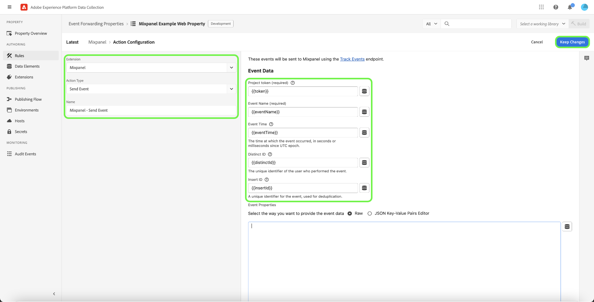

# Extension de transfert d’événement d’API [!DNL Mixpanel Track Events]

[[!DNL Mixpanel]](https://www.mixpanel.com) est un outil d’analyse de produit qui vous permet de capturer des données sur la manière dont les utilisateurs interagissent avec un produit numérique. Vous pouvez analyser les données des produits à l’aide de rapports simples et interactifs qui vous permettent d’interroger et de visualiser les données en quelques clics seulement. [!DNL Mixpanel] conçu pour rendre les équipes plus efficaces en permettant à chacun d’analyser les données utilisateur en temps réel afin d’identifier les tendances, de comprendre le comportement des utilisateurs et de prendre des décisions concernant votre produit.

[!DNL Mixpanel] utilise un modèle basé sur les événements et centré sur l’utilisateur qui connecte chaque interaction à un seul utilisateur. Le modèle de données [!DNL Mixpanel] repose sur les concepts d’utilisateurs, d’événements et de propriétés.

>[!NOTE]
>
>Reportez-vous à la documentation [!DNL Mixpanel] sur la [gestion des identités](https://help.mixpanel.com/hc/en-us/articles/360041039771-Getting-Started-with-Identity-Management) pour comprendre comment fusionne [!DNL Mixpanel] événements afin de créer des clusters d’identités. Il est également recommandé de consulter le document sur les [identifiants distincts](https://help.mixpanel.com/hc/en-us/articles/115004509426-Distinct-ID-Creation-JavaScript-iOS-Android-) pour comprendre comment ils sont utilisés pour identifier les utilisateurs dans les données d’événement.

## Cas d’utilisation

Cette extension doit être utilisée si vous souhaitez utiliser les données d’Edge Network en [!DNL Mixpanel] pour tirer parti de ses fonctionnalités d’analyse de produit.

Prenons l’exemple d’une organisation de vente au détail ayant une présence multicanale (site web et mobile). L’entreprise capture les entrées transactionnelles ou conversationnelles en tant que données d’événement de ses plateformes et les charge dans [!DNL Mixpanel] à l’aide de l’extension de transfert d’événement.

Les équipes d’analyse peuvent ensuite exploiter [!DNL Mixpanel's] fonctionnalités pour traiter les jeux de données et extraire les informations commerciales, qui peuvent être utilisées pour générer des graphiques, des tableaux de bord ou d’autres visualisations afin d’informer les parties prenantes de l’entreprise.

Pour plus d’informations sur les cas d’utilisation spécifiques à [!DNL Mixpanel], consultez la documentation suivante :

* [Débutant avec  [!DNL Mixpanel]](https://docs.mixpanel.com/docs)
* [Qu&#39;est-ce que  [!DNL Mixpanel] ?](https://developer.mixpanel.com/docs)
* [12 fonctionnalités  [!DNL Mixpanel] &#x200B;](https://mixpanel.com/blog/12-things-you-probably-didnt-know-you-could-do-with-mixpanel/)

## Conditions préalables de [!DNL Mixpanel] {#prerequisites-mixpanel}

Vous devez disposer d’un compte [!DNL Mixpanel] valide pour utiliser cette extension. Accédez à la [[!DNL Mixpanel] page d’enregistrement](https://mixpanel.com/register/) pour vous enregistrer et créer un compte si vous n’en avez pas déjà un.

Assurez-vous que le paramètre [[!DNL Identity Merge]](https://help.mixpanel.com/hc/en-us/articles/9648680824852-ID-Merge-Implementation-Best-Practices) est activé pour votre projet. Accédez à **[!DNL Settings]** > **[!DNL Project Setting]** > **[!DNL Identity Merge]** et activez/désactivez le paramètre.

### Comprendre les clusters d’identités dans [!DNL Mixpanel]

En [!DNL Mixpanel], un cluster d’identités contient un ensemble de valeurs `distinct_id` qui se connectent à un utilisateur individuel. [!DNL Mixpanel] gère le cluster d’identités de chaque utilisateur, résolvant un seul `distinct_id` canonique de chaque cluster à utiliser dans les rapports. Vous pouvez également inclure votre propre identifiant (appelé `distinct_id` local) pour les événements anonymes qui se produisent avant un événement d’identification de l’utilisateur.

[!DNL Mixpanel] résout les clusters d’identités par deux méthodes :

* **Identifier** : [!DNL Mixpanel] connecte l&#39;identifiant de votre choix à un `distinct_id` anonyme. Si le SDK [!DNL Mixpanel] est activé pour votre site web, Experience Platform utilisera le `distinct_id` affecté à l’utilisateur actuellement connecté.
* **Alias** : [!DNL Mixpanel] combine deux `distinct id` non anonymes si d’autres critères de fusion sont remplis.

>[!NOTE]
>
>Reportez-vous au document [!DNL Mixpanel] sur la [gestion des identités](https://help.mixpanel.com/hc/en-us/articles/360041039771-Getting-Started-with-Identity-Management#user-identification) pour plus d’informations sur ces méthodes.
>
>Vérifiez que vous avez activé la [[!DNL Mixpanel]  fonctionnalité de fusion d’identités &#x200B;](#prerequisites-mixpanel) pour vous assurer que les clusters d’identités sont résolus correctement.

### Collecter les détails de configuration requis {#configuration-details}

Pour connecter Experience Platform à [!DNL Mixpanel], vous devez disposer des entrées suivantes :

| Type de clé | Description | Exemple |
| --- | --- | --- |
| Jeton de projet | Jeton de projet associé à votre compte [!DNL Mixpanel]. Reportez-vous à la documentation [!DNL Mixpanel] sur la [recherche de votre jeton de projet](https://help.mixpanel.com/hc/en-us/articles/115004502806-Find-Project-Token-) pour obtenir des conseils. | `25470xxxxxxxxxxxxxxxxxxx1289` |

## Installation et configuration de l’extension [!DNL Mixpanel] {#install}

Pour installer l’extension, [créez une propriété de transfert d’événement](../../../ui/event-forwarding/overview.md#properties) ou choisissez plutôt une propriété existante à modifier.

Sélectionner **[!UICONTROL Extensions]** dans le volet de navigation de gauche. Dans l’onglet **[!UICONTROL Catalogue]**, sélectionnez **[!UICONTROL Installer]** sur la carte de l’extension [!DNL Mixpanel].

![Installation de l’extension [!DNL Mixpanel].](../../../images/extensions/server/mixpanel/install-extension.png)

## Créer une règle de [!DNL Send Event]

Commencez à créer une règle dans votre propriété de transfert d’événement. Sous **[!UICONTROL Actions]**, ajoutez une nouvelle action et définissez l’extension sur **[!UICONTROL Mixpanel]**. Définissez ensuite le type d’action sur **[!UICONTROL Suivi des événements]** pour envoyer des événements Edge Network à [!DNL Mixpanel].

| Entrée | Description | Obligatoire |
| --- | --- | --- |
| [!UICONTROL &#x200B; Jeton de projet &#x200B;] | Ce champ doit être mappé au jeton de projet associé à votre compte [!DNL Mixpanel]. | Oui |
| [!UICONTROL Type d’événement] | Nom de l’événement. | Oui |
| [!UICONTROL Heure de l’événement] | L’heure de l’événement. | |
| [!UICONTROL Identifiant Mixpanel distinct] | Identifiant unique de l’utilisateur qui a exécuté l’événement. | |
| [!UICONTROL Insérer un ID] | Identifiant unique de l’événement, utilisé pour la déduplication. | |
| [!UICONTROL Propriétés des événements] | Un objet JSON contenant les propriétés personnalisées de l’événement. Faites votre choix entre fournir du code JSON brut ou utiliser un ensemble simplifié d’entrées clé-valeur. | |

>[!NOTE]
>
>Pour plus d’informations sur les champs standard d’un événement [!DNL Mixpanel], consultez la [documentation officielle](https://developer.mixpanel.com/reference/import-events#event).

Une fois l’action [!UICONTROL Suivi des événements] ajoutée à la règle, vous pouvez configurer les conditions de la règle afin qu’elle ne se déclenche que pour certains événements, ou vous pouvez laisser la section Conditions vide pour que la règle se déclenche pour tous les événements.

>[!IMPORTANT]
>
>Si votre site web utilise [!DNL Mixpanel] SDK, vous pouvez passer à l’étape suivante de la [validation de vos données dans [!DNL Mixpanel]](#validate). Si vous n’utilisez pas [!DNL Mixpanel] SDK, vous devez [créer une règle de suivi des identités distincte](#create-an-identity-tracking-rule) pour vous assurer que les événements et les valeurs de `distinct_id` appropriés sont envoyés à [!DNL Mixpanel] lorsqu’un événement d’identification d’utilisateur se produit.

## Valider les données dans [!DNL Mixpanel] {#validate}

Si votre implémentation réussit et que des événements sont collectés, des événements s’affichent dans la [[!DNL Mixpanel] console](https://help.mixpanel.com/hc/en-us/articles/4402837164948).

Vérifiez si [!DNL Mixpanel] a fusionné les événements de post-connexion renseignés avec les valeurs d’e-mail et les événements créés lors de l’utilisation de **[!UICONTROL Événement d’envoi]**. Si elle est implémentée correctement, [!DNL Mixpanel] les associera à un seul [profil utilisateur](https://help.mixpanel.com/hc/en-us/articles/115004501966).

## Étapes suivantes

Ce guide explique comment envoyer des événements de conversion à [!DNL Mixpanel] à l’aide du transfert d’événement. Cette extension de transfert d’événement tire parti de l’API [!DNL Mixpanel] SDK et JavaScript. Pour plus d’informations sur ces technologies sous-jacentes, consultez la documentation officielle :

* [[!DNL Mixpanel] SDK](https://developer.mixpanel.com/docs/nodejs)
* [API [!DNL Mixpanel] JAVASCRIPT](https://developer.mixpanel.com/docs/javascript-full-api-reference#mixpanelidentify)

Pour plus d’informations sur les fonctionnalités de transfert d’événement d’Experience Platform, consultez la [présentation du transfert d’événement](../../../ui/event-forwarding/overview.md).
