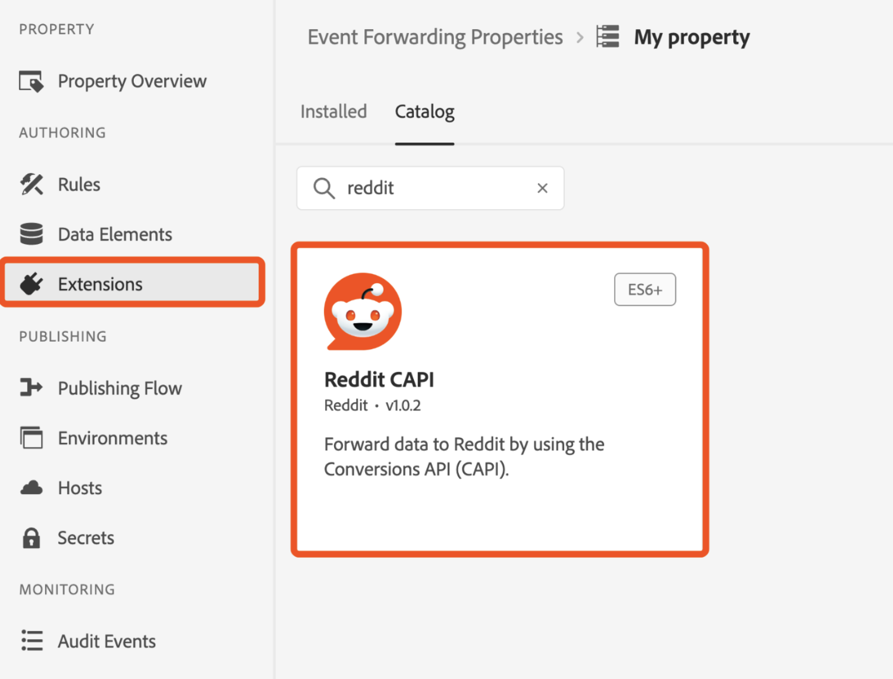

# Présentation de l’extension API [!DNL Reddit] Conversions

Reddit est une plateforme de médias sociaux avec une base d&#39;utilisateurs diversifiée, ce qui la rend idéale pour les annonceurs ciblant des audiences spécifiques.

Utilisez l’extension [[!DNL Reddit] API de conversions](https://ads-api.reddit.com/docs/v2/#tag/Conversions-API) pour envoyer à [!DNL Reddit Ads] les événements d’interaction utilisateur capturés dans l’Edge Network Adobe Experience Platform. Utilisez cette extension pour aider votre marque à atteindre une audience de plus de 379 millions d’utilisateurs actifs par semaine, et à mieux comprendre le comportement des utilisateurs et exécuter des publicités ciblées.

Lisez ce guide pour savoir comment installer, configurer et utiliser l’extension d’API [!DNL Reddit] Conversions dans vos [règles](https://experienceleague.adobe.com/fr/docs/experience-platform/tags/ui/rules) de transfert d’événement.

## Avantages clés {#benefits}

Utilisez l’extension d’API Reddit Conversions pour :

- **Touchez votre audience** : interagissez avec plus de 379 millions d’utilisateurs actifs par semaine sur [!DNL Reddit].
- **Analyser le comportement des utilisateurs** : utilisez les données d’interaction utilisateur pour comprendre le comportement et optimiser les campagnes.
- **Diffuser des annonces ciblées** : exécutez des annonces personnalisées en fonction des interactions utilisateur capturées dans Adobe Experience Platform.

## Prérequis {#prerequisites}

Vous devez disposer d’un compte Reddit Ads valide pour utiliser cette extension. Accédez à la [[!DNL Reddit Ads] page d’enregistrement](https://business.reddithelp.com/s/article/Create-and-manage-your-Reddit-Ads-account) pour vous enregistrer et créer un compte si vous n’en avez pas déjà un. Une fois votre compte configuré, [demandez l’accès à l’API Ads](https://www.redditforbusiness.com/api-partnership).

### Collecter les détails de configuration requis {#configuration-details}

Pour connecter Experience Platform à [!DNL Reddit], les entrées suivantes sont requises :

| Informations d’identification | Description | Exemple |
| --- | --- | --- |
| Identifiant du pixel | L’identifiant de pixel est un identifiant unique associé à votre compte [!DNL Reddit Ads]. Il est utilisé pour effectuer le suivi des interactions utilisateur et des événements de conversion sur votre site web ou application. Vous trouverez votre Pixel ID dans votre [!DNL Reddit Ads] [compte](https://ads.reddit.com/accounts). | 123456789012 |
| Jeton d’accès de conversion | Votre Jeton D’Accès À La Conversion [!DNL Reddit]. Reportez-vous au document [[!DNL Reddit] API de conversion](https://business.reddithelp.com/s/article/conversion-access-token) pour obtenir des conseils.   **Vous ne devez passer par ce processus qu’une seule fois, car ce jeton n’expire pas.** | {YOUR_REDDIT_BEARER_TOKEN} |

## Installation et configuration de l’extension [!DNL Reddit] {#install-configure}

Pour installer et configurer l’extension d’API [!DNL Reddit] Conversions, procédez comme suit :

1. Dans l’interface utilisateur de la collecte de données Experience Platform, sélectionnez [!UICONTROL Extensions] dans le volet de navigation de gauche pour accéder au catalogue [!UICONTROL Extensions]. Créez ensuite [une propriété de transfert d’événement](https://experienceleague.adobe.com/fr/docs/experience-platform/tags/event-forwarding/overview#properties) ou sélectionnez une propriété existante.
2. Accédez à **[!UICONTROL Extensions]** dans le panneau de navigation de gauche. Sélectionnez **[!UICONTROL Catalogue]** puis l’extension **[!DNL Reddit]**.
   
3. Fournissez les détails de configuration suivants :
   - **Pixel ID** : saisissez votre [!DNL Reddit Ads] Pixel ID.
   - **Jeton d’accès de conversion** : saisissez le jeton généré dans votre compte [!DNL Reddit Ads] et sélectionnez **[!UICONTROL Enregistrer]** lorsque vous avez terminé.

     

## Configurer une règle de transfert d’événement {#config-rule}

Une fois les éléments de données configurés, créez des règles de transfert d’événement pour déterminer quand et comment les événements sont envoyés à [!DNL Reddit Ads].

1. Accédez à **Règles** dans votre propriété de transfert d’événement et créez une [règle](https://experienceleague.adobe.com/fr/docs/experience-platform/tags/ui/rules).
2. Sous **Actions**, ajoutez une nouvelle action et définissez l’extension sur **[!DNL Reddit CAPI]**.
3. Définissez le **Type d’action** sur **Envoyer l’événement**.
   
4. Configurez les commandes supplémentaires pour votre événement, comme illustré dans le tableau ci-dessous :

   | Nom du champ | Description | Exemple |
   | --- | --- | --- |
   | `Event Name` | Spécifiez le nom de l’événement de conversion. | `Purchase` |
   | `Event Type` | Définissez le type d’événement qui peut être un [événement de conversion Reddit pris en charge](https://business.reddithelp.com/s/article/supported-conversion-events#supported-conversion-events) ou un événement personnalisé. | `SignUp`, `MyCustomEvent` |
   | `Timestamp` | Indiquez l’heure de l’événement au format ISO ou à l’heure Epoch. | `2025-04-15T16:01:00.000Z`, `1744742460000` |
   | `Client Dedupe ID` | Ajoutez un ID unique pour la déduplication. | `abc123` |
   | `Match Keys` | Incluez les identifiants d’utilisateur et d’appareil pour l’attribution. | `{"email":"hashed_email@example.com", "phone":"hashed_phone"}` |
   | `Value` | Spécifiez la valeur monétaire de l’événement. | `99.99` |
   | `Currency Code` | Utilisez le format ISO-4217 pour la devise. | `USD` |
   | `Units Sold` | Entrez la quantité d&#39;articles achetés. | `3` |
   | `Country Code` | Indiquez le pays où l’événement s’est produit. | `US` |
   | `Data Processing Options` | Ajoutez des indicateurs de confidentialité, tels que LDU (Limited Data Usage). | `{"modes":["LDU"],"country":"US","region":"US-NY"}` |
   | `Consent` | Indiquez le consentement de l’utilisateur pour l’utilisation des données publicitaires. | `true` |

5. Sélectionnez **Conserver les modifications** pour enregistrer la règle.

## Métadonnées d’événement {#event-metadata}

Lisez cette section pour obtenir une répartition détaillée des champs de métadonnées d’événement et de données utilisateur, afin de vous assurer de comprendre les paramètres obligatoires et facultatifs pour configurer vos événements. Les champs affichés peuvent varier en fonction du type d’événement sélectionné.

>[!NOTE]
>
>Pour obtenir les meilleurs résultats de vos événements de conversion, veillez à remplir tous les champs lors de la configuration des [annonces de produits dynamiques](https://business.reddithelp.com/s/article/dynamic-product-ads).

### Champs de métadonnées d’événement

| Nom du champ | Description | Exemple |
| --- | --- | --- |
| `Conversion ID` (obligatoire) | ID unique de l’événement de conversion, utilisé pour la déduplication. | `abc123` |
| `Item Count` | Nombre total d’éléments pour l’événement de conversion. | `6` |
| `Currency` | La devise de la valeur est fournie, au format [ISO-4217](https://www.iso.org/iso-4217-currency-codes.html). | `USD` |
| `Value` | Valeur monétaire totale de l’événement de conversion, décimales comprises. | `1.23` |
| `Products` | Un tableau JSON d’objets avec des détails sur les produits associés à l’événement. Chaque objet doit inclure un `id` au minimum. | `[{"id":"SKU123","name":"ProductName","category":"CategoryName"},{"id":"SKU456","name":"ProductName","category":"CategoryName"}]` |

### Champs de données utilisateur

Les paramètres suivants sont facultatifs, mais recommandés :

| Nom du champ | Description | Exemple |
| --- | --- | --- |
| `Email` (fortement recommandé) | E-mail utilisateur haché ou non haché. | `example@email.com` |
| `External ID` | Identifiant utilisateur attribué par l’annonceur haché ou non haché. | `customer12345` |
| `UUID` (fortement recommandé) | Identifiant généré par Reddit Pixel sur votre site web. | `1677712978045.b8f7eb7d-b357-437b-8bd3-e1c8166c7132` |
| `IP Address` (fortement recommandé) | Adresse IP de l’appareil de l’utilisateur. | `192.168.0.1` |
| `User Agent` (fortement recommandé) | Navigateur ou application utilisé par l’utilisateur ou l’utilisatrice. | `Chrome/98.0.4758.102` |
| `IDFA` | Identifiant Apple haché ou non haché pour les annonceurs. | `8A2E4F6D-0852-4B2A-B9D5-79334DE14B16` |
| `AAID` | Identifiant Android Advertising haché ou non haché. | `38400000-8cf0-11bd-b23e-10b96e40000d` |
| `Screen Width` | Largeur d’affichage de l’utilisateur. | `1920` |
| `Screen Height` | Hauteur d’affichage de l’utilisateur. | `1080` |
| `Data Processing Options` (format JSON) | Paramètres de confidentialité de l’utilisateur. Ne prend en charge que l’UDL (utilisation limitée des données). | `{"modes":["LDU"],"country":"US","region":"US-NY"}` |

### Considérations importantes

Avant d’envoyer des données à [!DNL Reddit Ads], l’extension hache et normalise les valeurs des champs suivants : `Email`, `External ID`, `IDFA` et `AAID`. L’extension ne hache pas à nouveau ces valeurs si elles ont déjà été hachées en [!DNL SHA-256].

## Validation et déploiement {#validate-deploy}

Après avoir configuré l’extension et les règles, validez l’intégration en vérifiant les données d’événement dans le [[!DNL Reddit Ads] Gestionnaire d’événements](https://business.reddithelp.com/s/article/Events-Manager). Utilisez le [Match Quality Score (MQS)](https://business.reddithelp.com/s/article/match-quality-score) pour évaluer la précision et la fiabilité de vos intégrations de signaux.

Pour plus d’informations sur les [!DNL Reddit Ads], consultez la [documentation sur les publicités Reddit](https://ads.reddit.com/).

## Étapes suivantes {#next-steps}

Vous êtes arrivé au bout de ce document. À présent, vous devez comprendre comment configurer et utiliser l’extension d’API de conversions [!DNL Reddit]. Pour plus d’informations sur les fonctionnalités de transfert d’événement de Adobe Experience Platform, consultez la [présentation du transfert d’événement](../../../ui/event-forwarding/overview.md) ou les ressources suivantes :

- [Partager des clés de correspondance](https://business.reddithelp.com/s/article/about-attribution-matching-signals) et [métadonnées d’événement](https://business.reddithelp.com/s/article/about-event-metadata) : découvrez comment partager efficacement des clés de correspondance et des métadonnées d’événement.
- [Dédupliquer les événements](https://business.reddithelp.com/s/article/event-deduplication) : assurez le suivi précis des événements en dédupliquant les événements.
- [Créer un jeton d’accès de conversion](https://business.reddithelp.com/helpcenter/s/article/conversion-access-token) : suivez les étapes de création d’un jeton d’accès de conversion pour une authentification API sécurisée.
