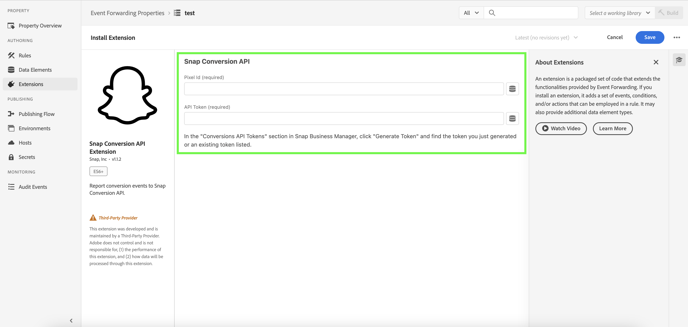

# Présentation de l’extension d’API de conversions [!DNL Snapchat]

L’extension [!DNL Snap] de l’API de conversion est une interface sécurisée du serveur [Edge Network ](/help/server-api/overview.md) qui vous permet de partager des informations avec [!DNL Snapchat] directement sur les actions des utilisateurs sur vos sites web. Vous pouvez tirer parti des règles de transfert d’événement pour envoyer des données du **[!DNL Adobe Experience Platform Edge Network]** à **[!DNL Snapchat]** à l’aide de l’extension d’API de conversion **[!DNL Snap]**.

## Conditions préalables de [!DNL Snapchat] {#prerequisites}

Pour utiliser l’API [!DNL Snapchat] Conversions, vous devez disposer d’une propriété [ Transfert d’événement ](https://experienceleague.adobe.com/en/docs/experience-platform/tags/event-forwarding/getting-started) configurée dans le Adobe Experience Platform et des [ autorisations requises ](https://experienceleague.adobe.com/en/docs/experience-platform/collection/permissions) pour modifier la propriété.

Créez un [flux de données](/help/tags/ui/event-forwarding/getting-started.md) et ajoutez-y le [service de transfert d’événement](/help/tags/ui/event-forwarding/getting-started#enable-event-forwarding).

Un compte **[!DNL Snapchat]** [Business Manager](https://business.snapchat.com/) est requis pour utiliser l’API Conversions. Business Manager aide les annonceurs à intégrer les efforts marketing de **[!DNL Snapchat]** dans leur entreprise et avec des partenaires externes. Consultez l’article **[!DNL Snapchat]** [centre d’aide](https://businesshelp.snapchat.com/s/article/get-started?language=en_US) sur la création d’un compte Business Manager si vous n’en avez pas.

Un **[!DNL Snap Pixel]** (https://businesshelp.snapchat.com/s/article/pixel-website-install?language=en_US) doit être configuré dans le gestionnaire de publicités Snapchat et vous devez avoir accès à l’affichage du `Pixel ID`. Le `Pixel ID` se trouve dans la section **[!UICONTROL Gestionnaire d’événements]**(https://businesshelp.snapchat.com/s/article/events-manager?language=en_US).

Vous avez besoin d’un jeton API statique de longue durée. Pour obtenir ce jeton, consultez la [[!DNL Snapchat] documentation de l’API de conversion](https://developers.snap.com/api/marketing-api/Conversions-API/GetStarted#access-token).

## Installer et configurer l’extension d’API d’événements web [!DNL Snapchat] {#install}

Pour installer l’extension, accédez à **[!UICONTROL Collecte de données]**>**[!UICONTROL Transfert d’événement]**. Sélectionnez la propriété où vous souhaitez installer l’extension.

Une fois la propriété souhaitée sélectionnée, procédez comme suit :

1. Dans le panneau de navigation de gauche, sélectionnez **[!UICONTROL Extensions]**.
2. Recherchez l’extension **[!UICONTROL Snap Conversion API Extension]** et sélectionnez **[!UICONTROL Installer]**.

   .

3. Dans l’écran de configuration, saisissez les valeurs suivantes :

* **[!UICONTROL Pixel Id]**
* **[!UICONTROL Jeton API]**

Lorsque vous avez terminé, sélectionnez **[!UICONTROL Enregistrer]**.

.
<!-- 
![[!DNL Snap] configuration screen for the [!DNL Snap] conversion API extension.](../../../images/extensions/server/snap/configure.png) -->

## Création d’éléments de données {#create-data-elements}

Pour transmettre des points de données en tant que paramètres à l’extension de l’API Conversions [!DNL Snapchat], vous devez créer des [éléments de données](https://experienceleague.adobe.com/en/docs/platform-learn/implement-web-sdk/event-forwarding/setup-event-forwarding#create-an-event-forwarding-data-element) pour chaque point de données. Procédez comme suit :

1. Accédez à **[!UICONTROL Création]**>**[!UICONTROL Éléments de données]** dans l’écran **[!UICONTROL Informations sur la propriété]** de votre propriété, puis sélectionnez **[!UICONTROL Ajouter un élément de données]**.

   .

2. Saisissez un nom pour l’élément de données.

3. Sélectionnez **[!UICONTROL Core]** comme extension et **[!UICONTROL Path]** comme type d’élément de données.

4. Dans le menu déroulant, sélectionnez l’élément approprié, puis renseignez le champ [!UICONTROL Chemin] dans le panneau de droite pour référencer les données de votre choix dans le schéma.

   .

Par exemple, si vous créez un élément de données qui fait référence à `snapClickId` dans le schéma illustré ci-dessous :

.

Vous devez configurer l’élément de données car `snapClickId` se trouve sous `_snap.inc.exchange` dans le schéma XDM.

.

Consultez la [documentation des propriétés de transfert d’événement](/help/tags/ui/event-forwarding/overview#data-elements.md) pour plus d’informations sur la création d’éléments de données.

## Créer des règles pour envoyer des événements de conversion à accrocher {#create-snap-rules}

Les [règles](https://experienceleague.adobe.com/en/docs/platform-learn/implement-web-sdk/event-forwarding/setup-event-forwarding#create-an-event-forwarding-rule) sont utilisées pour déclencher des extensions dans Platform. Cette section explique comment créer des règles dans votre propriété de transfert d’événement pour envoyer des événements de conversion à Snap à l’aide de l’extension de l’API Conversions.

### Créer une règle

1. Accédez à votre propriété de transfert d’événement et sélectionnez **[!UICONTROL Règles]** dans le menu Création. Cliquez ensuite sur **[!UICONTROL Créer une règle]**.

   .

2. Nommez la règle et configurez une condition pour déclencher l’événement Snap. Par exemple, pour envoyer un événement `PURCHASE` chaque fois qu&#39;un événement inclut un numéro de commande, définissez une condition afin de vérifier si l&#39;interaction de l&#39;utilisateur contient un numéro de commande fournisseur valide.

   .

3. Après avoir enregistré la condition, ajoutez une action pour déclencher l’API de conversion Snap. Dans le panneau de gauche :

   * Définissez le menu déroulant [!UICONTROL Extension] sur [!UICONTROL Extension de l’API Snap Conversions].

   * Définissez le menu déroulant [!UICONTROL Type d’action] sur [!UICONTROL Signaler les conversions web].

   * Nommez la règle en conséquence.

   .

4. Configurez les [valeurs de paramètre CAPI](https://developers.snap.com/api/marketing-api/Conversions-API/Parameters) à envoyer pour l’événement dans la section **[!UICONTROL Liaisons de données]** du panneau de droite. Les champs de l’extension sont mappés aux paramètres CAPI comme illustré ci-dessous. Pour plus d’informations sur chaque paramètre, consultez la [documentation de l’API de conversions Snapchat](https://developers.snap.com/api/marketing-api/Conversions-API/Parameters).

| Champ de liaison de données | Paramètre Snap CAPI |
| --- | --- |
| Type d’événement (obligatoire) | `event_name` |
| E-mail | `em` |
| Numéro de téléphone | `ph` |
| Agent utilisateur | `client_user_agent` |
| Adresse IP | `client_ip_address` |
| Clic sur l’ID | `sc_click_id` |
| Cookie1 | `so_cookie1` |
| Prénom | `fn` |
| Nom | `ln` |
| Genre | `ge` |
| Ville | `ph` |
| State (État) | `st` |
| Zip (Code postal) | `zp` |
| Pays | `country` |
| ID externe | `external_id` |
| Identifiant du partenaire | `partner_id` |
| ID d’abonnement | `subscription_id` |
| ID de lead | `lead_id` |
| Article ou catégorie | `content_category` |
| Nom du contenu | `content_ids` |
| Type de contenu | `content_name` |
| Contenus | `contents` |
| Description | `description` |
| Balise d’événement | `event_tag` |
| Nombre d’éléments | `num_items` |
| Price | `value` |
| Devise | `currency` |
| Identifiant de transaction | `order_id` (également envoyé pour `event_id` à la place de `client dedup idD`) |
| LTV prédite | `predicted_ltv` |
| Chaîne de recherche | `search_string` |
| Méthode d’inscription | `sign_up_method` |
| Identifiant de déduplication client | `event_id` |
| Utilisation limitée des données | `data_processing_options` |
| URL de la page | `event_source_url` |

### Champs obligatoires et facultatifs

* Champs obligatoires :

   * Tous les événements auront `event_source` définis sur `WEB`.

   * Au moins l’un des champs ou combinaisons suivants est requis pour la correspondance :

      * E-mail
      * Numéro de téléphone
      * Adresse IP et agent utilisateur

**Remarques complémentaires :**

* Pour les événements `Purchase`, les champs `Currency` et `Price` sont obligatoires.

* L’activation de la case à cocher **[!UICONTROL Mode test]** envoie les événements sous la forme d’événements de test, qui apparaissent dans l’outil d’événement de test au lieu du compte rendu des performances standard. Voir cet article [centre d’aide aux entreprises](https://businesshelp.snapchat.com/s/article/capi-event-testing?language=en_US#:~:text=Snap&#39;s%20Conversions%20API%20(CAPI)%20Test,being%20processed%20as%20production%20results.) pour plus d’informations.

* Le paramètre `contents` doit être une chaîne JSON contenant au moins l’un des champs suivants :

   * `id`
   * `item_category`
   * `brand`
   * `delivery_category`
   * `item_price`
   * `quantity`

Exemple :

```json
{
  "id": "id1",
  "brand": "brand1",
  "delivery_category": "c1",
  "item_price": 2.00,
  "quantity": 2
}
```

Pour utiliser la [valeur des conversions personnalisées et le compte rendu des performances des retour sur dépenses publicitaires](https://businesshelp.snapchat.com/s/article/custom-conversions-value-roas?language=en_US), incluez les paramètres pertinents dans le champ `contents`. Par exemple, `brand`, `item_price`, `id`.

Exemple de configuration pour un événement `Purchase` :

[Image montrant les liaisons de données.](../../../images/extensions/server/snap/data_bindings.png)

Les champs facultatifs peuvent être définis comme illustré ci-dessous :

[Image montrant les champs facultatifs.](../../../images/extensions/server/snap/optional_fields.png)

Une fois que vous avez défini le nom, la condition et l’action de la règle comme décrit ci-dessus, enregistrez la règle et assurez-vous qu’elle est activée.

[Image illustrant la règle activée .](../../../images/extensions/server/snap/enabled_rule.png)

Vous pouvez maintenant publier ces modifications dans votre propriété. Pour plus d’informations, consultez la documentation sur le [flux de publication](https://experienceleague.adobe.com/en/docs/experience-platform/tags/publish/overview).

## Résolution des problèmes {#troubleshoot}

Pour résoudre les problèmes et optimiser votre configuration, consultez les [recommandations relatives au score de qualité de l’événement](https://businesshelp.snapchat.com/s/article/event-quality-score) afin de vous assurer que vos événements atteignent les taux de correspondance et les résultats de performance les plus élevés possible.

Si vous rencontrez des problèmes avec votre **score de qualité de l’événement**, découvrez nos recommandations pour l’améliorer [ici](https://businesshelp.snapchat.com/s/article/esq-issues-recommendations?language=en_US).

## Étapes suivantes {#next-steps}

Ce guide explique comment envoyer des données d’événement côté serveur à **[!DNL Snap]** à l’aide de l’extension **[!DNL Snap Conversions API]**. Pour plus d’informations sur les fonctionnalités de transfert d’événement dans Platform, reportez-vous à la section [Présentation du transfert d’événement](../../../ui/event-forwarding/overview.md).
