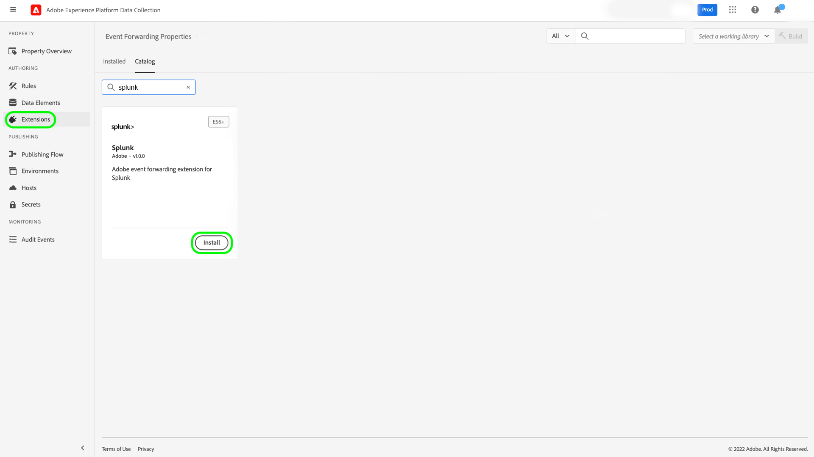
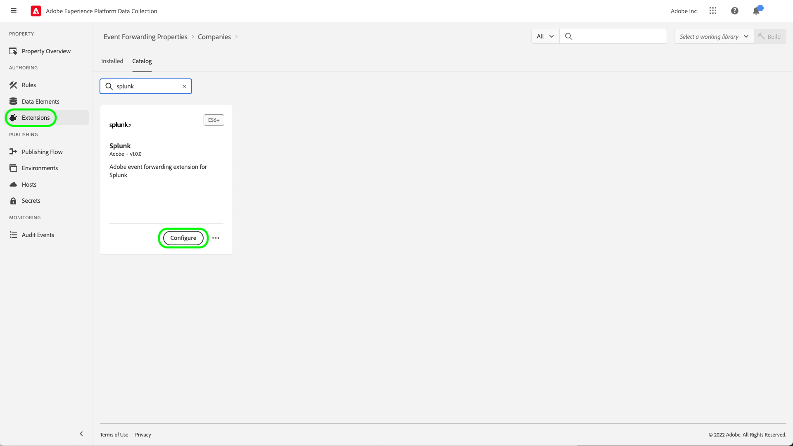
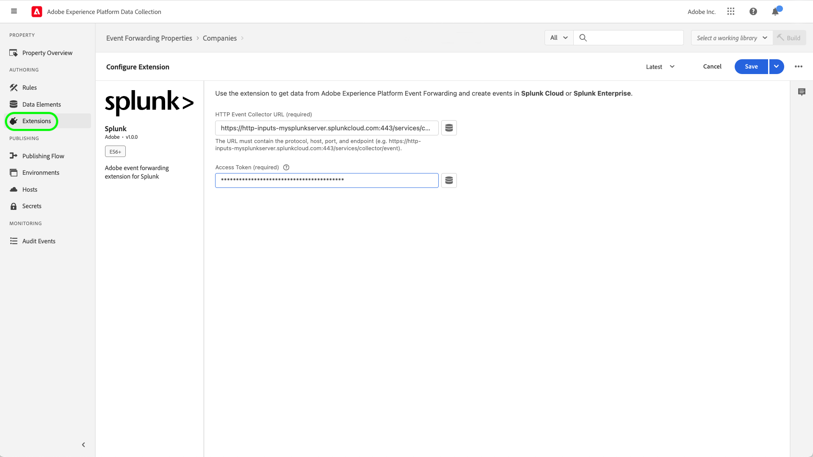
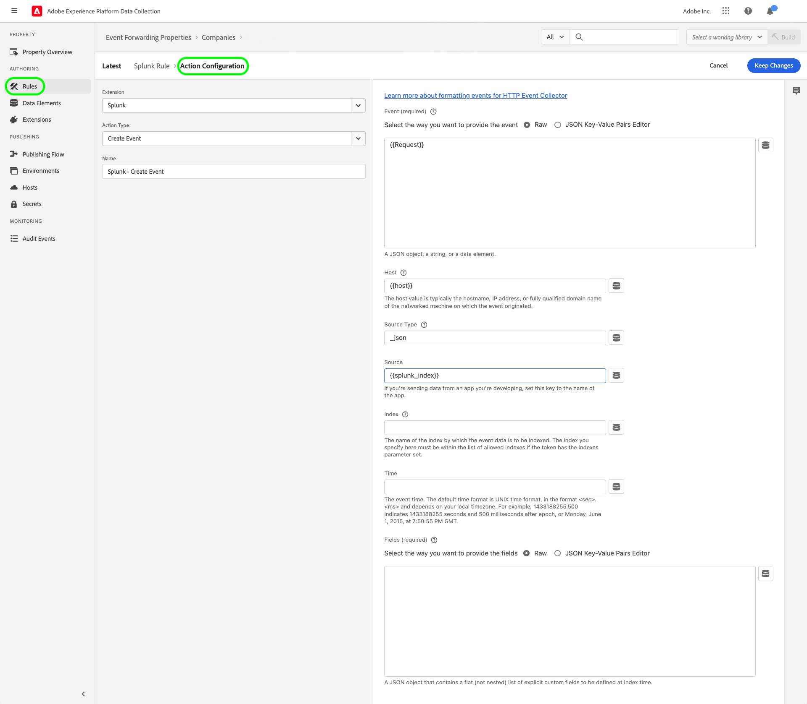
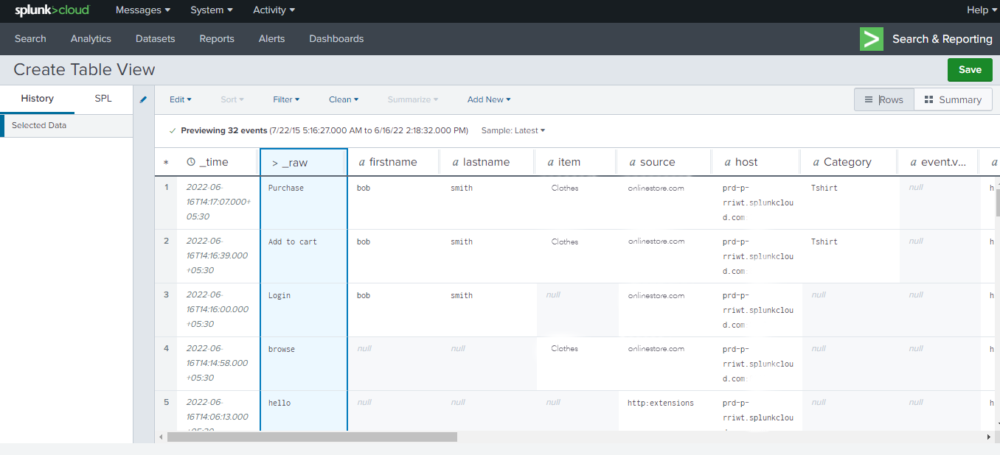

# Présentation de l’extension Splunk

[Splunk](https://www.splunk.com/fr_fr) est une plateforme de contrôle qui fournit des fonctions de recherche, d’analyse et de visualisation pour obtenir des informations sur vos données. Le [transfert d’événement](../../../ui/event-forwarding/overview.md) Splunk tire parti de l’[API REST du collecteur d’événements HTTP Splunk](https://docs.splunk.com/Documentation/Splunk/8.2.5/Data/HECRESTendpoints) pour envoyer des événements d’Adobe Experience Platform Edge Network vers le [collecteur d’événements HTTP Splunk](https://docs.splunk.com/Documentation/Splunk/8.2.5/Data/UsetheHTTPEventCollector).

Splunk utilise des jetons porteur comme mécanisme d’authentification pour communiquer avec l’API collecteur d’événements Splunk.

## Cas d’utilisation {#use-cases}

Les équipes marketing peuvent utiliser l’extension pour les cas d’utilisation suivants :

| Cas d’utilisation | Description |
| --- | --- |
| Analyse du comportement des clients | Les organiations peuvent capturer les données d’événement d’interaction client de leur site web et transférer les événements pertinents vers Splunk. Les équipes de marketing et d’analyse peuvent alors effectuer des analyses ultérieures sur la plateforme Splunk afin de comprendre les interactions et les comportements clés des utilisateurs. La plateforme Splunk peut être utilisée pour générer des graphiques, des tableaux de bord ou d’autres visualisations afin d’informer les parties prenantes de l’entreprise. |
| Recherche évolutive sur des jeux de données volumineux | Les entreprises peuvent capturer des entrées transactionnelles ou conversationnelles comme données d’événement du site web et transférer des événements vers Splunk. Les équipes d’Analytics peuvent ensuite tirer parti des fonctionnalités d’indexation évolutive de Splunk pour filtrer et traiter les jeux de données volumineux afin d’obtenir des informations sur l’entreprise et prendre des décisions éclairées. |

{style="table-layout:auto"}

## Conditions préalables {#prerequisites}

Vous devez disposer d’un compte Splunk pour pouvoir utiliser cette extension. Vous pouvez créer un compte Splunk sur la [page d’accueil de Splunk](https://www.splunk.com/fr_fr/page/sign_up).

>[!NOTE]
>
> L’extension Splunk prend en charge les instances d’entreprise Splunk et Splunk Cloud. Ce guide présente une implémentation utilisant [Splunk Cloud](https://www.splunk.com/fr_fr/products/splunk-cloud-platform.html) comme référence. Le processus de configuration pour [Splunk Enterprise](https://www.splunk.com/fr_fr/products/splunk-enterprise.html) est similaire, mais nécessite des conseils spécifiques de la part de votre administrateur Splunk Enterprise.

Pour configurer l’extension, vous devez également disposer des valeurs techniques suivantes :

* Un [jeton de collecteur d’événements](https://docs.splunk.com/Documentation/Splunk/8.2.5/Data/UsetheHTTPEventCollector#Create_an_Event_Collector_token_on_Splunk_Cloud_Platform). Les jetons sont généralement au format UUIDv4, comme celui-ci : `12345678-1234-1234-1234-1234567890AB`.
* L’adresse et port de l’instance de plateforme Splunk pour votre organisation. L’adresse et le port d’une instance de plateforme adoptent généralement le format suivant : `mysplunkserver.example.com:443`.

  >[!IMPORTANT]
  >
  > Les points d’entrée Splunk référencés dans le transfert d’événement ne doivent utiliser que le port `443`. Les ports non standard ne sont actuellement pas pris en charge dans les implémentations de transfert d’événement.

## Installer l’extension Splunk {#install}

Pour installer l’extension collecteur d’événements Splunk dans l’interface utilisateur, accédez à **Transfert d’événement** et sélectionnez une propriété à laquelle ajouter l’extension, ou créez-en une nouvelle.

Une fois que vous avez sélectionné ou créé la propriété souhaitée, accédez à **Extensions** > **Catalogue**. Recherchez « [!DNL Splunk] », puis sélectionnez **[!DNL Install]** sur l’extension Splunk.

## Configurer l’extension Splunk {#configure_extension}

>[!IMPORTANT]
>
>En fonction de vos besoins d’implémentation, vous devrez peut-être créer un schéma, des éléments de données et un jeu de données avant de configurer l’extension. Avant de commencer, consultez toutes les étapes de configuration afin de déterminer les entités à configurer pour votre cas d’utilisation.

Sélectionner **Extensions** dans le volet de navigation de gauche. Sous **Installé**, sélectionnez **Configurer** sur l’extension Splunk.

Pour **[!UICONTROL URL du collecteur d’événements HTTP]**, saisissez l’adresse et le port de votre instance de plateforme Splunk. Sous **[!UICONTROL Jeton d’accès]**, saisissez votre valeur [!DNL Event Collector Token]. Lorsque vous avez terminé, sélectionnez **[!UICONTROL Enregistrer]**.

## Configurer une règle de transfert d’événement {#config_rule}

Commencez à créer une [règle](../../../ui/managing-resources/rules.md) de transfert d’événement et configurez ses conditions selon vos besoins. Lors de la sélection des actions de la règle, cliquez sur l’extension [!UICONTROL Splunk], puis sélectionnez le type d’action [!UICONTROL Créer un événement]. D’autres commandes s’affichent pour configurer davantage l’événement Splunk.

L’étape suivante consiste à mapper les propriétés d’événement Splunk vers les éléments de données que vous avez précédemment créés. Les mappages facultatifs pris en charge en fonction des données d’événement d’entrée et pouvant être configurés sont présentés ci-dessous. Reportez-vous à la [documentation de Splunk](https://docs.splunk.com/Documentation/Splunk/8.2.5/Data/FormateventsforHTTPEventCollector#Event_metadata) pour plus de détails.

| Nom du champ | Description |
| --- | --- |
| [!UICONTROL Event ]  **(REQUIRED)** | Indiquez comment vous souhaitez fournir les données d’événement. Les données d’événement peuvent être affectées à la clé `event` de l’objet JSON dans la requête HTTP, ou il peut s’agir de texte brut. La clé `event` se trouve au même niveau du paquet d’événement JSON que les clés de métadonnées. Dans les accolades clé-valeur `event`, les données peuvent se trouver sous n’importe quel formulaire dont vous avez besoin (chaîne, nombre, autre objet JSON, etc.). |
| [!UICONTROL Hôte] | Le nom d’hôte du client à partir duquel vous envoyez des données. |
| [!UICONTROL Type ] | Le type de source à affecter aux données d’événement. |
| [!UICONTROL Source] | La valeur source à affecter aux données d’événement. Par exemple, si vous envoyez des données à partir d’une application que vous développez, définissez cette clé sur le nom de l’application. |
| [!UICONTROL Index ] | Le nom de l’index des données d’événement. L’index que vous spécifiez ici doit figurer dans la liste des index autorisés si le paramètre d’index est défini pour le jeton. |
| [!UICONTROL Heure] | L’heure de l’événement. Le format d’heure par défaut est en temps UNIX (au format `<sec>.<ms>`) et dépend du fuseau horaire local. Par exemple, `1433188255.500` indique 1433188255 secondes et 500 millisecondes après l’époque Unix, ou lundi 1er juin 2015 à 19:50:55 GMT. |
| [!UICONTROL Champs] | Spécifiez un objet JSON brut ou un ensemble de paires clé-valeur contenant des champs personnalisés explicites à définir au moment de l’index.  La clé `fields` ne s’applique pas aux données brutes.  Les requêtes contenant les propriétés `fields` doivent être envoyées au point d’entrée `/collector/event`, ou ils ne seront pas indexés. Pour plus d’informations, voir la documentation Splunk sur [extraction de champs indexés](https://docs.splunk.com/Documentation/Splunk/8.2.5/Data/IFXandHEC). |

### Valider des données dans Splunk {#validate}

Après avoir créé et exécuté la règle de transfert d’événement, vérifiez si l’événement envoyé à l’API Splunk s’affiche comme prévu dans l’interface utilisateur de Splunk. Si la collecte d’événements et l’intégration de l’Experience Platform ont été effectuées avec succès, des événements s’afficheront dans la console Splunk comme suit :

## Étapes suivantes

Ce document explique comment installer et configurer l’extension de transfert d’événement Splunk dans l’interface utilisateur. Pour plus d’informations sur la collecte de données d’événement dans Splunk, consultez la documentation officielle :

* [Configurer et utiliser le collecteur d’événements HTTP dans Splunk Web](https://docs.splunk.com/Documentation/Splunk/8.2.5/Data/UsetheHTTPEventCollector)
* [Configurer l’authentification avec des jetons](https://docs.splunk.com/Documentation/Splunk/8.2.5/Security/Setupauthenticationwithtokens#Prerequisites_for_activating_tokens)
* [Dépannage du collecteur d’événements HTTP](https://docs.splunk.com/Documentation/Splunk/8.2.5/Data/TroubleshootHTTPEventCollector) (répertorie également un compendium de [codes d’erreur possibles](https://docs.splunk.com/Documentation/Splunk/8.2.5/Data/TroubleshootHTTPEventCollector#Possible_error_codes))
