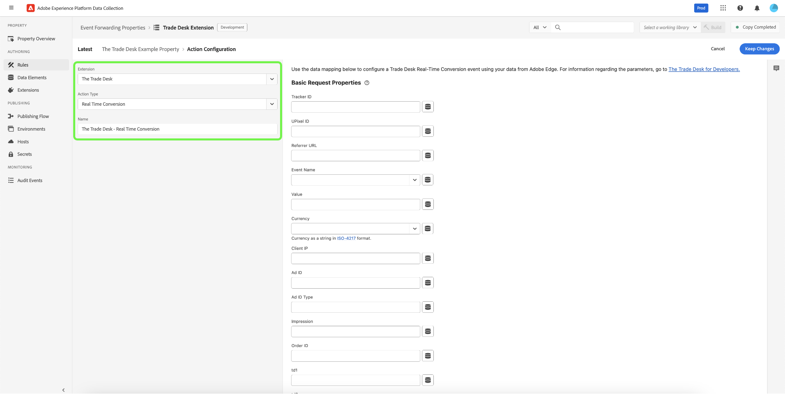

# Présentation de l’extension [!DNL The Trade Desk Real-Time Conversions API]

Vous pouvez utiliser l’extension [[!DNL The Trade Desk Real-Time Conversions API]](https://partner.thetradedesk.com/v3/portal/data/doc/DataConversionEventsApi) pour envoyer des données depuis Adobe Experience Platform Edge Network vers [!DNL The Trade Desk] en utilisant les fonctionnalités de l’API dans vos règles de [transfert d’événement](../../../ui/event-forwarding/overview.md).

En utilisant [!DNL The Trade Desk Real-Time Conversions API] extension, vous pouvez tirer parti des fonctionnalités de l’API dans vos règles [transfert d’événement](../../../ui/event-forwarding/overview.md) pour envoyer des données aux [!DNL The Trade Desk] à partir de l’Edge Network Adobe Experience Platform.

Lisez ce document pour savoir comment installer l’extension et utiliser ses fonctionnalités dans une [règle](../../../ui/managing-resources/rules.md) de transfert d’événement.

>[!NOTE]
>
>Cette extension et cette page de documentation sont gérées par [!DNL The Trade Desk] équipe. Pour toute demande ou information, contactez directement l&#39;équipe.

## Conditions préalables {#prerequisites}

Pour configurer le [[!DNL The Trade Desk Real-Time Conversions API]](https://partner.thetradedesk.com/v3/portal/data/doc/DataConversionEventsApi), vous devez disposer d’un ID publicitaire, d’un ID UPixel et d’un ID de suivi appropriés issus de votre compte [!DNL The Trade Desk].

>[!INFO]
>
>Si vous êtes un marchand, vous devrez également obtenir votre carte d&#39;identité de marchand.

## Installation et configuration de l’API [!DNL The Trade Desk] Real-Time Conversions {#install}

Pour installer l’extension, [créez une propriété de transfert d’événement](../../../ui/event-forwarding/overview.md#properties) ou sélectionnez une propriété existante à modifier à la place.

Sélectionner **[!UICONTROL Extensions]** dans le volet de navigation de gauche. Dans l’onglet **[!UICONTROL Catalogue]**, sélectionnez la vignette d’API **[!UICONTROL The Trade Desk]** Real-Time Conversions, puis sélectionnez **[!UICONTROL Installer]**.

![Catalogue d’extensions affichant la carte d’extension [!DNL The Trade Desk] mettant en surbrillance install.](../../../images/extensions/server/tradedesk/install-extension.png)

Dans l’écran suivant, saisissez le [!UICONTROL ID publicitaire] et éventuellement un [!UICONTROL ID commerçant]. Vous pouvez coller les identifiants directement dans ces entrées ou utiliser un élément de données à la place. Ils serviront de valeurs par défaut utilisées lors de l’appel d’un événement à [!DNL The Trade Desk]’API Real-Time Conversions. Lorsque vous avez terminé, cliquez sur **[!UICONTROL Enregistrer]**.

Pour découvrir comment créer des éléments de données et les rendre disponibles pour les extensions dans votre propriété de balise, suivez le tutoriel [Créer des éléments de données](https://experienceleague.adobe.com/fr/docs/platform-learn/data-collection/tags/create-data-elements).

![Page de configuration de l’extension [!DNL The Trade Desk] avec les champs [!UICONTROL ID publicitaire] et [!UICONTROL ID de commerçant] en surbrillance.](../../../images/extensions/server/tradedesk/configure-extension.png)

L’extension est installée et vous pouvez désormais utiliser ses fonctionnalités dans vos règles de transfert d’événement.

## Configurer une règle de transfert d’événement {#rule}

Une fois que vous avez installé et configuré l’extension, vous pouvez commencer à créer des règles de transfert d’événement qui déterminent comment et quand vos événements seront envoyés à [!DNL The Trade Desk].

Vous devez envisager de configurer plusieurs règles afin d’envoyer toutes les [propriétés de requête](https://partner.thetradedesk.com/v3/portal/data/doc/DataConversionEventsApi#properties) acceptées via [!DNL The Trade Desk] et [!DNL The Trade Desk]’API Real-Time Conversions.

>[!NOTE]
>
>Les événements doivent être envoyés en temps réel ou aussi près que possible du temps réel.

Créez une [règle](../../../ui/managing-resources/rules.md) de transfert d’événement dans votre propriété de transfert d’événement. Sous **[!UICONTROL Actions]**, ajoutez une nouvelle action et définissez l’extension sur **[!UICONTROL The Trade Desk]**. Sélectionnez ensuite **[!UICONTROL Conversion en temps réel]** pour le **[!UICONTROL Type d’action]**.

Une fois la sélection effectuée, des commandes supplémentaires apparaissent pour configurer plus en détail les données d’événement qui seront envoyées à [!DNL The Trade Desk]. Sélectionnez **[!UICONTROL Conserver les modifications]** pour enregistrer la règle.

Les options de configuration sont divisées en trois sections principales, comme indiqué ci-dessous :

**[!UICONTROL Propriétés de requête de base]**

| Entrée | Description |
| --- | --- |
| Identifiant du dispositif de suivi | Identifiant de plateforme du dispositif de suivi d’événement. |
| ID UPixel | Identifiant universel en pixels pour l’événement. |
| URL du référent | URL du site web à partir duquel l’événement s’est produit, le cas échéant. |
| Nom de l’événement | Type d’événement défini par la plateforme du partenaire. |
| Valeur | Valeur de suivi des recettes dans une chaîne décimale (par exemple, « 19,98 »). |
| Devise | Code de devise au format ISO. |
| IP du client | Adresse IP du client IPv4 ou IPv6. |
| Identifiant de publicité | ID publicitaire unique pour l’événement. |
| Type d’ID d’annonce | Type de l’ID de publicité, spécifié dans la propriété ID de publicité : TDID, IDFA, AAID, DAID, NAID, IDL, EUID ou UID2. |
| Impression | Chaîne de 36 caractères (tirets inclus) qui sert d’identifiant unique pour l’impression à laquelle l’événement est attribué. |
| ID de commande | Identifiant de commande associé de l’événement. |
| td1-td10 | Dix propriétés dynamiques personnalisées numérotées séquentiellement qui peuvent être utilisées pour fournir des métadonnées de conversion supplémentaires. |

{style="table-layout:auto"}

![Section [!DNL Basic Request Properties] présentant un exemple de saisie de données dans les champs.](../../../images/extensions/server/tradedesk/configure-extension-basic-request-properties.png)

Reportez-vous à la documentation du développeur [!DNL The Trade Desk] pour plus d’informations sur les [propriétés de requête](https://partner.thetradedesk.com/v3/portal/data/doc/DataConversionEventsApi#properties) acceptées par [!DNL The Trade Desk]’API Real-Time Conversions.

**[!UICONTROL Paramètres de demande d’objet]**

Un objet JSON contenant plus d’informations. Vous avez la possibilité d’utiliser un ensemble réduit d’entrées clé-valeur ou de fournir du code JSON brut. De plus, vous pouvez récupérer les données dynamiques d’un élément de données en sélectionnant les disques () sur la droite.

![Section [!DNL Object Request Parameters] présentant les champs disponibles.](../../../images/extensions/server/tradedesk/configure-object-request-params.png)

Reportez-vous à la documentation [Événement de conversion en temps réel](https://partner.thetradedesk.com/v3/portal/data/doc/DataConversionEventsApi#properties-items) pour plus d’informations sur [!UICONTROL Paramètres de requête d’objet] et leurs propriétés.

**[!UICONTROL Remplacements de configuration]**

>[!NOTE]
>
>Les champs [!UICONTROL Remplacements de configuration] vous permettent de définir un [!DNL Advertiser ID] et/ou un [!DNL Merchant ID] différent pour chaque règle.

| Entrée | Description |
| --- | --- |
| Identifiant annonceur | Identifiant unique de l’annonceur auquel cet événement est associé. Un autre ID d’annonceur peut être fourni pour remplacer l’ID que vous avez fourni dans la configuration de l’extension. |
| Identifiant du commerçant | Identifiant unique attribué à chaque commerçant par [!DNL The Trade Desk] tout au long de la procédure d’intégration. Un autre ID de commerçant peut être fourni pour remplacer l’ID que vous avez fourni dans la configuration de l’extension. |

![Section [!DNL Configuration Overrides] présentant les champs disponibles.](../../../images/extensions/server/tradedesk/configure-overrides.png)

Lorsque la règle vous convient, sélectionnez **[!UICONTROL Enregistrer dans la bibliothèque]**. Enfin, publiez un nouveau transfert d’événement [build](../../../ui/publishing/builds.md) pour activer les modifications apportées à la bibliothèque.

## Étapes suivantes

Ce guide explique comment envoyer des données d’événement côté serveur à [!DNL The Trade Desk] à l’aide de l’extension [!DNL The Trade Desk] de l’API Real-Time Conversions. À partir de là, il est recommandé de développer votre intégration en créant des règles distinctes qui envoient des événements de conversion spécifiques, le cas échéant, par campagne. Pour plus d’informations sur les fonctionnalités de transfert d’événement dans [!DNL Adobe Experience Platform], consultez la [présentation du transfert d’événement](../../../ui/event-forwarding/overview.md).

Consultez la documentation [!DNL The Trade Desk] sur [les bonnes pratiques relatives à l’API  [!DNL The Trade Desk] Real-Time Conversions](https://partner.thetradedesk.com/v3/portal/data/doc/DataConversionEventsApi) pour plus d’informations sur la mise en œuvre efficace de votre intégration.

Pour plus d’informations sur le débogage de votre implémentation à l’aide du débogueur Experience Platform et de l’outil de surveillance du transfert d’événement, lisez la [présentation d’Adobe Experience Platform Debugger](../../../../debugger/home.md) et [Surveiller les activités dans le transfert d’événement](../../../ui/event-forwarding/monitoring.md).
