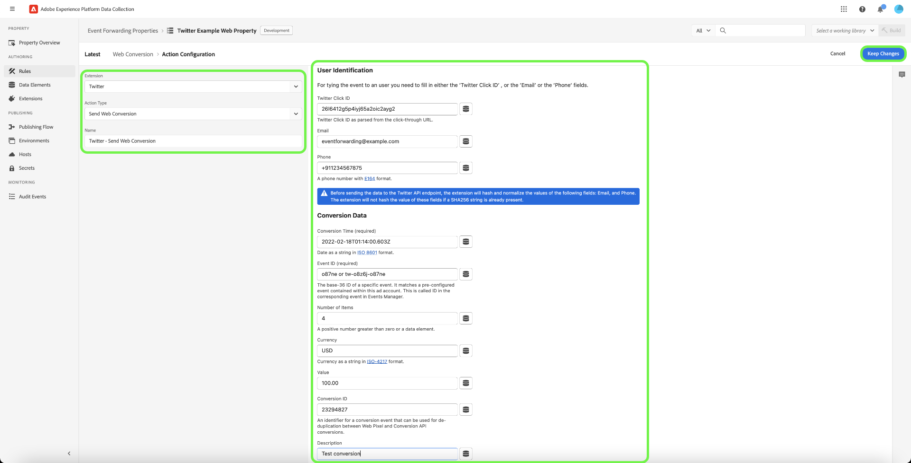

# Extension de transfert d’événement [!DNL Twitter]

[[!DNL Twitter]](https://twitter.com/i/flow/login) est un service en ligne de médias sociaux et de réseaux sociaux, sur lequel les utilisateurs publient et interagissent avec des messages de 280 caractères connus sous le nom de tweets. Les utilisateurs peuvent interagir avec Twitter à l’aide d’un navigateur, d’un logiciel frontal mobile ou par programmation via ses [API](https://developer.twitter.com/en/docs/twitter-api)

L’extension [!DNL Twitter] Web Conversions API [transfert d’événement](../../../ui/event-forwarding/overview.md) vous permet d’exploiter les données capturées dans Adobe Experience Platform Edge Network et de les envoyer à [!DNL Twitter]. Ce document couvre les cas d’utilisation de l’extension, comment l’installer et comment intégrer ses fonctionnalités dans vos [règles](../../../ui/managing-resources/rules.md) de transfert d’événement.

[!DNL Twitter] nécessite [OAuth 1.0](https://developer.twitter.com/en/docs/authentication/oauth-1-0a) pour l’authentification avec l’API [!DNL Twitter] [!DNL Web Conversions].

## Cas d’utilisation

Cette extension doit être utilisée si vous souhaitez utiliser les données d’Edge Network en [!DNL Twitter] pour tirer parti de ses fonctionnalités d’analyse et de ciblage des clients.

Prenons l’exemple d’une équipe marketing au sein d’une organisation. L’équipe capture les données d’événement d’interaction de l’utilisateur de son site web en tant que données d’événement de son site web et les charge dans [!DNL Twitter] à l’aide de cette extension de transfert d’événement.

Les équipes de marketing et d’analyse peuvent ensuite exploiter [!DNL Twitter's] fonctionnalités pour effectuer des analyses supplémentaires et cibler ces utilisateurs pour des campagnes publicitaires ciblées.

Pour plus d’informations sur les cas d’utilisation spécifiques à [!DNL Twitter], consultez la documentation [[!DNL Twitter] cas d’utilisation](https://developer.twitter.com/en/use-cases/build-for-businesses).

## Conditions préalables et mécanismes de sécurisation [!DNL Twitter] {#prerequisites}

Vous devez disposer d’un compte [!DNL Twitter] valide pour utiliser cette extension. Accédez à la [[!DNL Twitter] page d’enregistrement](https://help.twitter.com/en/using-twitter/create-twitter-account) pour vous enregistrer et créer un compte si vous n’en avez pas déjà un.

Vous devez configurer votre compte en tant que compte de développeur [!DNL Twitter]. Pour savoir comment vous inscrire en tant que développeur, reportez-vous à la section [[!DNL Twitter] Compte de développeur](https://developer.twitter.com/en/support/twitter-api/developer-account1).

### Mécanismes de sécurisation des API {#guardrails}

L’API [!DNL Twitter] Web Conversions a une limite de débit de 60 000 requêtes par intervalle de 15 minutes, où chaque requête autorise 500 événements.

### Collecter les détails de configuration requis {#configuration-details}

Pour connecter Experience Platform à [!DNL Twitter], les entrées suivantes sont requises :

| Type de clé | Description |
| --- | --- |
| Clé du client | &#x200B; Clé API de l’application pour accéder à l’API [!DNL Twitter]. Reportez-vous à la documentation [!DNL Twitter] sur les clés et secrets [api](https://developer.twitter.com/en/docs/authentication/oauth-1-0a/api-key-and-secret) pour obtenir des conseils. |
| Secret du client | Le secret d’API permet à votre application d’accéder à l’API [!DNL Twitter]. Reportez-vous à la documentation [!DNL Twitter] sur les clés et secrets [api](https://developer.twitter.com/en/docs/authentication/oauth-1-0a/api-key-and-secret) pour obtenir des conseils. |
| Secret du jeton | Secret de jeton non expirant de votre application, utilisé pour s’authentifier auprès de l’API [!DNL Twitter] via OAuth. Reportez-vous à la documentation [!DNL Twitter] sur l’[obtention de jetons d’accès utilisateur](https://developer.twitter.com/en/docs/authentication/oauth-1-0a/obtaining-user-access-tokens) pour obtenir des conseils. |
| Jeton d’accès | Jeton d’accès non expirant de votre application, utilisé pour s’authentifier auprès de l’API [!DNL Twitter] via OAuth. Reportez-vous à la documentation [!DNL Twitter] sur l’[obtention de jetons d’accès utilisateur](https://developer.twitter.com/en/docs/authentication/oauth-1-0a/obtaining-user-access-tokens) pour obtenir des conseils. |
| Id De Pixel | Le pixel d’[!DNL Twitter] est une balise de site web qui est implémentée sur votre site web pour effectuer le suivi des actions ou des conversions du site. Reportez-vous à la documentation [!DNL Twitter] sur [le suivi des conversions pour les sites web](https://business.twitter.com/en/help/campaign-measurement-and-analytics/conversion-tracking-for-websites.html) pour obtenir des conseils. |

## Installation et configuration de l’extension [!DNL Twitter] {#install}

Pour installer l’extension, [créez une propriété de transfert d’événement](../../../ui/event-forwarding/overview.md#properties) ou choisissez plutôt une propriété existante à modifier.

Sélectionner **[!UICONTROL Extensions]** dans le volet de navigation de gauche. Dans l’onglet **[!UICONTROL Catalogue]**, sélectionnez **[!UICONTROL Installer]** sur la carte de l’extension [!DNL Twitter].

![Catalogue présentant l’extension [!DNL Twitter] mettant en surbrillance install.](../../../images/extensions/server/twitter/install.png)

>[!IMPORTANT]
>
>Selon vos besoins d’implémentation, vous devrez peut-être créer un schéma, des éléments de données et un jeu de données avant de configurer l’extension. Avant de commencer, consultez toutes les étapes de configuration afin de déterminer les entités à configurer pour votre cas d’utilisation.

Dans l’écran suivant, saisissez les [valeurs de configuration](#configuration-details) suivantes que vous avez précédemment collectées à partir de [!DNL Twitter] :

* **[!UICONTROL Pixel Id]**
* **[!UICONTROL Consumer Key]**
* **[!UICONTROL Secret du client]**
* **[!UICONTROL Jeton]**
* **[!UICONTROL Jeton secret]**

Lorsque vous avez terminé, sélectionnez **[!UICONTROL Enregistrer]**.

![[!DNL Twitter] écran de configuration de l’extension [!DNL Twitter].](../../../images/extensions/server/twitter/configure.png)

## Configurer une règle de transfert d’événement {#config-rule}

Une fois tous vos éléments de données configurés, vous pouvez commencer à créer des règles de transfert d’événement qui déterminent quand et comment vos événements seront envoyés à [!DNL Twitter].

Créez une [règle](../../../ui/managing-resources/rules.md) dans votre propriété de transfert d’événement. Sous **[!UICONTROL Actions]**, ajoutez une nouvelle action et définissez l’extension sur **[!UICONTROL Twitter]**. Pour envoyer des événements Edge Network à [!DNL Twitter], définissez le **[!UICONTROL Type d’action]** sur **[!UICONTROL Envoyer la conversion web].**

Après la sélection, des commandes supplémentaires apparaissent pour configurer plus en détail l’événement. Vous devez mapper les propriétés d’événement [!DNL Twitter] aux éléments de données que vous avez précédemment créés. Pour plus d’informations, consultez la section [[!DNL Twitter] API de conversions web](https://developer.twitter.com/en/docs/twitter-ads-api/measurement/api-reference/conversions).

[!DNL Twitter] de création d’une règle d’événement de conversion.

**[!UICONTROL Identification de l&#39;utilisateur]**

| Nom du champ | Description | Exemple | Obligatoire |
| --- | --- | --- | --- |
| [!UICONTROL [!DNL Twitter] l’ID de clic] | [!DNL Twitter] ID de clic tel qu’analysé à partir de l’URL de clic publicitaire. | `26l6412g5p4iyj65a2oic2ayg2` | Obligatoire si aucun autre identifiant n’est ajouté. |
| [!UICONTROL E-mail] | Adresse e-mail hachée avec SHA256. Le texte doit être en minuscules et les espaces de fin ou de début doivent être supprimés avant le hachage. | `eventforwarding@example.com` | Obligatoire si aucun autre identifiant n’est ajouté. |
| [!UICONTROL Téléphone] | Le téléphone sert d’identifiant pour correspondre à l’événement de conversion. Le numéro de téléphone doit être au format E164 `[+][country code][area code][local phone number]` avant hachage. | `+911234567875` | Obligatoire si aucun autre identifiant n’est ajouté. |

**[!UICONTROL Données de conversion]**

| Nom du champ | Description | Exemple | Obligatoire |
| --- | --- | --- | --- |
| [!UICONTROL Heure de conversion] | Date et heure sous forme de chaîne au format [ISO 8601](https://datatracker.ietf.org/doc/html/rfc3339#section-5.6) ou au format `yyyy-MM-dd'T'HH:mm:ss:SSSZ`. | 2022-02-:14:00.603Z | Oui |
| [!UICONTROL Identifiant de l’événement] | Identifiant base-36 d’un événement spécifique. Cet identifiant doit correspondre à un événement préconfiguré contenu dans votre compte publicitaire [!DNL Twitter]. Il s’agit de l’identifiant de l’événement correspondant dans le gestionnaire d’événements. | o87ne ou tw-o8z6j-o87ne (tw-pixel_id-event-id) | Oui |
| [!UICONTROL Nombre d’éléments] | Nombre d’articles achetés dans l’événement. Il doit s&#39;agir d&#39;un nombre positif supérieur à 0. | 4 | Non |
| [!UICONTROL Devise] | Devise des articles achetés dans l’événement. Ce montant est exprimé en ISO-4217 et, s’il n’est pas fourni, la valeur par défaut sera USD. | USD | Non |
| [!UICONTROL Valeur] | Valeur de prix des articles achetés dans l’événement. | 100,00 | Non |
| [!UICONTROL ID de conversion] | Identifiant d’un événement de conversion qui peut être utilisé à des fins de déduplication entre les conversions de pixels web et de l’API de conversion dans la même balise d’événement. | 23294827 | Non |
| [!UICONTROL Description] | Une description contenant toutes les informations supplémentaires sur les conversions. | Tester la conversion | Non |

## Valider les données dans [!DNL Twitter]

Une fois la règle de transfert d’événement créée et exécutée, vérifiez si l’événement envoyé à l’API [!DNL Twitter] s’affiche comme prévu dans l’interface utilisateur de [!DNL Twitter].

Si la collecte d’événements et l’intégration des [!DNL Experience Platform] ont été effectuées avec succès, des événements s’affichent dans le [!DNL Twitter] [!UICONTROL gestionnaire d’événements].

![Gestionnaire d’événements [!DNL Twitter]](../../../images/extensions/server/twitter/event-manager.png)

## Étapes suivantes

Ce guide explique comment envoyer des événements de conversion à [!DNL Twitter] à l’aide du transfert d’événement. Pour plus d’informations sur ces technologies sous-jacentes, consultez la documentation officielle :

* [[!DNL Twitter] API](https://developer.twitter.com/en/docs/twitter-api)
* [API de conversion Web [!DNL Twitter]](https://developer.twitter.com/en/docs/twitter-ads-api/measurement/api-reference/conversions)
* [[!DNL Twitter] Jeton d’accès utilisateur](https://developer.twitter.com/en/docs/authentication/oauth-1-0a/obtaining-user-access-tokens)
* [Identifiant des pixels et suivi des conversions](https://business.twitter.com/en/help/campaign-measurement-and-analytics/conversion-tracking-for-websites.html)
