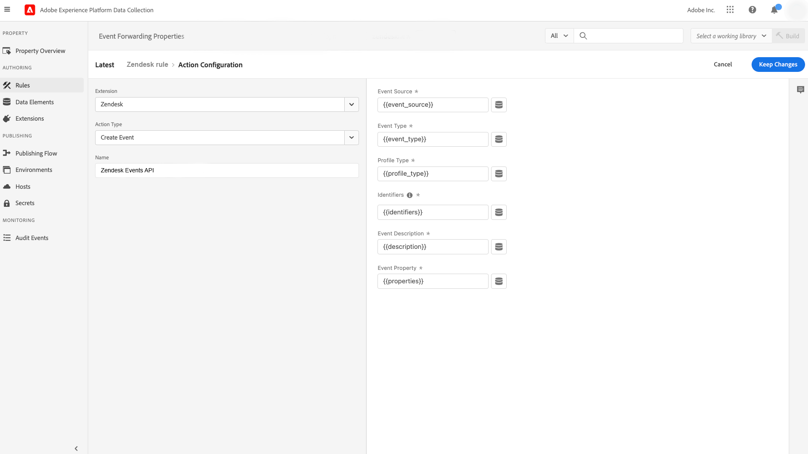

# [!DNL Zendesk] Présentation de l’extension d’API d’événements

[Zendesk](https://www.zendesk.fr) est une solution de service client et un outil de vente. L’extension [transfert d’événement](../../../ui/event-forwarding/overview.md) Zendesk tire parti de [[!DNL Zendesk Events API]](https://developer.zendesk.com/api-reference/custom-data/events-api/events-api/) pour envoyer des événements d’Adobe Experience Platform Edge Network à Zendesk en vue d’un traitement ultérieur. Vous pouvez utiliser l’extension pour collecter les interactions de profils client à utiliser dans les analyses et actions en aval.

Ce document explique comment installer et configurer l’extension dans l’interface utilisateur.

## Conditions préalables

Vous devez disposer d’un compte Zendesk pour utiliser cette extension. Vous pouvez vous créer un compte Zendesk sur le [site web de Zendesk](https://www.zendesk.fr/register/).

Vous devez également rassembler les détails suivants pour votre configuration Zendesk :

| Type de clé | Description | Exemple |
| --- | --- | --- |
| Sous-domaine | Lors du processus d’enregistrement, un **sous-domaine** unique est créé spécifiquement pour le compte. Reportez-vous à la [documentation Zendesk](https://developer.zendesk.com/documentation/ticketing/working-with-oauth/creating-and-using-oauth-tokens-with-the-api/) pour plus d’informations. | `xxxxx.zendesk.com` (où `xxxxx` est la valeur fournie lors de la création du compte) |
| Jeton API | Zendesk utilise des jetons porteur comme mécanisme d’authentification pour communiquer avec l’API Zendesk. Après vous être connecté au portail Zendesk, générez un jeton API. Reportez-vous à la [documentation Zendesk](https://support.zendesk.com/hc/en-us/articles/4408889192858-Generating-a-new-API-token) pour plus d’informations. | `cwWyOtHAv12w4dhpiulfe9BdZFTz3OKaTSzn2QvV` |

{style=&quot;table-layout:auto&quot;}

Enfin, vous devez créer un secret de transfert d’événement pour le jeton API. Définissez le type de secret sur **[!UICONTROL Jeton]**, puis définissez la valeur sur le jeton API que vous avez collecté à partir de votre configuration Zendesk. Reportez-vous à la documentation relative aux [secrets du transfert d’événement](../../../ui/event-forwarding/secrets.md) pour plus d’informations sur la configuration des secrets.

## Installer l’extension {#install}

Pour installer l’extension Zendesk dans l’interface utilisateur, accédez à **Transfert d’événement** et sélectionnez une propriété à laquelle ajouter l’extension, ou créez-en une nouvelle.

Une fois que vous avez sélectionné ou créé la propriété souhaitée, accédez à **Extensions** > **Catalogue**. Recherchez « [!DNL Zendesk] », puis sélectionnez **[!DNL Install]** sur l’extension Zendesk.

## Configurez l’extension {#configure}

>[!IMPORTANT]
>
>En fonction de vos besoins d’implémentation, vous devrez peut-être créer un schéma, des éléments de données et un jeu de données avant de configurer l’extension. Avant de commencer, consultez toutes les étapes de configuration afin de déterminer les entités à configurer pour votre cas d’utilisation.

Sélectionner **Extensions** dans le volet de navigation de gauche. Sous **Installé**, sélectionnez **Configurer** sur l’extension Zendesk.

Sous **[!UICONTROL Domaine de Zendesk]**, saisissez la valeur de votre sous-domaine Zendesk. Sous **[!UICONTROL Jeton Zendesk]**, sélectionnez le secret que vous avez créé précédemment et qui contient le jeton API.

## Configurer une règle de transfert d’événement

Commencez à créer une [règle](../../../ui/managing-resources/rules.md) de transfert d’événement et configurez ses conditions selon vos besoins. Lors de la sélection des actions de la règle, sélectionnez l’événement [!UICONTROL Zendesk] , puis sélectionnez la variable [!UICONTROL Créer un événement] type d’action.

Lors de la configuration de l’action, vous êtes invité à affecter des éléments de données aux différentes propriétés qui seront envoyées à Zendesk.

Ces éléments de données doivent être mappés comme indiqué ci-dessous.

### `event` keys

`event` est un objet JSON qui représente l’événement déclenché par l’utilisateur. Reportez-vous au document Zendesk sur l’[anatomie d’un événement](https://developer.zendesk.com/documentation/custom-data/events/anatomy-of-an-event/) pour plus d’informations sur les propriétés capturées par l’objet `event`.

Les clés suivantes peuvent être référencées dans l’objet `event` lors du mappage vers des éléments de données :

| `event` triggers | Type | Chemin de la plateforme | Description | Obligatoire | Limites |
| --- | --- | --- | --- | --- | --- |
| `source` | Chaîne | `arc.event.xdm._extconndev.event_source` | L’application qui a envoyé l’événement. | Oui | N’utilisez pas `Zendesk` comme valeur. Il s’agit d’un nom de source protégé pour les événements standard Zendesk. Toute tentative d’utilisation entraînera une erreur. La longueur de la valeur ne doit pas dépasser 40 caractères. |
| `type` | Chaîne | `arc.event.xdm._extconndev.event_type` | Un nom pour le type d’événement. Vous pouvez utiliser ce champ pour indiquer différents types d’événements pour une source donnée. Vous pouvez par exemple créer un ensemble d’événements pour les connexions des utilisateurs et un autre pour les paniers. | Oui | La longueur de la valeur ne doit pas dépasser 40 caractères. |
| `description` | Chaîne | `arc.event.xdm._extconndev.description` | Une description pour l’événement. | Non | (S/O) |
| `created_at` | Chaîne | `arc.event.xdm.timestamp` | Un horodatage ISO-8601 indiquant l’heure à laquelle l’événement a été créé. | Non | (S/O) |
| `properties` | Objet | `arc.event.xdm._extconndev.EventProperties` | Un objet JSON personnalisé contenant des détails sur l’événement. | Oui | (S/O) |

{style=&quot;table-layout:auto&quot;}

>[!NOTE]
>
>Reportez-vous à la [[!DNL Zendesk Events API] documentation](https://developer.zendesk.com/api-reference/custom-data/events-api/events-api/) pour plus d’informations sur les propriétés d’événement.

### `profile` keys

`profile` est un objet JSON représentant l’utilisateur qui a déclenché l’événement. Reportez-vous au document Zendesk sur l’[anatomie d’un profil](https://developer.zendesk.com/documentation/custom-data/profiles/anatomy-of-a-profile/) pour plus d’informations sur les propriétés capturées par l’objet `profile`.

Les clés suivantes peuvent être référencées dans l’objet `profile` lors du mappage à des éléments de données :

| `profile` triggers | Type | Chemin de la plateforme | Description | Obligatoire | Limites |
| --- | --- | --- | --- | --- | --- |
| `source` | Chaîne | `arc.event.xdm._extconndev.profile_source` | Le produit ou le service associé au profil, tel que `Support`, `CompanyName` ou `Chat`. | Oui | (S/O) |
| `type` | Chaîne | `arc.event.xdm._extconndev.profile_type` | Un nom pour le type de profil. Vous pouvez utiliser ce champ pour créer différents types de profils pour une source donnée. Par exemple, vous pouvez créer un ensemble de profils d’entreprise pour les clients et un autre pour les employés. | Oui | La longueur du type de profil ne doit pas dépasser 40 caractères. |
| `name` | Chaîne | `arc.event.xdm._extconndev.name` | Le nom de la personne du profil. | Non | (S/O) |
| `user_id` | Chaîne | `arc.event.xdm._extconndev.user_id` | L’identifiant utilisateur de la personne dans Zendesk. | Non | (S/O) |
| `identifiers` | Tableau | `arc.event.xdm._extconndev.identifiers` | Un tableau contenant au moins un identifiant. Chaque identifiant se compose d’un type et d’une valeur. | Oui | Reportez-vous à la [documentation Zendesk](https://developer.zendesk.com/api-reference/custom-data/profiles_api/profiles_api/#identifiers-array) pour plus d’informations sur le tableau `identifiers`. Tous les champs et valeurs doivent être uniques. |
| `attributes` | Objet | `arc.event.xdm._extconndev.attrbutes` | Objet contenant des propriétés définies par l’utilisateur à propos de la personne. | Non | Reportez-vous à la [documentation Zendesk](https://developer.zendesk.com/documentation/custom-data/profiles/anatomy-of-a-profile/#attributes) pour plus d’informations sur les attributs de profil. |

{style=&quot;table-layout:auto&quot;}

## Valider des données dans Zendesk {#validate}

Si la collecte d’événements et l’intégration d’Adobe Experience Platform s’effectuent avec succès, les événements dans la console Zendesk doivent apparaître comme illustré ci-dessous. Cela indique une intégration réussie.

Profils :

Événements :

## Limites de requêtes {#limits}

En fonction du type de compte, le Zendesk [!DNL Events API] peut gérer le nombre de requêtes suivant par minute :

| [!DNL Account Type] | Demandes par minute |
| --- | --- |
| [!DNL Team] | 250 |
| [!DNL Growth] | 250 |
| [!DNL Professional] | 500 |
| [!DNL Enterprise] | 750 |
| [!DNL Enterprise Plus] | 1000 |

{style=&quot;table-layout:auto&quot;}

Reportez-vous à la [documentation Zendesk](https://developer.zendesk.com/api-reference/ticketing/account-configuration/usage_limits/#:~:text=API%20requests%20made%20by%20Zendesk%20apps%20are%20subject,sources%20for%20the%20account%2C%20including%20internal%20product%20requests.) pour plus d’informations sur ces limites.

## Erreurs et résolution des problèmes {#errors-and-troubleshooting}

Lors de l’utilisation ou de la configuration de l’extension, les erreurs ci-dessous peuvent être renvoyées par l’API d’événements Zendesk :

| Code d’erreur | Description | Résolution | Exemple |
|---|---|---|---|
| 400 | **Longueur de profil non valide :** cette erreur se produit lorsque la longueur d’un attribut de profil contient plus de 40 caractères. | Limitez la longueur des données d’attribut de profil à un maximum de 40 caractères. | `{"error": [{"code":"InvalidProfileTypeLength","title": "Profile type length > 40 chars"}]}` |
| 401 | **Itinéraire introuvable :** cette erreur se produit lorsqu’un domaine non valide a été fourni. | Vérifiez qu’un domaine valide est fourni au format suivant : `{subdomain}.zendesk.com` | `{"error": [{"description": "No route found for host {subdomain}.zendesk.com","title": "RouteNotFound"}]}` |
| 401 | **Authentification non valide ou manquante :** cette erreur se produit lorsque l’accès au jeton est non valide, manquant ou arrivé à expiration. | Vérifiez que le jeton d’accès est valide et n’a pas expiré. | `{"error": [{"code":"MissingOrInvalidAuthentication","title": "Invalid or Missing Authentication"}]}` |
| 403 | **Autorisations insuffisantes :** cette erreur se produit lorsque des autorisations suffisantes pour accéder à la ressource ne sont pas fournies. | Vérifiez que les autorisations requises ont été fournies. | `{"error": [{"code":"PermissionDenied","title": "Insufficient permisssions to perform operation"}]}` |
| 429 | **Trop de requêtes :** Cette erreur se produit lorsque la limite d’enregistrement de l’objet de point d’entrée a été dépassée. | Reportez-vous à la section ci-dessus sur les [limites de requête](#limits) pour plus d’informations sur les seuils par limite. | `{"error": [{"code":"TooManyRequests","title": "Too Many Requests"}]}` |

{style=&quot;table-layout:auto&quot;}

## Étapes suivantes

Ce document explique comment installer et configurer l’extension de transfert d’événement Zendesk dans l’interface utilisateur. Pour plus d’informations sur la collecte de données d’événement dans Zendesk, consultez la documentation officielle :

* [Prise en main des événements](https://developer.zendesk.com/documentation/custom-data/events/getting-started-with-events/)
* [API d’événements Zendesk](https://developer.zendesk.com/api-reference/custom-data/events-api/events-api/)
* [À propos de l’API d’événements Zendesk](https://developer.zendesk.com/documentation/custom-data/events/about-the-events-api/)
* [Anatomie d’un événement](https://developer.zendesk.com/documentation/custom-data/events/anatomy-of-an-event/)
* [API de profils Zendesk](https://developer.zendesk.com/api-reference/custom-data/events-api/events-api/#profile-object)
* [À propos de l’API de profils](https://developer.zendesk.com/documentation/custom-data/profiles/about-the-profiles-api/)
* [Anatomie d’un profil](https://developer.zendesk.com/documentation/custom-data/profiles/anatomy-of-a-profile/)
