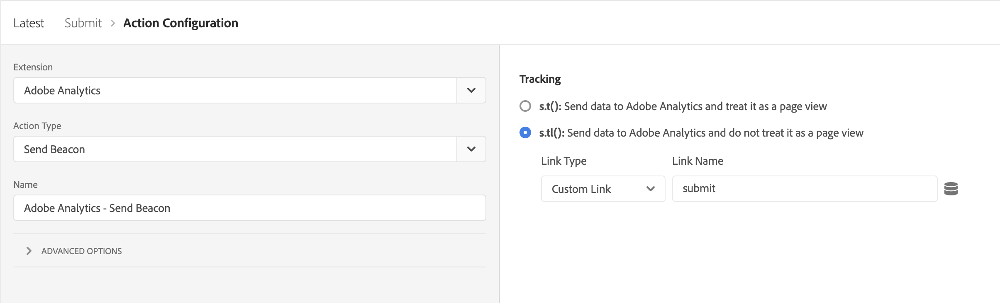

# Présentation de l’extension Adobe Experience Manager Forms

Ce document présente l’extension de balise Adobe Experience Manager Forms dans Adobe Experience Platform.

## Événements

Les types d’événement suivants sont fournis par l’extension :

1. **Rendu** : Déclenche lorsque l’utilisateur effectue le rendu (l’ouverture) d’un formulaire.
1. **Erreur** : Se déclenche lorsque l’utilisateur commet une erreur de validation sur un formulaire.
1. **Aide** : Se déclenche lorsque l’utilisateur clique sur l’icône d’aide d’un champ.
1. **Envoyer** : Déclencheurs lors de l’envoi du formulaire.
1. **Visite de champ** : Déclenche lorsqu’un champ est visité.
1. **Abandon** : Se déclenche lorsque l’utilisateur ferme l’onglet ou accède à une autre URL.
1. **Enregistrer** : Se déclenche lorsqu’un formulaire est enregistré sur le portail.

>[!IMPORTANT]
>
>L’événement Save n’est actuellement pas disponible pour Forms as a Cloud Service. Les événements personnalisés distribués par l’éditeur de règles dans la Forms adaptative peuvent être capturés à l’aide de l’événement principal &quot;Capturer l’événement personnalisé&quot;.

## Éléments de données

L’extension fournit plusieurs éléments de données qui peuvent être utilisés pour envoyer des propriétés dans les appels d’analyse.

## Prise en main

Suivez les étapes ci-dessous pour commencer à utiliser l’extension .

1. Installez l’extension Adobe Experience Manager Forms à partir du catalogue d’extensions. Aucune autre configuration n’est requise après l’installation.
2. Installez et configurez l’[extension Adobe Analytics](../analytics/overview.md#Configure-the-Adobe-Analytics-extension).

## Créer une règle

Une règle qui utilise l’extension Forms Experience Manager se présente comme suit :

Suivez les étapes décrites ci-dessous pour créer une règle similaire pour votre mise en oeuvre.

### Ajout d’un événement

1. Sélectionnez **Adobe Experience Manager Forms** dans la liste déroulante des extensions.
2. Sélectionnez l’événement à capturer.

### Ajouter une action

1. Sélectionnez &quot;Adobe Analytics&quot; dans la liste déroulante de l’extension.
2. Sélectionnez &quot;set variable&quot; dans la liste déroulante Action Type (Type d’action).
3. Dans la vue de configuration, sélectionnez les propriétés et les événements à envoyer.
4. Ajoutez une action &quot;Envoyer la balise&quot; pour envoyer l’appel d’analyse avec les événements et les propriétés définis à l’étape 3.
   
5. Ajoutez une action &quot;clear variable&quot; (Effacer la variable).

