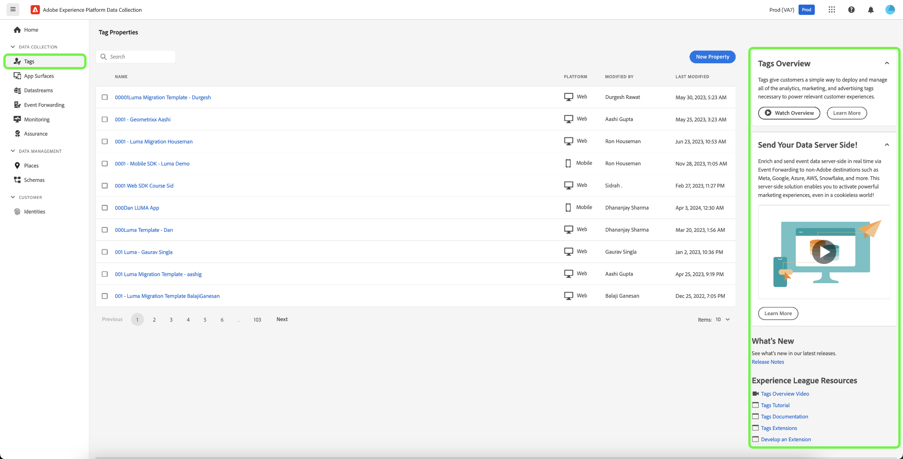

# Présentation des balises

Les balises dans Adobe Experience Platform (anciennement appelé Adobe Experience Platform Launch) représentent la nouvelle génération des fonctionnalités de gestion des balises d’Adobe. Les balises offrent aux clients un moyen simple de déployer et de gérer toutes les balises dʼanalyse, de marketing et de publicité nécessaires pour offrir des expériences client pertinentes.

Les balises permettent à tous les utilisateurs de créer et de gérer leurs propres intégrations, appelées *extensions*. Ces extensions sont disponibles pour les clients [!DNL Adobe Experience Cloud] sous la forme d’une expérience d’app store qui leur permet d’installer, de configurer et de déployer rapidement leurs balises.

Les balises sont proposées aux clients [!DNL Adobe Experience Cloud] en tant que fonctionnalité à valeur ajoutée incluse.

## Avantages clés {#key-benefits}

* Retour sur investissement plus rapide.
* Données fiables grâce à la collecte, l’organisation et la transmission centralisées, fondées sur les éléments de données.
* Expériences attrayantes grâce à l’intégration de technologies d’analyse des données et de marketing à l’aide du créateur de règles.

## Principales fonctionnalités {#key-features}

Utilisez l’aide du produit dans le panneau de droite pour en savoir plus sur les balises et afficher les ressources supplémentaires disponibles.

### Extensions {#extensions}

Une extension est un package de code (JavaScript, HTML et CSS) qui étend les fonctionnalités des balises. Créez, gérez et mettez à jour vos intégrations à l’aide d’une interface en libre-service ou presque. Vous pouvez considérer les extensions comme des applications que vous utilisez pour exécuter vos tâches.

### Catalogue d’extensions {#extension-catalog}

Explorez, configurez et déployez des outils publicitaires/de marketing conçus et gérés par des éditeurs de logiciels indépendants.

### Créateur de règles {#rule-builder}

Créez des règles robustes qui associent plusieurs événements, séquencés de la façon que vous déterminez à l’aide d’une logique si/alors assortie de conditions et d’exceptions. Les règles proposent des options pour les éléments suivants :

* Événements
* Conditions
* Exceptions
* Actions

Le créateur de règles inclut la vérification des erreurs en temps réel et le surlignage de la syntaxe pour votre code personnalisé.

Lorsque les critères et conditions décrits dans vos règles sont remplis, les actions que vous définissez sont exécutées dans l’ordre.

### Éléments de données {#data-elements}

Collectez, organisez et transmettez les données sur différentes technologies publicitaires et marketing Web.

### Publication d’entreprise {#enterprise-publishing}

Le processus de publication permet aux équipes de publier du code sur les pages. Des personnes différentes peuvent créer une mise en œuvre, lʼapprouver et la publier sur vos pages.

* Les modifications de votre code sont encapsulées dans les bibliothèques que vous définissez.
* Vous spécifiez où et quand vous souhaitez déployer votre code.
* Plusieurs bibliothèques peuvent être créées en parallèle par des équipes différentes.
* Environnements de développement illimités.
* Processus délibéré, basé sur des autorisations, pour fusionner des bibliothèques entre elles.

### API ouvertes {#open-apis}

Automatisez la mise en œuvre de technologies individuelles ou dʼun groupe de technologies.

* Les balises interagissent avec lʼAPI Reactor.
* Les déploiements peuvent être automatisés grâce aux API.
* Vous pouvez intégrer les API à vos propres systèmes internes.
* Vous pouvez créer votre propre interface utilisateur si tel est votre souhait.

### Balise conteneur modulaire légère {#modular-tag}

Le contenu de votre conteneur est réduit, y compris votre code personnalisé. Tout est modulaire. Si vous n’avez pas besoin d’un élément, celui-ci n’est pas inclus dans votre bibliothèque. Vous obtenez ainsi une mise en œuvre rapide et compacte. Voir [Minimisation](./ui/publishing/builds.md).

## Autres informations importantes {#other-highlights}

Les balises offrent plusieurs avantages par rapport aux systèmes similaires, notamment :

* La fonction `document.write ()` n’est pas utilisée lorsque Chrome ne l’autorise pas.
* Les règles Haut de page et Bas de page sont regroupées dans la bibliothèque principale afin de réduire le nombre d’appels HTTP superflus.
* Les scripts d’action personnalisés d’une règle peuvent être chargés en parallèle, mais sont exécutés de manière séquentielle.
* Si vous évitez les règles Haut de page et Bas de page, le code est essentiellement asynchrone, avec possibilité de devenir entièrement asynchrone.
