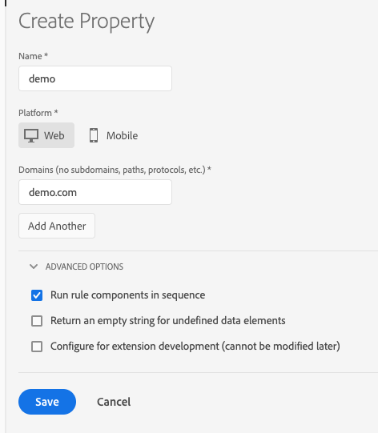

# Propriétés

## Propriétés web

Une propriété web est un ensemble de règles, d’éléments de données, d’extensions configurées, d’environnements et de bibliothèques.  Chaque propriété web possède son propre jeu de codes intégrés et peut être déployée sur un nombre indéfini de sites web (domaines différents).

## Propriétés mobiles

Un type de propriété mobile peut contenir plusieurs applications. Par exemple, dans une propriété mobile, vous pouvez gérer le même ensemble de règles et d’extensions entre plusieurs applications iOS et Android.

## Bonnes pratiques pour la planification des propriétés {#best-practices-for-planning-properties}

Les implémentations de balises dans Adobe Experience Platform peuvent être très différentes. Elles possèdent un large éventail de besoins de collecte des données, dʼutilisation des variables, dʼextensions, de balises tierces, dʼautres systèmes et technologies, de personnes, dʼéquipes, de régions géographiques, etc. Vous devez structurer vos propriétés de manière à ce qu’elles correspondent au workflow, aux processus et à l’environnement de votre organisation.

Tenez compte des éléments suivants lors de la planification des propriétés :

* Structure du code
* Données
* Variables
* Extensions, balises et systèmes
* Personnes

### Structure du code

Les sites sont basés sur du HTML, des applications mobiles sur du code.  Si les modèles ou les codes base HTML sous-jacents sont identiques pour plusieurs sites et applications, vous pouvez envisager dʼutiliser une seule propriété de balise pour gérer plusieurs sites ou applications.

### Données

Pour tous vos sites web ou applications, les données que vous allez collecter sont-elles très similaires, plutôt similaires ou uniques ?

Si les données à collecter sont similaires, il est logique de regrouper les sites ou applications en une propriété afin d’éviter de dupliquer des règles ou de copier des règles d’une propriété à une autre.

Si vos besoins en termes de collecte de données sont uniques pour chaque site ou application, il semble logique de les séparer dans des propriétés distinctes. Cette méthode permet de contrôler la collecte de données plus spécifiquement sans utiliser d’importants volumes de logique conditionnelle dans les scripts personnalisés.

### Variables

Comme pour les données, les variables que vous allez définir dans [!DNL Analytics] et autres extensions sont-elles très similaires, plutôt similaires ou uniques ?

Par exemple, si l’eVar27 est utilisée pour la même valeur source sur tous vos sites ou applications, il semble logique de regrouper ces sites ou applications afin que vous puissiez définir les variables communes en une seule propriété.

### Extensions, balises et systèmes

Les extensions, balises et systèmes que vous allez déployer sont-ils très similaires, plutôt similaires ou uniques ?

Si les extensions, balises et systèmes que vous allez déployer sont très similaires sur lʼensemble de vos sites ou applications, vous pouvez les inclure dans la même propriété.

Si vous déployez [!DNL Adobe Analytics] sur un seul site ou une seule application et que vos autres extensions et balises sont également uniques, vous pouvez créer des propriétés distinctes afin de disposer d’un meilleur contrôle.

Par exemple, si vous déployez [!DNL Adobe Analytics], [!DNL Target] et les mêmes extensions tierces sur l’ensemble de vos sites ou applications, un regroupement peut être justifié.

### Personnes

Les personnes, équipes et organisations qui travaillent sur Adobe Experience Platform auront-elles besoin d’un accès à tous vos sites web et applications, à certaines de ces ressources ou à seulement l’une d’entre elles ?

Les fonctionnalités de gestion des utilisateurs permettent d’affecter des rôles à différentes personnes pour toutes vos propriétés ou par propriété. Si une personne dispose des droits suffisants, elle peut effectuer des actions administratives pour toutes les propriétés de cette organisation Experience Platform. Tous les autres rôles peuvent être affectés sur une base par propriété. Vous pouvez même masquer une propriété pour certains utilisateurs (non administrateurs) en ne leur accordant aucun rôle dans cette propriété.

## Page Propriétés

Une propriété est un ensemble de règles, d’éléments de données, d’extensions configurées, d’environnements et de bibliothèques. Pour le Web, il nʼy a quʼun seul code intégré de publication par propriété. Pour les propriétés mobiles, il y a un identifiant dʼapplication de configuration par propriété.

Une propriété peut être n’importe quel regroupement d’un ou de plusieurs domaines et sous-domaines. Vous pouvez gérer ces ressources et en effectuer le suivi de manière similaire. Par exemple, supposons que vous disposez de plusieurs sites web reposant sur un modèle et que vous souhaitez effectuer le suivi des mêmes ressources sur tous les sites. Vous pouvez appliquer une propriété à plusieurs domaines.

À gauche de l’écran, vous pouvez voir les sociétés de votre organisation. Cette fonction s’avère particulièrement utile si vous gérez plusieurs comptes. Sélectionnez une société pour afficher les propriétés et journaux d’audit qui lui sont associés.

Chaque propriété se trouve dans la liste Propriétés.

Cette liste inclut plusieurs informations :

* Nom de propriété
* Plateforme
* Statut

Cliquez sur une propriété pour en voir une présentation. La présentation répertorie toutes les activités exécutées pour cette propriété. Elle montre également les mesures et les extensions de la propriété.

## Création ou configuration d’une propriété

Cette section fournit des conseils sur la création ou la configuration d’une propriété de balise dans Adobe Experience Platform.

>[!NOTE]
>
>Seul un utilisateur disposant de droits suffisants peut créer une propriété. Voir [Autorisations des utilisateurs](user-permissions.md).

Avant de commencer, consultez les [Bonnes pratiques pour la planification des propriétés](companies-and-properties.md#best-practices-for-planning-properties).

Accédez à la page de votre entreprise, puis sélectionnez **[!UICONTROL Ajouter une propriété]** ou sélectionnez une propriété existante dans la liste et sélectionnez **[!UICONTROL Configurer]**.

### Pour le Web

Suivez les instructions pour créer une propriété web.

1. Renseignez les champs suivants :

   **Name :** le nom de la propriété.

   **Domaines :** URL de base de tous les sites sur lesquels vous prévoyez de déployer cette propriété.

1. (Avancé) **[!UICONTROL Exécution des composants de règle en séquence]** Cochez cette case pour que les conditions et actions attendent que la précédente soit achevée avant de s’exécuter.
1. (Avancé) **[!UICONTROL Renvoyer une chaîne vide pour les éléments de données manquants :]** si vous référencez un élément de données qui n’existe pas dans une bibliothèque, cela renvoie normalement `undefined`. Cochez cette case si vous souhaitez que ce scénario renvoie une chaîne vide à la place.
1. (Avancé) **[!UICONTROL Configuration pour le développement d’extensions :]** cochez cette case si vous prévoyez d’installer des extensions de développement sur lesquelles votre société travaille activement.
1. Sélectionnez **[!UICONTROL Enregistrer]**.

### Pour les propriétés mobiles

Suivez les instructions pour créer une propriété mobile.

1. Renseignez les champs suivants :

   * **Name :** le nom de la propriété.
   * **Privacy :** par défaut, le paramètre de confidentialité est défini sur Opted In (Activé), ce qui signifie que vous souhaitez que le SDK collecte et envoie des données aux solutions. Si vous sélectionnez Opt Out (Désactivé), le SDK ne transmettra PAS les données aux solutions par défaut. Si vous sélectionnez Unknown (Aucun), le SDK doit préalablement demander à lʼutilisateur lʼautorisation de collecter et de partager les données.

     >[!NOTE]
     >
     >Il est possible de contrôler ces paramètres par API dans l’application mobile.

   * **Use HTTPS :** sélectionnez ce paramètre selon que toutes les communications de données doivent être envoyées via HTTP ou via HTTPS.

1. Sélectionnez **[!UICONTROL Enregistrer]**.

Une fois votre propriété créée, Experience Platform ajoute automatiquement un hôte par défaut, un ensemble d’environnements (Développement, Évaluation et Production) et les extensions par défaut.

## Suppression d’une propriété

Suivez les étapes ci-dessous pour supprimer une propriété de balise.

>[!NOTE]
>
>La suppression d’une propriété est une opération irréversible. Le demandeur doit être un utilisateur de niveau administrateur. Cette demande ne peut pas être annulée.

1. Dans la liste Propriétés, sélectionnez la propriété à supprimer.

   Vous pouvez sélectionner et supprimer plusieurs propriétés.

1. Sélectionnez **[!UICONTROL Supprimer]**, puis confirmez la suppression de la propriété.
