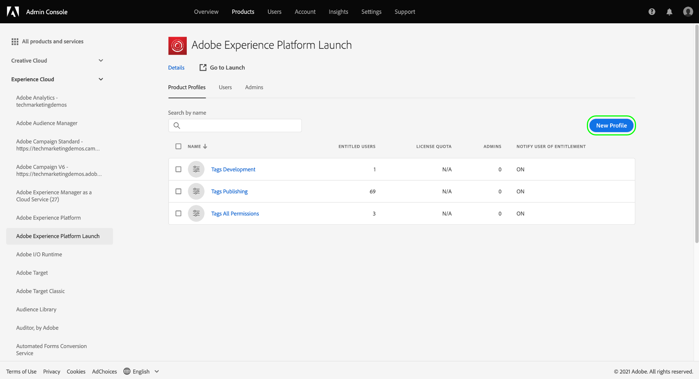
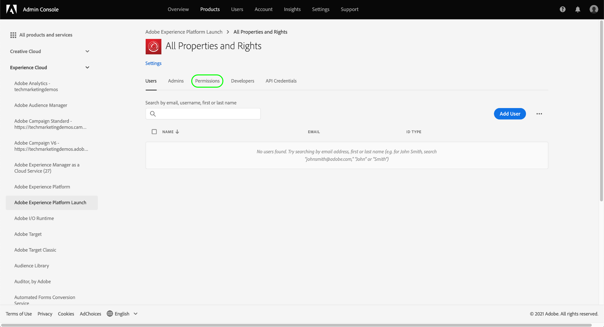

# Gestion des autorisations relatives aux balises

>[!NOTE]
>
>Adobe Experience Platform Launch est désormais une suite de technologies destinées à la collecte de données dans Adobe Experience Platform. Plusieurs modifications terminologiques ont par conséquent été apportées à la documentation du produit. Reportez-vous au [document](../../term-updates.md) suivant pour consulter une référence consolidée des modifications terminologiques.

Pour utiliser des balises dans Adobe Experience Platform, vous devez avoir accès à au moins un produit Adobe Experience Cloud via Adobe Admin Console. En outre, des autorisations relatives aux balises doivent également vous être octroyées au niveau du profil de produit afin d’effectuer certaines actions lorsque vous êtes connecté à l’interface utilisateur de la collecte de données.

Ce guide explique comment octroyer ces autorisations aux utilisateurs à l’aide d’Admin Console.

>[!NOTE]
>
>Pour obtenir des informations détaillées sur les différents types d’autorisations relatives aux balises disponibles mentionnés dans ce guide, reportez-vous à la [présentation des autorisations d’utilisateur](./user-permissions.md).

## Obtention des droits d’administrateur pour un profil de produit de balises

Pour gérer les autorisations d’utilisateur relatives aux balises, vous devez au moins être administrateur d’un profil de produit de balises dans Adobe Admin Console. Les administrateurs système et les administrateurs produit peuvent également gérer les autorisations d’un profil de produit de balises.

Pour plus d’informations sur les différents niveaux d’administration et sur la gestion de ces rôles au sein de votre organisation, consultez le document Admin Console sur les [rôles administratifs](https://helpx.adobe.com/fr/enterprise/admin-guide.html/enterprise/using/admin-roles.ug.html).

## Sélection d’un profil de produit pour lequel gérer les autorisations

Une fois que vous disposez des droits d’administrateur, connectez-vous à Admin Console et sélectionnez **[!UICONTROL Produits]** dans la barre de navigation supérieure. Dans la liste des produits affichés, sélectionnez **[!UICONTROL Adobe Experience Platform Launch]**.

Une liste des profils de produits s’affiche. Un profil de produit est un concept qui lie un groupe d’autorisations à un groupe d’utilisateurs. À partir de là, vous pouvez créer un profil à configurer, ou sélectionner un profil de produit existant dans la liste à modifier (en supposant que vous disposez des droits d’administrateur pour ce profil).

### Création d’un profil de produits

>[!NOTE]
>
>Si vous avez sélectionné un profil existant à modifier, passez directement à la [section suivante](#permissions).

Pour créer un profil de produit, cliquez sur **[!UICONTROL Nouveau profil]**.

Une boîte de dialogue s’affiche, vous permettant de fournir un nom et une description facultative du profil. Vous pouvez également activer ou désactiver la réception d’e-mails par les utilisateurs lorsqu’ils sont ajoutés ou supprimés de ce profil. Lorsque vous avez terminé, sélectionnez **[!UICONTROL Enregistrer]**.

## Configuration des autorisations pour le profil de produit {#permissions}

La page de détails du profil de produit s’affiche. À l’aide des onglets fournis, vous pouvez gérer les utilisateurs affectés au profil, et configurer les propriétés et droits spécifiques octroyés à ces utilisateurs par le profil.

Les étapes d’ajout d’utilisateurs sont présentées [plus loin dans ce guide](#users). Pour l’instant, sélectionnez **[!UICONTROL Autorisations]**.

L’écran suivant présente un aperçu du nombre de plateformes, propriétés et droits actuellement affectés au profil. Sélectionnez **[!UICONTROL Modifier]** en regard de l’une des lignes pour commencer à configurer les autorisations du profil.

L’écran [!UICONTROL Modifier les autorisations] s’affiche. Il vous permet d’ajouter et de supprimer des autorisations du profil de produit. Dans la section **[!UICONTROL Plateformes]**, vous pouvez constater que toutes les plateformes ont été ajoutées au profil par défaut.

### Attribution de propriétés

Pour attribuer des propriétés à ce profil, sélectionnez **[!UICONTROL Propriétés]** dans le volet de navigation de gauche.

Par défaut, un nouveau profil de produit a automatiquement accès à toutes les propriétés disponibles pour votre organisation. Cela inclut les propriétés actuellement disponibles et les propriétés futures.

Si vous souhaitez limiter les propriétés disponibles, sélectionnez l’option d’activation/désactivation de l’**[!UICONTROL Inclusion automatique]**. Vous pouvez ainsi ajouter et supprimer manuellement des propriétés pour la propriété en fonction de vos besoins.

Si l’option Inclusion automatique est désactivée, toutes les propriétés actuellement disponibles sont répertoriées sur la gauche. Vous pouvez ajouter des propriétés au profil en sélectionnant l’icône plus (**+**) en regard de la propriété en question dans la colonne de gauche. Pour supprimer une propriété, cliquez sur l’icône **X** en regard de la propriété en question dans la colonne de droite.

>[!IMPORTANT]
>
>La désactivation de la fonctionnalité d’inclusion automatique signifie que toutes les propriétés créées ultérieurement doivent être ajoutées manuellement au profil de produit pour que ce dernier puisse y accéder.

### Accordez des droits

Par défaut, tous les droits sont désactivés pour un profil de produit et doivent être ajoutés manuellement pour être activés. Si vous appartenez à un profil de produit qui inclut automatiquement des propriétés mais ne dispose pas de droits, vous disposez alors d’un accès en lecture seule à toutes les propriétés.

>[!NOTE]
>
>Un utilisateur peut appartenir à plusieurs profils de produit dans Admin Console, mais les droits de ces profils ne sont pas combinés dans un jeu d’autorisations principal. Cet utilisateur ne dispose toujours que des droits explicitement accordés par chaque groupe.
>
>Par exemple, si Groupe 1 donne accès à Propriété A avec le droit de développement et si Groupe 2 donne accès à Propriété B avec le droit de publication, les droits de développement et de publication ne sont pas combinés pour Propriété A et Propriété B. Vous pouvez uniquement développer sur Propriété A et publier sur Propriété B.

Sélectionnez **[!UICONTROL Droits de propriété]** dans le volet de navigation de gauche. Comme pour les propriétés, vous pouvez sélectionner l’icône plus (**+**) en regard d’un droit de propriété pour l’ajouter au profil. Si vous souhaitez ajouter tous les droits de propriété au profil, vous pouvez également sélectionner **[!UICONTROL Ajouter tout]**.

Sélectionnez ensuite **[!UICONTROL Droits de la société]** dans le volet de navigation de gauche. Ajoutez ou supprimez les droits dont vous avez besoin et, une fois que vous avez terminé, sélectionnez **[!UICONTROL Enregistrer]**.

## Attribution d’utilisateurs au profil {#users}

Pour attribuer des utilisateurs au profil de produit, sélectionnez l’onglet [!UICONTROL Utilisateurs], puis sélectionnez [!UICONTROL Ajouter un utilisateur].

Dans la boîte de dialogue qui s’affiche, saisissez le nom, le groupe d’utilisateurs ou l’adresse e-mail des utilisateurs que vous souhaitez ajouter au profil. Si un utilisateur fait partie de votre organisation, ses informations s’affichent dans une liste déroulante de saisie semi-automatique que vous pouvez sélectionner pour en compléter les détails. S’il ne fait pas partie de votre organisation, vous pouvez saisir ses informations manuellement à la place.

Lorsque vous avez terminé, sélectionnez **[!UICONTROL Enregistrer]** pour ajouter les utilisateurs spécifiés au profil de produit.

Une fois les utilisateurs ajoutés au profil, ils reçoivent un e-mail les informant qu’ils disposent désormais des droits pour l’interface utilisateur de la collecte de données.

## Étapes suivantes

Ce document vous a présenté la gestion des propriétés et des droits de l’interface utilisateur de la collecte de données à l’aide d’Adobe Admin Console. Pour plus d’informations sur les autorisations disponibles et les fonctionnalités auxquelles elles donnent accès, consultez la présentation des [autorisations d’utilisateur](./user-permissions.md).
