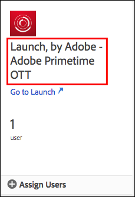

# Autorisations utilisateur

>[!NOTE]
>
>Adobe Experience Platform Launch a été rebaptisé en tant que suite de technologies de collecte de données dans Adobe Experience Platform. Plusieurs modifications terminologiques ont par conséquent été apportées à la documentation du produit. Reportez-vous au [document](../../term-updates.md) suivant pour consulter une référence consolidée des modifications terminologiques.

## Types d’autorisations

Il existe deux autorisations utilisateur à comprendre pour une utilisation avec des balises dans Adobe Experience Platform :

* **Autorisations Experience Cloud :** situées dans l’Admin Console au niveau de l’entreprise, les autorisations [!DNL Experience Cloud] régissent les personnes qui peuvent contrôler les autorisations de groupe et l’appartenance à un groupe pour tous les produits [!DNL Experience Cloud].
* **Autorisations des balises :** les autorisations des balises se trouvent dans le Admin Console au niveau du profil de produit. Ces autorisations déterminent quels utilisateurs peuvent réellement effectuer certaines actions lorsqu’ils sont connectés à l’interface utilisateur de la collecte de données.

Cet article examine en détail ces différents types d’autorisations.

### Autorisations Experience Cloud

Cette section décrit les facteurs importants à comprendre lors de l’utilisation de Platform. Pour obtenir une vue d’ensemble des autorisations [!DNL Experience Cloud], consultez la section [Rôles administratifs dans le Guide de l’utilisateur de l’entreprise](https://helpx.adobe.com/fr/enterprise/using/admin-roles.html).

#### Administrateur d’organisation

Les administrateurs d’organisation sont souvent appelés administrateurs d’org. La fonction principale d’un administrateur d’org. consiste à attribuer des autorisations à d’autres utilisateurs. Pour ce faire, il crée des profils de produit (ou groupes) contenant un ensemble spécifique de droits au sein d’un produit spécifique, puis il affecte des utilisateurs, existants ou nouveaux, à ce profil de produit.

Les administrateurs d’org. d’entreprise n’héritent d’aucun droit pour les balises dans Platform. Ils doivent s’ajouter à un profil de produit disposant des autorisations appropriées s’ils souhaitent effectuer une action dans l’interface utilisateur de la collecte de données.

#### Administrateur de produit

Un administrateur de produit (ou admin. produit) est similaire à un administrateur d’org., mais sa portée est plus limitée. En effet, un administrateur de produit dispose uniquement de l’autorisation de modifier les profils de produit d’un produit [!DNL Adobe] spécifique, plutôt que tous les produits [!DNL Adobe] auxquels l’entreprise a accès.

### Autorisations pour les balises

Dans [!DNL Experience Cloud], aucun droit ou autorisation n’est attribué à des utilisateurs individuels. Ils sont affectés à un profil de produit (voir « Autorisations Experience Cloud » ci-dessus). Les utilisateurs individuels sont ensuite affectés à un ou plusieurs profils de produit.

Dans un profil de produit, les autorisations des balises sont divisées en quatre dimensions.

1. Plateformes
1. Propriétés
1. Droits de propriété
1. Droits d’entreprise

#### Plateformes

Chaque propriété possède une plateforme. Il existe actuellement deux plateformes que vous pouvez utiliser pour les balises : *Web* et *Mobile*. Vous pouvez utiliser ce type d’autorisation pour restreindre ou accorder l’accès à un type particulier de propriété. Cela peut s’avérer utile lorsque l’équipe qui gère vos applications mobiles diffère de celle qui gère vos sites Web.

#### Propriétés

Il s’agit d’une liste de toutes les propriétés qui existent dans votre société. Vous pouvez utiliser ce type d’autorisation pour restreindre ou accorder l’accès à des propriétés existantes spécifiques (par nom).

#### Droits de propriété

Toutes les propriétés que vous créez dans l’interface utilisateur de la collecte de données sont disponibles dans le Admin Console pour que vous puissiez attribuer des autorisations. Si un profil de produit donné n’a pas accès à Propriété A1, les utilisateurs qui appartiennent à ce profil ne peuvent pas consulter ou modifier des paramètres dans Propriété A1.

En supposant qu’un utilisateur appartienne à un profil ayant accès à Propriété A1, ce qu’il peut faire dans la propriété A1 est déterminé par les droits qui lui ont été octroyés par ce groupe d’autorisations. Les utilisateurs disposant d’autorisations pour Propriété A1, mais pas de droits attribués, disposent d’un accès en lecture seule.

Les autorisations disponibles dans ce groupe sont les suivantes :

* **Développer :**  permet de créer des règles et des éléments de données. Vous pouvez également créer des bibliothèques et les intégrer dans des environnements de développement existants. Vous pouvez soumettre une bibliothèque pour approbation lorsque vous êtes prêt. La plupart des tâches quotidiennes dans l’interface utilisateur de la collecte de données requièrent ce droit.
* **Approuver :** permet de créer une bibliothèque envoyée dans l’environnement d’évaluation. Vous pouvez également approuver une bibliothèque en vue de la publier une fois le test terminé.
* **Publier :** permet de publier des bibliothèques approuvées dans l’environnement de production.
* **Manage Extensions (Gérer les extensions) :**  permet d’installer de nouvelles extensions sur une propriété, de modifier la configuration de l’extension d’une extension déjà installée et de supprimer une extension. Consultez la documentation de présentation des extensions pour [plus d’informations sur les extensions](../managing-resources/extensions/overview.md). Ce rôle appartient généralement au service informatique ou au marketing, selon votre organisation.
* **Gérer les environnements :** permet de créer et de modifier des environnements. Pour plus d’informations, consultez la [documentation sur les environnements](../publishing/environments.md) . Ce rôle appartient généralement au groupe informatique.

#### Droits d’entreprise

Les droits d’entreprise s’appliquent aux autorisations qui s’appliquent à plusieurs propriétés. Il en existe actuellement trois :

* **Gérer les propriétés :** permet de créer de nouvelles propriétés dans l’interface utilisateur de la collecte de données et de modifier les métadonnées et les paramètres au niveau de la propriété. Vous pouvez également supprimer des propriétés. Pour plus d’informations, consultez la [documentation sur les propriétés](companies-and-properties.md) . Les administrateurs assument généralement ce rôle.
* 
* Permet de créer des propriétés et de modifier les métadonnées et les paramètres au niveau de la propriété. Vous pouvez également supprimer des propriétés. En savoir plus sur les propriétés [ici](companies-and-properties.md). Les administrateurs assument généralement ce rôle.
* **Develop Extensions** (Développer des extensions) : permet de créer et de modifier des modules d’extensions dont l’entreprise dispose, y compris les versions privées et les demandes de version publique.
* **Gérer les configurations d’application :** cette option n’est disponible que pour les clients qui disposent d’une licence Adobe Journey Optimizer ou pour toute autre solution qui leur donne accès aux messages in-app et aux notifications push.  Vous pouvez ainsi gérer les applications dont l’Experience Cloud connaît les informations ainsi que les informations d’identification push nécessaires pour communiquer avec le service Firebase Cloud Messaging et le service de notification push Apple.

### Autorisations utilisateur totales

Les autorisations totales d’un utilisateur individuel sont déterminées par son nombre total d’abonnements dans différents profils de produit. Si un utilisateur appartient à plusieurs profils de produit, les autorisations de chaque profil sont additionnées et non multipliées.

Par exemple : le profil de produit A accorde à Henry le droit de développement pour Propriété 1. Le profil de produit B accorde à Henry le droit de publication pour Propriété 2. Henry peut développer dans Propriété 1 et publier dans Propriété 2, mais il ne peut pas publier dans Propriété 1 ou développer dans Propriété 2, car il n’a pas reçu de droits explicites à cet effet.

## Scénarios de droits

Différentes sociétés ont des besoins différents lorsqu’il s’agit de créer des profils de produit. Ces besoins varient en fonction de la taille de l’entreprise, de la structure de l’organisation, du nombre de sites, du nombre de personnes impliquées dans la gestion des balises, etc.

Vous trouverez ci-dessous quelques scénarios courants et un point de départ recommandé lorsque vous envisagez de créer des profils de produit et d’y ajouter des utilisateurs.

### Affichage unique

Si vous dirigez une petite entreprise comptant une personne responsable de tout, accordez-lui l’autorisation d’accès à toutes les propriétés et attribuez-lui tous les droits répertoriés ci-dessus.

### Séparation des tâches

De nombreuses personnes prennent part au balisage. Vous disposez d’un groupe de personnes (éventuellement un consultant externe) qui créent des règles et des éléments de données, mais vous ne souhaitez pas qu’elles aient accès à l’environnement de production. Vous souhaitez vous assurer que personne n’effectue de déploiement pour Production, à l’exception de l’équipe informatique.

1. Créez un compte pour vos consultants et ne leur accordez que le droit de développement.
1. Le consultant crée et teste dans les limites que vous avez définies.
1. Si le consultant souhaite une nouvelle extension ou est prêt à les rendre actives, un représentant de votre organisation (disposant des droits appropriés) effectue ces actions.

### Entreprise

Une entreprise peut avoir plusieurs sites divisés géographiquement, avec différentes équipes responsables de chaque région. Au sein de ces équipes, différentes personnes se chargent du développement et de la publication.

Cela se rapproche de la section « Séparation des tâches » ci-dessus, à l’exception de l’organisation par zone géographique.

* Amérique du Nord
   * Groupe de développement
   * Groupe de publication
* Europe
   * Groupe de développement
   * Groupe de publication
* ...
   * Groupe de développement
   * Groupe de publication

## Exemples

Quelques exemples des types de rôles susceptibles d’exister dans votre organisation, ainsi que des autorisations que vous devez leur affecter, peuvent contribuer à clarifier ce concept.

Voici quelques descriptions des différents rôles qui peuvent s’appliquer à votre organisation, ainsi qu’une matrice qui indique les autorisations dont ils ont besoin pour réaliser leurs tâches.

* Le gestionnaire : souhaite être au courant de ce qui se passe, mais ne devrait pas être en mesure d’apporter des modifications.
* Le spécialiste marketing : peut installer des extensions et configurer de nouvelles balises pour des propriétés existantes, mais ne peut pas publier dans les environnements d’évaluation ou de production.
* Le développeur d’applications mobiles : est responsable de la mise en œuvre de solutions Adobe et tierces dans une application mobile native.
* L’équipe informatique : ne modifie aucune balise, mais contrôle totalement les environnements d’évaluation et de production et ce qu’ils contiennent.
* Homme à tout faire : s’occupe de tout.

| Rôle | Propriétés | Droits d’entreprise | Droits de propriété |
|--- |--- |--- |--- |
| Le gestionnaire | Inclusion automatique |  |  |
| Le spécialiste marketing | Inclusion automatique | Gérer des propriétés | Développer Gérer les extensions |
| Le développeur d’applications mobiles | Inclusion automatique | Gérer des propriétés Gérer les configurations d’application | Développer Gérer les extensions |
| L’équipe informatique | Inclusion automatique | Approuver Publier Gérer les environnements |
| L’homme à tout faire | Inclusion automatique | Gérer des propriétés | Développer Approuver Publier Gérer les extensions Gérer les environnements |
| Le développeur d’extensions | Inclusion automatique | Gérer des propriétés Développer des extensions | Développer |

## Attribution d’autorisations utilisateur

Les étapes ci-dessous vous guident tout au long du processus d’attribution d’autorisations. Vous pouvez également consulter ce processus [en vidéo](https://www.youtube.com/watch?v=ba28BHX8cwU).

Les étapes 1 à 3 ci-dessous peuvent être contournées en accédant directement à [Adobe Admin Console](https://adminconsole.adobe.com/enterprise/products). Si vous appartenez à plusieurs organisations, sélectionnez l’organisation appropriée dans le volet de navigation supérieur sur la droite.

### 1. Connectez-vous à Experience Cloud

Connectez-vous à [https://experiencecloud.adobe.com/](https://experiencecloud.adobe.com/) avec votre Adobe ID, puis sélectionnez l’organisation à utiliser dans l’interface utilisateur de collecte de données à partir du menu [!UICONTROL Navigation].

Ouvrez le sélecteur de solutions en cliquant sur l’icône des 9 points dans le menu [!UICONTROL Navigation], puis cliquez sur **[!UICONTROL Administration]**.

Si ce lien n’est pas visible, les deux conditions suivantes s’appliquent :

* Vous n’êtes pas administrateur d’org.
* Vous n’êtes pas administrateur de produit pour l’un des produits [!DNL Experience Cloud].

Dans les deux cas, demandez à un administrateur d’org. d’effectuer cette procédure pour vous ou de vous donner le statut d’administrateur de produit pour les balises afin que vous puissiez le faire vous-même.

>[!NOTE]
>
>Si vous ne connaissez pas votre administrateur d’org., contactez le service à la clientèle.

### 2. Ouvrez l’Admin Console

Sélectionnez **Admin Console**.

Sélectionnez la carte **[!DNL Experience Platform Launch] - `Company Name`**.

<!-- Scott, update above image. Rebranding. -->

Vous pouvez également cliquer sur **[!UICONTROL Produits]** dans le volet de navigation supérieur, puis sélectionner **[!DNL Experience Platform Launch]-`Company Name`** dans le volet de navigation de gauche.

Si vous ne voyez pas de carte [!DNL Experience Platform Launch] ou si [!DNL Experience Platform Launch] n’apparaît pas dans cette liste, cela signifie que vous n’êtes pas administrateur d’org., mais que vous êtes un administrateur de produit pour d’autres produits Experience Cloud. Étant donné que vous n’êtes pas administrateur Experience Platform Launch, vous devez rechercher un administrateur d’org. qui peut effectuer cette procédure pour vous ou qui peut vous donner le statut d’administrateur de produit pour [!DNL Platform Launch].

Une fois que vous avez sélectionné Platform Launch, une liste des profils de produit s’affiche. Considérez ces profils comme des groupes d’autorisations. Un profil est créé pour vous et intitulé « [!DNL Platform Launch] - `Company Name` ».

### 3. Créez votre profil de produit

Si vous modifiez un profil de produit existant, ignorez cette étape.

Choisissez de modifier ce profil de produit ou d’en créer un.

Pour créer un profil de produit, cliquez sur **[!UICONTROL Nouveau profil]**.

Donnez un nom et une description à votre nouveau profil, indiquez si les utilisateurs doivent recevoir des e-mails lorsqu’ils sont ajoutés ou supprimés de ce profil, puis cliquez sur **[!UICONTROL Terminé]**.

### 4. Modifiez votre profil de produit

Sélectionnez le profil de produit dans la liste, puis ouvrez l’onglet **[!UICONTROL Autorisations]**. Vous pouvez attribuer des autorisations entre deux dimensions : Propriétés et Droits.

Pour attribuer des propriétés à cette définition de groupe, ouvrez la section **[!UICONTROL Propriétés]**.

Une liste affiche les propriétés de la balise.

Par défaut, les nouvelles configurations de produit incluent automatiquement des propriétés. Cela signifie que toutes les propriétés (présentes et futures) sont incluses dans la définition du groupe.

Si l’option Auto-include (Inclusion automatique) est désactivée, toutes les propriétés actuellement disponibles sont répertoriées sur la gauche. Vous pouvez déplacer les propriétés dans cette définition de groupe en cliquant sur **[!UICONTROL Ajouter]**.

Lorsque vous avez terminé, cliquez sur **[!UICONTROL Enregistrer]**.

### 5. Accordez des droits

Accordez les droits que vous souhaitez pour faire partie de votre définition de groupe. Ouvrez la section **[!UICONTROL Droits]**.

Les droits ne sont pas inclus automatiquement. Vous devez attribuer chaque droit à votre profil. Vous pouvez ajouter rapidement tous les droits à ce profil à l’aide du bouton [!UICONTROL + Ajouter tout] ou vous pouvez attribuer des droits individuels à l’aide des boutons + (ajouter) individuels. Pour plus d’informations sur les autorisations associées à chaque droit, voir [Scénarios de droits](#rights-scenarios). Lorsque vous avez terminé, cliquez sur **[!UICONTROL Enregistrer]**. Si [!UICONTROL Enregistrer] n’est pas disponible, aucune modification n’a été apportée et vous ne vous verrez attribuer aucun nouveau droit.

Accordez d’abord les droits de propriété :

Accordez ensuite les droits d’entreprise :

Remarques importantes à prendre en compte concernant l’attribution de droits :

* L’absence de droits implique un accès en lecture seule. Si vous faites partie d’une configuration de produit avec des propriétés Auto-include (Inclusion automatique) et aucun droit, vous disposez alors d’un accès en lecture seule à toutes les propriétés de balise.
* Si vous n’attribuez pas correctement les propriétés de gestion, vous ne pourrez pas ajouter de propriétés lorsque vous vous connecterez.
* Un utilisateur peut appartenir à plusieurs groupes, mais les droits de ces groupes ne sont pas combinés dans un jeu d’autorisations maître défini. Cet utilisateur ne dispose toujours que des droits explicitement accordés par chaque groupe.

   Par exemple, si Groupe 1 donne accès à Propriété A avec le droit de développement et si Groupe 2 donne accès à Propriété B avec le droit de publication, les droits de développement et de publication ne sont pas combinés pour Propriété A et Propriété B. Vous pouvez uniquement développer sur Propriété A et publier sur Propriété B.

### 6. Affectez des utilisateurs à des groupes

Pour affecter des utilisateurs à votre groupe, ouvrez l’onglet [!UICONTROL Utilisateurs], puis cliquez sur [!UICONTROL Ajouter un utilisateur].

Sélectionnez les points de suspension (...) pour d’autres options, telles que les opérations utilisateur groupées.

>[!NOTE]
>
>Être administrateur d’organisation ou administrateur de produit ne vous accorde aucun droit au sein du produit de balise. Vous devez appartenir à au moins un profil de produit.

Recherchez l’utilisateur que vous souhaitez ajouter au groupe. Vous pouvez effectuer une recherche par nom ou par adresse électronique. Cette option est automatiquement renseignée par les utilisateurs existants dans votre organisation. Quand vous avez trouvé l’utilisateur que vous recherchez, cliquez sur son nom.

Une fois que vous avez ajouté des utilisateurs, ils reçoivent un e-mail leur indiquant qu’ils disposent désormais de droits. Pour vous connecter, suivez le lien vers l’[interface utilisateur de la collecte de données](https://launch.adobe.com).

>[!NOTE]
>
>Si l’utilisateur n’existe pas, vous pouvez simplement saisir son adresse électronique complète, puis indiquer un nom et un prénom. Le nouvel utilisateur reçoit un courrier électronique et, lorsqu’il crée un identifiant [!DNL Adobe] à partir de cette invitation par courrier électronique, il est lié au compte utilisateur que vous avez créé pour lui. Si vous vous accordez des autorisations, vous n’aurez pas ce problème.

## Problèmes courants

### Erreur de chargement du compte

Lorsque vous vous connectez à l’interface utilisateur de la collecte de données, vous recevez un message indiquant &quot;Error Loading Account&quot; (Erreur de chargement du compte).

Résolution : Votre utilisateur n’appartient à aucun profil de produit de balise. Suivez les étapes ci-dessus pour créer un profil et lui accorder des droits, ainsi que pour affecter un utilisateur à un profil.

### Bouton Property (Propriété) grisé

Une fois connecté, vous ne pouvez pas ajouter de propriétés.

Résolution : votre compte utilisateur n’appartient pas à une configuration de produit qui dispose du droit Manage Properties (Gérer des propriétés). Revenez à l’étape 5 ci-dessus.
