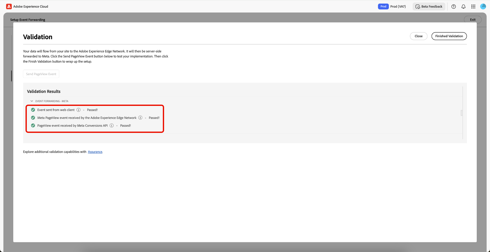

# Présentation de la configuration guidée du transfert d’événement

>[!IMPORTANT]
>
>La fonction de configuration guidée est disponible pour les clients qui ont acheté le package Real-Time CDP Prime et Ultimate. Pour plus dʼinformations, contactez votre représentant commercial Adobe.

>[!NOTE]
>
>Tout client existant peut utiliser les workflows de configuration guidés pour créer une implémentation de référence qui peut être utilisée pour les éléments suivants :
>
>* Utilisez-le comme point de départ d’une toute nouvelle implémentation.
>* Utilisez-la comme une implémentation de référence que vous pouvez examiner pour voir comment elle a été configurée, puis répliquez-la dans vos implémentations de production actuelles.

La fonction de configuration guidée vous permet de configurer facilement et efficacement. Cet outil automatise plusieurs étapes exécutées dans les balises Adobe et le transfert d’événement, ce qui réduit considérablement le temps de configuration.

Cette configuration peut installer automatiquement des extensions. Cette implémentation hybride est recommandée par [!DNL Meta] pour collecter et transférer des conversions d’événement côté serveur. La fonctionnalité de configuration guidée est conçue pour vous aider à commencer une implémentation du transfert d’événement et n’est pas destinée à fournir une implémentation complète et fonctionnelle de bout en bout qui prend en charge tous les cas d’utilisation.

## Prise en main de la configuration guidée {#guided-setup}

Pour commencer à utiliser la fonctionnalité, sélectionnez **[!UICONTROL Commencer]** dans l’interface utilisateur **[!UICONTROL Transfert d’événement]** Collections de données.

>[!INFO]
>
>Vous pouvez également accéder directement à la configuration guidée à partir de la page d’accueil Collections de données .

### Création d’une propriété de balises {#new-property}

Dans la section Configurer les propriétés , sélectionnez **[!UICONTROL Nouveau]** et saisissez les détails du nouveau **[!UICONTROL Domaine de la propriété]**.

Sélectionnez **[!UICONTROL Ajouter]** pour le [!DNL Meta Conversion API] dans la section Ajouter des extensions . Sur la page Configurer les informations de [!DNL Meta], vous avez la possibilité de saisir manuellement votre **[!UICONTROL ID de pixel Meta]**, votre **[!UICONTROL Jeton d’accès utilisateur système Meta]** et votre **[!UICONTROL Chemin d’accès à la couche de données]** ou d’utiliser l’option **[!UICONTROL Se connecter à Meta]**.

#### Connexion à [!DNL Meta] à l’aide de vos informations d’identification {#meta-credentials}

Sélectionnez **[!UICONTROL Connexion à Meta]**, saisissez vos informations d’identification [!DNL Meta] et sélectionnez **[!UICONTROL Connexion]**, puis sélectionnez **[!UICONTROL Suivant]**.

Vous serez désormais invité à **Créer un portefeuille d’entreprise**. Saisissez le **[!UICONTROL nom du portefeuille d’entreprise]** et sélectionnez **[!UICONTROL Suivant]**.

Sélectionnez votre portefeuille d’entreprise dans la liste, puis sélectionnez **[!UICONTROL Suivant]**. Vous pouvez voir les paramètres de Business Portfolio, de Compte publicitaire et de [!DNL Meta Pixel]. Sélectionnez **[!UICONTROL Continuer]** pour confirmer les paramètres, puis sélectionnez **[!UICONTROL Suivant]**.

Patientez quelques minutes le temps que le processus de configuration se termine, puis sélectionnez **[!UICONTROL Terminé]**.

Votre **[!UICONTROL ID de pixel]** votre **[!UICONTROL jeton d’accès utilisateur du système Meta]** et votre **[!UICONTROL chemin de la couche de données]** seront automatiquement renseignés. Sélectionnez **[!UICONTROL Enregistrer]**.

#### Créer des ressources pour votre nouvelle propriété de balises {#create-resources}

Dans la section Créer des ressources , sélectionnez **[!UICONTROL Pré-vérifier les ressources]** pour vérifier votre organisation et vos propriétés en cas de collisions ou de ressources existantes nécessaires à votre implémentation.

La page Actions de tâche affiche une liste de tâches et d’actions. Sélectionnez **[!UICONTROL Créer des ressources]** pour créer ces tâches.

Patientez quelques minutes le temps que les règles, éléments de données, extensions, bibliothèques, SDK, etc. requis terminent l’installation. La section Créer des ressources fournit des liens vers les propriétés et les ressources créées.

#### Validation de la mise en œuvre {#validate-implementation}

La section Valider l’implémentation fournit le lien intégré que vous pouvez utiliser sur votre site web. **[!UICONTROL Démarrer la validation]** exécute le test dans la session en cours du navigateur sur cette page de configuration guidée. Si la validation réussit ici, la même implémentation doit fonctionner lorsque vous déployez le lien incorporé sur votre site.

Sélectionnez **[!UICONTROL Envoyer un événement PageView]** pour envoyer un événement de test via Adobe Experience Platform Edge Network. Il est ensuite transféré côté serveur vers [!DNL Meta]. Sélectionnez **[!UICONTROL Validation terminée]** pour terminer la configuration.

>[!NOTE]
>
>Si des échecs se produisent au cours du processus de validation, cliquez sur le lien **** pour passer en revue les événements qui ont peut-être échoué.

### Utiliser une propriété de balises existante {#existing-property}

Dans la section Configurer les propriétés , sélectionnez **[!UICONTROL Existant]**, puis sélectionnez votre propriété Balises dans le menu déroulant. Le système tente de trouver la propriété de transfert d’événement déjà associée à cette propriété par le biais des flux de données. Vous pouvez maintenant continuer à reconfigurer le [!DNL Meta Conversion API], puis pré-vérifier et créer des ressources.

Si la propriété de balises sélectionnée n’est pas connectée à une propriété de transfert d’événement ou si des flux de données sont manquants, ils sont automatiquement créés.

Pour configurer vos [!DNL Meta Conversion API], suivez le processus mis en évidence ci-dessus dans la [Se connecter à [!DNL Meta] à l’aide de vos informations d’identification](#meta-credentials).

Maintenant que vous avez généré **[!UICONTROL l’ID de pixel]** **[!UICONTROL le jeton d’accès de l’utilisateur du système Meta]** et **[!UICONTROL le chemin de la couche de données]**, sélectionnez **[!UICONTROL Pré-vérifier les ressources]** pour créer le workflow de transfert d’événement.

Étant donné que vous utilisez une propriété de balises existante, le processus de configuration diffère légèrement du workflow de la nouvelle propriété. Comme ils existent déjà, vous pouvez constater que le système ignore la création de la propriété web, de l’hôte et de l’environnement. Enfin, sélectionnez **[!UICONTROL Créer des ressources]** pour créer les tâches qui ne sont pas encore disponibles.

>[!INFO]
>
>La configuration guidée ajoute automatiquement des notes aux propriétés qui sont mises à jour pendant le processus. Vous pouvez les afficher dans la section Notes du panneau de droite de la propriété Balises en mode d’édition. Vous pouvez voir quand la propriété a été mise à jour ou créée par l’outil de configuration guidée. Ce journal d’audit vous permet de suivre les modifications apportées par la fonction de configuration guidée.

Patientez quelques minutes le temps que les règles, éléments de données, extensions, bibliothèques, SDK, etc. requis terminent l’installation. La section Créer des ressources fournit des liens vers les propriétés et les ressources créées.

La section Valider l’implémentation fournit le lien intégré que vous pouvez utiliser sur votre site web. **[!UICONTROL Démarrer la validation]** exécute le test dans la session en cours du navigateur sur cette page de configuration guidée. Si la validation réussit ici, la même implémentation doit fonctionner lorsque vous déployez le lien incorporé sur votre site.

Sélectionnez **[!UICONTROL Envoyer un événement PageView]** pour envoyer un événement de test via Adobe Experience Platform Edge Network. Il est ensuite transféré côté serveur vers [!DNL Meta]. Sélectionnez **[!UICONTROL Validation terminée]** pour terminer la configuration.

>[!NOTE]
>
>Si des échecs se produisent au cours du processus de validation, cliquez sur le lien **** pour passer en revue les événements qui ont peut-être échoué.

## Étapes suivantes {#next-steps}

Ce guide explique comment utiliser l’outil de configuration guidé pour créer et configurer des propriétés pour le [!DNL Meta Conversions API].

Pour plus d’informations sur la mise en œuvre efficace de votre intégration [!DNL Conversions API]](https://www.facebook.com/business/help/308855623839366?id=818859032317965) consultez la documentation [!DNL Meta] sur [les bonnes pratiques relatives à . Pour des informations plus générales sur les balises et le transfert d’événement dans Adobe Experience Cloud, reportez-vous à la [présentation des balises](../../home.md).
