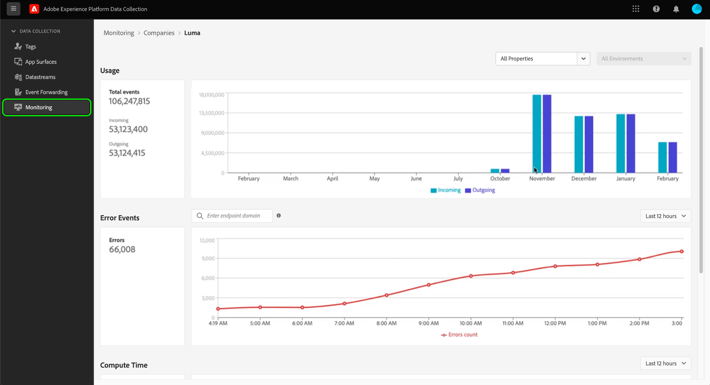
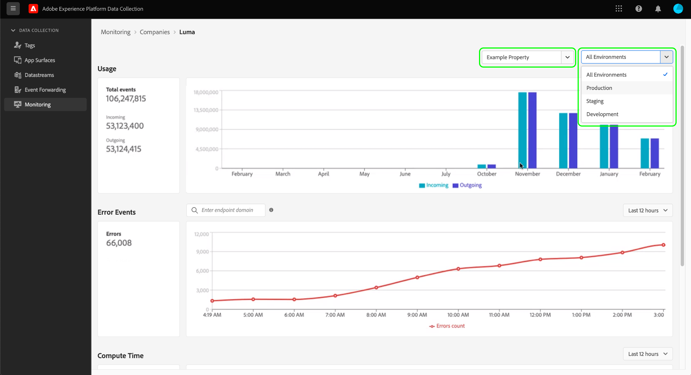
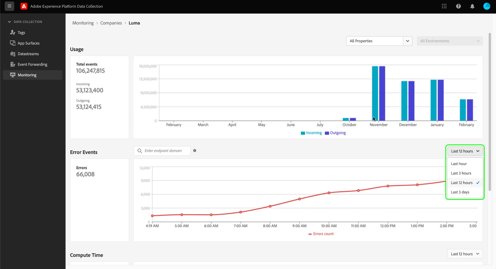

# Surveillance des activités dans le transfert d’événement (Beta)

>[!IMPORTANT]
>
>Cette fonctionnalité est actuellement en version Beta et votre organisation n’y a peut-être pas encore accès. Les fonctionnalités et la documentation sont susceptibles d’être modifiées.

L’onglet **[!UICONTROL Surveillance]** de l’interface utilisateur de collecte de données vous permet de surveiller les modèles d’utilisation, les erreurs et de calculer le temps de vos propriétés de transfert d’événement. Ce guide présente de manière générale comment afficher et comprendre les rapports affichés dans l’onglet.

## Conditions préalables

Ce guide suppose que vous avez acheté le transfert d’événement et que vous connaissez le fonctionnement du transfert d’événement. Pour plus d’informations, consultez la [présentation du transfert d’événement](./overview.md).

## Vue d’ensemble des vidéos

Regardez la vidéo suivante pour une présentation détaillée de la fonctionnalité de surveillance :

>[!VIDEO](https://video.tv.adobe.com/v/3411267?captions=fre_fr&quality=12&learn=on)

## Sélection des propriétés et des environnements

Vous pouvez afficher les mesures au sein d’un environnement et d’une propriété individuels, ou dans toutes les propriétés et tous les environnements détenus par votre organisation.

Pour afficher les mesures d’une seule propriété, sélectionnez le menu déroulant des propriétés et choisissez la propriété qui vous intéresse dans la liste. Une fois la propriété sélectionnée, vous pouvez également utiliser la liste déroulante d’environnement pour sélectionner un environnement ciblé.

## [!UICONTROL Utilisation]

>[!NOTE]
>
>Les données d’utilisation sont actualisées chaque mois après la fin du mois précédent.

Le rapport **[!UICONTROL Utilisation]** affiche les appels entrants et sortants pour une période donnée. Les appels entrants représentent les données envoyées au transfert d’événement. Les appels sortants représentent les données envoyées à partir du transfert d’événement. Le nombre **[!UICONTROL Total d’événements]** dans le volet de gauche correspond à la somme des appels entrants et sortants pour la période donnée.

## [!UICONTROL Événements d’erreur]

Le rapport **[!UICONTROL Événements d’erreur]** affiche les erreurs sous forme agrégée, et réparties par code de réponse HTTP lorsque vous placez le curseur sur le graphique en courbes. Les erreurs affichées proviennent d’appels sortants et les codes de réponse proviennent du point d’entrée avec lequel le transfert d’événement interagit.

Les erreurs s’affichent pour une période donnée, qui peut être ajustée à partir du menu déroulant fourni.

La zone de recherche de l’événement d’erreur vous permet d’interroger le transfert d’événement afin de comprendre les erreurs pour un domaine de point d’entrée donné. Vous devez entrer le domaine exact, car la fonction de recherche n&#39;accepte pas les approximations ou les correspondances « floues ». Une fois que vous avez fourni un domaine exact pour lequel il existe des données d’erreur sortantes, appuyez sur Entrée et le rapport s’actualise pour afficher les erreurs sortantes pour ce domaine. Par exemple, pour afficher les erreurs du point d’entrée de l’API de conversions Facebook, le domaine doit être écrit comme `https://graph.facebook.com`.

## [!UICONTROL Temps de calcul]

Le rapport **[!UICONTROL Temps de calcul]** affiche le temps de calcul de toutes les règles sur les serveurs de transfert d’événements.

>[!NOTE]
>
>Les heures affichées ne représentent pas une latence de bout en bout. Le transfert d’événement est limité à 50 millisecondes en temps de calcul. Si cette limite est dépassée, les données associées seront ignorées.

Les facteurs suivants affectent le temps de calcul :

1. Le nombre de règles
2. La complexité des règles, généralement liée à la quantité de code JavaScript personnalisé exécuté

Par exemple, si une action dans le transfert d’événements atteint un point d’entrée et que celui-ci met deux secondes pour répondre, cette latence de deux secondes ne sera pas prise en compte dans le temps de calcul, car le transfert d’événements n’attend que et ne calcule rien activement. Le temps de réponse ne peut pas être supérieur à 30 secondes, sinon les données seront ignorées.
