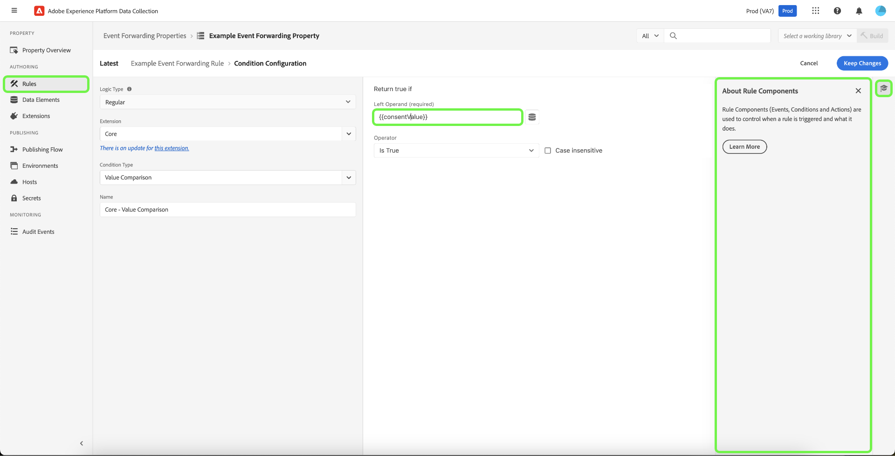

# Présentation du transfert dʼévénements

>[!NOTE]
>
>Le transfert d’événement est une fonctionnalité payante uniquement incluse dans les offres Connections, Prime, ou Ultimate d’Adobe Real-Time Customer Data Platform.

>[!NOTE]
>
>Adobe Experience Platform Launch est désormais une suite de technologies destinées à la collecte de données dans Adobe Experience Platform. Plusieurs modifications terminologiques ont par conséquent été apportées à la documentation du produit. Reportez-vous au [document](../../term-updates.md) suivant pour consulter une référence consolidée des modifications terminologiques.

Le transfert d’événement dans Adobe Experience Platform vous permet d’envoyer les données d’événement collectées vers une destination pour le traitement côté serveur. Le transfert dʼévénements réduit le poids de la page web et de lʼapplication en utilisant Adobe Experience Platform Edge Network pour exécuter les tâches normalement exécutées sur le client. Mises en œuvre de la même manière que les balises, les règles de transfert d’événement peuvent transformer et envoyer des données vers de nouvelles destinations. Cependant, au lieu d’envoyer ces données depuis une application cliente comme un navigateur web, elles sont envoyées depuis les serveurs d’Adobe.

Ce document présente une vue détaillée du transfert d’événement dans Platform.

>[!NOTE]
>
>Pour plus d’informations sur la façon dont le transfert d’événement s’insère dans l’écosystème de collecte de données de Platform, voir la section [présentation de la collecte de données](../../../collection/home.md).

Le transfert d’événement associé au [SDK Web](/help/web-sdk/home.md) et [SDK Mobile](https://experienceleague.adobe.com/docs/platform-learn/data-collection/mobile-sdk/overview.html?lang=fr) Adobe Experience Platform offre les avantages suivants :

**Performances** :

* Effectuez un seul appel à partir d’une page qui contient une payload de données qui est ensuite fédérée côté serveur afin de réduire le trafic réseau côté client et offrir une expérience plus rapide aux clients.
* Réduisez le temps nécessaire au chargement des pages web pour améliorer les performances du site.
* Réduisez le nombre de technologies requises côté client pour offrir votre expérience et envoyer des données vers de nombreuses destinations.

**Gouvernance des données** :

* Augmentez la transparence et le contrôle relatifs aux données envoyées vers l’ensemble des propriétés, ainsi qu’à leur destination.

## Différences entre le transfert dʼévénements et les balises {#differences-from-tags}

En termes de configuration, le transfert d’événement utilise plusieurs des mêmes concepts que les balises, tels que : [règles](../managing-resources/rules.md), [éléments de données](../managing-resources/data-elements.md) et [extensions](../managing-resources/extensions/overview.md). La principale différence entre les deux peut être résumée comme suit :

* Les balises **collectent** les données d’événement d’un site web ou d’une application mobile native et les envoient à Platform Edge Network.
* Le transfert d’événement **envoie** les données d’événement entrantes de Platform Edge Network vers un point d’entrée qui représente une destination finale ou un point d’entrée qui fournit des données avec lesquelles vous souhaitez enrichir la payload d’origine.

Tandis que les balises collectent les données d’événement directement sur votre site ou application mobile native à l’aide des SDK Web et Mobile Platform, le transfert d’événement nécessite que les données d’événement soient déjà envoyées via Platform Edge Network afin de les transférer vers les destinations. En d’autres termes, vous devez mettre en œuvre le SDK Web ou Mobile Platform sur votre propriété numérique (par le biais de balises ou à l’aide de code brut) afin d’utiliser le transfert d’événement.

### Propriétés {#properties}

Le transfert d’événement conserve sa propre banque de propriétés séparées des balises, que vous pouvez afficher dans l’interface utilisateur de l’Experience Platform ou dans l’interface utilisateur de collecte de données en sélectionnant **[!UICONTROL Transfert d’événement]** dans le volet de navigation de gauche.

>[!TIP]
>
>Utilisez l’ aide du produit dans le panneau de droite pour en savoir plus sur le transfert d’événement et afficher d’autres ressources disponibles.

Toutes les propriétés de transfert d’événement répertorient **[!UICONTROL Edge]** comme leur plateforme. Elles ne font pas la distinction entre web et mobile, car elles traitent uniquement les données reçues de Platform Edge Network, qui peut lui-même recevoir des données d’événement des plateformes web et mobiles.

### Extensions {#extensions}

Le transfert d’événement possède son propre catalogue d’extensions compatibles, telles que l’extension [Core](../../extensions/server/core/overview.md) et l’extension [Adobe Cloud Connector](../../extensions/server/cloud-connector/overview.md). Vous pouvez afficher les extensions disponibles pour les propriétés de transfert d’événement dans l’interface utilisateur en sélectionnant **[!UICONTROL Extensions]** dans le volet de navigation de gauche, suivi de **[!UICONTROL Catalogue]**.

Vous pouvez afficher d’autres ressources disponibles pour en savoir plus sur cette fonctionnalité en sélectionnant  dans le panneau de droite.

### Éléments de données {#data-elements}

Les types d’éléments de données disponibles dans le transfert d’événements sont limités au catalogue des [extensions](#extensions) compatibles qui les fournissent.

Bien que les éléments de données eux-mêmes soient créés et configurés de la même manière dans le transfert d’événement que pour les balises, il existe d’importantes différences de syntaxe concernant la manière dont ils référencent des données à partir de Platform Edge Network.

#### Référencement des données de Platform Edge Network {#data-element-path}

Pour référencer des données à partir de Platform Edge Network, vous devez créer un élément de données qui fournit un chemin d’accès valide à ces données. Lors de la création de l’élément de données dans l’interface utilisateur, sélectionnez **[!UICONTROL Core]** comme extension et **[!UICONTROL Chemin]** comme type.

La valeur de **[!UICONTROL Chemin]** pour l’élément de données doit suivre le modèle `arc.event.{ELEMENT}` (par exemple : `arc.event.xdm.web.webPageDetails.URL`). Ce chemin d’accès doit être spécifié correctement pour que les données soient envoyées.

Vous pouvez afficher d’autres ressources disponibles pour en savoir plus sur cette fonctionnalité en sélectionnant  dans le panneau de droite.

### Règles {#rules}

La création de règles dans les propriétés de transfert d’événement fonctionne de la même manière que les balises. La principale différence réside dans le fait que vous ne pouvez pas sélectionner d’événements en tant que composants de règle. À la place, une règle de transfert d’événement traite tous les événements qu’elle reçoit du [flux de données](../../../datastreams/overview.md) et transfère ces événements vers les destinations si certaines conditions sont remplies.

En outre, un délai d’attente de 30 secondes s’applique à un seul événement, car il est traité dans toutes les règles (et donc toutes les actions) au sein d’une propriété de transfert d’événement. Cela signifie que toutes les règles et toutes les actions pour un événement unique doivent être exécutées au cours de cette période.

Vous pouvez afficher d’autres ressources disponibles pour en savoir plus sur cette fonctionnalité en sélectionnant  dans le panneau de droite.

#### Segmentation d’éléments de données en unités lexicales {#tokenization}

Dans les règles de balises, les éléments de données sont segmentés en unités lexicales avec un `%` au début et à la fin du nom de l’élément de données (par exemple : `%viewportHeight%`). Dans les règles de transfert d’événement, les éléments de données sont plutôt segmentés en unités lexicales avec `{{` au début et `}}` à la fin du nom de l’élément de données (par exemple : `{{viewportHeight}}`).

Vous pouvez afficher d’autres ressources disponibles pour en savoir plus sur cette fonctionnalité en sélectionnant  dans le panneau de droite.

#### Séquence des actions de règle {#action-sequencing}

La section [!UICONTROL Actions] d’une règle de transfert d’événements est toujours exécutée de manière séquentielle. Par exemple, si une règle comporte deux actions, la deuxième action ne commence pas l’exécution tant que l’action précédente n’est pas terminée (et dans les cas où une réponse est attendue à partir d’un point de terminaison, ce point de terminaison a répondu). Assurez-vous que l’ordre des actions est correct lorsque vous enregistrez une règle. Cette séquence d’exécution ne peut pas être exécutée de manière asynchrone comme elle le peut avec les règles de balise.

## Secrets {#secrets}

Le transfert d’événements vous permet de créer, gérer et stocker des secrets qui peuvent être utilisés pour vous authentifier sur les serveurs auxquels vous envoyez des données. Consultez le guide sur les [secrets](./secrets.md) pour connaître les différents types de secrets disponibles et la manière dont ils sont implémentés dans l’interface utilisateur.

## Vue d’ensemble des vidéos {#video}

La vidéo suivante est destinée à vous aider à mieux comprendre le transfert des événements et les connexions Real-Time CDP.

>[!VIDEO](https://video.tv.adobe.com/v/3429308)

## Étapes suivantes

Ce document présente de manière générale le transfert d’événement. Pour plus d’informations sur la configuration de cette fonctionnalité pour votre entreprise, consultez le [guide de prise en main](./getting-started.md).
