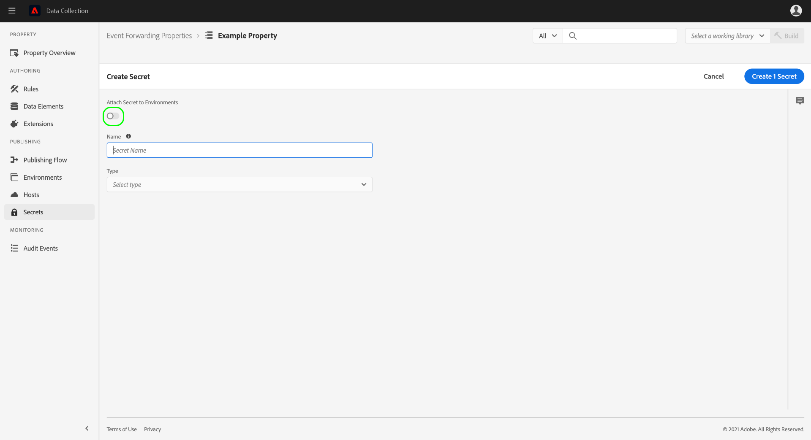
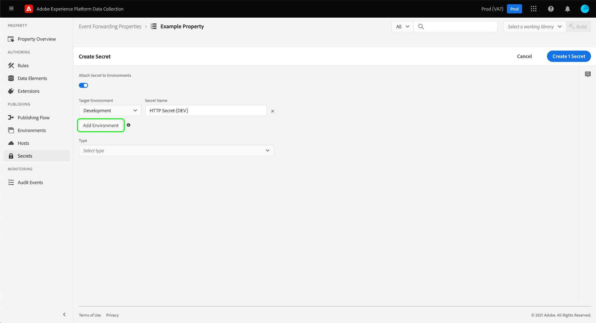
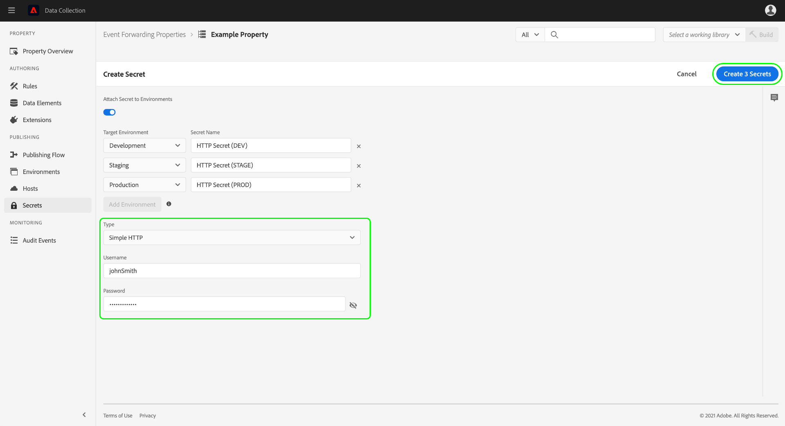
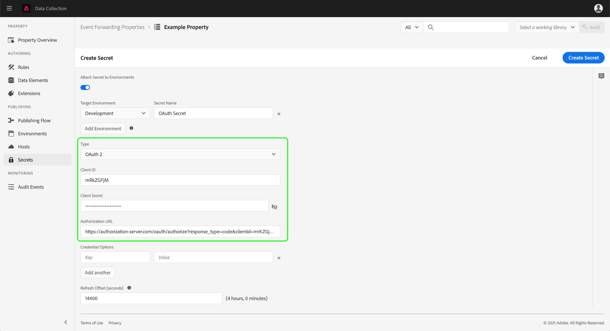
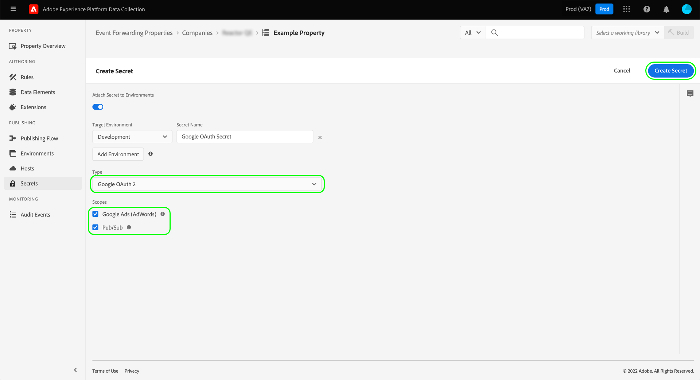
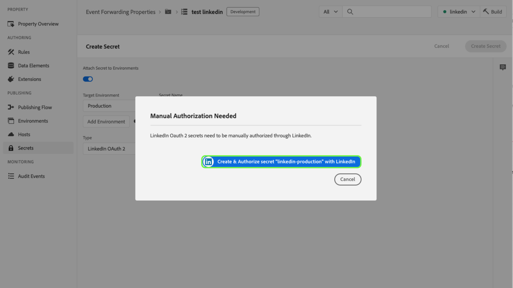

# Configuration de secrets dans le transfert d’événements

Dans le transfert dʼévénement, un secret est une ressource qui représente des informations dʼidentification pour sʼauthentifier auprès dʼun autre système, ce qui permet lʼéchange sécurisé de données. Les secrets ne peuvent être créés que dans les propriétés de transfert dʼévénement.

Les types de secrets suivants sont actuellement pris en charge :

| Type de secret | Description |
| --- | --- |
| [!UICONTROL Amazon OAuth 2] | Permet une authentification sécurisée avec les services [!DNL Amazon]. Le système stocke le jeton en toute sécurité et gère son renouvellement à des intervalles spécifiés. |
| [!UICONTROL Google OAuth 2] | Contient plusieurs attributs pour prendre en charge la spécification d’authentification [OAuth 2.0](https://datatracker.ietf.org/doc/html/rfc6749) pour une utilisation dans l’[API Google Ads](https://developers.google.com/google-ads/api/docs/oauth/overview) et l’[API Pub/Sub](https://cloud.google.com/pubsub/docs/reference/service_apis_overview). Le système vous demande les informations requises, puis gère le renouvellement de ces jetons pour vous à un intervalle spécifié. |
| [!UICONTROL HTTP] | Contient deux attributs de chaîne pour un nom dʼutilisateur et un mot de passe, respectivement. |
| [!UICONTROL [!DNL LinkedIn] OAuth 2] | Le système vous demande les informations requises, puis gère le renouvellement de ces jetons pour vous à un intervalle spécifié. |
| [!UICONTROL OAuth 2] | Contient plusieurs attributs pour prendre en charge le [type d’octroi des informations d’identification du client](https://datatracker.ietf.org/doc/html/rfc6749#section-1.3.4) pour la spécification d’authentification [OAuth 2.0](https://datatracker.ietf.org/doc/html/rfc6749). Le système vous demande les informations requises, puis gère le renouvellement de ces jetons pour vous à un intervalle spécifié. |
| [!UICONTROL OAuth 2 JWT] | Contient plusieurs attributs pour la prise en charge du profil JSON Web Token (JWT) pour les autorisations [OAuth 2.0](https://datatracker.ietf.org/doc/html/rfc7523#section-2.1). Le système vous demande les informations requises, puis gère le renouvellement de ces jetons pour vous à un intervalle spécifié. |
| [!UICONTROL Token] | Chaîne unique de caractères représentant une valeur de jeton dʼauthentification connue et comprise par les deux systèmes. |

{style="table-layout:auto"}

Ce guide fournit un aperçu général de la configuration des secrets d’une propriété de transfert d’événement ([!UICONTROL Edge]) dans l’interface utilisateur d’Experience Platform ou l’interface utilisateur de la collecte de données.

>[!NOTE]
>
>Pour obtenir des instructions détaillées sur la gestion des secrets dans lʼAPI Reactor, notamment un exemple JSON de la structure dʼun secret, reportez-vous au [guide de lʼAPI Secrets](../../api/guides/secrets.md).

## Conditions préalables

Avant dʼutiliser ce guide, assurez-vous au préalable de savoir comment gérer les ressources pour les balises et le transfert dʼévénement dans lʼinterface utilisateur, y compris comment créer un élément de données et une règle de transfert dʼévénement. Si vous avez besoin dʼune présentation, consultez le guide sur la [gestion des ressources](../managing-resources/overview.md).

Vous devez également posséder une compréhension pratique du flux de publication pour les balises et le transfert dʼévénement, y compris la manière dʼajouter des ressources à une bibliothèque et dʼinstaller une version de celle-ci sur votre site web à des fins de test. Pour plus dʼinformations, voir [présentation de la publication](../publishing/overview.md).

## Créer un secret {#create}

>[!CONTEXTUALHELP]
>id="platform_eventforwarding_secrets_environments"
>title="Environnements pour les secrets"
>abstract="Pour être utilisé par le transfert dʼévénement, un secret doit dʼabord être affecté à un environnement existant. Si aucun environnement n’est créé pour votre propriété de transfert d’événement, vous devez le configurer avant de continuer."
>additional-url="https://experienceleague.adobe.com/docs/experience-platform/tags/publish/environments/environments.html?lang=fr" text="Présentation des environnements"

Pour créer un secret, sélectionnez **[!UICONTROL Event Forwarding]** dans le volet de navigation de gauche, puis ouvrez la propriété de transfert d’événement sous laquelle vous souhaitez ajouter le secret. Sélectionnez ensuite **[!UICONTROL Secrets]** dans le volet de navigation de gauche, puis **[!UICONTROL Create New Secret]**.

Lʼécran suivant vous permet de configurer les détails du secret. Pour être utilisé par le transfert dʼévénement, un secret doit dʼabord être affecté à un environnement existant. Si aucun environnement nʼest créé pour votre propriété de transfert dʼévénement, consultez le guide sur les [environnements](../publishing/environments.md) pour obtenir des conseils sur la façon de les configurer avant de poursuivre.

>[!NOTE]
>
>Si vous souhaitez toujours créer et enregistrer le secret avant de l’ajouter à un environnement, désactivez le bouton (bascule) **[!UICONTROL Attach Secret to Environments]** avant de renseigner le reste des informations. Notez que vous devrez affecter le secret à un environnement par la suite si vous souhaitez lʼutiliser.
>
>

Sous **[!UICONTROL Target Environment]**, utilisez le menu déroulant pour sélectionner l’environnement auquel vous souhaitez attribuer le secret. Sous **[!UICONTROL Secret Name]**, attribuez un nom au secret dans le contexte de l’environnement. Chaque secret au sein de la propriété de transfert dʼévénement doit posséder un nom unique.

Un secret ne peut être attribué quʼà un environnement à la fois, mais vous pouvez attribuer les mêmes informations dʼidentification à plusieurs secrets au sein de différents environnements si vous le souhaitez. Sélectionnez **[!UICONTROL Add Environment]** pour ajouter une autre ligne à la liste.

Pour chaque environnement ajouté, vous devez attribuer un nouveau nom unique pour le secret associé. Si vous avez épuisé tous les environnements disponibles, le bouton **[!UICONTROL Add Environment]** n’est pas disponible.

À partir de là, les étapes de création du secret varient en fonction du type de secret que vous souhaitez créer. Consultez les sous-sections ci-dessous pour plus de détails :

* [[!UICONTROL Token]](#token)
* [[!UICONTROL HTTP]](#http)
* [[!UICONTROL OAuth 2]](#oauth2)
* [[!UICONTROL OAuth 2 JWT]](#oauth2jwt)
* [[!UICONTROL Google OAuth 2]](#google-oauth2)
* [[!UICONTROL [!DNL LinkedIn] OAuth 2]](#linkedin-oauth2)
* [[!UICONTROL [!DNL Amazon] OAuth 2]](#amazon-oauth2)

### [!UICONTROL Token] {#token}

Pour créer un secret de jeton, sélectionnez **[!UICONTROL Token]** dans la liste déroulante **[!UICONTROL Type]** . Dans le champ **[!UICONTROL Token]** qui s’affiche, indiquez la chaîne d’identification reconnue par le système auquel vous vous authentifiez. Sélectionnez **[!UICONTROL Create Secret]** pour enregistrer le secret.

### [!UICONTROL HTTP] {#http}

Pour créer un secret HTTP, sélectionnez **[!UICONTROL Simple HTTP]** dans la liste déroulante **[!UICONTROL Type]** . Dans les champs qui s’affichent ci-dessous, indiquez un nom d’utilisateur et un mot de passe pour les informations d’identification avant de sélectionner **[!UICONTROL Create Secret]** pour enregistrer le secret.

>[!NOTE]
>
>Lors de l’enregistrement, les informations d’identification sont codées à l’aide du [schéma d’authentification HTTP « basique »](https://www.rfc-editor.org/rfc/rfc7617.html).

### [!UICONTROL OAuth 2] {#oauth2}

Pour créer un secret OAuth 2, sélectionnez **[!UICONTROL OAuth 2]** dans la liste déroulante **[!UICONTROL Type]** . Dans les champs qui s’affichent ci-dessous, fournissez vos [[!UICONTROL Client ID] et [!UICONTROL Client Secret]](https://www.oauth.com/oauth2-servers/client-registration/client-id-secret/), ainsi que votre [[!UICONTROL Token URL]](https://www.oauth.com/oauth2-servers/access-tokens/client-credentials/) pour votre intégration OAuth. Le champ [!UICONTROL Token URL] de l’interface utilisateur est une concaténation entre l’hôte du serveur d’autorisation et le chemin d’accès au jeton.

Sous **[!UICONTROL Credential Options]**, vous pouvez fournir d’autres options d’identification telles que `scope` et `audience` sous la forme de paires clé-valeur. Pour ajouter d’autres paires clé-valeur, sélectionnez **[!UICONTROL Add another]**.

Enfin, vous pouvez configurer la valeur **[!UICONTROL Refresh Offset]** pour le secret. Cette valeur représente le nombre de secondes avant l’expiration du jeton pendant lesquelles le système effectue une actualisation automatique. L’équivalent en heures et minutes s’affiche à droite du champ et se met automatiquement à jour au fur et à mesure que vous tapez.

Par exemple, si le décalage d’actualisation est défini sur la valeur par défaut de `14400` (quatre heures) et le jeton d’accès comporte une valeur `expires_in` de `86400` (24 heures), le système actualisera automatiquement le secret dans 20 heures.

>[!IMPORTANT]
>
>Un secret OAuth nécessite au moins quatre heures entre les actualisations et doit également être valide pendant au moins huit heures. Cette restriction vous donne un minimum de quatre heures pour intervenir en cas de problème avec le jeton généré.
>
>Par exemple, si le décalage est défini sur `28800` (huit heures) et le jeton d’accès comporte un `expires_in` de `36000` (dix heures), l’échange échouerait, car la différence en résultant serait inférieure à quatre heures.

Lorsque vous avez terminé, sélectionnez **[!UICONTROL Create Secret]** pour enregistrer le secret.

### [!UICONTROL OAuth 2 JWT] {#oauth2jwt}

Pour créer un secret JWT OAuth 2, sélectionnez **[!UICONTROL OAuth 2 JWT]** dans la liste déroulante **[!UICONTROL Type]** .

![Onglet [!UICONTROL Create Secret] avec le secret JWT OAuth 2 mis en surbrillance dans le menu déroulant [!UICONTROL Type].](../../images/ui/event-forwarding/secrets/oauth-jwt-secret.png)

>[!NOTE]
>
>La seule [!UICONTROL Algorithm] actuellement prise en charge pour la signature du jeton JWT est RS256.

Dans les champs qui s’affichent ci-dessous, fournissez vos [!UICONTROL Issuer], [!UICONTROL Subject], [!UICONTROL Audience], [!UICONTROL Custom Claims] et [!UICONTROL TTL], puis sélectionnez le [!UICONTROL Algorithm] dans la liste déroulante. Saisissez ensuite le [!UICONTROL Private Key Id], ainsi que votre [[!UICONTROL Token URL]](https://www.oauth.com/oauth2-servers/access-tokens/client-credentials/) pour votre intégration OAuth. Le champ [!UICONTROL Token URL] n’est pas obligatoire. Si une valeur est fournie, le jeton JWT est échangé avec un jeton d’accès. Le secret sera actualisé en fonction de l’attribut `expires_in` de la réponse et de la valeur [!UICONTROL Refresh Offset]. Si aucune valeur n’est fournie, le secret transmis à Edge est le JWT. Le jeton JWT sera actualisé en fonction des valeurs [!UICONTROL TTL] et [!UICONTROL Refresh Offset].

![Onglet [!UICONTROL Create Secret] avec une sélection de champs de saisie en surbrillance.](../../images/ui/event-forwarding/secrets/oauth-jwt-information.png)

Sous **[!UICONTROL Credential Options]**, vous pouvez fournir d’autres options d’identification telles que `jwt_param` sous la forme de paires clé-valeur. Pour ajouter d’autres paires clé-valeur, sélectionnez **[!UICONTROL Add another]**.

![Onglet [!UICONTROL Create Secret] mettant en surbrillance les champs [!UICONTROL Credential Options].](../../images/ui/event-forwarding/secrets/oauth-jwt-credential-options.png)

Enfin, vous pouvez configurer la valeur **[!UICONTROL Refresh Offset]** pour le secret. Cette valeur représente le nombre de secondes avant l’expiration du jeton pendant lesquelles le système effectue une actualisation automatique. L’équivalent en heures et minutes s’affiche à droite du champ et se met automatiquement à jour au fur et à mesure que vous tapez.

![Onglet [!UICONTROL Create Secret] mettant en surbrillance le champ [!UICONTROL Refresh Offset].](../../images/ui/event-forwarding/secrets/oauth-jwt-refresh-offset.png)

Par exemple, si le décalage d’actualisation est défini sur la valeur par défaut de `1800` (30 minutes) et que le jeton d’accès a une valeur `expires_in` de `3600` (une heure), le système actualisera automatiquement le secret dans une heure.

>[!IMPORTANT]
>
>Un secret JWT OAuth 2 nécessite au moins 30 minutes entre les actualisations et doit également être valide pendant au moins une heure. Cette restriction vous donne un minimum de 30 minutes pour intervenir en cas de problème avec le jeton généré.
>
>Par exemple, si le décalage est défini sur `1800` (30 minutes) et que le jeton d’accès a une `expires_in` de `2700` (45 minutes), l’échange échouerait, car la différence en résultant serait inférieure à 30 minutes.

Lorsque vous avez terminé, sélectionnez **[!UICONTROL Create Secret]** pour enregistrer le secret.

![Onglet [!UICONTROL Create Secret] mettant en surbrillance [!UICONTROL Create Secret]](../../images/ui/event-forwarding/secrets/oauth-jwt-create-secret.png)

### [!UICONTROL Google OAuth 2] {#google-oauth2}

Pour créer un secret OAuth 2 Google, sélectionnez **[!UICONTROL Google OAuth 2]** dans la liste déroulante **[!UICONTROL Type]** . Sous **[!UICONTROL Scopes]**, sélectionnez les API Google auxquelles vous souhaitez accorder l’accès à l’aide de ce secret. Les produits suivants sont actuellement pris en charge :

* [API Google Ads](https://developers.google.com/google-ads/api/docs/oauth/overview)
* [API Pub/Sub](https://cloud.google.com/pubsub/docs/reference/service_apis_overview)

Lorsque vous avez terminé, sélectionnez **[!UICONTROL Create Secret]**.

Une fenêtre contextuelle s’affiche pour vous informer que le secret doit être autorisé manuellement via Google. Sélectionnez **[!UICONTROL Create & Authorize]** pour continuer.

Une boîte de dialogue s’affiche et vous permet de saisir les informations d’identification de votre compte Google. Suivez les invites pour accorder l’accès au transfert d’événement à vos données sous la portée sélectionnée. Une fois le processus d’autorisation terminé, le secret est créé.

>[!IMPORTANT]
>
>Si votre organisation a défini une politique de réauthentification pour les applications Google Cloud, les secrets créés ne seront pas actualisés avec succès après l’expiration de l’authentification (entre 1 et 24 heures selon la configuration de la politique).
>
>Pour résoudre ce problème, connectez-vous à l’Admin Console Google et accédez à la page **[!DNL App access control]** afin de marquer l’application de transfert d’événement (Adobe Real-Time CDP Event Forwarding) comme [!DNL Trusted]. Reportez-vous à la documentation Google sur comment [définir des durées de session pour les services Google Cloud](https://support.google.com/a/answer/9368756) pour plus d’informations.

### [!UICONTROL [!DNL LinkedIn] OAuth 2] {#linkedin-oauth2}

Pour créer un secret OAuth 2 [!DNL LinkedIn], sélectionnez **[!UICONTROL [!DNL LinkedIn] OAuth 2]** dans la liste déroulante **[!UICONTROL Type]** . Ensuite, sélectionnez **[!UICONTROL Create Secret]**.

![Onglet [!UICONTROL Create Secret] avec le champ [!UICONTROL Type] en surbrillance.](../../images/ui/event-forwarding/secrets/linkedin-oauth.png)

Une fenêtre contextuelle s’affiche pour vous informer que le secret doit être autorisé manuellement via [!DNL LinkedIn]. Sélectionnez **[!UICONTROL Create & Authorize secret with [!DNL LinkedIn]]** pour continuer.

Une boîte de dialogue s’affiche vous invitant à saisir vos informations d’identification [!DNL LinkedIn]. Suivez les invites pour accorder l’accès au transfert d’événement à vos données.

Une fois le processus d’autorisation terminé, vous revenez à l’onglet **[!UICONTROL Secrets]** , où vous pouvez voir votre secret nouvellement créé. Vous pouvez voir ici le statut du secret et la date d’expiration.

![Onglet [!UICONTROL Secret] mettant en surbrillance le secret nouvellement créé.](../../images/ui/event-forwarding/secrets/linkedin-new-secret.png)

#### Réautoriser un secret [!UICONTROL [!DNL LinkedIn] OAuth 2]

>IMPORTANT
>
>Vous devez réautoriser l’utilisation de vos informations d’identification [!DNL LinkedIn] tous les 365 jours. Si vous n’autorisez pas la réautorisation en temps voulu, votre secret n’est pas actualisé et les demandes de conversion [!DNL LinkedIn] échouent.

Trois mois avant le secret qui nécessite une réautorisation, une fenêtre contextuelle commence à s’afficher lorsque vous parcourez une page de la propriété. Sélectionnez **[!UICONTROL Click here to go to your secrets]**.

![Onglet [!UICONTROL Property Overview] mettant en surbrillance la fenêtre contextuelle de réautorisation secrète.](../../images/ui/event-forwarding/secrets/linkedin-reauthorization-popup.png)

Vous êtes redirigé vers l’onglet [!UICONTROL Secrets] . Les secrets répertoriés sur cette page sont filtrés afin d’afficher uniquement les secrets qui doivent être réautorisés. Sélectionnez **[!UICONTROL Auth Needed]** pour le secret que vous devez réautoriser.

![Onglet [!UICONTROL Secret] mettant en surbrillance [!UICONTROL Auth Needed]pour le secret [!DNL LinkedIn].](../../images/ui/event-forwarding/secrets/linkedin-reauthorization.png)

Une boîte de dialogue s’affiche et vous invite à saisir vos informations d’identification [!DNL LinkedIn]. Suivez les invites pour réautoriser votre secret.

### [!UICONTROL [!DNL Amazon] OAuth 2] {#amazon-oauth2}

Pour créer un secret OAuth 2 [!DNL Amazon], sélectionnez **[!UICONTROL [!DNL Amazon] OAuth 2]** dans la liste déroulante **[!UICONTROL Type]** . Ensuite, sélectionnez **[!UICONTROL Create Secret]**.

![Onglet [!UICONTROL Create Secret] avec le champ [!UICONTROL Type] en surbrillance.](../../images/ui/event-forwarding/secrets/amazon-oauth.png)

Une fenêtre contextuelle s’affiche pour vous informer que le secret doit être autorisé manuellement via [!DNL Amazon]. Sélectionnez **[!UICONTROL Create & Authorize secret with [!DNL Amazon]]** pour continuer.

Fenêtre contextuelle d’autorisation 

Une boîte de dialogue s’affiche vous invitant à saisir vos informations d’identification [!DNL Amazon]. Suivez les invites pour accorder l’accès au transfert d’événement à vos données.

Une fois le processus d’autorisation terminé, vous revenez à l’onglet **[!UICONTROL Secrets]** , où vous pouvez voir votre secret nouvellement créé. Vous pouvez voir ici le statut du secret et la date d’expiration.

![Onglet [!UICONTROL Secret] mettant en surbrillance le secret nouvellement créé.](../../images/ui/event-forwarding/secrets/amazon-new-secret.png)

## Modifier un secret

Une fois que vous avez créé des secrets pour une propriété, vous pouvez les trouver dans l’espace de travail **[!UICONTROL Secrets]**. Pour modifier les détails d’un secret existant, sélectionnez son nom dans la liste.

L’écran suivant vous permet de modifier le nom et les informations d’identification du secret.

>[!NOTE]
>
>Si le secret est associé à un environnement existant, vous ne pouvez pas le réaffecter à un autre environnement. Si vous souhaitez utiliser les mêmes informations d’identification dans un environnement différent, vous devez [créer un nouveau secret](#create). Pour pouvoir réaffecter l’environnement de cet écran, il faut qu’il n’ait jamais préalablement été attribué à un environnement, ou que vous supprimiez l’environnement auquel le secret était attaché.

### Réessayer un échange secret

Vous pouvez réessayer ou actualiser un échange secret depuis l’écran d’édition. Ce processus varie en fonction du type de secret en cours de modification :

| Type de secret | Protocole de nouvel essai |
| --- | --- |
| [!UICONTROL Token] | Sélectionnez **[!UICONTROL Exchange Secret]** pour réessayer l’échange secret. Cette commande n’est disponible que lorsqu’un environnement est attaché au secret. |
| [!UICONTROL HTTP] | Si aucun environnement n’est associé au secret, sélectionnez **[!UICONTROL Exchange Secret]** pour échanger les informations d’identification vers base64. Si un environnement est joint, sélectionnez **[!UICONTROL Exchange and Deploy Secret]** pour passer en base64 et déployer le secret. |
| [!UICONTROL OAuth 2] | Sélectionnez **[!UICONTROL Generate Token]** pour échanger les informations d’identification et renvoyer un jeton d’accès du fournisseur d’authentification. |

## Supprimer un secret

Pour supprimer un secret existant dans l’espace de travail **[!UICONTROL Secrets]**, cochez la case en regard de son nom avant de sélectionner **[!UICONTROL Delete]**.

## Utilisation de secrets dans le transfert d’événements

Pour utiliser un secret dans le transfert d’événements, vous devez d’abord créer un [élément de données](../managing-resources/data-elements.md) qui fait référence au secret lui-même. Après avoir enregistré l’élément de données, vous pouvez l’inclure dans les [règles](../managing-resources/rules.md) du transfert d’événements et ajouter ces règles à une [bibliothèque](../publishing/libraries.md), qui peut à son tour être déployée sur les serveurs d’Adobe en tant que [version](../publishing/builds.md).

Lors de la création de l’élément de données, sélectionnez l’extension de **[!UICONTROL Core]**, puis sélectionnez **[!UICONTROL Secret]** pour le type d’élément de données. Le panneau de droite met à jour et fournit des commandes déroulantes pour attribuer jusqu’à trois secrets à l’élément de données : un pour [!UICONTROL Development], [!UICONTROL Staging] et [!UICONTROL Production], respectivement.

>[!NOTE]
>
>Seuls les secrets associés aux environnements de développement, d’évaluation et de production s’affichent pour leurs listes déroulantes respectives.

En attribuant plusieurs secrets à un élément de données unique et en l’incluant dans une règle, vous pouvez faire changer la valeur de l’élément de données en fonction de l’emplacement de la bibliothèque conteneur dans le [flux de publication](../publishing/publishing-flow.md).

>[!NOTE]
>
>Lors de la création de l’élément de données, un environnement de développement doit être affecté. Les secrets des environnements d’évaluation et de production ne sont pas requis, mais les versions qui tentent de passer à ces environnements échouent si leurs éléments de données de type secret n’ont pas de secret sélectionné pour l’environnement en question.

## Étapes suivantes

Ce guide explique comment gérer les secrets dans l’interface utilisateur. Pour plus d’informations sur l’interaction avec les secrets à l’aide de l’API Reactor, voir le [guide de points d’entrée des secrets](../../api/endpoints/secrets.md).
