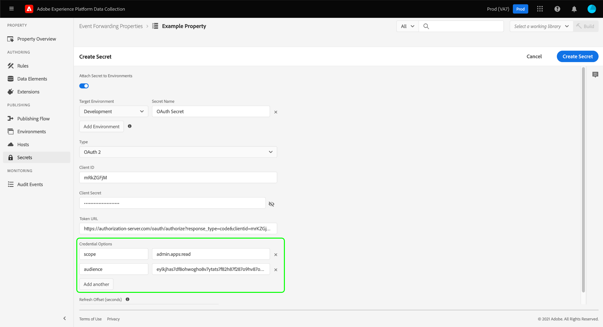

# Détail des transferts d&#39;événements

En cas de transfert, un secret est une ressource qui représente un identifiant d&#39;authentification pour un autre système, permettant l&#39;échange sécurisé de données. Les secrets peuvent uniquement être créés dans les propriétés de transfert d&#39;événements.

Il existe actuellement trois types de secret pris en charge :

| Type secret | Description |
| --- | --- |
| [!UICONTROL Jeton] | Chaîne unique de caractères représentant une valeur de jeton d’authentification connue et comprise par les deux systèmes. |
| [!UICONTROL HTTP] | Contient deux attributs de chaîne pour un nom d&#39;utilisateur et un mot de passe, respectivement. |
| [!UICONTROL OAuth2] | Contient plusieurs attributs pour prendre en charge le [OAuth2](https://datatracker.ietf.org/doc/html/rfc6749) spécification d&#39;authentification. Le système vous demande les informations requises, puis gère le renouvellement de ces jetons pour vous selon un intervalle spécifié. Actuellement, seul le [Informations d&#39;identification du client](https://datatracker.ietf.org/doc/html/rfc6749#section-1.3.4) la version d’OAuth2 est prise en charge. |

{style=&quot;table-layout:auto&quot;}

Ce guide fournit une vue d’ensemble de haut niveau sur la configuration des secrets pour un transfert d’événements ([!UICONTROL Edge]) dans l’interface utilisateur de collecte de données.

>[!NOTE]
>
>Pour obtenir des conseils détaillés sur la gestion des secrets dans l&#39;API du réacteur, y compris l&#39;exemple JSON de la structure d&#39;un secret, consultez la rubrique [guide d’API secrets](../../api/guides/secrets.md).

## Conditions préalables

Ce guide suppose que vous savez déjà comment gérer les ressources pour les balises et le transfert d&#39;événements dans l&#39;interface utilisateur de collecte de données, y compris comment créer un élément de données et une règle de transfert d&#39;événements. Consultez le guide sur [gestion des ressources](../managing-resources/overview.md) si vous avez besoin d&#39;une introduction.

Vous devez également avoir une bonne compréhension du flux de publication pour les balises et le transfert d’événements, y compris comment ajouter des ressources à une bibliothèque et installer une version sur votre site web pour le test. Voir la section [présentation de la publication](../publishing/overview.md) pour plus de détails.

## Création d’un secret {#create}

Pour créer un secret, connectez-vous à l&#39;interface utilisateur de collecte de données et ouvrez la propriété de transfert d&#39;événement sous laquelle vous souhaitez ajouter le secret. Ensuite, sélectionnez **[!UICONTROL Secrets]** dans la navigation de gauche, suivi de **[!UICONTROL Créer un secret]**.

L&#39;écran suivant vous permet de configurer les détails du secret. Pour qu&#39;un secret puisse être utilisé par le transfert d&#39;événements, il doit être affecté à un environnement existant. Si aucun environnement n’est créé pour votre propriété de transfert d’événement, consultez le guide sur [environnements](../publishing/environments.md) pour obtenir des conseils sur la façon de les configurer avant de continuer.

>[!NOTE]
>
>Si vous souhaitez toujours créer et enregistrer le secret avant de l’ajouter à un environnement, désactivez l’option **[!UICONTROL Joindre le secret aux environnements]** basculez avant de remplir le reste des informations. Notez que vous devrez l&#39;affecter ultérieurement à un environnement si vous souhaitez utiliser le secret.
>
>

Sous **[!UICONTROL Environnement cible]**, utilisez le menu déroulant pour sélectionner l’environnement auquel vous souhaitez affecter le secret. Sous **[!UICONTROL Nom secret]**, donnez un nom au secret dans le contexte de l&#39;environnement. Ce nom doit être unique dans tous les secrets sous la propriété de transfert d&#39;événement.

Un secret ne peut être attribué qu&#39;à un environnement à la fois, mais vous pouvez, si vous le souhaitez, affecter les mêmes informations d&#39;identification à plusieurs secrets dans différents environnements. Sélectionner **[!UICONTROL Ajouter un environnement]** pour ajouter une autre ligne à la liste.

Pour chaque environnement que vous ajoutez, vous devez fournir un autre nom unique pour le secret associé. Si vous épulez tous les environnements disponibles, la **[!UICONTROL Ajouter un environnement]** ne sera pas disponible.

À partir de là, les étapes de création du secret varient en fonction du type de secret que vous créez. Pour plus de détails, reportez-vous aux sous-sections ci-dessous :

* [[!UICONTROL Jeton]](#token)
* [[!UICONTROL HTTP]](#http)
* [[!UICONTROL OAuth2]](#oauth2)

### [!UICONTROL Jeton] {#token}

Pour créer un secret de jeton, sélectionnez **[!UICONTROL Jeton]** de **[!UICONTROL Type]** vers le bas. Dans la boîte de dialogue **[!UICONTROL Jeton]** qui s’affiche, indiquez la chaîne d’informations d’identification reconnue par le système auquel vous vous authentifiez. Sélectionner **[!UICONTROL Créer secret]** pour enregistrer le secret.

### [!UICONTROL HTTP] {#http}

Pour créer un secret HTTP, sélectionnez **[!UICONTROL HTTP simple]** de **[!UICONTROL Type]** vers le bas. Dans les champs qui apparaissent ci-dessous, indiquez un nom d’utilisateur et un mot de passe pour les informations d’identification avant de sélectionner **[!UICONTROL Créer secret]** pour enregistrer le secret.

>[!NOTE]
>
>Lors de l’enregistrement, les informations d’identification sont codées à l’aide de la [Schéma d&#39;authentification HTTP &quot;de base&quot;](https://www.rfc-editor.org/rfc/rfc7617.html).

### [!UICONTROL OAuth2] {#oauth2}

Pour créer un secret OAuth2, sélectionnez **[!UICONTROL OAuth2]** de **[!UICONTROL Type]** vers le bas. Dans les champs qui s’affichent ci-dessous, fournissez votre [[!UICONTROL ID client] et [!UICONTROL Secret client]](https://www.oauth.com/oauth2-servers/client-registration/client-id-secret/), ainsi que votre [URL d’autorisation](https://www.oauth.com/oauth2-servers/access-tokens/client-credentials/) pour votre intégration OAuth. Le [!UICONTROL URL d’autorisation] dans l’interface utilisateur de collecte de données est une concaténation entre l’hôte du serveur d’autorisation et le chemin d’accès du jeton.

Sous **[!UICONTROL Options d’informations d’identification]**, vous pouvez fournir d’autres options d’informations d’identification, telles que `scope` et `audience` sous la forme de paires clé-valeur. Pour ajouter d’autres paires clé-valeur, sélectionnez **[!UICONTROL Ajouter un autre]**.

Enfin, vous pouvez configurer l’option **[!UICONTROL Actualiser le décalage]** pour le secret. Cela représente le nombre de secondes avant l&#39;expiration du jeton pendant lequel le système effectue une actualisation automatique. Le temps équivalent en heures et minutes s’affiche à droite du champ et se met automatiquement à jour à mesure que vous tapez.

Par exemple, si le décalage d’actualisation est défini sur la valeur par défaut de `14400` (quatre heures) et le jeton d’accès possède un `expires_in` valeur de `86400` (24 heures), le système actualisera automatiquement le secret dans 20 heures.

>[!IMPORTANT]
>
>Un secret OAuth nécessite au moins quatre heures entre les rafraîchissements et doit également être valide pendant au moins huit heures. Cette restriction vous donne un minimum de quatre heures pour intervenir si des problèmes surviennent avec le jeton généré.
>
>Par exemple, si le décalage est défini sur `28800` (huit heures) et le jeton d’accès possède un `expires_in` de `36000` (dix heures), l&#39;échange échouerait parce que la différence résultante serait inférieure à quatre heures.

Lorsque vous avez terminé, sélectionnez **[!UICONTROL Créer secret]** pour enregistrer le secret.

## Modification d’un secret

Une fois que vous avez créé des secrets pour une propriété, vous pouvez les trouver dans la liste **[!UICONTROL Secrets]** espace de travail. Pour modifier les détails d&#39;un secret existant, sélectionnez son nom dans la liste.

L’écran suivant vous permet de modifier le nom et les informations d’identification du secret.

>[!NOTE]
>
>Si le secret est associé à un environnement existant, vous ne pouvez pas le réattribuer à un autre environnement. Si vous souhaitez utiliser les mêmes informations d’identification sur un autre environnement, vous devez [créer un nouveau secret](#create) au lieu de cela. La seule façon de réaffecter l&#39;environnement de cet écran est si vous n&#39;avez jamais attribué le secret à un environnement à l&#39;avance ou si vous avez supprimé l&#39;environnement auquel le secret était attaché.

### Réessayer un échange secret

Vous pouvez réessayer ou actualiser un échange secret à partir de l’écran d’édition. Ce processus varie en fonction du type de secret en cours de modification :

| Type secret | Protocole de nouvelle tentative |
| --- | --- |
| [!UICONTROL Jeton] | Sélectionner **[!UICONTROL Secret Exchange]** pour essayer à nouveau l&#39;échange secret. Ce contrôle n&#39;est disponible que lorsqu&#39;un environnement est associé au secret. |
| [!UICONTROL HTTP] | Si aucun environnement n’est associé au secret, sélectionnez **[!UICONTROL Secret Exchange]** pour échanger les informations d&#39;identification vers base64. Si un environnement est associé, sélectionnez Sélectionner **[!UICONTROL Exchange et Déployer le secret]** pour échanger vers base64 et déployer le secret vers Cloudfare. |
| [!UICONTROL OAuth2] | Sélectionner **[!UICONTROL Générer un jeton]** pour échanger les informations d’identification et renvoyer un jeton d’accès à partir du fournisseur d’authentification. |

## Suppression d’un secret

Pour supprimer un secret existant dans le fichier  **[!UICONTROL Secrets]** , cochez la case en regard de son nom avant de sélectionner **[!UICONTROL Supprimer]**.

## Utilisation de secrets dans le transfert d’événements

Pour utiliser un secret dans le transfert d&#39;événements, vous devez d&#39;abord créer un [élément de données](../managing-resources/data-elements.md) cela fait référence au secret lui-même. Après avoir enregistré l’élément de données, vous pouvez l’inclure dans le transfert d’événements. [règles](../managing-resources/rules.md) et ajoutez ces règles à un [bibliothèque](../publishing/libraries.md), qui peuvent à leur tour être déployées sur les serveurs d’Adobes en tant que [construire](../publishing/builds.md).

Lors de la création de l’élément de données, sélectionnez l’option **[!UICONTROL Core]** , puis sélectionnez **[!UICONTROL Secret]** pour le type d’élément de données. Le panneau droit est mis à jour et fournit des commandes de liste déroulante permettant d’attribuer jusqu’à trois secrets à l’élément de données : un pour [!UICONTROL Développement], [!UICONTROL Stabilisation]et [!UICONTROL Production] respectivement.

>[!NOTE]
>
>Seuls les secrets liés aux environnements de développement, de préparation et de production s’affichent pour leurs listes déroulantes respectives.

En attribuant plusieurs secrets à un seul élément de données et en y incluant une règle, vous pouvez faire en sorte que la valeur de l’élément de données change en fonction de l’emplacement de la bibliothèque conteneur dans le fichier [flux de publication](../publishing/publishing-flow.md).

>[!NOTE]
>
>Lors de la création de l’élément de données, un environnement de développement doit être affecté. Les secrets pour les environnements de production et de transit ne sont pas nécessaires, mais les versions qui tentent de passer à ces environnements échoueront si leurs éléments de données de type secret n&#39;ont pas sélectionné de secret pour l&#39;environnement en question.

## Étapes suivantes

Ce guide explique comment gérer les secrets dans l&#39;interface utilisateur de collecte de données. Pour plus d’informations sur l’interaction avec des secrets à l’aide de l’API Reactor, consultez la section [guide de point de terminaison secrets](../../api/endpoints/secrets.md).
