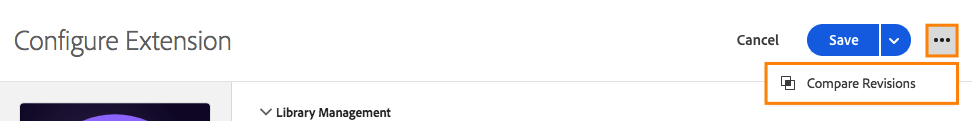

# Comparaison des révisions des ressources

Comparez des révisions des ressources pour afficher l’historique d’une ressource individuelle.  Vous pouvez comparer l’état actuel de la ressource à des versions plus anciennes ou comparer la version actuellement publiée d’une ressource au jeu de modifications le plus récent qui a été enregistré.

## Lancer une comparaison

Le lancement d’une comparaison est le même pour tous les types de ressources. Ouvrez la vue Edit (Modifier) d’une ressource individuelle, puis recherchez l’icône de trois points située en regard du bouton **[!UICONTROL Save]** pour afficher les actions disponibles pour cette ressource.  Sélectionnez **[!UICONTROL Compare Revisions]** dans la liste.

Pour les extensions, accédez à la vue détaillée en cliquant sur le bouton **[!UICONTROL Configure]** lors de l’affichage de votre liste d’extensions installées.  Pour les éléments de données et les règles, sélectionnez-en un dans la liste.

## Utilisation de la vue Compare (Comparer)

Lorsque vous lancez une comparaison, la vue par défaut affiche la dernière version sur la droite. Cette version comprend toutes les modifications non enregistrées que vous avez apportées à la ressource dans la vue Edit (Modifier). (Notez le libellé « Unsaved Changes » (Modifications non enregistrées) sur la partie droite de l’image ci-dessous.)

Sur la gauche, vous pouvez sélectionner l’une des révisions existantes pour comparer la valeur Latest (Le plus récent).

Cliquez sur **[!UICONTROL Use These Changes]** pour copier les paramètres de votre révision sélectionnée (à gauche) à la version la plus récente (à droite).  Cette opération copie les paramètres de l’ancienne révision vers les modifications non enregistrées les plus récentes.  Si vous souhaitez que ces modifications soient conservées, veillez à **[!UICONTROL Save]** après avoir quitté la vue Compare (Comparer).

>[!TIP]
>Les ressources individuelles peuvent avoir à la fois des attributs et des paramètres. Ces paramètres sont stockés sous la forme de bloc JSON, qui est une méthode structurée de stockage des données, mais suffisamment flexible pour que les développeurs d’extensions puissent y placer ce dont ils ont besoin pour que leurs extensions effectuent les opérations souhaitées.
>La version initiale de la vue Compare (Comparer) affiche les paramètres sous leur forme brute, comme JSON. Les futures améliorations vous permettront d’afficher les versions de différentes manières, notamment des comparaisons de code détaillées et en utilisant des vues d’extension fournies par les développeurs d’extensions.

## Comparaison d’extensions

Les extensions ont un seul écran pour montrer les différences entre les versions.

En mode Compare (Comparer), les différences entre les versions des paramètres sont surlignées. Les ajouts et les suppressions par rapport aux paramètres individuels sont indiqués par l’extension d’une ligne dans l’une ou l’autre direction.

Vous trouverez ci-dessus les modifications suivantes :

* L’extension [!DNL Adobe Analytics] est mise à jour vers une nouvelle version, indiquée par les numéros de version en orange sur la partie supérieure.
* Les paramètres `orgID` et `currencyCode` sont modifiés par les paramètres indiqués par l’extension de la section orange dans les paramètres.

## Comparaison d’éléments de données

Les éléments de données ont un seul écran pour montrer les différences, mais comme les éléments de données possèdent des attributs supplémentaires en plus de leurs paramètres, des informations supplémentaires s’affichent. Les attributs qui ont changé sont surlignés en orange.

Vous trouverez ci-dessus les modifications suivantes :

* Le nom « Page Name 2 » (Nom de page 2) a été remplacé par « My Special Page Name » (Mon nom de page spécial), comme l’indique la barre orange.
* Le type « JavaScript Variable » (Variable JavaScript) a été remplacé par Page Info (Informations sur la page).
* La valeur par défaut « b » a été ajoutée.
* L’option « Force lowercase value » (Forcer l’utilisation de minuscules pour la valeur) a été sélectionnée.
* L’option « Clean text » (Texte clair) a été sélectionnée.
* Les paramètres ont changé. (Les paramètres relatifs au type JavaScript Variable (Variable JavaScript) diffèrent du type Page Info (Informations sur la page)).

Dans les cas où le bloc de paramètres est volumineux, vous pouvez développer la section des paramètres pour un meilleur affichage.

## Comparaison de règles

Les règles se composent de plusieurs composants. Pour comprendre les modifications apportées à une règle, vous devez être familiarisé avec l’ajout et la suppression de composants, ainsi qu’avec les modifications apportées à un composant individuel. Ainsi, lorsque vous comparez des versions d’une règle, il existe en réalité deux écrans.

Le premier écran affiche une vue de haut niveau, qui met en surbrillance les modifications apportées à la disposition des composants des règles au sein de la règle. Les modifications sont mises en surbrillance. Plusieurs types de modifications sont affichés.

Vous trouverez ci-dessus les modifications suivantes :

* Le nom de la règle « Analytics » modifié par « Baseline Analytics », indiqué par la barre orange par Name (Nom).
* La condition « Core - Domain » (Core - Domaine) a été ajoutée, comme l’indique l’icône « + » orange et l’ajout du composant sur la droite.
* L’action « [!DNL Adobe Analytics] - Clear Variables » (Adobe Analytics - Effacer des variables) a été supprimée, comme l’indique l’icône « - » orange et l’absence du composant sur la droite.
* L’action « [!DNL Adobe Analytics] - Set Variables » (Adobe Analytics - Définir les variables) a été modifiée, comme l’indique la ligne orange entre les versions du composant sur les côtés gauche et droit. Cette ligne est droite si l’ordre des composants n’a pas changé.
* L’action « [!DNL Adobe Analytics] - Set Variables » (Adobe Analytics - Définir les variables) et l’ordre d’action « [!DNL Adobe Analytics] - Send Beacon » (Adobe Analytics - Envoyer la balise) ont changé, comme l’indiquent les lignes incurvées reliant les différentes versions des composants sur les côtés gauche et droit.

Pour afficher les modifications spécifiques apportées à l’un des composants d’une règle, cliquez sur le composant spécifique que vous voulez afficher.  La ligne devient bleue lorsque vous la survolez à l’aide de la souris.

La comparaison pour un composant de règle individuel se comporte comme la comparaison pour un élément de données.

Vous trouverez ci-dessus la modification suivante :

* Le composant de règle a été modifié pour ajouter eVar2 avec la valeur « 1 ».

Dans les cas où le bloc de paramètres est volumineux, vous pouvez développer la section des paramètres pour un meilleur affichage.
