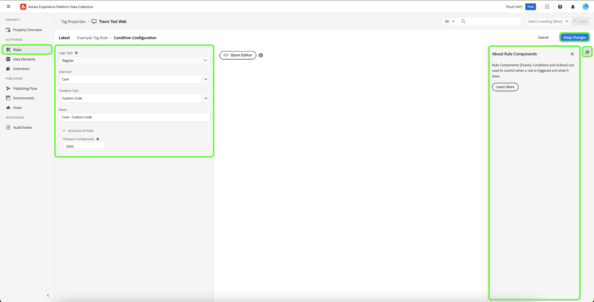

# Règles

>[!NOTE]
>
>Adobe Experience Platform Launch est désormais une suite de technologies destinées à la collecte de données dans Adobe Experience Platform. Plusieurs modifications terminologiques ont par conséquent été apportées à la documentation du produit. Reportez-vous au [document](../../term-updates.md) suivant pour consulter une référence consolidée des modifications terminologiques.

Dans Adobe Experience Platform, les balises obéissent à un système basé sur des règles. Elles recherchent les interactions utilisateur et les données associées. Lorsque les critères définis dans votre règle sont satisfaits, la règle déclenche l’extension, le script ou le code côté client que vous avez identifié.

Créez des règles pour intégrer les données et les fonctionnalités du marketing, ainsi qu’une technologie d’annonces qui rassemble les produits disparates en une seule solution.

## Structure de règle

**Événements (If) :** l’événement est l’élément que la règle doit rechercher. Il est défini en sélectionnant un événement, toutes les conditions applicables et toutes les exceptions.

**Actions (Then) :** les déclencheurs surviennent après que les événements d’une règle ont lieu et que toutes les conditions sont satisfaites. Une règle de balise peut déclencher autant d’actions discrètes que vous souhaitez et vous pouvez contrôler l’ordre dans lequel elles se produisent. Par exemple, une règle unique pour une page de remerciements d’un site de commerce électronique peut déclencher vos outils d’analyse et balises tierces. Il n’est pas nécessaire de créer une règle distincte pour chaque extension ou balise.

Vous pouvez ajouter d’autres types d’événements. Plusieurs événements sont associés à l’aide d’un opérateur OR. Les conditions de la règle seront donc évaluées si l’un des événements est satisfait.

>[!IMPORTANT]
>
>Les modifications ne prennent effet que lorsqu’elles sont [publiées](../publishing/overview.md).

### Événements et conditions (if)

Les événements avec des conditions sont la composante *If* d’une règle.

Si un événement spécifié se produit, les conditions sont évaluées, puis les actions spécifiées ont lieu si nécessaire.

* **Événements** : indiquez un ou plusieurs événements devant avoir lieu pour déclencher la règle. Plusieurs événements sont unis par un opérateur OR. L’un des événements spécifiés va déclencher la règle.

* **Conditions** : circonscrivez l’événement en configurant les conditions qui doivent être vraies pour qu’un événement déclenche la règle. Une exception est définie comme une condition NOT. Plusieurs conditions sont réunies par un opérateur AND.

Les événements disponibles dépendent des extensions installées. Pour plus d’informations sur les événements dans l’extension Core, reportez-vous à [Types d’événements de l’extension Core](../../extensions/client/core/overview.md#core-extension-event-types).

### Actions (Then)

Les actions sont la partie *Then* d’une règle. Elles définissent ce que vous voulez qu’il se passe lorsque la règle s’exécute. Lorsqu’un événement est déclenché, si les conditions prennent la valeur true (vrai) et si les exceptions prennent la valeur false (faux), les actions sont effectuées. Vous pouvez faire glisser et déposer des actions pour les organiser selon vos besoins.

## Créez une règle

Créez une règle en indiquant les actions qui se produisent si une condition est remplie.

>[!TIP]
>
>Vous pouvez afficher d’autres ressources disponibles pour en savoir plus sur cette fonctionnalité en sélectionnant  dans le panneau de droite.

1. Ouvrez lʼonglet [!UICONTROL Règles], puis sélectionnez **[!UICONTROL Créer une règle]**.

   

1. Attribuez un nom à la règle.
1. Cliquez sur lʼicône **[!UICONTROL Ajouter]** sous Événements.
1. Sélectionnez votre extension et l’un des types d’événements disponibles pour cette extension, puis configurez les paramètres de l’événement.

   

   Les types d’événement disponibles dépendent de l’extension sélectionnée. Les paramètres de l’événement diffèrent en fonction du type d’événement. Certains événements ne comportent aucun paramètre à configurer.

   >[!IMPORTANT]
   >
   >Dans une règle côté client, les éléments de données sont segmentés en unités lexicales avec un `%` au début et à la fin du nom de l’élément de données. Par exemple : `%viewportHeight%`. Dans une règle de transfert d’événements, les éléments de données sont segmentés en unités lexicales avec `{{` au début et `}}` à la fin du nom de l’élément de données. Par exemple : `{{viewportHeight}}`.

   Pour référencer des données à partir du réseau Edge, le chemin d’accès de l’élément de données doit être `arc.event._<element>_`.

   `arc` désigne Adobe Response Context.

   Par exemple : `arc.event.xdm.web.webPageDetails.URL`

   >[!IMPORTANT]
   >
   >Si ce chemin d’accès n’est pas spécifié correctement, les données ne sont pas collectées.

1. Définissez le paramètre Ordre, puis cliquez sur **[!UICONTROL Conserver les modifications]**.

   L’ordre par défaut pour tous les composants de règle est 50. Si vous souhaitez l’exécuter plus tôt, attribuez-lui un nombre inférieur à 50.

   * L’ordre d’exécution est l’ordre des nombres. 1 vient avant 3. 3 vient avant 10. 10 vient avant 100, etc.
   * Les règles qui ont le même ordre s’exécutent sans ordre particulier.
   * Les règles sont déclenchées dans l’ordre, mais pas nécessairement dans le même ordre. Si Règle A et Règle B partagent un événement et que vous attribuez un ordre pour que cette Règle A vienne en premier lieu, alors si Règle A fait quelque chose de manière asynchrone, il n’est pas garanti que Règle A se termine avant que Règle B ne commence.

     Si vous souhaitez qu’elle s’exécute plus tard, attribuez-lui un nombre supérieur à 50. Pour plus d’informations sur l’ordre, reportez-vous à [Ordre des règles](rules.md#rule-ordering).

1. Sélectionnez l’icône **[!UICONTROL Ajouter]** de Conditions, puis sélectionnez un type de logique, une extension, un type de condition et configurez les paramètres de votre condition. Sélectionnez ensuite **[!UICONTROL Conserver les modifications]**.

   

   Les types de conditions disponibles dépendent de l’extension sélectionnée. Les paramètres de conditions diffèrent en fonction du type de condition.

   Type de logique :

   * Le type de logique normal permet l’exécution d’actions si la condition est remplie.
   * Le type de logique exceptionnel empêche l’exécution d’actions si la condition est remplie.

   (Avancé) Délai d’expiration : Cette option est disponible lorsque le séquencement des composants de règle est activé sur votre propriété. Cet attribut définit la durée maximale autorisée pour l’exécution de la condition. Si le délai d’expiration est atteint, la condition échoue et le reste des conditions et actions de la règle est supprimé de la file d’attente de traitement. La valeur par défaut est de 2 000 ms.

   Vous pouvez ajouter autant de conditions que vous le souhaitez. Plusieurs conditions dans la même règle sont jointes avec AND.

1. Sélectionnez l’icône Actions **[!UICONTROL Ajouter]** , puis sélectionnez votre extension et l’un des types d’actions disponibles pour cette extension, configurez les paramètres de l’action, puis sélectionnez **[!UICONTROL Conserver les modifications]**.

   

   Les types d’action disponibles dépendent de l’extension que vous avez sélectionnée. Les paramètres d’action diffèrent selon le type d’action.

   (Avancé) Attendre avant d’exécuter l’action suivante : Cette option est disponible lorsque le séquencement des composants de règle est activé sur votre propriété. Lorsque cette option est cochée, les balises n’appellent pas l’action suivante tant que celle-ci n’est pas terminée. Lorsque cette option est désactivée, l’action suivante commence à s’exécuter immédiatement. La valeur par défaut est **[!UICONTROL Activé]**.

   (Avancé) Délai d’expiration : Cette option est disponible lorsque le séquencement des composants de règle est activé sur votre propriété. Il définit la durée maximale autorisée pour l’achèvement de l’action. Si le délai d’expiration est atteint, l’action échoue et toutes les actions suivantes de cette règle sont supprimées de la file d’attente de traitement. La valeur par défaut est de 2 000 ms.

1. Vérifiez votre règle, puis sélectionnez **[!UICONTROL Enregistrer la règle]**.

   Ultérieurement, lorsque vous [publierez](../publishing/overview.md), vous ajouterez cette règle à une bibliothèque et vous la déploierez.

Lors de la création ou de la modification de règles, vous pouvez enregistrer et créer une [bibliothèque active](../publishing/libraries.md#active-library). Cette opération enregistre immédiatement votre modification dans votre bibliothèque et exécute une version. Le statut de la version s’affiche.

## Ordre des règles {#rule-ordering}

L’ordre des règles vous permet de contrôler l’ordre d’exécution des règles qui partagent un événement. Chaque règle contient un nombre entier qui détermine son ordre de priorité (la valeur par défaut est de 50). Les règles qui contiennent des valeurs inférieures pour leur ordre sont exécutées avant celles qui ont des valeurs supérieures.

Considérons un ensemble de cinq règles qui partagent toutes un événement et ont toutes une priorité par défaut :

* Si vous souhaitez quʼune règle soit exécutée en dernier, vous pouvez modifier le composant de cette règle et lui attribuer un nombre supérieur à 50 (60 par exemple).
* Si vous souhaitez quʼune règle soit exécutée en premier, vous pouvez modifier le composant de cette règle et lui attribuer un nombre inférieur à 50 (40 par exemple).

>[!NOTE]
>
>En fin de compte, la responsabilité d’exécuter les actions dans l’ordre repose sur le développeur d’extensions du type d’événement que vous utilisez. Les développeurs d’extensions Adobe s’assurent que leurs extensions fonctionnent comme prévu. Adobe fournit des conseils aux développeurs dʼextensions tiers pour quʼils procèdent correctement, mais ne peut garantir le respect de ces directives.

Il est fortement recommandé d’ordonner vos règles avec des nombres positifs compris entre 1 et 100 (la valeur par défaut est de 50). Étant donné que lʼordre des règles doit être géré manuellement, une bonne pratique consiste à le garder aussi simple que possible. Sʼil existe des cas limites où cette contrainte est trop restrictive, les balises prennent en charge les numéros dʼordre des règles entre +/- 2 147 483 648.

### Gestion des règles côté client

L’ordre de chargement des règles varie selon que l’action de règle est configurée avec JavaScript, HTML ou un autre code côté client, et que les règles utilisent un événement de haut ou de bas de page ou un type d’événement différent.

Vous pouvez utiliser `document.write` dans vos scripts personnalisés, quels que soient les événements configurés pour la règle.

Vous pouvez agencer différents types de code personnalisé les uns par rapport aux autres. Vous pouvez, par exemple, avoir une action de code personnalisé JavaScript, puis une action de code personnalisé HTML, et enfin une action de code personnalisé JavaScript. Les balises garantissent leur exécution dans cet ordre.

## Regroupement de règles

Les événements et conditions des règles sont toujours regroupés dans la bibliothèque de balises principale. Les actions peuvent être regroupées dans la bibliothèque principale ou chargées plus tard en tant que sous-ressources, si nécessaire. Le type d’événement de la règle détermine si les actions sont regroupées ou non.

### Règles avec événements « Core - Library Loaded » (Core - Bibliothèque chargée) ou « Core - Page Top » (Core - Haut de page)

Ces événements doivent être presque toujours exécutés (à moins que les conditions n’aient la valeur false). Par souci d’efficacité, ils sont donc regroupés dans la bibliothèque principale, le fichier référencé par votre code incorporé.

* **Javascript :** le code JavaScript est intégré à la bibliothèque de balises principale. Le script personnalisé est encapsulé dans une balise de script et écrit dans le document à l’aide de `document.write`. Si la règle comporte plusieurs scripts personnalisés, ils sont écrits dans l’ordre.

* **HTML :** le code HTML est intégré à la bibliothèque de balises principale. `document.write` est utilisée pour écrire le code HTML dans le document. Si la règle comporte plusieurs scripts personnalisés, ils sont écrits dans l’ordre.

### Règles avec tout autre événement

Adobe ne peut garantir qu’aucune autre règle sera réellement déclenchée et que son code d’action sera nécessaire. Pour cette raison, les actions de tous les types d’événement qui ne sont pas répertoriés ci-dessus ne sont pas incluses dans la bibliothèque principale. Ils sont à la place stockés sous forme de sous-ressources et référencés par la bibliothèque principale si nécessaire.

* **JavaScript :** le code JavaScript est chargé à partir du serveur sous forme de texte normal, encapsulé dans une balise de script et ajouté au document à l’aide de Postscribe. Si la règle comporte plusieurs scripts personnalisés JavaScript, ils sont chargés en parallèle à partir du serveur, mais exécutés dans le même ordre que celui qui a été configuré dans la règle.
* **HTML :** le code HTML est chargé à partir du serveur et ajouté au document à l’aide de Postscribe. Si la règle comporte plusieurs scripts HTML personnalisés, ils sont chargés en parallèle à partir du serveur, mais exécutés dans le même ordre que celui qui a été configuré dans la règle.

## Séquencement des composants de règle {#sequencing}

Le comportement de lʼenvironnement dʼexécution dépend de si **[!UICONTROL Exécuter les composants de règle en séquence]** est activé ou non pour votre propriété. Ce paramètre détermine si les composants d’une règle peuvent être évalués en parallèle (de manière asynchrone) ou s’ils doivent l’être en séquence.

>[!IMPORTANT]
>
>Ce paramètre détermine uniquement la manière dont les conditions et actions sont évaluées dans chaque règle. Il n’affecte pas la séquence dans laquelle les règles elles-mêmes sont exécutées sur votre propriété. Pour plus d’informations sur la manière de déterminer l’ordre d’exécution de plusieurs règles, reportez-vous à la section précédente sur lʼ[ordre des règles](#rule-ordering).
>
>Dans les propriétés de [transfert d’événement](../event-forwarding/overview.md), les actions de règle sont toujours exécutées de manière séquentielle et ce paramètre n’est pas disponible. Assurez-vous que l’ordre est correct lorsque vous créez la règle.

### Activé

Si ce paramètre est activé lorsqu’un événement est déclenché au moment de l’exécution, les conditions et les actions de la règle sont ajoutées à une file d’attente de traitement (selon l’ordre que vous avez défini) et traitées une à une selon le principe du « premier entré, premier sorti » (FIFO). La règle attend lʼachèvement du composant avant de passer à la suivante.

Si une condition est évaluée comme false ou atteint son délai d’expiration défini, les conditions et actions suivantes de cette règle sont supprimées de la file d’attente.

Si une action échoue ou atteint son délai d’expiration défini, les actions suivantes de cette règle sont supprimées de la file d’attente.

### Désactivé

Si cette option est désactivée, lorsqu’un événement est déclenché au moment de l’exécution, les conditions de la règle sont immédiatement évaluées. Plusieurs conditions sont évaluées en parallèle.

Si toutes les conditions renvoient la valeur true (et que les exceptions renvoient la valeur false), les actions de la règle sont immédiatement exécutées. Les actions sont appelées dans l’ordre, mais les balises n’attendent pas qu’une action soit achevée avant d’appeler la suivante. Si vos actions sont synchrones, elles sont tout de même exécutées dans l’ordre. Si une ou plusieurs actions sont asynchrones, certaines actions s’exécutent en parallèle.
