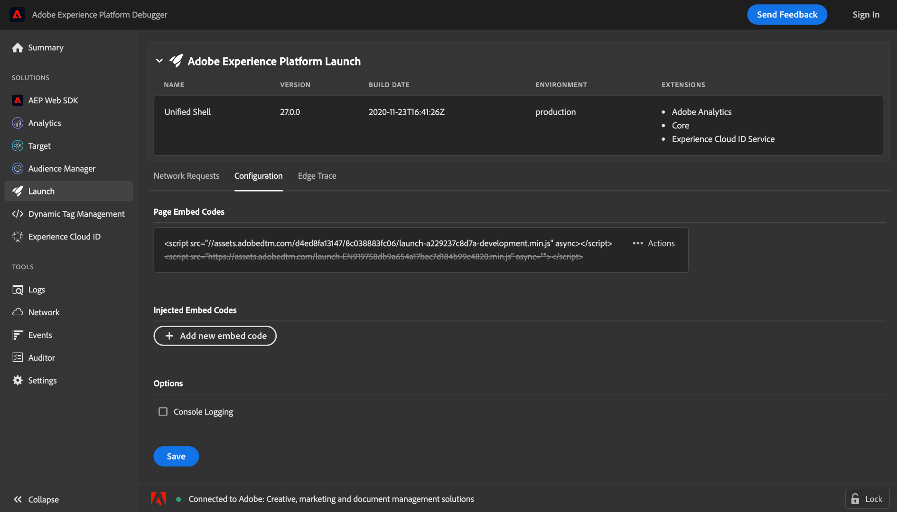

# Test des codes incorporés à l’aide du débogeur Adobe Experience Platform

>[!NOTE]
>
>Adobe Experience Platform Launch est désormais une suite de technologies destinées à la collecte de données dans Adobe Experience Platform. Plusieurs modifications terminologiques ont par conséquent été apportées à la documentation du produit. Reportez-vous au [document](../../term-updates.md) suivant pour consulter une référence consolidée des modifications terminologiques.

Lorsque vous apportez des modifications à vos versions de bibliothèque dans Adobe Experience Platform, vous devez les tester avant de déployer la version sur votre environnement de production. Si vous ne disposez pas d’un environnement d’évaluation ou de développement dédié à votre site web, vous pouvez utiliser le débogueur Adobe Experience Platform pour tester localement différents codes incorporés dans votre site.

## Conditions préalables

Ce tutoriel nécessite une bonne compréhension de l’utilisation des environnements et des codes incorporés pour les balises. Pour plus d’informations, consultez la [présentation des environnements](./environments.md).

Ce tutoriel nécessite également l’installation de l’extension de navigateur Experience Platform Debugger. Experience Platform Debugger est disponible pour le navigateur Chrome. Utilisez le lien suivant pour installer l’extension avant de commencer le tutoriel :

* [Experience Platform Debugger pour Chrome](https://chrome.google.com/webstore/detail/adobe-experience-platform/bfnnokhpnncpkdmbokanobigaccjkpob)

## Ouvrez Experience Platform Debugger sur votre site web.

À l’aide du navigateur de votre choix, accédez à votre site web et ouvrez l’extension Experience Platform Debugger. Le site auquel Experience Platform Debugger est actuellement connecté s’affiche au bas de la fenêtre. Si les balises sont en cours d’exécution sur votre site, celui-ci est répertorié dans l’onglet [!UICONTROL Résumé].

>[!NOTE]
>
>Si Experience Platform Debugger ne se connecte pas initialement, vous devrez peut-être recharger l’onglet du navigateur qui affiche votre site web avant de réessayer.

## Remplacement des codes incorporés

Une fois Experience Platform Debugger connecté à votre site, sélectionnez **[!UICONTROL Launch]** dans le volet de navigation de gauche. Vous trouverez ici des informations sur la version de bibliothèque en cours d’exécution sur votre site, y compris son environnement et les extensions associées. À partir de là, sélectionnez **[!UICONTROL Configuration]** pour afficher les commandes de gestion des codes incorporés.

Sous [!UICONTROL Codes incorporés de la page], le code incorporé actuellement utilisé par votre site s’affiche. Sélectionnez **[!UICONTROL Actions]** sur le côté droit du code incorporé, puis cliquez sur **[!UICONTROL Remplacer]**.

Une fenêtre contextuelle s’affiche, vous invitant à fournir un code incorporé pour remplacer le code actuel. Notez que le remplacement du code incorporé à l’aide d’Experience Platform Debugger ne modifie pas le code incorporé déployé sur votre site. Il remplace uniquement le code incorporé s’exécutant localement afin que vous puissiez tester et déboguer son implémentation.

Collez le code incorporé à tester dans la zone de texte fournie, puis cliquez sur **[!UICONTROL Appliquer]**.

L’onglet **[!UICONTROL Configuration]** réapparaît, indiquant que le code incorporé actif a été remplacé par celui que vous avez fourni. Vous pouvez désormais utiliser le navigateur Web pour déterminer si le code incorporé que vous testez fonctionne comme prévu.

## Étapes suivantes

Ce tutoriel explique comment changer localement de code incorporé à des fins de test à l’aide d’Experience Platform Debugger. Reportez-vous à la documentation d’[Experience Platform Debugger](../../../debugger/home.md) pour plus d’informations sur ses différentes fonctionnalités.
