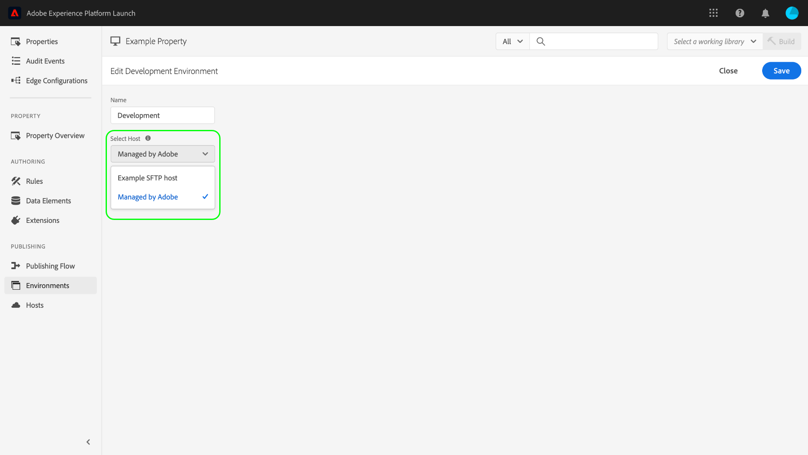
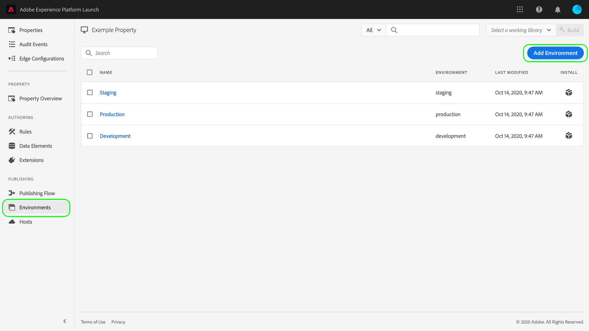

# Environnements

Les environnements de balises définissent plusieurs aspects clés des versions de bibliothèque que vous déployez sur votre site Web ou application :

* Nom de fichier de la version.
* Le domaine et le chemin d’accès de la version, en fonction de l’hôte affecté à l’environnement.
* Format de fichier de la version, selon l’option d’archivage choisie.

Lorsque vous créez une version de bibliothèque, vous devez l’affecter à un environnement. Les extensions, règles et éléments de données de la version sont ensuite compilés et placés dans l’environnement attribué. Chaque environnement fournit un code intégré unique qui vous permet d’intégrer la version qui lui est assignée dans votre site.

Il peut y avoir différents artefacts dans chaque environnement. Cela vous permet de tester différentes bibliothèques dans différents environnements lorsque vous les utilisez dans votre processus.

Ce document décrit la procédure à suivre pour installer, configurer et créer différents environnements dans l’interface utilisateur de Collecte de données.

## Types d’environnement

Les balises prennent en charge trois types d&#39;environnements différents, chacun correspondant à un état spécifique dans le [workflow de publication](./publishing-flow.md) :

| Type d’environnement | Description |
| --- | --- |
| Développement | Cet environnement correspond à la colonne **Développement** du workflow de publication. |
| Évaluation | Cet environnement correspond aux colonnes **Envoyé** et **Approuvé** du workflow de publication. |
| Production | Cet environnement correspond à la colonne **Publié** du workflow de publication. |

Il peut y avoir différents artefacts dans chaque environnement. Cela vous permet de tester différentes bibliothèques dans différents environnements lorsque vous les utilisez dans le workflow de publication.

>[!NOTE]
>
>Chaque environnement ne peut être affecté qu’à une seule version de bibliothèque à la fois. Cependant, il est prévu qu’un seul environnement contienne de nombreuses versions différents au fur et à mesure que vous les utilisez dans le workflow de publication, en réaffectant les versions entre les environnements si nécessaire.

## Installation {#installation}

Chaque environnement comporte un ensemble d’instructions utilisées pour la connexion à votre application. Pour les propriétés web, ces instructions fournissent des codes intégrés. Pour les propriétés mobiles, ces instructions fournissent le code nécessaire pour instancier les bibliothèques que vous utilisez et récupérer la configuration au moment de l’exécution.

>[!IMPORTANT]
>
>Chaque type d’environnement comporte ses propres instructions d’installation correspondantes. En fonction de l’environnement utilisé, vous devez vous assurer que vous utilisez les codes intégrés et/ou les dépendances appropriés.
>
>Par exemple, le code intégré de production d’une propriété web prend en charge la mise en cache du navigateur, contrairement aux codes intégrés de développement et d’évaluation. Par conséquent, vous ne devez pas utiliser les codes intégrés de développement ou d’évaluation dans les contextes à trafic élevé ou de production.

Pour accéder aux instructions d’installation d’un environnement, accédez à l’onglet **[!UICONTROL Environments]** correspondant à votre propriété, puis sélectionnez l’icône **[!UICONTROL Install]** correspondant à cet environnement.

Si vous utilisez une propriété web, vous recevez un code intégré à utiliser dans la balise `<head>` de votre document. Vous disposez également de l’option permettant de déployer les fichiers de bibliothèque de manière synchrone ou asynchrone au moment de l’exécution. Selon le paramètre choisi, les instructions d’installation affichées seront différentes. Les codes intégrés sont expliqués plus en détail plus loin dans ce document.

Si vous utilisez une propriété mobile, des instructions distinctes vous sont données pour l’installation des dépendances pour Android (via [Gradle](https://gradle.org/)) et iOS (via [CocoaPods](https://cocoapods.org/)).

## Configuration mobile

Pour les propriétés mobiles, vous pouvez voir les options de configuration d’un environnement en le sélectionnant dans la liste. À partir de là, vous pouvez modifier le nom de l’environnement. Actuellement, les environnements mobiles ne peuvent utiliser que des hôtes gérés par Adobe.

Pour plus d’informations, consultez la présentation sur les [hôtes](./hosts/hosts-overview.md).

## Configuration web

Les paramètres de l’environnement affecté déterminent les éléments suivants pour les propriétés Web :

* **Hôte** : emplacement du serveur sur lequel vous souhaitez déployer votre version.
* **Paramètre d’archivage** : indique si le système doit générer un ensemble de fichiers déployable ou les compresser dans un format d’archive.
* **Code intégré** : code `<script>` à incorporer dans le code HTML des pages de votre site web, utilisé pour déployer la version de la bibliothèque au moment de l’exécution.

Dans l’onglet [!UICONTROL Environments], sélectionnez un environnement répertorié pour afficher ses commandes de configuration.

### Hôte {#host}

Sélectionnez **[!UICONTROL Host]** pour choisir un hôte préconfiguré pour l’environnement dans le menu déroulant.

Lors de la création d’une version, celle-ci est distribuée à l’emplacement spécifié pour l’hôte affecté. Pour plus d’informations sur la création et la configuration des hôtes de balises, reportez-vous à la [présentation des hôtes](./hosts/hosts-overview.md).

### Paramètre d’archivage {#archive}

La plupart des versions se composent de plusieurs fichiers. Les versions multi-fichiers contiennent un fichier de bibliothèque principal (lié dans le code intégré) qui contient les références internes aux autres fichiers qui sont extraites selon les besoins.

Le bouton **[!UICONTROL Create archive]** vous permet d’activer/désactiver le paramètre d’archivage de l’environnement. Par défaut, l’option d’archivage est désactivée et la version est diffusée dans un format qui s’exécute en l’état (JavaScript pour les propriétés web et JSON pour les propriétés mobiles).

Si vous choisissez d’activer le paramètre d’archivage, d’autres paramètres de configuration s’affichent dans l’interface utilisateur, vous permettant éventuellement de chiffrer le fichier d’archive et de définir un chemin d’accès à la bibliothèque si vous utilisez l’auto-hébergement.

Le chemin d’accès peut être soit une URL complète, soit un chemin relatif utilisable pour plusieurs domaines. Ce chemin est important, car la plupart des versions comportent plusieurs fichiers qui contiennent des références internes les uns aux autres.

Si vous utilisez l’option d’archivage, tous les fichiers de la version sont fournis sous la forme d’un fichier.zip. Ce format peut s’avérer utile si :

1. vous auto-hébergez la bibliothèque, mais ne souhaitez pas configurer un hôte SFTP pour la diffusion ;
1. vous devez exécuter une analyse du code sur la version avant son déploiement ;
1. vous souhaitez simplement consulter le contenu de la version.

### Code intégré {#embed-code}

Un code intégré est une balise `<script>` devant être placée dans les sections `<head>` de vos pages web afin de charger et d’exécuter le code que vous créez. Chaque configuration d’environnement génère automatiquement son propre code intégré. Il vous suffit donc de le copier-coller dans votre site sur les pages sur lesquelles vous souhaitez exécuter les balises.

Lorsque vous consultez les instructions d’installation, vous pouvez choisir que le script charge les fichiers de bibliothèque de manière synchrone ou asynchrone. Ce paramètre n’est pas persistant et ne reflète pas la manière dont vous avez réellement implémenté les balises sur votre site. Au contraire, il ne vise qu’à montrer la manière appropriée d’installer l’environnement.

>[!WARNING]
>
>Selon le contenu de votre bibliothèque de balises, le comportement de vos règles et d’autres éléments peut varier entre un déploiement synchrone et asynchrone. Il est donc important de tester minutieusement les modifications que vous apportez.

#### Déploiement asynchrone

Un déploiement asynchrone permet au navigateur de continuer à charger le reste de la page pendant la récupération de la bibliothèque. Il n’y a qu’un seul code intégré lors de l’utilisation de ce paramètre, qui doit être placé dans le document `<head>`.

Pour plus d’informations sur ce paramètre, voir le guide sur le [déploiement asynchrone](../client-side/asynchronous-deployment.md).

#### Déploiement synchrone

Lorsque le navigateur lit un code intégré à l’aide d’un déploiement synchrone, il récupère la bibliothèque de balises et l’exécute avant de continuer à charger la page.

Les codes intégrés synchrones se composent de deux balises `<script>` qui doivent être placées dans le code HTML de votre site web. Une balise `<script>` doit être placée dans le document `<head>`, tandis que l’autre doit être placée juste avant la balise `</body>` de fermeture.

#### Mises à jour du code intégré

Les codes intégrés étant générés en fonction des configurations de votre environnement, certaines modifications de configuration mettent automatiquement à jour le code intégré de l’environnement en question. Ces modifications comprennent :

* Passer d’un hôte géré par Adobe à un hôte SFTP ou vice versa.
* Modifier le paramètre d’archivage.
* Mettre à jour le champ du chemin si le paramètre d’archivage est activé.

>[!WARNING]
>
>Lorsque le code intégré d’un environnement de balises change, vous devez mettre manuellement à jour les codes intégrés dans votre code HTML. Pour éviter une maintenance coûteuse, vous ne devez mettre à jour votre ou vos codes intégrés que lorsque cela est absolument nécessaire.

## Création d’un environnement

Trois environnements sont automatiquement affectés à une propriété lors de sa création : développement, staging et production. Ces environnements suffisent pour exécuter le processus de publication. Cependant, vous pouvez ajouter d’autres environnements de développement si vous le souhaitez, car cela peut s’avérer utile pour des équipes plus importantes dans lesquelles plusieurs développeurs travaillent simultanément sur différents projets.

Dans l’onglet [!UICONTROL Environments] correspondant à votre propriété, sélectionnez **[!UICONTROL Add Environment]**.

Dans l’écran suivant, sélectionnez l’option **[!UICONTROL Development]**.

L’écran suivant vous permet de nommer le nouvel environnement, de sélectionner un hôte et de choisir un paramètre d’archivage. Lorsque vous avez terminé, sélectionnez **[!UICONTROL Save]** pour créer l’environnement.

L’onglet [!UICONTROL Environments] s’affiche à nouveau, et les instructions d’installation du nouvel environnement s’affichent.

## Étapes suivantes

Grâce à ce document, vous devriez mieux comprendre la configuration des environnements dans l’interface utilisateur et leur installation sur votre site web ou dans votre application. Vous êtes maintenant prêt à publier vos versions de bibliothèque.

Lorsque vous publiez des itérations de votre bibliothèque au fil du temps, il peut s’avérer nécessaire d’effectuer le tracking et l’archivage des versions précédentes à des fins de dépannage et de restauration. Pour plus d’informations, consultez le guide sur la [republication des anciennes bibliothèques](./republish.md).
