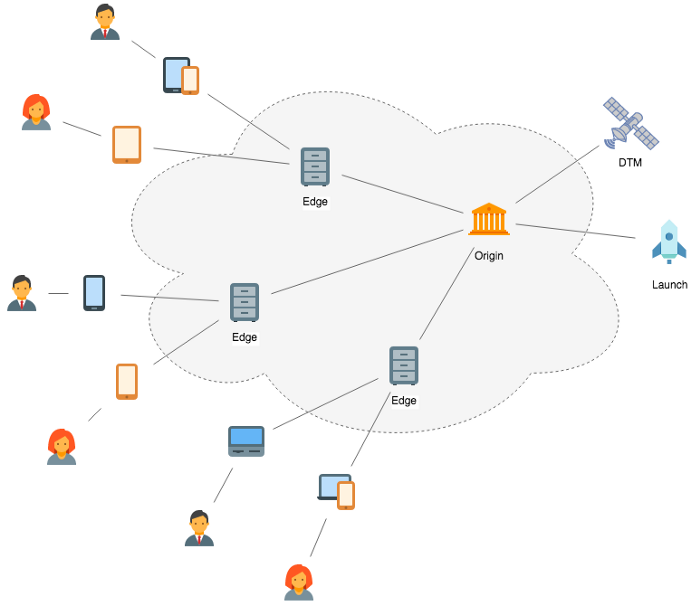

# Présentation des hôtes gérés par Adobe

>[!NOTE]
>
>Adobe Experience Platform Launch est désormais une suite de technologies destinées à la collecte de données dans Adobe Experience Platform. Plusieurs modifications terminologiques ont par conséquent été apportées à la documentation du produit. Reportez-vous au [document](../../../term-updates.md) suivant pour consulter une référence consolidée des modifications terminologiques.

Les hôtes gérés par Adobe sont le paramètre d’hôte par défaut pour le déploiement des versions de bibliothèques de balises dans Adobe Experience Platform. Lorsque vous créez une propriété dans l’interface utilisateur de la collecte de données, un hôte géré par Adobe par défaut est créé pour vous.

Avec les hôtes gérés par Adobe, les versions de bibliothèque sont diffusées à un réseau de diffusion de contenu (CDN) tiers avec lequel Adobe a conclu un contrat. Ces réseaux de diffusion de contenu fonctionnent indépendamment d’Adobe. Ainsi, même lorsque Platform est en cours de maintenance ou est hors service, votre code déployé continuera à fonctionner normalement sur vos sites et applications. Le code incorporé pour un hôte géré par Adobe indique l’emplacement du fichier de bibliothèque principal sur le réseau de diffusion de contenu afin qu’un appareil client puisse récupérer les fichiers au moment de l’exécution.

Ce document présente une vue d’ensemble des hôtes gérés par Adobe dans Platform et décrit la procédure à suivre pour créer un hôte géré par Adobe dans l’interface utilisateur.

## Akamai

Actuellement, le principal fournisseur de réseau CDN pour Adobe est [Akamai](https://www.akamai.com/fr). Le puissant réseau de diffusion de contenu d’Akamai est conçu pour fournir du contenu à une audience globale et volumineuse de visiteurs Web. Le réseau de diffusion de contenu exécute des réseaux redondants de nœuds équilibrés en charge et optimisés géographiquement afin de diffuser le contenu le plus rapidement possible aux visiteurs du monde entier.

Plus précisément Akamai exécute plus de 137 000 serveurs dans 87 pays sur plus de 1 150 réseaux. Pour ce qui est de la redondance, le réseau CDN achemine non seulement d’un serveur à un autre, mais peut également acheminer d’un nœud de serveurs à un autre nœud de serveurs, si nécessaire. En d’autres termes, chaque nœud est constitué de plusieurs serveurs, de sorte qu’un serveur qui tombe en panne ne constitue jamais un problème, car les autres serveurs du même nœud peuvent prendre le relais.

Si un nœud entier tombe en panne, Akamai prend le relais à partir du nœud suivant le plus proche en diffusant le même contenu mis en cache. Les nœuds sont sélectionnés dynamiquement en fonction de l’emplacement du visiteur, de la charge de trafic et d’autres facteurs afin que le contenu soit systématiquement fourni à partir du meilleur nœud local pour chaque visiteur.

Les fichiers hébergés sur Akamai ont un domaine `assets.adobedtm.com`. Il peut être référencé de manière sécurisée ou non (`http://` ou `https://`) en fonction de la manière dont il est appelé dans votre code `<script>` incorporé.

>[!WARNING]
>
>Si votre bibliothèque n’est pas disponible sur le réseau Akamai, Platform ne peut pas empêcher les erreurs qui pourraient en résulter.

## Caching de la création de bibliothèque

Lors de l’utilisation d’hôtes gérés par Adobe, les versions de votre bibliothèque sont mises en cache à deux emplacements :

* [Caching d’Edge](#edge)
* [Caching du navigateur](#browser)

### Caching d’Edge {#edge}

L’objectif principal d’un réseau CDN est de distribuer de façon intelligente du contenu aux serveurs qui sont géographiquement plus proches des utilisateurs finaux, de sorte que le contenu puisse être récupéré plus rapidement par les appareils clients. Pour ce faire, les réseaux CDN mettent à disposition des copies du contenu sur des serveurs répartis géographiquement dans le monde (« nœuds de périphérie »).

Une fois que votre version a été déployée sur l’hôte géré par Adobe, le réseau CDN la distribue sur plusieurs serveurs centralisés (« origines »), qui envoient ensuite des copies de la version à de nombreux noeuds de périphérie dans le monde entier pour le caching. Les versions mises en cache de la version stockée sur ces nœuds de périphérie sont ensuite finalement diffusées sur les appareils client.

>[!NOTE]
>
>Pour les hôtes gérés par Adobe, la première bibliothèque publiée dans un nouvel environnement peut prendre jusqu’à 5 minutes pour se propager dans le réseau mondial de diffusion de contenu.

Lorsqu’un noeud de périphérie reçoit une requête pour un fichier spécifique (tel que la version de votre bibliothèque), il vérifie d’abord le délai d’expiration du fichier. Si le temps n’a pas expiré, le noeud Edge sert la version mise en cache. Si le temps a expiré, le noeud de périphérie demande une nouvelle copie à l’origine la plus proche, diffuse cette copie actualisée, puis met en cache la copie actualisée avec un nouveau délai d’expiration.

>[!NOTE]
>
>Outre le caching des nœuds de périphérie, il peut également exister des réseaux intermédiaires (tels que les réseaux d’entreprise ou mobiles) qui effectuent leur propre caching. Si vos versions ne sont pas mises en cache comme prévu, ces réseaux peuvent en être la cause sous-jacente.

#### Invalidation du cache Edge {#invalidation}

Lorsque vous chargez une nouvelle version de bibliothèque, les caches sur tous les nœuds de périphérie applicables sont invalidés. Cela signifie que chaque nœud considère sa version mise en cache comme non valide, quelle que soit la date à laquelle il a récupéré une nouvelle copie. La prochaine fois qu’un nœud de périphérie reçoit une demande pour ce fichier, il récupère une nouvelle copie de l’origine.

Puisque Akamai dispose de plusieurs serveurs d’origine qui répliquent des fichiers entre eux, et qu’il n’existe aucun moyen de savoir quelle origine a reçu votre fichier en premier, il est possible que ces requêtes de nœud atteignent une origine qui ne possède pas la dernière version. Il mettrait ensuite à nouveau en cache l’ancienne version. Pour éviter cela, plusieurs invalidations du cache pour chaque nouvelle version sont effectuées sur les intervalles suivants :

* Immédiatement après le téléchargement
* 5 minutes après le téléchargement
* 60 minutes après le téléchargement

Ces invalidations échelonnées du cache donnent aux groupes de serveurs d’origine le temps de répliquer la dernière version du fichier entre eux afin qu’ils disposent tous de la dernière version une fois le fichier extrait.

### Caching du navigateur {#browser}

Les versions de bibliothèque sont également mises en cache sur le navigateur à l’aide de l’en-tête HTTP `cache-control`. Lors de l’utilisation d’hôtes gérés par Adobe, vous n’avez aucun contrôle sur les en-têtes renvoyés dans les réponses de l’API. Par conséquent, le paramètre Adobe par défaut pour le caching est utilisé. En d’autres termes, vous ne pouvez pas utiliser d’en-têtes personnalisés pour les hôtes gérés par Adobe. Si vous avez besoin d’un en-tête `cache-control` personnalisé, vous pouvez envisager l’[auto-hébergement](self-hosting-libraries.md) à la place.

Le délai d’expiration de la version de votre bibliothèque mise en cache par le navigateur (déterminé par l’en-tête `cache-control`) varie en fonction de l’environnement de balise que vous utilisez :

| Environnement | Valeur `cache-control` |
| --- | --- |
| Développement | `max-age=0, no-cache, no-store` |
| Évaluation | `max-age=0, no-cache, no-store` |
| Production | `max-age=3600` |

Comme l’indique le tableau ci-dessus, le caching du navigateur n’est pas pris en charge sur les environnements de développement et d’évaluation. Par conséquent, vous ne devez pas utiliser les codes incorporés de développement ou intermédiaires dans les contextes à trafic élevé ou de production.

Les en-têtes de contrôle du cache ne sont appliqués que pour la version de la bibliothèque principale. Toutes les sous-ressources situées sous la bibliothèque principale sont toujours considérées comme des sous-ressources nouvelles et il n’est donc pas nécessaire de les mettre en cache dans le navigateur.

## Utilisation de l’hébergement géré par les Adobes dans l’interface utilisateur

Lorsque vous créez une propriété pour la première fois dans l’interface utilisateur de Platform ou dans l’interface utilisateur de collecte de données, un hôte géré par Adobe est automatiquement créé. Tous les environnements disponibles possédant des propriétés immédiatement utilisables sont également affectés par défaut à l’hôte géré par Adobe.

>[!NOTE]
>
>Si l’affectation de l’hôte géré par Adobe par défaut est supprimée de tous les environnements, l’hôte peut être supprimé. Si vous souhaitez revenir à un hôte géré par Adobe après cette opération, vous pouvez créer un nouvel hôte en procédant comme suit :
>
>1. Sélectionnez l’onglet **[!UICONTROL Hôtes]** sur votre propriété, puis cliquez sur **[!UICONTROL Ajouter l’hôte]**.
>1. Attribuez un nom à l’hôte, sélectionnez **[!UICONTROL Géré par Adobe]** comme type d’hôte, puis cliquez sur **[!UICONTROL Enregistrer]**.
>
>Vous pouvez ensuite réaffecter vos environnements à l’hôte géré par Adobe selon vos besoins.

## Étapes suivantes

Ce document fournit un aperçu de l’hébergement géré par Adobe pour les bibliothèques de balises dans Adobe Experience Platform. Pour plus d’informations sur les autres options d’hébergement, consultez la documentation suivante :

* [Hébergement SFTP](./sftp-host.md)
* [Bibliothèques auto-hébergées](./self-hosting-libraries.md)

Pour plus d’informations sur la gestion des hôtes pour vos environnements, consultez le [guide des environnements](../environments.md).
