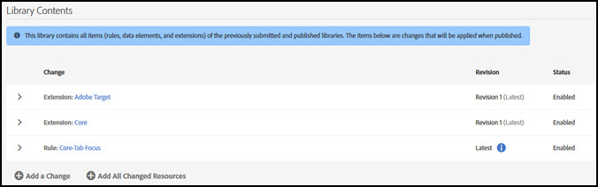
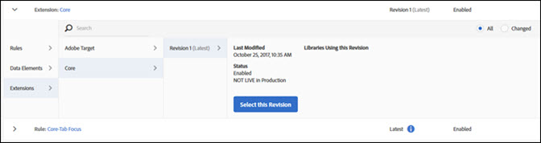

# Bibliothèques

>[!NOTE]
>
>Adobe Experience Platform Launch est désormais une suite de technologies destinées à la collecte de données dans Adobe Experience Platform. Plusieurs modifications terminologiques ont par conséquent été apportées à la documentation du produit. Reportez-vous au [document](../../term-updates.md) suivant pour consulter une référence consolidée des modifications terminologiques.

Une bibliothèque est un ensemble d’instructions qui définit la façon dont les extensions, les éléments de données et les règles interagissent les uns avec les autres après leur déploiement. Lors de la création d’une bibliothèque, vous indiquez les modifications que vous souhaitez apporter à votre bibliothèque. Lors de la création, ces modifications sont combinées avec tout ce qui a été soumis, approuvé ou publié dans les bibliothèques précédentes.

Les bibliothèques contiennent l’ajout ou la suppression de :

* Règles
* éléments ;
* Configuration d’extension

Les bibliothèques doivent être affectées à un environnement avant de pouvoir être compilées dans une version. Les bibliothèques sont approuvées ou rejetées dans leur ensemble. Vous ne pouvez pas approuver ni rejeter des éléments spécifiques au sein d’une bibliothèque. Une bibliothèque passe par plusieurs environnements au fil du processus de publication.

## créer une bibliothèque ; {#create-a-library}

Pour créer une bibliothèque, procédez comme suit :

1. Ouvrez lʼonglet [!UICONTROL Publication].

   La page [!UICONTROL Publication] répertorie les bibliothèques de développement et fournit les moyens nécessaires pour les soumettre pour approbation, pour les déplacer vers lʼévaluation ou pour les publier en production.

1. Cliquez sur **[!UICONTROL Ajouter une bibliothèque]**.

   

1. Donnez un nom à la bibliothèque.
1. Affectez la bibliothèque à un environnement de développement.
1. Ajoutez une modification à la bibliothèque.
Pour ajouter un élément, cliquez sur **[!UICONTROL Ajouter une modification]**, puis choisissez les éléments à ajouter. Tout élément qui a été modifié ou supprimé peut être ajouté à la bibliothèque choisie.

   

   Vous pouvez ajouter les éléments suivants à votre bibliothèque :

   * Règles
   * Éléments de données
   * Configuration d’extension

1. Pour ajouter des ressources qui ont été modifiées, sélectionnez **[!UICONTROL Ajouter toutes les ressources modifiées]**.
1. Sélectionnez **[!UICONTROL Enregistrer]** ou **[!UICONTROL Enregistrer et créer pour le développement]**.

   Le déploiement compile une version et la déploie dans l’environnement affecté.

Une fois qu’une bibliothèque est créée, utilisez son menu déroulant pour sélectionner l’une des options suivantes :

* **Modifier** : cette option vous permet de modifier la configuration de la bibliothèque.

* **Version pour le développement** : cette option compile une version et la déploie dans l’environnement affecté.

* **Soumettre pour approbation** : cette option rend la bibliothèque disponible pour qu’un approbateur la déplace à l’étape suivante du processus de publication.

* **Supprimer** : cette option supprime la bibliothèque actuellement sélectionnée du processus de publication.

## Ajouter des éléments à une bibliothèque {#add-to-a-library}

Pour ajouter un élément à une bibliothèque, procédez comme suit.

1. Installez les [extensions](../managing-resources/extensions/overview.md) que vous souhaitez ajouter.
1. Créez les [éléments de données](../managing-resources/data-elements.md) et les règles à ajouter.
1. Ouvrez lʼonglet **[!UICONTROL Publication]**.
1. Sélectionnez la [bibliothèque](libraries.md) à modifier, puis cliquez sur **[!UICONTROL Modifier]**.
1. Utilisez les boutons de règles, d’éléments de données et d’extensions pour sélectionner les éléments à ajouter à la bibliothèque.
1. Enregistrez les modifications.

Les modifications apportées à la bibliothèque s’affichent dans le journal des modifications du contenu de la bibliothèque.

>[!NOTE]
>
>Les éléments de données peuvent dépendre d’extensions. Les règles peuvent dépendre à la fois d’éléments de données et d’extensions. Si vous n’incluez pas tous les composants nécessaires dans votre bibliothèque, la version ne pourra pas être créée et vous devrez ajouter ces composants avant d’obtenir une version fonctionnelle. Dans une version ultérieure de Launch, l’application vérifiera les dépendances lors de la modification d’une bibliothèque.

## Supprimer une bibliothèque

Pour supprimer un élément d’une bibliothèque, vous devez d’abord le désactiver, puis publier l’état désactivé.

1. Désactivez les extensions à supprimer, sans oublier les éléments de données et les règles qui dépendent de ces extensions.
1. Désactivez les éléments de données et les règles à supprimer.
1. Ouvrez lʼonglet **[!UICONTROL Publication]**.
1. Sélectionnez la bibliothèque que vous souhaitez modifier.
1. Utilisez les boutons de règles, d’éléments de données et d’extensions pour sélectionner les éléments à supprimer de la bibliothèque.
1. Enregistrez les modifications.

## Gérer les modifications apportées à la bibliothèque

Pour modifier les options d’une bibliothèque, procédez comme suit.

1. Cliquez sur une bibliothèque et sélectionnez **[!UICONTROL Modifier]** pour afficher les modifications apportées à la bibliothèque. Toutes les modifications sont répertoriées dans la liste [!UICONTROL Contenu de la bibliothèque].

   

1. Cliquez sur une modification pour afficher et sélectionner une révision.

   

1. Choisissez d’afficher **tous** les éléments ou les éléments **modifiés**. 
1. Sélectionnez la révision, puis cliquez sur **[!UICONTROL Sélectionner la révision]**.
1. Sélectionnez **[!UICONTROL Ajouter une modification]** ou **[!UICONTROL Ajouter toutes les ressources modifiées]**.

## Bibliothèque active {#active-library}

Les bibliothèques regroupent un ensemble de modifications que vous souhaitez apporter à votre code déployé. La bibliothèque active facilite cette opération, ce qui vous permet d’effectuer rapidement une itération des modifications et de voir leur impact.

Les extensions, les règles et les éléments de données peuvent désormais être enregistrés directement dans la bibliothèque sur laquelle vous travaillez. Si nécessaire, une nouvelle version peut également être créée ou même une nouvelle bibliothèque à partir de la liste déroulante [!UICONTROL Bibliothèque principale].

La liste suivante fournit des informations supplémentaires sur la gestion d’une bibliothèque active.

1. [Création d’une bibliothèque](libraries.md#create-a-library).
1. Accédez à [Rules](../managing-resources/rules.md) (Règles), [Data Elements](../managing-resources/data-elements.md) (Éléments de données) ou [Extensions](../managing-resources/extensions/overview.md) (Extensions).
1. Sélectionnez votre bibliothèque active.
1. Effectuez vos modifications, puis enregistrez et créez la bibliothèque.
1. Testez vos modifications et répétez ces étapes si nécessaire.
