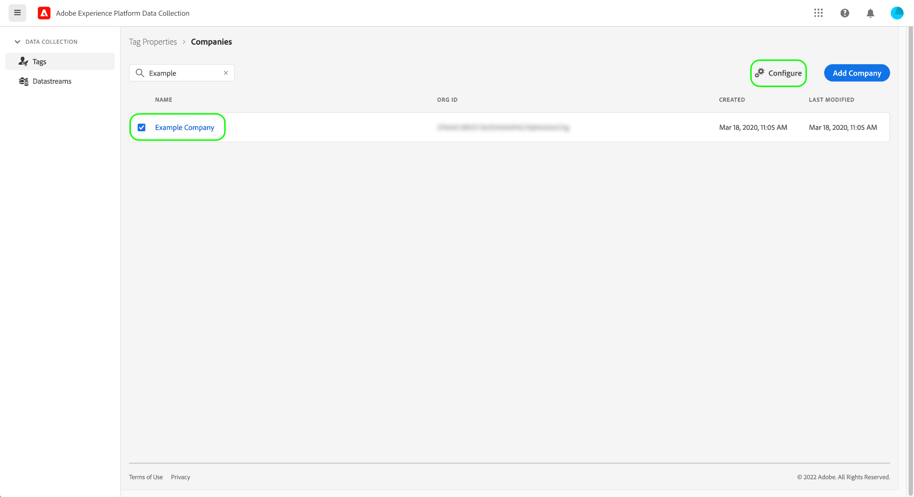

# Prise en charge du réseau de diffusion de contenu Premium pour les balises (version bêta)

>[!IMPORTANT]
>
>La fonctionnalité premium CDN pour les balises est actuellement en version bêta et votre entreprise peut ne pas y avoir encore accès. Cette documentation peut être modifiée.

Lorsque vous utilisez une [Hôte géré par Adobe](./hosts/managed-by-adobe-host.md) pour diffuser vos ressources de balises Adobe Experience Platform sur votre site web, ces ressources sont distribuées parmi divers réseaux de diffusion de contenu (CDN) dans le monde entier afin d’offrir la vitesse de téléchargement la plus rapide. Cependant, certaines régions exigent que toutes les ressources de site web soient répliquées et hébergées sur un serveur de cette région.

Pour en tenir compte, les balises dans Experience Platform fournissent une fonctionnalité de réseau de diffusion de contenu haut de gamme qui vous permet de diffuser du contenu vers ces régions spéciales.

La prise en charge Premium du réseau de diffusion de contenu est une fonctionnalité payante qui doit être achetée par votre organisation pour l’activer et l’utiliser. Ce guide explique comment configurer et utiliser cette fonctionnalité dans l’interface utilisateur de la collecte de données une fois qu’elle a été achetée.

## Activation du réseau de diffusion de contenu Premium pour une entreprise

Le réseau de diffusion de contenu Premium est activé au niveau de l’entreprise, ce qui signifie que vous devez disposer des autorisations de modification de l’entreprise pour activer la fonctionnalité.

Dans l’interface utilisateur de la collecte de données, accédez à **[!UICONTROL Balises]** > **[!UICONTROL Entreprises]**. À partir de là, sélectionnez la société pour laquelle vous souhaitez activer la fonction, puis sélectionnez **[!UICONTROL Configurer]** .

Dans la boîte de dialogue de configuration qui s’affiche, sélectionnez l’option pour **[!UICONTROL Réseau de diffusion de contenu Premium activé]** avant de sélectionner **[!UICONTROL Enregistrer]** pour confirmer vos modifications.

## Reconstruire et installer des bibliothèques de balises avec des codes incorporés mis à jour

L’activation de la fonction de réseau de diffusion de contenu premium ne signifie pas que vos ressources de balise sont immédiatement répliquées et prêtes à être utilisées dans les nouvelles régions. Cela signifie uniquement que vous pouvez maintenant choisir le moment auquel vous abonner à cette fonctionnalité.

>[!IMPORTANT]
>
>Les bibliothèques créées avant d’activer le réseau de diffusion de contenu premium continueront à fonctionner en l’état comme elles le font aujourd’hui. Cela s’applique également aux bibliothèques qui ne sont pas gérées par Adobe, puisque [environnements archivés](./environments.md#archive) n’utilisent que des URL relatives pour leurs chemins d’accès aux ressources. Notez qu’une fois que vous avez activé le réseau de diffusion de contenu Premium, toute bibliothèque que vous créez et qui n’est pas gérée par Adobe se comporte comme si la fonctionnalité de réseau de diffusion de contenu Premium n’était pas activée.

Une fois que vous avez activé le réseau de diffusion de contenu premium et recréé les bibliothèques que vous souhaitez utiliser à partir des nouvelles régions d’hébergement, vous pouvez récupérer les nouveaux codes incorporés de région d’hébergement à ajouter à vos sites web.

>[!NOTE]
>
>Le code incorporé de la bibliothèque qui est répertorié sous le [!UICONTROL Standard] la région d’hébergement continuera à fonctionner en l’état, ainsi que les codes incorporés Haut de page ou Bas de page figurant déjà sur vos sites web.

Visitez le **[!UICONTROL Environnements]** ou affichez les instructions d’installation de l’environnement à partir de l’écran de modification de la bibliothèque pour trouver les nouveaux codes incorporés. Chaque nouvelle région d’hébergement prise en charge apparaît après l’événement [!UICONTROL Standard] région d’hébergement (utilisée pour les zones du monde qui sont prises en charge sans réseau de diffusion de contenu premium). La capture d’écran ci-dessous montre un code incorporé pour la région Chine, qui utilise `.cn` comme son domaine de niveau supérieur (TLD).

Sélectionnez le code incorporé approprié à la page web et collez-le dans le `<head>` de votre document. Pour plus d’informations sur l’utilisation des codes incorporés pour installer les bibliothèques de balises, reportez-vous à la section [Guide de l’interface utilisateur des environnements](./environments.md#installation).

## Étapes suivantes

Ce guide explique comment activer et installer la fonctionnalité de réseau de diffusion de contenu premium pour la mise en oeuvre de vos balises. Pour plus d’informations sur l’installation et le test des bibliothèques de balises sur vos propriétés web et mobiles, reportez-vous à la section [présentation de la publication](./overview.md).
