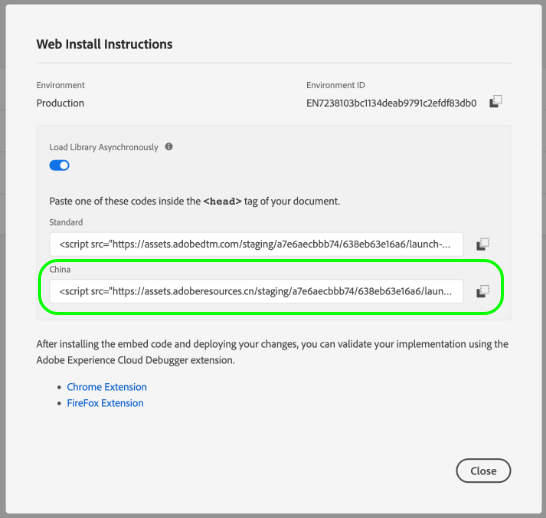

# Balises Experience Platform (Chine)

Lorsque vous utilisez un [hôte géré par ](./hosts/managed-by-adobe-host.md) pour diffuser vos ressources de balises Adobe Experience Platform sur votre site web, ces ressources sont distribuées entre divers réseaux de diffusion de contenu (CDN) à travers le monde afin de fournir la vitesse de téléchargement la plus rapide. Cependant, certaines régions nécessitent que toutes les ressources du site web soient répliquées et hébergées sur un serveur au sein de cette région.

Pour en tenir compte, les balises dans Experience Platform fournissent une fonctionnalité Experience Platform Tags (Chine) qui vous permet de diffuser du contenu dans ces régions spéciales.

La prise en charge d’Experience Platform Tags (Chine) est une fonctionnalité payante qui doit être achetée par votre entreprise pour être activée et utilisée. Ce guide explique comment configurer et utiliser cette fonctionnalité dans l’interface utilisateur d’Experience Platform ou de la collecte de données après son achat.

## Activez Experience Platform Tags (Chine) pour votre organisation

Experience Platform Tags (Chine) est activé au niveau de la société. Une fois que votre organisation a acheté la fonctionnalité Experience Platform Tags (Chine), un administrateur Adobe l’active dans l’interface utilisateur de votre société.

## Recréer et installer des bibliothèques de balises avec des codes incorporés mis à jour

Une fois qu’Experience Platform Tags (Chine) est activé, cela ne signifie pas que vos ressources de balises sont immédiatement répliquées et prêtes à être utilisées dans les nouvelles régions. Cela signifie uniquement que vous pouvez désormais choisir le moment où vous souhaitez vous inscrire à cette fonctionnalité.

>[!IMPORTANT]
>
>Les bibliothèques créées avant l’activation des balises en Chine continueront à fonctionner en l’état, exactement comme aujourd’hui. Cela s’applique également aux bibliothèques qui ne sont pas gérées par Adobe, car les [ environnements archivés ](./environments.md#archive) n’utilisent que des URL relatives pour leurs chemins d’accès aux ressources. Notez qu’après avoir activé Experience Platform Tags (Chine), toute bibliothèque que vous créez et qui n’est pas gérée par Adobe se comporte comme si la fonctionnalité Balises en Chine n’était pas activée.

Une fois que vous avez activé les balises en Chine et reconstruit les bibliothèques que vous souhaitez utiliser à partir des nouvelles régions d’hébergement, vous pouvez récupérer les nouveaux codes incorporés de région d’hébergement à ajouter à vos sites web.

>[!NOTE]
>
>Le code incorporé de bibliothèque répertorié sous la région d’hébergement [!UICONTROL Standard] continuera à fonctionner en l’état, ainsi que tout code incorporé de haut ou de bas de page figurant déjà sur vos sites web.

Rendez-vous sur la page **[!UICONTROL Environments]** ou consultez les instructions d’installation de l’environnement dans l’écran de modification de la bibliothèque pour trouver les nouveaux codes incorporés. Chaque nouvelle région d’hébergement prise en charge apparaît après la région d’hébergement [!UICONTROL Standard] (utilisée pour les zones du monde qui sont prises en charge sans Experience Platform Tags (Chine)). La capture d’écran ci-dessous montre un code incorporé pour la région Chine, qui utilise `.cn` comme domaine de niveau supérieur (TLD).

Sélectionnez le code incorporé approprié pour la page web et collez-le dans la balise `<head>` de votre document. Pour plus d’informations sur l’utilisation des codes incorporés pour installer les bibliothèques de balises, reportez-vous au guide de l’interface utilisateur [environnements](./environments.md#installation).

## Étapes suivantes

Ce guide explique comment activer et installer la fonctionnalité Experience Platform Tags (Chine) pour votre implémentation de balises. Pour plus d’informations sur l’installation et le test des bibliothèques de balises sur vos propriétés web et mobiles, reportez-vous à la section [présentation de la publication](./overview.md).
