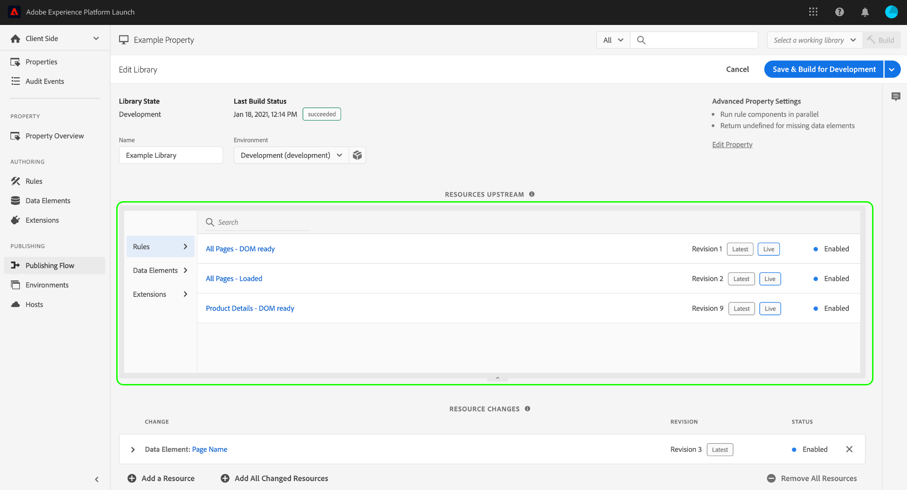

# Flux de publication {#publishing-flow}

>[!CONTEXTUALHELP]
>id="platform_tags_publishing_flow"
>title="Flux de publication"
>abstract="Découvrez les niveaux d’autorisations utilisateur requis pour le flux de publication, y compris les droits Développer, Approuver et Publish."

>[!NOTE]
>
>Adobe Experience Platform Launch est désormais une suite de technologies destinées à la collecte de données dans Adobe Experience Platform. Plusieurs modifications terminologiques ont par conséquent été apportées à la documentation du produit. Reportez-vous au [document](../../term-updates.md) suivant pour consulter une référence consolidée des modifications terminologiques.

Le flux de publication des balises dans Adobe Experience Platform fait référence au processus de création de bibliothèques, de test des versions et dʼapprobation pour la production.

Les actions disponibles que vous pouvez réaliser sur une bibliothèque dépendent de l’état de la bibliothèque et du niveau d’autorisation que vous possédez. En outre, l’état d’une bibliothèque affecte également les ressources qu’elle contient (règles, éléments de données et extensions) en fonction de ce qui se trouve en amont dans le flux de publication.

Les sections ci-dessous couvrent les détails concernant les autorisations, l’état de la bibliothèque et les éléments en amont qui se rapportent au flux de publication.

## Autorisations {#permissions}

Il existe différents niveaux dʼautorisations dʼutilisateur importants pour le flux de publication, qui sont précisément les droits de propriété de [!UICONTROL Développement], dʼ[!UICONTROL Approbation], et de [!UICONTROL Publication] :

* **[!UICONTROL Développement]** : prévoit la possibilité de créer des bibliothèques, de créer à des fins de développement et dʼenvoyer pour approbation.
* **[!UICONTROL Approbation]** : prévoit la possibilité de créer pour lʼévaluation et dʼapprouver les versions évaluées.
* **[!UICONTROL Publication]** : prévoit la possibilité de publier une bibliothèque approuvée.

Les droits ne sont pas inclusifs. Pour qu’une seule personne effectue le processus du début à la fin, cette personne doit se voir attribuer les trois droits au sein d’une propriété donnée.

Pour plus dʼinformations sur la gestion des autorisations pour les balises, consultez le [guide des autorisations utilisateur](../administration/user-permissions.md).

## État de la bibliothèque {#state}

En ce qui concerne le flux de publication, une bibliothèque peut se trouver dans quatre états de base :

* [[!UICONTROL Développement]](#development)
* [[!UICONTROL Envoyé]](#submitted)
* [[!UICONTROL Approuvé]](#approved)
* [[!UICONTROL Publié]](#published)

Ces quatre états sont représentés sous forme de colonnes dans l’onglet **[!UICONTROL Flux de publication]**.

Des mesures spécifiques doivent être prises pour déplacer une bibliothèque entre ces états. Le diagramme suivant décrit chaque action qui déplace une bibliothèque entre les états :

### [!UICONTROL Développement] {#development}

Lorsque de nouvelles bibliothèques sont créées, elles démarrent à lʼétat [!UICONTROL En développement]. Toute modification apportée à une bibliothèque doit être effectuée lorsque la bibliothèque est à lʼétat [!UICONTROL En développement]. Une fois le développement et les tests terminés, la bibliothèque peut être envoyée pour approbation.

Le tableau suivant décrit les actions disponibles pour une bibliothèque à lʼétat [!UICONTROL En développement] :

| Action | Description |
| --- | --- |
| [!UICONTROL Modifier] | Utilisez lʼécran [!UICONTROL Modifier la bibliothèque] pour ajouter ou supprimer des composants de la bibliothèque. |
| [!UICONTROL Créer vers le développement] | Créez une version pour la bibliothèque. La version est compilée et déployée dans l’environnement auquel la bibliothèque est attribuée. Cette étape échoue si la bibliothèque n’est pas attribuée à un environnement ou si elle contient une modification déjà définie en amont. |
| [!UICONTROL Envoyer pour approbation] | Annulez lʼattribution de la bibliothèque à partir de lʼenvironnement de développement et déplacez la bibliothèque dans la colonne [!UICONTROL Envoyées] pour permettre à un utilisateur disposant des autorisations dʼapprobation de travailler dessus. Pour que cette option soit activée, la dernière version de la bibliothèque doit avoir été installée avec succès. |
| [!UICONTROL Envoyer et créer vers l’évaluation] | Cela ne peut être effectué que par un utilisateur disposant des droits Développer et Approuver. Cette action annule l’affectation de la bibliothèque à partir de l’environnement de développement, déplace la bibliothèque vers l’état [!UICONTROL Envoyé] et crée la bibliothèque dans l’environnement d’évaluation. Pour que cette option soit activée, la dernière version de la bibliothèque doit avoir été installée avec succès. |
| [!UICONTROL Approuver pour publication] | Cela ne peut être effectué que par un utilisateur disposant des droits Développer et Approuver. Cette action annule l’affectation de la bibliothèque à partir de l’environnement de développement et la déplace vers l’état [!UICONTROL Approuvé], en ignorant entièrement l’environnement d’évaluation et l’état [!UICONTROL Envoyé]. Pour que cette option soit activée, la dernière version de la bibliothèque doit avoir été installée avec succès. |
| [!UICONTROL Approuver et publier dans l’environnement de production] | Cela ne peut être effectué que par un utilisateur disposant des droits Développer, Approuver et Publier. Cette action annule l’attribution de la bibliothèque à l’environnement de développement, la déplace vers l’état [!UICONTROL Approuvé] et la publie en production. Une fois la création de production terminée, la bibliothèque passe à l’état [!UICONTROL Publié]. Pour que cette option soit activée, la dernière version de la bibliothèque doit avoir été installée avec succès. |
| [!UICONTROL Supprimer] | Supprimez la bibliothèque du système. Cela ne supprime pas la version de l’environnement. |

### [!UICONTROL Envoyé] {#submitted}

Lorsquʼune bibliothèque se trouve à lʼétat [!UICONTROL Envoyées], un utilisateur disposant dʼautorisations dʼapprobation peut tester la bibliothèque au sein de lʼenvironnement dʼévaluation. Lorsque le test est terminé, la bibliothèque peut être approuvée ou refusée. Les versions refusées reviennent à lʼétat [!UICONTROL En développement] afin que dʼautres modifications puissent être apportées avant de redémarrer le flux de publication.

Le tableau suivant décrit les actions disponibles pour une bibliothèque à lʼétat [!UICONTROL Envoyées] :

| Action | Description |
| --- | --- |
| [!UICONTROL Ouvrir] | Affichez le contenu de la bibliothèque. Les modifications ne sont pas autorisées pour les bibliothèques qui se trouvent en dehors de la colonne [!UICONTROL En développement]. Si des modifications sont nécessaires, la bibliothèque doit être rejetée afin de pouvoir apporter des modifications dans lʼétat [!UICONTROL En développement]. |
| [!UICONTROL Créer à des fins d’évaluation] | Créez la bibliothèque dans l’environnement d’évaluation pour le déploiement. |
| [!UICONTROL Approuver pour publication] | Déplacez la bibliothèque dans la colonne [!UICONTROL Approuvées] pour permettre à un utilisateur disposant dʼautorisations de publication de travailler dessus. |
| [!UICONTROL Approuver et publier dans l’environnement de production] | Cette opération ne peut être effectuée que par un utilisateur disposant des droits Approuver et Publier. Cette action annule l’attribution de la bibliothèque à l’environnement d’évaluation, la déplace vers l’état [!UICONTROL Approuvé] et la publie en production. Une fois la création de l’environnement de production terminée, la bibliothèque passe à l’état [!UICONTROL Publié]. Cela peut être effectué avec ou sans une version réussie dans l’environnement d’évaluation. |
| [!UICONTROL Rejeter] | Pour effectuer dʼautres modifications, annulez lʼattribution de la bibliothèque à partir de lʼenvironnement dʼévaluation et déplacez-la de nouveau dans la colonne [!UICONTROL En développement]. |

### [!UICONTROL Approuvé] {#approved}

Une fois qu’une bibliothèque a été approuvée, un utilisateur disposant d’autorisations de publication peut la publier ou la refuser. Les versions refusées reviennent à lʼétat [!UICONTROL En développement], de sorte que des modifications supplémentaires puissent être apportées avant que le flux de publication ne recommence.

Le tableau suivant décrit les actions disponibles pour une bibliothèque à lʼétat [!UICONTROL Approuvées] :

| Action | Description |
| --- | --- |
| [!UICONTROL Ouvrir] | Affichez le contenu de la bibliothèque. Les modifications ne sont pas autorisées pour les bibliothèques qui se trouvent en dehors de la colonne [!UICONTROL En développement]. Si des modifications sont nécessaires, la bibliothèque doit être rejetée afin de pouvoir apporter des modifications dans lʼétat [!UICONTROL En développement]. |
| [!UICONTROL Créer et publier dans Production] | Annulez l’attribution de la bibliothèque à son environnement d’évaluation, affectez-la à l’environnement de production et déployez-la.  **Important** : lorsque cette option est sélectionnée, votre bibliothèque est activée dans votre environnement de production. Assurez-vous que la bibliothèque contient les modifications souhaitées avant de sélectionner cette option. |
| [!UICONTROL Rejeter] | Pour effectuer dʼautres modifications, annulez lʼattribution de la bibliothèque à son environnement dʼévaluation et déplacez-la dans la colonne [!UICONTROL En développement]. |

### [!UICONTROL Publié] {#published}

La colonne [!UICONTROL Publié] indique les bibliothèques qui ont été publiées et leurs dates de publication. La bibliothèque actuellement publiée s’affiche avec un point vert en regard de celle-ci. À moins que vous n’ayez effectué une republication sur une bibliothèque précédente, il s’agira toujours de la bibliothèque en haut de la colonne.

| Action | Description |
| --- | --- |
| [!UICONTROL Ouvrir] | Affichez le contenu de la bibliothèque. Les modifications ne sont pas autorisées pour les bibliothèques qui se trouvent en dehors de la colonne [!UICONTROL En développement]. Si vous souhaitez modifier les éléments qui se trouvent dans votre environnement de production, vous devez créer une nouvelle bibliothèque et la déplacer tout au long du processus de publication. |
| [!UICONTROL Republication] | Cette action n’est disponible que sur les cinq bibliothèques publiées le plus récemment et uniquement si l’environnement de production est (A) configuré avec l’option Archiver désactivée et (b) utilise un hôte [!UICONTROL Géré par Adobe] au moment de la génération. |
| [!UICONTROL Télécharger] | Cette action n’est disponible que sur les cinq bibliothèques publiées le plus récemment et uniquement si l’environnement de production est (A) configuré avec l’option Archiver sur et (b) utilise un hôte [!UICONTROL Géré par Adobe] au moment de la génération. |

## En amont {#upstream}

Après avoir publié votre première bibliothèque, comprendre le rôle des éléments en amont lorsque vous déplacez de nouvelles bibliothèques dans le flux de publication est important.

Si une bibliothèque se trouve actuellement à lʼétape [!UICONTROL En développement], [!UICONTROL Envoyées], ou [!UICONTROL Approuvées], elle héritera des règles, des éléments de données et des extensions de toutes les bibliothèques en amont. Ces ressources héritées constituent une « ligne de base » pour chaque bibliothèque tandis qu’elles se déplacent dans le flux de publication. Dans l’absolu, vous pouvez simplement considérer chaque nouvelle bibliothèque comme une série de changements sur la ligne de base établie par les éléments en amont. Ainsi, aucun élément d’une bibliothèque précédente n’est écrasé de manière inattendue lors de la publication d’une nouvelle itération.

Ce qui est inclus en amont dépend de l’étape actuelle de la bibliothèque. Par exemple, les bibliothèques de la colonne [!UICONTROL Approuvées] héritent uniquement des ressources de la bibliothèque [!UICONTROL Publiées], tandis que les bibliothèques qui se trouvent dans lʼétat [!UICONTROL En développement] héritent des ressources de toutes les autres colonnes.

Lors de la modification d’une bibliothèque dans l’interface utilisateur, toutes les ressources héritées des éléments en amont sont représentées dans la section **[!UICONTROL Ressources en amont]**. Pour afficher ces ressources, sélectionnez l’onglet Développer situé sous l’en-tête de la section.

La section se développe pour afficher les ressources individuelles héritées des éléments en amont. Vous pouvez utiliser le rail de gauche pour effectuer un filtrage entre les [!UICONTROL Règles], les [!UICONTROL Éléments de données] et les [!UICONTROL Extensions], ou utiliser la barre de recherche pour rechercher une ressource spécifique à lʼaide de son nom.

## Étapes suivantes

Ce guide fournit une présentation détaillée du flux de publication pour les bibliothèques dans Adobe Experience Platform. Pour en savoir plus sur la façon de publier vos bibliothèques, consultez la section [Présentation de la publication](./overview.md).
